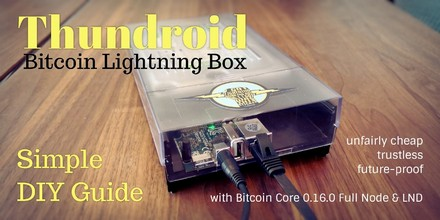

# Cryptocurrency guides 
by Stadicus

---

**Beginner’s Guide to ️⚡Lightning️⚡ on a Raspberry Pi**  
[Click here](guides/tree/master/raspibolt)

---

**The perfect Bitcoin ⚡️Lightning️⚡ node**  
based on a Hardkernel Odroid HC2  
[Click here](guides/tree/master/thundroid)

Feedback, issues and pull requests welcome!
