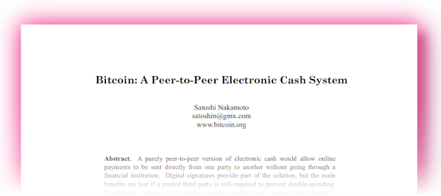
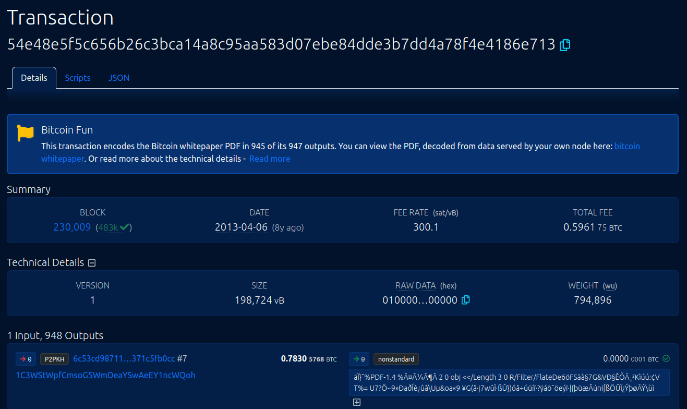

## Bonus guide: Download the bitcoin whitepaper directly from your own blockchain
{: .no_toc }

---

Download the Bitcoin white paper PDF directly from the blockchain data on your own node and witness the power of a decentralized network to fight censorship.

Difficulty: Easy
{: .label .label-green }

Status: Tested v3
{: .label .label-green }



---

Table of contents
{: .text-delta }

1. TOC
{:toc}

---

## Introduction

The Bitcoin white paper PDF was encoded in the blockhain in April 2013, in transaction `54e48e5f5c656b26c3bca14a8c95aa583d07ebe84dde3b7dd4a78f4e4186e713` of block `230,009`.

The transaction contains 947 outputs and the sender spent almost 60 millions sats as miner fee! Some explanations on how the paper is encoded in the transaction is given in a [Bitcoin StackExchange post](https://bitcoin.stackexchange.com/questions/35959/how-is-the-whitepaper-decoded-from-the-blockchain-tx-with-1000x-m-of-n-multisi/35970#35970){:target="_blank"} from 2015.

This guide explains how to reconstruct the Bitcoin white paper PDF using your own verified blockchain data. No matter how censored the white paper could become (see [this article about white paper copyright claims](https://bitcoinmagazine.com/business/copa-suing-craig-wright-over-bitcoin-white-paper-claims){:target="_blank"}), you will know how to recreate and share the foundational document of Bitcoin.

---

## Extract the whitepaper directly from Bitcoin Core

* With the "admin" user, create a new directory to store the PDF and move to this directory

  ```sh
  $ mkdir bitcoin-white-paper
  $ cd bitcoin-white-paper
  ```

* Use `bitcoin-cli` to download and create the PDF

  ```sh
  $ bitcoin-cli getrawtransaction 54e48e5f5c656b26c3bca14a8c95aa583d07ebe84dde3b7dd4a78f4e4186e713 true | jq -r '.vout[].scriptPubKey.asm' | cut -c3- | xxd -p -r | tail +9c | head -c 184292 > bitcoin.pdf
  $ ls -la
  > bitcoin.pdf
  ```

---

### How does this work?

Here's how the long command from above actually works:

* With `bitcoin-cli getrawtransaction`, you get the raw data of the transaction with this specific transaction id.
  This command returns the result as a JSON object.

  You can run `bitcoin-cli help getrawtransaction` to learn more.

* The result is handed over ("piped") to the next command: `jq -r '.vout[].scriptPubKey.asm'`.
  This instruction extracts the assembly data from the "scriptPubKey" for all transaction outputs, where the Bitcoin whitepaper data is stored.

  Run `jq --help` for more information.

* The result is then piped into the `cut -c3-` command, which cuts off the first two characters on every line.

  Check out `cut --help` to learn more.

* The command `xxd -p -r` takes the previous result as input and converts everything from hex into binary encoding.

  Run `xxd --help` for more about this command.

* Then, `tail +9c` output the data starting with the 9th byte

  Use `tail --help` to learn more.

* Finally, the data is piped into `head -c 184292`.
  This command sends the first 184292 bytes onwards.

  Run `head --help` for more information.

* The argument `> bitcoin.pdf` then takes the whole data input stream and stores it into the file "bitcoin.pdf".

This concatenation of simple commands is a shining example of one of the core principles of Linux.
The character `|` allows to string them together to create powerful yet efficient data processing.

---

### Send the PDF to your computer

To be read, the PDF can now be sent from the remote node to your local computer using the [scp](https://www.man7.org/linux/man-pages/man1/scp.1.html){:target="_blank"} utility.

* **macOS or Linux**

  On your local computer, open a terminal window and type the following command. Replace YourNodeIP with the Raspberry Pi IP address (or `raspibolt.local` if it works) and do not forget the dot at the end of the line (representing the destination of the file, here the 'Home' folder of your local computer).

  ```sh
  $ scp admin@YourNodeIP:~/bitcoin-white-paper/bitcoin.pdf .
  ```

* **Windows**

  This also works with the PSCP tool from PuTTY that you can run from the command line.
See [How to Use Putty pscp to Copy Files](https://tonyteaches.tech/putty-pscp-tutorial/){:target="_blank"} for more information.

  ```sh
  pscp admin@YourNodeIP:~/bitcoin-white-paper/bitcoin.pdf .
  ```

* The file should now be located in the Home folder of your local computer.

### Send the PDF to your Telegram account

🚨 **Privacy warning**: Using this method will leak your IP address to the Telegram server.

* Follow [this tutorial](https://www.shellhacks.com/telegram-api-send-message-personal-notification-bot/){:target="_blank"} to create a new Telegram bot (up to, and including, 'Get the Chat ID'). Write down the bot ID and the chat ID in a secure location (e.g., your password manager).

* Send the white paper to your bot (replace YourChatID and YourBotID by respectively your chat and bot ID obtained from the previous step). It might take a few seconds.

  ```sh
  $ curl -v -F "chat_id=YourChatID" -F document=@/home/admin/bitcoin-white-paper/bitcoin.pdf https://api.telegram.org/botYourBotID/sendDocument
  ```

* The PDF should now be available for download in your Telegram bot.

---
  
## Get the whitepaper from BTC RPC Explorer

The BTC-RPC-Explorer has also a functionality to extract the data from the node and display the PDF in the web browser.




* Open your Explorer at [https://raspibolt.local:4000/](https://raspibolt.local:4000/){:target="_blank"} (replace raspibolt.local with your node IP address if needed). 
* Look-up the transaction ID in the explorer: `54e48e5f5c656b26c3bca14a8c95aa583d07ebe84dde3b7dd4a78f4e4186e713`
* Click on the link "bitcoin whitepaper" in the top box, this will generate the PDF from the node blockchain and displays it as a pdf file in the browser.
* Alternatively, use the following URL: [https://raspibolt.local:4000/bitcoin-whitepaper](https://raspibolt.local:4000/bitcoin-whitepaper){:target="_blank"}
 
---

<< Back: [+ Bitcoin](index.md)
