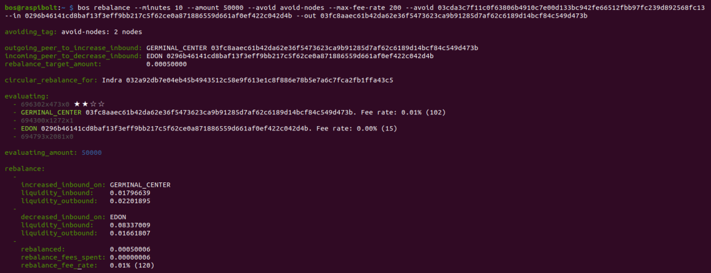
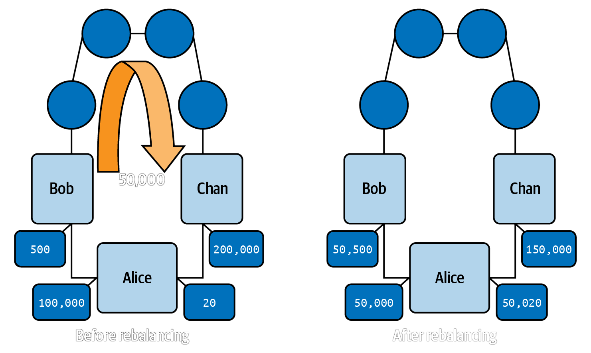
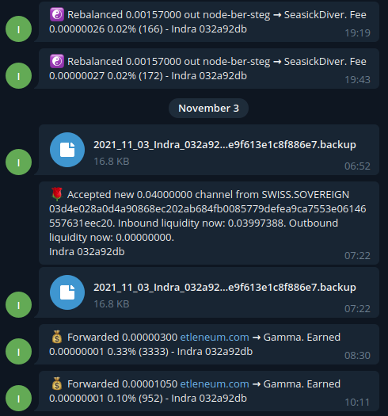

# Bonus guide: Balance of Satoshis
{: .no_toc }

---

[Balance of Satoshis](https://github.com/alexbosworth/balanceofsatoshis){:target="_blank"} (BoS), created and maintained by LND developper Alex Bosworth, is a tool to work with LND. The most used feature of BoS is the rebalancing command that allows to manage your channels liquidity (which is the main focus of this guide), but BoS contains now many other lightning tools outside liquidity management (such as the creation of a node monitoring Telegram bot which is explained below).

Difficulty: Medium
{: .label .label-yellow }

Status: Tested v3
{: .label .label-green }



---

Table of contents
{: .text-delta }

1. TOC
{:toc}

---

## Requirements

* LND (or LND as part of Lightning Terminal/litd)
* Node v12.0+

---

## Installation

### Check NodeJS

* NojeJS v14.0 or above should have been installed for the BTC RPC Explorer. We can check our version of NodeJS with user "admin": 

  ```sh
  $ node -v
  > v14.18.2
  ```

* If the version is v12.0 or above, you can move to the next section. If NodeJS is not installed, follow [this guide](https://raspibolt.org/btcrpcexplorer.html#install-nodejs) to install it.

### Create the "bos" user and prepare the directory

* Create a new user "bos" and make it a member of the "lnd" group

  ```sh
  $ sudo adduser --disabled-password --gecos "" bos
  $ sudo adduser bos lnd
  $ sudo su - bos
  ```

* Create symlink to lnd directory

  ```sh
  $ ln -s /data/lnd /home/bos/.lnd
  ```
  
* Display the link and check that it's not shown in red (this would indicate an error)

  ```sh
  $ ls -la
  ```

* Add the bos binary file location to PATH
 
  ```sh
  $ echo 'export PATH=$PATH:/home/bos/balanceofsatoshis' >> /home/bos/.bashrc
  $ source /home/bos/.bashrc
  ```

### Install

* Check the main PGP key of Alex Bosworth, developer of Balance of Satoshis: [https://keybase.io/alexbosworth/](https://keybase.io/alexbosworth/){:target="_blank"}, i.e. E80D 2F3F 311F D87E

  ```sh
  $ gpg --receive-keys E80D2F3F311FD87E
  > [gpg: key E80D2F3F311FD87E: public key "Alex Bosworth <alex.bosworth@gmail.com>" imported
  > gpg: Total number processed: 1
  > gpg:               imported: 1
  ```

* Still with user "bos", download the source code and install it
  
  ```sh
  $ git clone https://github.com/alexbosworth/balanceofsatoshis.git
  $ cd balanceofsatoshis
  ```
  
* Find the most recent tag and verify the signature. Add the `--tags` option to select even a lightweight/non-annotated tag. Add the `--abbrev=0` option to remove any long-format tag names. 
    
  ```sh
  $ git describe --tags --abbrev=0
  > v11.14.0
  $ git verify-tag v11.14.0
  > gpg: Signature made Tue 07 Dec 2021 03:57:11 GMT
  > gpg:                using RSA key DE23E73BFA8A0AD5587D2FCDE80D2F3F311FD87E
  > gpg: Good signature from "Alex Bosworth <alex.bosworth@gmail.com>" [unknown]
  > [...]
  ```

* Install Balance of Satoshis locally
  
  ```sh
  $ npm install
  > [...]
  ```  

* Check the version with the `-V` option

  ```sh
  $ bos -V
  > v11.14.0
  ```
  
---
  
## Balance of Satoshis in action

To use Balance of Satoshis, we will use the "bos" user.

### Introduction

* To see a list of all available commands run the following command
  
  ```sh
  $ bos help
  > bos 11.14.0 
  > 
  > USAGE
  > 
  >   bos <command> [options]
  >   
  > COMMANDS
  > 
  >   accounting <category>               Get an accounting rundown
  >   [...]
  ```
  
* To see detailed information about an individual command, add the name of the command, e.g. with the command `rebalance`
  
  ```sh
  $ bos help rebalance
  > bos 11.14.0 
  > 
  > USAGE
  > 
  >   bos rebalance 
  >   Change the liquidity profile of two peers
  > [...]
  ```
  
* Get a short report of your LN node with pubkey, alias, local capacity, mempool information and recent routing activity

  ```sh
  $ bos report
  ```

* Get a list of your channels with peer alias, local and remote balances and your peers fee rates towards your node (the local and remote balances are colour-coded with balances <1M sats in white, >1M sats in green and 4M sats in bolded green, to help identify channels that might require rebalancing)

  ```sh
  $ bos peers
  > │ Alias                      │ Inbound    │ In Fee       │ Outbound   │
  > ├────────────────────────────┼────────────┼──────────────┼────────────┤
  > │ euclid                     │ 0.00283195 │ 0.00% (7)    │ 0.00956736 ┤
  > [...]
  ```

### Circular rebalancing  

Circular rebalancing allows to send satoshis out through one channel (which has too little inbound liquidity) and back through another channel (which has too little outbound liquidity). 

A good illustration is provided in Chapter 5 of 'Mastering the Lighnting Network' by Antonopoulos *et al.* ([source](https://github.com/lnbook/lnbook/blob/ec806916edd6f4d1b2f9da2fef08684f80acb671/05_node_operations.asciidoc#rebalancing-channels){:target="_blank"}) (Alice (A), is your node, Bob (B) and and Chan (C) are two peers with whom you have an opened channel with):



* To rebalance a channel (to node B) with high outbound and a channel with high inbound (to node C), use the `rebalance` command.

  ```sh
  $ bos rebalance --amount [AMOUNT_IN_SATS] --max-fee-rate [TOTAL_MAX_FEE_RATE_OF_REBALANCING] --in [NODE_C_PUBKEY] --out [NODE_A_PUBKEY]
  ```
  
* E.g. using the example above:
  *  with node B being the [Bitrefill node](https://amboss.space/node/03d607f3e69fd032524a867b288216bfab263b6eaee4e07783799a6fe69bb84fac){:target="_blank"}, 
  *  node C being the [CoinOS node](https://amboss.space/node/02868e12f320073cad0c2959c42559fbcfd1aa326fcb943492ed7f02c9820aa399){:target="_blank"} 
  *  rebalancing 50,000 sats 
  *  with a maximum fee rate that you are ready to pay of 100 ppm max
  
  ```sh
  $ bos rebalance --amount 50000 --max-fee-rate 100 --in 02868e12f320073cad0c2959c42559fbcfd1aa326fcb943492ed7f02c9820aa399 --out 03d607f3e69fd032524a867b288216bfab263b6eaee4e07783799a6fe69bb84fac
  ```

* Some rebalancing can take a very long time. A timeout can be specified for the command to terminate gracefully by adding the `--minutes` option.

  ```sh
  $ bos rebalance --minutes [NUMBER_OF_MINUTES] --amount [AMOUNT_IN_SATS] --max-fee-rate [TOTAL_MAX_FEE_RATE_OF_REBALANCING] --in [NODE_C_PUBKEY] --out [NODE_A_PUBKEY]
  ```
  
* If you notice that a node in the tried paths is repeatedly the cause of failures, you can ask BoS to ignore this node during path finding by adding the `--avoid` option
  
  ```sh
  $ bos rebalance --minutes [number_of_minutes] --amount [AMOUNT_IN_SATS] --max-fee-rate [TOTAL_MAX_FEE_RATE_OF_REBALANCING] --avoid [NODE_PUBKEY] --in [NODE_C_PUBKEY] --out [NODE_A_PUBKEY]
  ```

### Tags

BoS allows to create user-defined tags to classify nodes and then be used in the commands.

* For example, you might want to have a tag for nodes that have to be avoided in path finding

* Create the 'avoid-nodes' tag and tag nodes Y and Z

  ```sh
  $ bos tags avoid-nodes --add [NODE_Y_PUBKEY] --add [NODE_Z_PUBKEY]
  > tag: 
  >   alias: avoid-nodes
  >   id:    abc123...
  >   nodes: 
  >     - [NODE_Y_PUBKEY]
  >     - [NODE_Z_PUBKEY]
  ```
  
* Check the content of an existing tag

  ```sh
  $ bos tags
  > tags: 
  >   alias: avoid-nodes
  >   id:    abc123...
  >   nodes: 
  >     - [NODE_Y_PUBKEY]
  >     - [NODE_Z_PUBKEY]
  ```
  
* Use the tag in commands, e.g. with `bos rebalance`

  ```sh
  $ bos rebalance --minutes [number_of_minutes] --amount [AMOUNT_IN_SATS] --max-fee-rate [TOTAL_MAX_FEE_RATE_OF_REBALANCING] --avoid avoid-nodes --in [NODE_C_PUBKEY] --out [NODE_A_PUBKEY]
  ```

### Other commands

There are many additional options that can be used to improve the likelihood of a successful circular rebalancing. There are also many addditonal commands in addition to the rebalancing command. More information on all bos commands can be found in:

  *  [The BoS Github repository](https://github.com/alexbosworth/balanceofsatoshis){:target="_blank"}

  *  [This unofficial documentation repo](https://github.com/niteshbalusu11/BOS-Commands-Document){:target="_blank"} *(note that this page might not be kept up-to-date)*

You can also join the Balance of Satoshis Telegram group to get support: [https://t.me/balanceofsatoshis](https://t.me/balanceofsatoshis){:target="_blank"}

---

## Upgrade

* Log in with the "bos" user and upgrade Balance of Satoshis with `npm`

  ```sh
  $ sudo su - bos
  $ cd balanceofsatoshis
  ```

* Check what version you are using currently (e.g. here v11.14.0)

  ```sh
  $ bos -V
  > 11.14.0
  ```

* Update the local repository by downloading the new commits from the source repository and check if a new tag/version is available (e.g. here v99.99.9)
 
  ```sh
  $ git fetch
  > [...]
  > * [new tag]         v99.99.9   -> v99.99.9
  ```

* Find the most recent tag. Add the `--tags` option to select even a lightweight/non-annotated tag. Add the `--abbrev=0` option to remove any long-format tag names.
  
  ```sh 
  $ git describe --tags --abbrev=0
  > v11.14.0
  ```

* Remove any potential uncommited changes to your local branch to avoid issues when checking out the new tag

  ```sh
  $ git reset --hard HEAD
  > HEAD is now at 1b2a38d add docs for coop close on open
  ```

* Switch to new branch identified with `git fetch` (i.e. v99.99.9) and check that it is now  the most recent tag

  ```sh  
  $ git checkout v99.99.9
  > Previous HEAD position was 1b2a38d add docs for coop close on open
  > HEAD is now at dd58fc0 [...]
  $ git describe --tags --abbrev=0
  > v99.99.9
  ```
  
* Check the GPG signature of the new version
 
  ```sh
  $ git verify-tag v99.99.9
  > gpg: Signature made Tue 07 Dec 2021 03:57:11 GMT
  > gpg:                using RSA key DE23E73BFA8A0AD5587D2FCDE80D2F3F311FD87E
  > gpg: Good signature from "Alex Bosworth <alex.bosworth@gmail.com>" [unknown]
  > [...]
  ```  
  
* Install the new version and check this it has been installed properly

  ```sh
  $ npm install
  > [...]
  $ bos -V
  > v99.99.9
  ```

---

## Uninstall

If you want to uninstall Balance of Satoshis:

* Log in with the "root" user and delete the "bos" user

  ```sh
  $ sudo su -
  $ userdel -r bos
  ``` 

---

## Optional: connect your node to a Telegram bot

Balance of Satoshis allows connecting a node to a Telegram bot to receive updates about routing forwards, channel opening and closing events, successful rebalancing payments, payments received, keysend messages etc. It also saves a copy of `channel.backup` (SCB) each time there is a channel being opened or closed.



*Requirements:* a Telegram account

### Create a new TG bot with the BotFather

* Open Telegram, in the general search box look for the [@BotFather](https://t.me/BotFather){:target="_blank"} bot and start a conversation with the bot.
* Type `/start`
* Type `/newbot` and follow the instructions (choose a bot name, username)
* Once the bot is created, the BotFather will give you a HTTP API token, copy it and keep it somewhere safe (like in a password manager). Note that if you lose this token, you could always get it agin by typing `/myBot` in the BotFather feed.
* You also get a link to your bot (in the form: t.me/[your_bot_username]) click on it and it will redirect you to your new bot feed. Keep Telegram opened.

### Torify

To avoid leaking our node IP address to Telegram, we can force bos to use Tor using the [`torify`](https://gitlab.torproject.org/legacy/trac/-/wikis/doc/TorifyHOWTO) utility. To do this, we first need to edit the `torsocks.conf` file.

* Using the "admin" user, edit the `torsocks.conf` file by uncommenting the `AllowOutboundLocalhost` and setting the value to 1. Save (Ctrl+O) and exit (Ctrl+X)
  
  ```sh
  $ sudo nano /etc/tor/torsocks.conf
  ```
  ```ini
  AllowOutboundLocalhost 1
  ```
* Restart Tor
  
  ```sh
  $ sudo systemctl reload tor
  ```

### Use bos to connect your node to the bot

* Change to the "bos" user
  
  ```sh
  $ sudo su - bos
  ```

* Now, we are going to request bos to connect our node to the TG bot
  
  ```sh
  $ /usr/bin/torify bos telegram
  ```
  
* When prompted, enter the HTTP API token that the @BotFather gave you earlier

* Go to your new TG bot feed and type `/connect`. Your bot will give you a connection code

* Copy the connection code and paste it in your SSH session in the second prompt that bos created. You should get a connection message on both your SSH session and your TG bot feed. In the SSH session:

  ```sh
  > is_connected: true
  ```

* Your TG bot will now receive notifications from your nodes for various events as described in the introduction.

* Leave the temporary session by pressing Ctrl+C and log out of the "bos" user
  
  ```sh
  $ exit
  ```

### Permannent connection and autostart on boot 

Now we’ll make sure our Telegram Bot command starts as a systemd service on the Raspberry Pi so it’s always running.

* As user "admin", create the service file.

  ```sh
  $ sudo nano /etc/systemd/system/bos-telegram.service
  ```
  
* Paste the following configuration. Replace YourConnectionCode with your own connection code provided by your bot above. Save and exit.
  
  ```ini
  # /etc/systemd/system/bos-telegram.service

  [Unit]
  Description=bos-telegram
  Wants=lnd.service
  After=lnd.service

  [Service] 
  ExecStart=/usr/bin/torify /home/bos/balanceofsatoshis/bos telegram --connect YourConnectionCode
  User=bos
  Restart=always
  TimeoutSec=120
  RestartSec=30
  StandardOutput=null
  StandardError=journal

  [Install]
  WantedBy=multi-user.target 
  ```
  
* Enable the service, start it and check the status of the service. You should also receive a connection message from your TG bot ('Connect to ...').
  
  ```sh
  $ sudo systemctl enable bos-telegram.service
  $ sudo systemctl start bos-telegram.service
  $ systemctl status bos-telegram.service
  > bos-telegram.service - bos-telegram
  >   Loaded: loaded (/etc/systemd/system/bos-telegram.service; enabled; vendor preset: enabled)
  >   Active: active (running) since Fri 2021-12-03 13:52:06 GMT; 8s ago
  > Main PID: 4682 (node)
  >    Tasks: 11 (limit: 4164)
  >      CPU: 7.981s
  >   CGroup: /system.slice/bos-telegram.service
  >           `-4682 node /home/bos/.npm-global/bin/bos telegram --connect 1536853548
  ``` 

* To monitor the live logging output use the following command. Exit with Ctrl+C.

  ```sh
  $ sudo journalctl -f -u bos-telegram
  ```

* Check that the program is running in the background: Go to your Telegram bot and type /version, it should return your currently installed version of bos and the latest available version.

### Bos Telegram bot in action

* The bot will notify you of the followibg events on your LN node:
  * 💵 - A payment being received (if it's a keysend with a message, the message will be decoded and displayed
  * 💰 - Routing/forward events
  * ☯️ - Sucessful rebalancing payment you initiated
  * 🌹 - A new channel being opened to your node
  * 🥀 - A channel closing
  * You'll receive an actual **SCB backup file** (that can be downloaded) after each new channel opening or closing
  * ⛓ - A pending onchain payment being received
  * 🤖 - A reply to a command you invoke (see list of commands below)

* In your Telegram bot type /help to list the list of available commands:
  * /backup - Get node backup file
  * /blocknotify - Notification on next block
  * /connect - Connect bot
  * /costs - View costs over the past week
  * /earnings - View earnings over the past week
  * /invoice - Make an invoice
  * /liquidity with - View node liquidity
  * /mempool - BTC mempool report
  * /pay - Pay an invoice
  * /pending - View pending channels, probes, and forwards
  * /version - View the current bot version

<br /><br />

---

<< Back: [+ Lightning](index.md)
