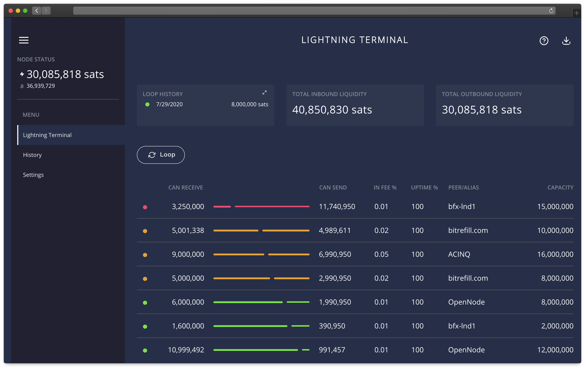

# Bonus guide: Lightning Terminal
{: .no_toc }

---

[Lightning Terminal](https://github.com/lightninglabs/lightning-terminal){:target="_blank"} is a software suite of Lightning Labs which contains:

* Faraday: accounting service
* Loop: client software for submarine swaps with LOOP node of Lightning Labs
* Pool: client software to submit orders to buy and sell inbound liquidity through unique price auction at each new block found



---

Table of contents
{: .text-delta }

1. TOC
{:toc}

---

## Introduction

Lightning Terminal provides a user interface to make submarine swap easily, it now also features a UI for Pool Market which is a good tool to estimate the price of liquidity.
Because Pool is alpha software, Lightning Terminal is alpha software too. The LND part is however in beta and the behavior is exactly the same as LND.  

You cannot run LiT and LND at the same time.  

The Lightning Terminal UI requires a password. Select a new password:

  `[ E ] Lightning Terminal master user password`

---

## Installation

### Download LiT

* With the "admin" user, download the latest arm64 binary and its associated checksum and signature files

  ```sh
  $ cd /tmp
  $ wget https://github.com/lightninglabs/lightning-terminal/releases/download/v0.6.1-alpha/lightning-terminal-linux-arm64-v0.6.1-alpha.tar.gz
  $ wget https://github.com/lightninglabs/lightning-terminal/releases/download/v0.6.1-alpha/manifest-v0.6.1-alpha.txt
  $ sha256sum --check manifest-v0.6.1-alpha.txt --ignore-missing
  > lightning-terminal-linux-arm64-v0.6.1-alpha.tar.gz: OK
  
  $ curl https://keybase.io/guggero/pgp_keys.asc | gpg --import
  >  % Total    % Received % Xferd  Average Speed   Time    Time     Time  Current
  >                               Dload  Upload   Total   Spent    Left  Speed
  > 100 19417  100 19417    0     0  32578      0 --:--:-- --:--:-- --:--:-- 32524
  > gpg: key 8E4256593F177720: 1 signature not checked due to a missing key
  > gpg: key 8E4256593F177720: "Oliver Gugger <gugger@gmail.com>" 1 new signature
  > gpg: Total number processed: 1
  > gpg:         new signatures: 1
  > gpg: no ultimately trusted keys found
  
  $ wget https://github.com/lightninglabs/lightning-terminal/releases/download/v0.6.1-alpha/manifest-v0.6.1-alpha.sig
  $ gpg --verify manifest-v0.6.1-alpha.sig manifest-v0.6.1-alpha.txt
  > gpg: Signature made Fri Dec  3 22:58:37 2021 GMT
  > gpg:                using RSA key F4FC70F07310028424EFC20A8E4256593F177720
  > gpg: Good signature from "Oliver Gugger <gugger@gmail.com>" [unknown]
  > [...]

  $ tar -xzf lightning-terminal-linux-arm64-v0.6.1-alpha.tar.gz
  $ sudo install -m 0755 -o root -g root -t /usr/local/bin lightning-terminal-linux-arm64-v0.6.1-alpha/*
  $ litd --lnd.version
  > litd version 0.14.1-beta commit=lightning-terminal-v0.6.1-alpha
  ```

### Data directory

* Create the “lnd” service user, and add it to the groups “bitcoin” and “debian-tor”

  ```sh
  $ sudo adduser --disabled-password --gecos "" lit
  $ sudo adduser lit lnd
  ```
  
* Create the Loop, Pool and Faraday data directories

  ```sh
  $ sudo mkdir /data/loop /data/pool /data/faraday
  $ sudo chown -R lit:lit /data/loop /data/pool /data/faraday
  ```

* Open a “lit” user session  
  
  ```sh 
  $ sudo su - lit
  ```

* Create symlink to lnd directory

  ```sh
  $ ln -s /data/lnd /home/lit/.lnd
  $ ln -s /data/loop /home/lit/.loop
  $ ln -s /data/pool /home/lit/.pool
  $ ln -s /data/faraday /home/lit/.faraday
  ```

* Display the links and check that they’re not shown in red (this would indicate an error)

  ```sh
  $ ls -la
  ```

#### Configuration

`litd`, the Lightning Terminal daemon, has its own configuration file. 
The settings for Pool, Faraday, Loop can all be put in the configuration file 

* Still with the "lit" user, create the LiT working directory

  ```sh
  $ mkdir /home/lit/.lit
  $ cd .lit
  ```

* Create the LiT configuration file and paste the following content (set the uipassword with your password [G] and adjust to your alias and paste password [B] as required in the Faraday section). Save and exit.

  ```sh
  $ nano lit.conf
  ```
  
  ```ini  
  # RaspiBolt: lit configuration
  # /home/admin/.lit/lit.conf
  
  #######################
  # Application Options #
  #######################
  
  # The host:port to listen for incoming HTTP/2 connections on for the web UI only. (default:127.0.0.1:8443)
  httpslisten=0.0.0.0:8443
  
  # Your password for the UI must be at least 8 characters long
  uipassword=Password[G]

  # Remote options
  remote.lit-debuglevel=debug

  # Remote lnd options
  remote.lnd.rpcserver=127.0.0.1:10009
  remote.lnd.macaroonpath=/home/lit/.lnd/data/chain/bitcoin/mainnet/admin.macaroon
  remote.lnd.tlscertpath=/home/lit/.lnd/tls.cert
  
  
  #################
  #     Loop      #
  #################
  
  # ???
  loop.loopoutmaxparts=5
  
  
  #################
  # Pool settings #
  #################
  
  # This option avoids the creation of channels with nodes with whom you already have a channel (set to 0 if you don't mind)
  #pool.newnodesonly=1
  
  
  ####################
  #      Faraday     #
  ####################
  
  # ???
  faraday.min_monitored=48h
  
  
  ####################
  # Faraday-Bitcoin  #
  ####################
  
  # If connect_bitcoin is set to 1, Faraday can connect to a bitcoin node (with --txindex set) to provide node accounting services
  faraday.connect_bitcoin=1
  # The Bitcoin node IP is the IP address of the Raspibolt, i.e. an address like 192.168.0.20
  faraday.bitcoin.host=192.168.0.171
  # bitcoin.user provides to Faraday the bicoind RPC username, as specified in our bitcoin.conf
  faraday.bitcoin.user=raspibolt
  # bitcoin.password provides to Faraday the bitcoind RPC password, as specified in our bitcoin.conf
  faraday.bitcoin.password=Password[B]
  ```

🔍 *Notice that the options for Faraday, Loop and Pool can be set in this configuration file but you must prefix the software with a dot as we made here. Use samples configuration files shown in github repo of each software for more options*
  
### Running LiT

* Test that Lightning Terminal is correctly using the LND database.

  ```sh
  $2 sudo su - bitcoin
  $2 litd
  ```

Now go back to the first session and try to unlock your wallet, if you already used your node a lot you must wait for the LND database to be open (you can take a look at the log returned in the second session where LiT is running).

  ```sh
  $ lncli unlock
  ```
  
  Type your `password [C]` to unlock the wallet. You can check the state with `lncli getinfo`, it should be synced with graph and chain. If it works, you can stop LiT running in the second section using `Ctrl + C` and exit it

  ```sh
  $2 exit
  ```
  
  
### Autostart LiT on boot

We stopped lnd service, now that LiT is running we can replace the autostart service for LND by the LiT's one. We modify LND systemd unit:

  ```sh
  $2 sudo systemctl disable lnd
  $2 sudo nano /etc/systemd/system/lnd.service
  ```
We can just change the line `ExecStart=/usr/local/bin/lnd` for `ExecStart=/usr/local/bin/litd`, rename the file and enable, start, unlock LiT:

  ```sh
  $2 sudo mv /etc/systemd/system/lnd.service /etc/systemd/system/litd.service
  $2 sudo systemctl enable litd
  $2 sudo systemctl start litd
  $2 systemctl status litd
  $2 lncli unlock
  ```
If you wish to look at the daemon information, they are in the system journal

  ```sh
  $2 sudo journalctl -f -u litd
  ```
### Using other software packaged in LiT

Others softwares have their own macaroon files too, they are created in `.loop`, `.faraday` and `.pool` directories of bitcoin home by default. So we create symbolic link so that admin user can use them.

  ```sh
  $2 ln -s /home/bitcoin/.loop /home/admin/.loop
  $2 ln -s /home/bitcoin/.pool /home/admin/.pool
  $2 ln -s /home/bitcoin/.faraday /home/admin/.faraday
  ```

For now, softwares packaged in LiT are all listening to the same port 10009 as LND. This is not the default behavior set in the code of these sofware so you must always indicate the RPC port when using them.

For example, the following will not work to look at the last auction snapshot:

  ```sh
  $2 pool auction snapshot
  ```
  
It will returns the following error:
  ```sh
  > [pool] rpc error: code = Unavailable desc = connection error: desc = "transport: Error while dialing dial tcp [::1]:12010: connect: connection refused"
  ```
It says that the `pool` command try to interact with your pool client on localhost's port 12010. However your instance of Pool is not listening to the default port 12010, but port 10009 ! It also needs to know where the TLS certificate to securely interact with LND is.

That's why this will work:

  ```sh
  $2 pool --rpcserver=localhost:10009 --tlscertpath=~/.lnd/tls.cert auction snapshot
  ```
It can be convenient to create alias to not have to type the rpc server address at every command. Use `alias` command in bash for that

  ```sh
  $2 alias poolit="pool --rpcserver=localhost:10009 --tlscertpath=~/.lnd/tls.cert"
  $2 poolit auction snapshot
  ```
You can add your aliases in `.bashrc` file of `admin`
  ```sh
  $2 nano ~/.bashrc
  ```
  
Add the following at the end of the file then save and exit:
  
  ```
  $2 alias poolit="pool --rpcserver=localhost:10009 --tlscertpath=~/.lnd/tls.cert"
  $2 alias loopit="loop --rpcserver=localhost:10009 --tlscertpath=~/.lnd/tls.cert"
  $2 alias frclit="frcli --rpcserver=localhost:10009 --tlscertpath=~/.lnd/tls.cert"
  ```
  
Use `help` and documentation on Pool, Loop and Faraday respectively for information on these command.
  
### Access LiT UI for easy Loop Out/In and Liquidity trading

LiT provides a UI that allows you to use Loop and Pool conveniently. The UI is running on port 8443. To access it you must be in your home network (or connected through a VPN like WireGuard) and `ufw` should allow access to the port 8443:

  ```sh
  $2 sudo su
  # ufw allow 8443 comment 'allow LiT UI'
  # ufw disable
  # ufw enable
  # exit
  ```
  
You can now connect from your home to `https://[your_pi_local_ip]:8443` with your browser and enjoy the nice GUI of LiT ! Use `PASSWORD_[B]` to log in.

### LiT upgrade

Open a session with "admin". You must stop LiT with `lncli stop` then `sudo systemctl stop litd` before upgrading !

Proceed as LND, but use the binaries of the LiT repo and **do not delete the LND macaroons**. Replace `wget https://github.com/lightningnetwork/lnd` by `wget https://github.com/lightninglabs/lightning-terminal` when downloading binaries and check signature as the "download" part of this guide.
<br /><br />

---

<< Back: [+ Lightning](index.md)
