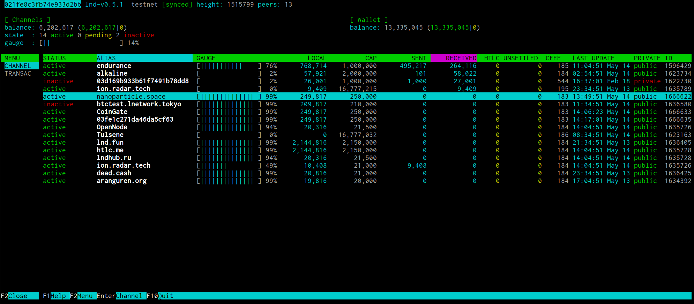

## Bonus guide: LNTOP terminal dashboard
{: .no_toc }

---

[lntop](https://github.com/edouardparis/lntop){:target="_blank"} is an interactive text-mode channels viewer for Unix systems.

Difficulty: Easy
{: .label .label-green }

Status: Tested v3
{: .label .label-green }



---

Table of contents
{: .text-delta }

1. TOC
{:toc}

---

### Install lntop

* As user “admin”, download the application, checksums, and the corresponding signature file

  ```sh
  $ cd /tmp/
  $ wget https://github.com/edouardparis/lntop/releases/download/v0.2.0/lntop-v0.2.0-Linux-arm64.tar.gz
  $ wget https://github.com/edouardparis/lntop/releases/download/v0.2.0/checksums-lntop-v0.2.0.txt
  $ wget https://github.com/edouardparis/lntop/releases/download/v0.2.0/checksums-lntop-v0.2.0.txt.sig
  ```

* Get the PGP key from Edouard, developer of lntop.
  You can compare the fingerprint against the one in his [Twitter profile](https://twitter.com/edouardparis){:target="_blank"}

  ```sh
  $ curl https://edouard.paris/key.asc | gpg --import
  > ...
  > gpg: key 47EEBB014DD80918: public key "Edouard (Personal) <m@edouard.paris>" imported
  > ...
  ```

* Verify the signature of the text file containing the checksums for the application

  ```sh
  $ gpg --verify checksums-lntop-v0.2.0.txt.sig checksums-lntop-v0.2.0.txt
  > gpg: Signature made Fri Dec  3 09:29:24 2021 GMT
  > gpg:                using RSA key A8BA5205BFCBC668853D560247EEBB014DD80918
  > gpg: Good signature from "Edouard (Personal) <m@edouard.paris>" [unknown]
  > gpg: WARNING: This key is not certified with a trusted signature!
  > gpg:          There is no indication that the signature belongs to the owner.
  > Primary key fingerprint: A8BA 5205 BFCB C668 853D  5602 47EE BB01 4DD8 0918
  ```

* Verify the signed checksum against the actual checksum of your download

  ```sh
  $ sha256sum --check checksums-lntop-v0.2.0.txt --ignore-missing
  > lntop-v0.2.0-Linux-arm64.tar.gz: OK
  ```

* If everything checks out, you can install the application

  ```sh
  $ tar -xvf lntop-v0.2.0-Linux-arm64.tar.gz
  $ sudo install -m 0755 -o root -g root -t /usr/local/bin release/lntop
  ```

---

### Run lntop

Depending on the size of your LND channel database, lntop can take quite a while to start.

```sh
$ lntop
```

---

<< Back: [+ Lightning](index.md)
