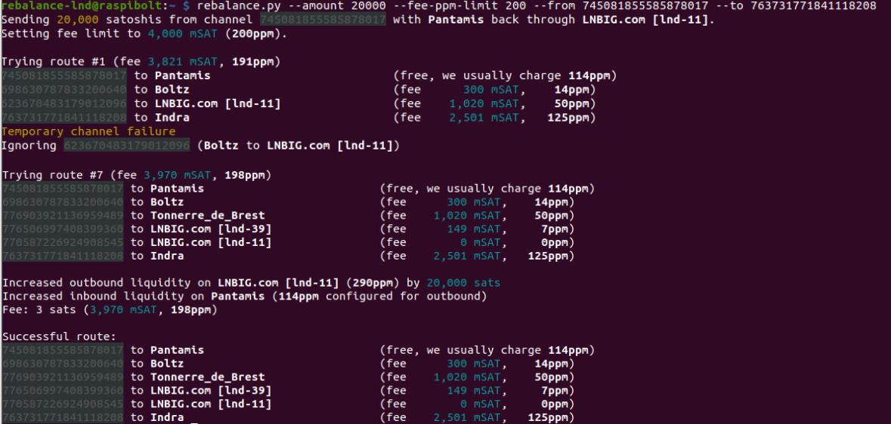

## Bonus guide: rebalance-lnd
{: .no_toc }

---

[rebalance-lnd](https://github.com/C-Otto/rebalance-lnd) (created by C-Otto) is a tool to manage your channel liquidity by doing circular rebalancing; i.e. sending sats out of a channel with too much outbound/local liquidity back to one of your channel with too much inbound/remote liquidity. 
You just pay the routing fees and can set up some maximum fees that you're ok to pay.

Difficulty: Easy
{: .label .label-green }

Status: Tested v3
{: .label .label-green }



---

Table of contents
{: .text-delta }

1. TOC
{:toc}

---

### Requirements

* LND (or LND as part of Lightning Terminal/litd)
* Python

---

### Install pip3

pip is not installed by default on Raspberry Pi OS Lite (64-bit), we need to install it.

* With user "admin" install pip3 and check the installed version

  ```sh
  $ sudo apt-get install python3-pip
  > [...]
  $ pip3 --version
  > pip 20.3.4 from /usr/lib/python3/dist-packages/pip (python 3.9)

### Install rebalance-lnd

* We create a "rebalance-lnd" user and we make it part of the "bitcoin" group (to be able to interact with LND)  

  ```sh
  $ sudo adduser --disabled-password --gecos "" rebalance-lnd
  $ sudo adduser rebalance-lnd lnd
  ```
  
* With the "charge-lnd" user, clone the charge-lnd repository, enter the directory and install the program and required packages using `pip3` (do _not_ forget the dot at the end of the pip command!)

  ```sh
  $ sudo su - rebalance-lnd
  $ git clone https://github.com/C-Otto/rebalance-lnd.git
  $ cd rebalance-lnd/
  $ pip3 install -r requirements.txt
  ```

* Add the rebalance-lnd binary file location to PATH

  ```sh
  $ echo 'export PATH=$PATH:/home/rebalance-lnd/rebalance-lnd' >> /home/rebalance-lnd/.bashrc
  $ source /home/rebalance-lnd/.bashrc
  `

* Test if the installation was successful by running the program
 
  ```sh
  $ rebalance.py
  > usage: rebalance.py [-h] [--lnddir LNDDIR] [--network NETWORK] [--grpc GRPC]
  > [...]
  ```
  
* We are going to create a simlink to the LND directory. We'll place the link in the home directory of the "charge-lnd" user to match the default LND directory used by rebalance-lnd (~/.lnd) 

  ```sh
  $ ln -s /data/lnd/ /home/rebalance-lnd/.lnd
  $ cd ~/
  ```
  
## rebalance-lnd in action

* To rebalance two channels, use the following command (the channel ID is the short 18 digits channel ID here)

 ```sh
  $ rebalance.py --amount AmountInSats --fee-ppm-limit FeeRateInPPM --from NodeAShortChannelID --to NodeBShortChannelID
  > Sending AmountInSats satoshis from channel [...]
  >[...]
  ```
  
## Upgrade

* Log in with the "rebalance-lnd" user

  ```sh
  $ sudo su - rebalance-lnd
  $ cd rebalance-lnd
  ```
  
* Fetch the latest version and install it
  
  ```sh
  $ git fetch
  $ git describe --tags --abbrev=0
  > v2.1
  $ git reset --hard HEAD
  > HEAD is now at 3ff8c87 Merge pull request #246 from C-Otto/dependabot/pip/googleapis-common-protos-1.54.0
  $ git checkout v9.9
  > Note: switching to 'v9.9'.
  > [...]
  $ npm install
  > [...]
  ```

## Uninstall

If you want to uninstall rebalance-lnd:

* Log in with the "root" user and delete the "rebalance-lnd" user

  ```sh
  $ sudo su -
  $ userdel -r rebalance-lnd
  $ exit
  ```
