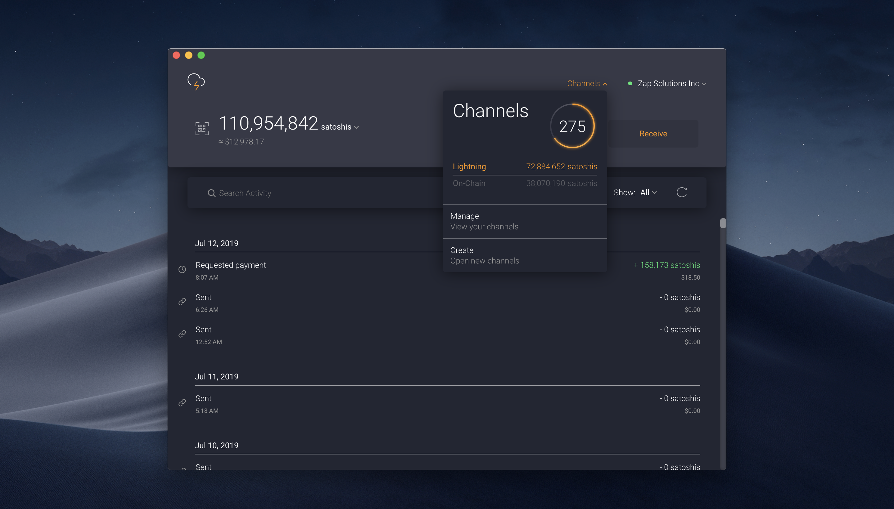

# Bonus guide: Zap Desktop
{: .no_toc }

The [desktop app Zap](https://github.com/LN-Zap/zap-desktop){:target="_blank"} is a cross-platform Lightning Network wallet focused on user experience and ease of use.

Difficulty: Easy
{: .label .label-green }

Status: Tested v3
{: .label .label-green }



---

Table of contents
{: .text-delta }

1. TOC
{:toc}

---

## Install Zap Desktop on your computer

### Download

* In the Zap repository [releases page](https://github.com/LN-Zap/zap-desktop/releases){:target="_blank"}, select the latest release and download the following files:
  * *For Linux:* the `.AppImage`, *e.g.* `Zap-linux-x86_64-v0.7.5-beta.AppImage`
  * *For Windows:* the `.exe`, *e.g.* `Zap-linux-x86_64-v0.7.5-beta.AppImage`
  * *For Mac:* the Mac `.zip`, *e.g.* `Zap-mac-v0.7.5-beta.zip`
  * *For all:* the file containing the list of expected SHA256 checksums: *e.g.* `SHASUMS256.txt.asc`

### Verify

* Follow the [instructions provided by Zap](https://github.com/LN-Zap/zap-desktop/blob/master/docs/SIGNATURES.md){:target="_blank"}

### Install

* *For Linux:* 
   * Right-click on the AppImage and click the ‘Properties’ entry
   * Switch to the ‘Permissions‘ tab
   * Click the ‘Allow executing file as program’ checkbox (or for some OSes, the ‘Is executable’ checkbox or select ‘Anyone’ in the ‘Execute’ drop down list)
   * Then double-clik on the AppImage file
* *For Windows:* 
  * Double-click on the .exe file
* *For Mac:* 
  * Double-click to unzip the file
  * Navigate to the newly unzipped folder
  * Drag-and-drop the ‘Zap.app‘ file to the ‘Applications‘ folder
  * Unmount the image and navigate to Applications folder
  * Double click on the ‘Zap.app‘ file

---

## Preparation on the Pi

### Update LND TLS certificate

* Allow connections to the RaspiBolt from your own local network (the netmask `/16` restricts access to all computers with an IP address of 192.168.*.*).  

  ```sh
  $ sudo nano /home/lnd/.lnd/lnd.conf
  ```

*  Add the following lines to the section `[Application Options]`:  
  
  ```ini
  # Add local network IP address to LND's TLS certificate
  tlsextraip=192.168.0.0/16
  rpclisten=0.0.0.0:10009
  ```
  
#* Backup and delete the existing `tls.cert` and `tls.key` filess and restart LND to recreate them. 
#  
#  ```
#  $ sudo mv /home/lnd/.lnd/tls.*

  ```
  
#* Copy the new `tls.cert` to the user "admin".  
 # ```
  #$ sudo cp /home/bitcoin/.lnd/tls.cert /home/admin/.lnd
  #```

* Restart LND (if you did not set up the autounlock, unlock the LND wallet with `lncli unlock`)  
  
  ```sh
  $ sudo systemctl restart lnd
  ```

### Firewall

* Configure firewall to allow incoming requests from local network only  
  
  ```sh
  $ sudo ufw allow from 192.168.0.0/16 to 10009/tcp comment 'allow LND grpc from local LAN'
  $ sudo ufw status
  ```

### Connect Zap Desktop with a Connection String 

We will connect Zap to the RaspiBolt using a connection string that includes the connection and authentication information. This   option is available starting with Zap 0.4.0 beta.

#### On the Pi:

* Install LndConnect:  
  ```
  $ cd /tmp
  $ wget https://github.com/LN-Zap/lndconnect/releases/download/v0.1.0/lndconnect-linux-armv7-v0.1.0.tar.gz
  $ sudo tar -xvf lndconnect-linux-armv7-v0.1.0.tar.gz --strip=1 -C /usr/local/bin
  ```

* Generate the Connection String  
  ```
  $ sudo lndconnect --lnddir=/home/admin/.lnd -i -j
  ```
  Copy the resulting text starting with `lndconnect://...`

#### Configure Zap: 

  * Start Zap on your desktop
  * Create a new wallet
  * Choose the `Connect to your node` option  
    
  * Paste the Connection String generated with LndConnect
  * Confirm and Connect
  * Confirm the settings on the following screen and you are done!
    

------

<< Back: [+ Lightning](index.md)
