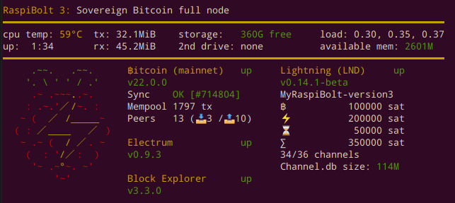

# Bonus guide: System overview
{: .no_toc }

To get a quick overview of the system status, you can use [a shell script](https://github.com/raspibolt/raspibolt/blob/master/resources/20-raspibolt-welcome){:target="_blank"} that gathers the most relevant data.
You can configure it to be shown on each login.

Difficulty: Easy
{: .label .label-green }

Status: Tested v3
{: .label .label-green }



---

## Installation

This script can be run by user "admin" without root privileges, but you should still check it yourself.

* Install necessary software packages

  ```sh
  $ sudo apt install jq net-tools netcat
  ```

* Download the script.
  Make sure to get the right script for the RaspiBolt version you run.

  ```sh
  $ cd /tmp/

  # RaspiBolt version 3 (current)
  $ wget https://raw.githubusercontent.com/raspibolt/raspibolt/master/resources/20-raspibolt-welcome

  # RaspiBolt v2 (deprecated) -- DON'T RUN THIS unless you run an old RaspiBolt version!
  $ wget https://raw.githubusercontent.com/raspibolt/raspibolt/master/resources/20-raspibolt-welcome-v2 -O 20-raspibolt-welcome
  ```

* Inspect the script to make sure it does not do bad things.
  Exit with `Ctrl`-`X`

  ```sh
  $ nano 20-raspibolt-welcome --linenumbers
  ```

* If you use a network cable instead of a wifi connection, go to line 19 and change `wlan0` to `eth0`.
  Save with `Ctrl`-`O`and exit `nano` with `Ctrl`-`X`.

  ```sh
  # set to network device name (usually "eth0" for ethernet, and "wlan0" for wifi)
  network_name="eth0"
  ```

* Install the script and make it executable

  ```sh
  $ sudo mv 20-raspibolt-welcome /usr/local/bin/raspibolt
  $ sudo chmod +x /usr/local/bin/raspibolt
  ```

* You can now run the script with user "admin"

  ```sh
  $ raspibolt
  ```

---

## Show on login (optional)

You can run the welcome script automatically every time you log in.
If you're in a hurry, you can always press `Ctrl`-`C` to skip the script.

* As user "admin", add the `raspibolt` command to the end of your `.bashrc` file

  ```sh
  $ echo "raspibolt" >> ~/.bashrc
  ```

In case you are upgrading from a previous version of the script, you need to disable the old script to avoid seeing both on startup.
In earlier versions, the script was executed by the "Message of the day" mechanism.

* To get rid of all MOTD output, simply rename the following directory:

  ```sh
  $ sudo mv /etc/update-motd.d /etc/update-motd.d.backup
  ```

<br /><br />

------

<< Back: [+ Raspberry Pi](index.md)
