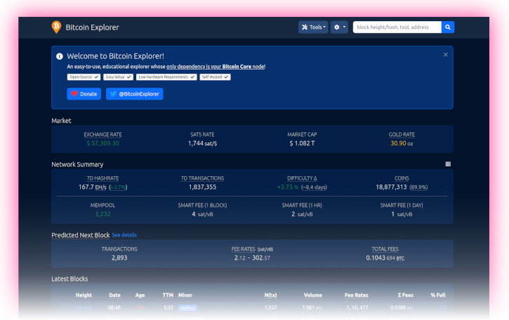

<!-- markdownlint-disable MD014 MD022 MD025 MD033 MD036 MD040 -->

# Blockchain Explorer
{: .no_toc }

Run your own private blockchain explorer with [BTC RPC Explorer](https://github.com/janoside/btc-rpc-explorer){:target="_blank"}. Trust your node, not some external services.



---

## Table of contents
{: .no_toc .text-delta }

1. TOC
{:toc}

---

## Run your own blockchain explorer

After the RaspiBolt runs your own fully validated node, and even acts as a backend for your hardware wallet with Electrs, the last important puzzle piece to improve privacy and financial sovereignty is your own Blockchain Explorer.
It lets you query transactions, addresses, and blocks of your choice.
You no longer need to leak information by querying a third-party blockchain explorer that can be used to get your location and cluster addresses.

[BTC RPC Explorer](https://github.com/janoside/btc-rpc-explorer){:target="_blank"} provides a lightweight and easy to use web interface to accomplish just that.
It's a database-free, self-hosted Bitcoin blockchain explorer, querying Bitcoin Core and Electrs via RPC.

---

## Preparations

### Transaction indexing

For the BTC RPC Explorer to work, you need your full node to index all transactions.

* If you followed this guide, the transaction index parameter is already enabled (`txindex=1`), and you can skip to the next section.

* If this is not the case, you need to set the `txindex=1` parameter in your Bitcoin Core configuration file (`bitcoin.conf`): [Bitcoin node configuration](bitcoin-core.md#configuration).

* After adding the parameter, restart Bitcoin Core, which will now index the whole blockchain

  ```sh
  $ sudo systemctl restart bitcoind
  ```

Please note that reindexing can take more than a day.
You can follow the progress using `tail -f ~/.bitcoin/debug.log`.

### Install Node.js

* Add the [Node.js](https://nodejs.org){:target="_blank"} package repository from user "admin".
  We'll use version 16, which is the latest stable version.

  ```sh
  $ curl -fsSL https://deb.nodesource.com/setup_16.x | sudo -E bash -
  ```

* Install Node.js using the apt package manager.

  ```sh
  $ sudo apt install nodejs
  ```

### Firewall & reverse proxy

In the [Security section](security.md), we set up NGINX as a reverse proxy.
Now we can add the BTC RPC Explorer configuration.

* Enable NGINX reverse proxy to route external encrypted HTTPS traffic internally to the BTC RPC Explorer

  ```sh
  $ sudo nano /etc/nginx/streams-enabled/btcrpcexplorer-reverse-proxy.conf
  ```

  ```nginx
  upstream btcrpcexplorer {
    server 127.0.0.1:3002;
  }
  server {
    listen 4000 ssl;
    proxy_pass btcrpcexplorer;
  }
  ```

* Test and reload NGINX configuration

  ```sh
  $ sudo nginx -t
  $ sudo systemctl reload nginx
  ```

* Configure the firewall to allow incoming HTTPS requests

  ```sh
  $ sudo ufw allow 4000/tcp comment 'allow BTC RPC Explorer SSL'
  $ sudo ufw status
  ```

---

## BTC RPC Explorer

### Installation

For improved security, we create the new user "btcrpcexplorer" that will run the block explorer.
Using a dedicated user limits potential damage in case there's a security vulnerability in the code.
An attacker would not be able to do much within this user's permission settings.

* Create a new user, assign it to the "bitcoin" group, and open a new session

  ```sh
  $ sudo adduser --disabled-password --gecos "" btcrpcexplorer
  $ sudo adduser btcrpcexplorer bitcoin
  $ sudo su - btcrpcexplorer
  ```

* Download the source code directly from GitHub and install all dependencies using the Node Package Manager (NPM).

  ```sh
  $ git clone --branch v3.3.0 https://github.com/janoside/btc-rpc-explorer.git
  $ cd btc-rpc-explorer
  $ npm install
  ```

Installation can take some time, up to 20 minutes.
There might be a lot of confusing output, but if you see something similar to the following, the installation was successful:

```
Installed to /home/btcrpcexplorer/btc-rpc-explorer/node_modules/node-sass/vendor/linux-arm64-83/binding.node
added 480 packages from 307 contributors and audited 482 packages in 570.14s

43 packages are looking for funding
  run `npm fund` for details

found 12 vulnerabilities (8 moderate, 4 high)
  run `npm audit fix` to fix them, or `npm audit` for details
```

### Configuration

* Copy and edit the configuration template (skip this step when updating).
  Activate any setting by removing the `#` at the beginning of the line.

  ```sh
  $ cp .env-sample .env
  $ nano .env
  ```

* Instruct BTC RPC Explorer to connect to local Bitcoin Core

  ```sh
  BTCEXP_BITCOIND_HOST=127.0.0.1
  BTCEXP_BITCOIND_PORT=8332
  BTCEXP_BITCOIND_COOKIE=/data/bitcoin/.cookie
  ```

* Extend the timeout period due to the limited resources of the Raspberry Pi

  ```sh
  BTCEXP_BITCOIND_RPC_TIMEOUT=10000
  ```

* To get address balances, either an Electrum server or an external service is necessary.
  Your local Electrs server can provide address transaction lists, balances, and more.

  ```sh
  BTCEXP_ADDRESS_API=electrum
  BTCEXP_ELECTRUM_SERVERS=tcp://127.0.0.1:50001
  ```

* You can decide whether you want to optimize for more information or for more privacy.

  * More information mode, including Bitcoin exchange rates:

    ```sh
    BTCEXP_PRIVACY_MODE=false
    BTCEXP_NO_RATES=false
    ```

  * More privacy mode, no external queries:

    ```sh
    BTCEXP_PRIVACY_MODE=true
    BTCEXP_NO_RATES=true
    ```

* Optionally, you can add password protection to the web interface.
  Simply add password [D] for the following option, for which the browser will then prompt you.
  You can enter any user name; only the password is checked.

  ```sh
  BTCEXP_BASIC_AUTH_PASSWORD=YourPassword[D]
  ```

* Decide whether you prefer a `light` or `dark` theme

  ```sh
  BTCEXP_UI_THEME=dark
  ```

* Save and exit

### First start

Test starting the explorer manually first to make sure it works.

* Make sure we are in the BTC RPC Explorer directory and start the application

  ```sh
  $ cd ~/btc-rpc-explorer
  $ npm run start
  ```

Now point your browser to the secure access point provided by the NGINX web proxy, for example <https://raspibolt.local:4000> (or your nodes IP address like <https://192.168.0.20:4000>).

Your browser will display a warning because we use a self-signed SSL certificate.
We can do nothing about that because we would need a proper domain name (e.g., https://yournode.com) to get an official certificate that browsers recognize.
Click on "Advanced" and proceed to the Block Explorer web interface.

* If you see a lot of errors on the RaspiBolt command line, then Bitcoin Core might still be indexing the blockchain.
  You need to wait until reindexing is done before using the BTC RPC Explorer.

* Stop the Explorer in the terminal with `Ctrl`-`C` and exit the "btcrpcexplorer" user session.

  ```sh
  $ exit
  ```

### Autostart on boot

Now we'll make sure our blockchain explorer starts as a service on the Raspberry Pi so that it's always running.
In order to do that, we create a systemd unit that starts the service on boot directly after Bitcoin Core.

* As user "admin", create the service file

  ```sh
  $ sudo nano /etc/systemd/system/btcrpcexplorer.service
  ```

* Paste the following configuration. Save and exit

  ```sh
  # RaspiBolt: systemd unit for BTC RPC Explorer
  # /etc/systemd/system/btcrpcexplorer.service

  [Unit]
  Description=BTC RPC Explorer
  After=network.target bitcoind.service
  After=electrs.service

  [Service]
  WorkingDirectory=/home/btcrpcexplorer/btc-rpc-explorer
  ExecStart=/usr/bin/npm start
  User=btcrpcexplorer

  Restart=always
  RestartSec=30

  [Install]
  WantedBy=multi-user.target
  ```

* Enable the service, start it and check the log output

  ```sh
  $ sudo systemctl enable btcrpcexplorer.service
  $ sudo systemctl start btcrpcexplorer.service
  $ sudo journalctl -f -u btcrpcexplorer
  ```

* You can now access your own BTC RPC Explorer from within your local network by browsing to <https://raspibolt.local:4000>{:target="_blank"} (or your equivalent IP address).

### Remote access over Tor (optional)

Do you want to access your personal blockchain explorer remotely?
You can easily do so by adding a Tor hidden service on the RaspiBolt and accessing the BTC RPC Explorer with the Tor browser from any device.

* Add the following three lines in the "location-hidden services" section in the `torrc` file.
  Save and exit.

  ```sh
  $ sudo nano /etc/tor/torrc
  ```

  ```sh
  ############### This section is just for location-hidden services ###
  HiddenServiceDir /var/lib/tor/hidden_service_btcrpcexplorer/
  HiddenServiceVersion 3
  HiddenServicePort 80 127.0.0.1:3002
  ```

* Reload Tor configuration and get your connection address.

  ```sh
  $ sudo systemctl reload tor
  $ sudo cat /var/lib/tor/hidden_service_btcrpcexplorer/hostname
  > abcdefg..............xyz.onion
  ```

* With the [Tor browser](https://www.torproject.org){:target="_blank"}, you can access this onion address from any device.

**Congratulations!**
You now have the BTC RPC Explorer running to check the Bitcoin network information directly from your node.

---

## For the future: BTC RPC Explorer update

Updating to a [new release](https://github.com/janoside/btc-rpc-explorer/releases){:target="_blank"} is straight-forward, but make sure to check out the [change log](https://github.com/janoside/btc-rpc-explorer/blob/master/CHANGELOG.md){:target="_blank"} first.

* From user "admin", stop the service and open a "btcrpcexplorer" user session.

  ```sh
  $ sudo systemctl stop btcrpcexplorer
  $ sudo su - btcrpcexplorer
  ```

* Fetch the latest GitHub repository information, display the release tags (use the latest `v3.3.0` in this example), and update:

  ```sh
  $ cd /home/btcrpcexplorer/btc-rpc-explorer
  $ git fetch
  $ git reset --hard HEAD
  $ git tag
  $ git checkout v3.3.0
  $ npm install
  $ exit
  ```

* Start the service again.

  ```sh
  $ sudo systemctl start btcrpcexplorer
  ```

<br /><br />

---

Next: [Lightning >>](lightning.md)

