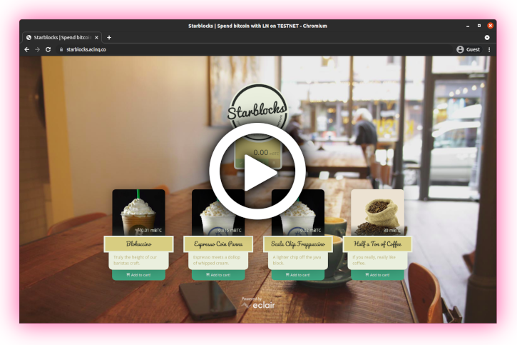

<!-- markdownlint-disable MD014 MD022 MD025 MD040 -->


# Backstory
{: .no_toc }

Hey, I'm [Stadicus](https://stadicus.com){:target="_blank"}, and I wrote the first version of this guide back in 2017 when Lightning was pretty obscure.
I love to tinker and build stuff.

## Why am I excited about Bitcoin and Lightning?

**Bitcoin as new technology** is an exciting endeavor, especially due to its interdisciplinary nature.

**Bitcoin as sound money** will have a significant impact on economic principles and society.
In my opinion, a solid, anti-fragile base layer for this future monetary network is the killer app for blockchains.
It will be more important than the most novel feature of competing altcoin projects.

Currently, Bitcoin is more of a store of value and not really suited for small everyday transactions.
Due to the limitations of the blockchain, and the growth of its usage, fees have risen and business models relying on cheap transactions are being priced out.
This is fine.
A **genuinely decentralized blockchains is a scarce resource** and cannot scale to accommodate all global transactions.
The current scaling pains are a great motivator to build better technology to scale exponentially instead of just making everything bigger for linear scaling.

This is where the **Lightning Network** comes in.
As one of several new blockchain “extensions”, it enables nearly unlimited transactions, with instant payment confirmation, minimal fees, and increased privacy.
It sounds almost too good to be true.
Still, the technology is well researched, committed to the cypherpunk open-source ethos, and leverages the solid underpinnings of Bitcoin.

Bitcoin's security model requires both full nodes and miners to be decentralized.
While the full-node-using economy must be decentralized to stop fake bitcoins that do not abide by consensus from being accepted as payments, the miners must be decentralized to stop censorship of transactions and make transactions irreversible.

To preserve the decentralized nature of this monetary system, I think it is important that everybody can run their own trustless Bitcoin full node, preferably on cheap hardware like a Raspberry Pi.
If Bitcoin is digital gold, then a full node is your own personal goldsmith who checks that received payments are genuine.

This is why I set out to build my **RaspiBolt**.
Through numerous iterations, I now have quite an exemplary configuration, which I would like to share as my modest contribution to the community.
I am not a systems specialist, so please feel free to point out improvements.

## The good old days

This was the original goal of the RaspiBolt guide back in 2017: simply buying a Blockaccino.
I used the [Eclair](https://github.com/ACINQ/eclair){:target="_blank"} Lighting implementation back then, on Lightning testnet, as mainnet was not even running yet.
Oh, how time flies...

{:target="_blank"}

Watch the [original screencast](https://vimeo.com/252693058){:target="_blank"} from back then.

## A community project

I started this guide in 2017 as a [Medium article](https://medium.com/@stadicus/noobs-guide-to-%EF%B8%8F-lightning%EF%B8%8F-on-a-raspberry-pi-f0ab7525586e){:target="_blank"} and moved it to GitHub later.
There have been many contributors, building more and more content.
It hasn't been "my own" guide for a long time but has become a genuine community effort.

Thanks to everybody who contributed and will do so in the future.
Thanks to everyone who cares about Bitcoin and feels that running your own Bitcoin node is essential for keeping it decentralized.

  

---

Next: [Rasperry Pi >>](raspberry-pi/index.md)
