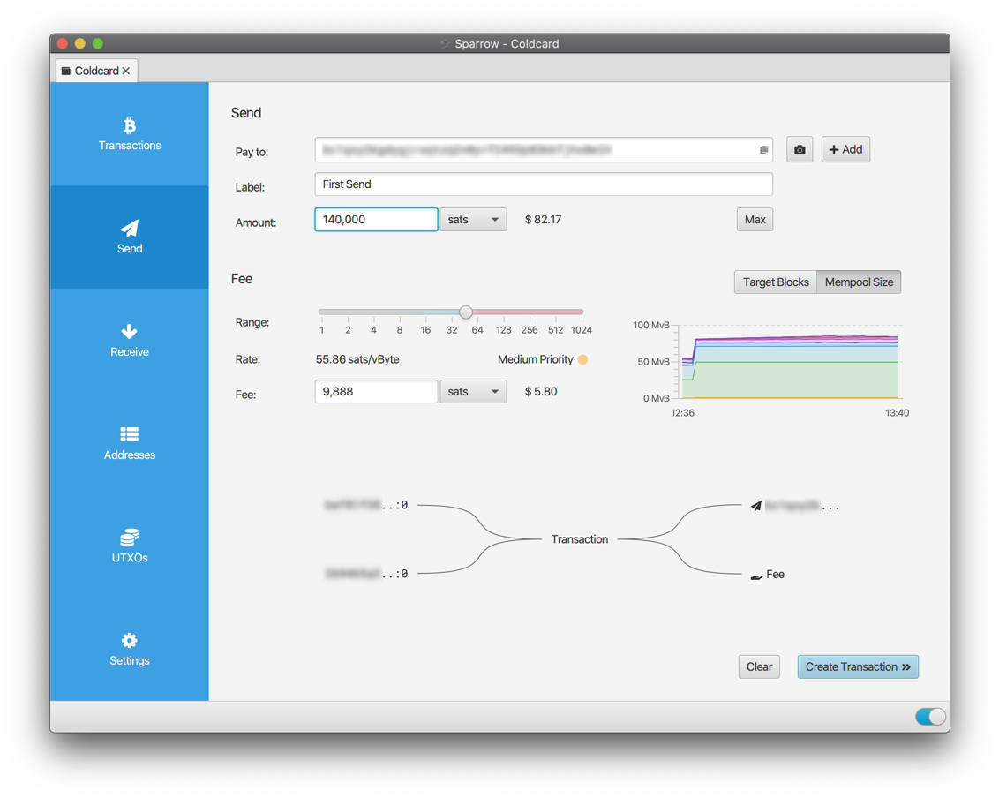

<!-- markdownlint-disable MD014 MD022 MD025 MD033 MD040 -->

# Desktop wallet
{: .no_toc }

We install the [Sparrow](https://github.com/romanz/electrs/){:target="_blank"} desktop wallet on a computer and connect it to your Electrum server on your node for private bitcoin on-chain transactions.  



If you'd like to install another desktop wallet and connect it to your node, we have bonus guides for:
* [BitBoxApp](../bonus/bitcoin/bitboxapp.md)
* [Electrum](../bonus/bitcoin/electrum.md)
* [Specter Desktop](../bonus/bitcoin/specter-desktop.md)

---

## Table of contents
{: .no_toc .text-delta }

1. TOC
{:toc}

---

## Preparations

### Tor

By default, Sparrow uses clearnet to query the bitcoin exchange rate and to communicate with the Whirlpool server when coinjoining. This is not ideal as your IP is leaked to the exchange rate API provider and to the Whirlpool server.  

To preserve your privacy, Sparrow can instead communicate over the Tor network. To do this, Tor has to be running on your computer:
* either as a background service, reachable on port 9050
* or when the Tor Browser is opened, reachable on port 9150

Here, we'll use the Tor Browser and port 9150 as it is easier to set up on Windows and Mac.

* Install the Tor Browser on your computer by following [these Tor guidelines](https://tb-manual.torproject.org/installation/){:target="_blank"}.

* Open the Tor Browser
* Click on "Always connect automatically" and "Connect to Tor"
* Keep the Tor Browser running while using Sparrow

*Note:* For Linux Debian-based OS users, you might prefer to just have Tor running in the background and not have to open the Tor Browser each time you're using Sparrow. If so, instead of intalling the browser, simply install Tor with `sudo apt install tor` and start the systemd service with `sudo systemctl start tor`.

## Installation

On your local computer, download, verify and install Sparrow.


* [Using the instructions on this page](https://www.sparrowwallet.com/download/){:target="_blank"}: 
  * Download the required version for your OS
  * Download the manifest and manifest signature files
  * Verify the release
  * Install Sparrow

---

## Local connection

We can connect Sparrow to our Electrum server (recommended option) or to Bitcoin Core directly. For more information about the privacy and security trade-offs of the various server options, read the following [article](https://www.sparrowwallet.com/docs/best-practices.html){:target="_blank"} by Craig Raw, the author of Sparrow.


### Launch Sparrow

* Launch Sparrow
* Read carefully the introductory messages by clicking on "Next" several times
* When you reach the "Connecting to a Private Electrum Server" message, click on "Configure Server"

### Option 1: Connect to Electrs (recommended)

* Click on the "Private Electrum" tab
* On the "URL" line, paste `raspibolt.local` or your node IP (e.g. `192.168.0.20`) in the first box and `50002` in the second box
* Enable SSL by clicking on the slider (it should become blue)
* Enable the Tor proxy by clicking on the "Use proxy" slider
* On the "Proxu URL" line, paste `127.0.0.1` in the first box and `9150` in the second box (or `9050` if you run Tor as a background service)
* Click on "Test Connection". A green tick should appear on the button and you should see something similar to the following output:

  ```
  > Connected to electrs/0.9.5 on protocol version 1.4
  > [...]
  ```


If there is a connection error message, try the following troubleshooting:
* Make sure that your computer is not connected to any "guest" WiFi network at home. A "guest" WiFi network prevents the computer to connect to any other devices on the local network, such as your node.
* If you have used Sparrow before on this computer, delete the existing certificates that are stored within the `certs` folder:
  * On Windows: `C:\Users\remi\AppData\Roaming\Sparrow\certs`
  * On macOS: `~/.sparrow/cert`
  * On Linux: `~/.sparrow/cert`


You're set! Sparrow is now configured to connect to your Electrum server from within your LAN.

### Option 2: Connect to Bitcoin Core

Follow the following guidelines if you did not install an Electrum server and prefer to connect to Bitcoin Core; otherwise move to the [next section](#remote-connection-over-tor-optional).  

Before we can configure Sparrow to connect to Bitcoin Core, we have to configure Bitcoin Core on the node.  

#### Bitcoin Core configuration

* On your node, configure the firewall to allow access to the Bitcoin RPC port 8332 from any device within the local network

  ```sh
  $ sudo ufw allow 8332/tcp comment 'allow bitcoin RPC connection'
  $ sudo ufw status
  ```

* Open the Bitcoin Core configuration file

  ```sh
  $ sudo nano /data/bitcoin/bitcoin.conf
  ```

* Paste the following lines at the end. Replace `<your_node_ip>` with your own node IP (e.g. `192.168.0.20`) and replace <private_ip_subnet> with your private IP subnet (e.g. `192.168.0.0/16`, i.e. the start of your node IP, `192.168.0.0` followed by the `/16` mask). Save and exit.

  ```ini
  > # Allow RPC connections from localhost (default) 
  > # and from anywhere on the local area network
  > main.rpcport=8332
  > rpcallowip=127.0.0.1
  > rpcallowip=192.168.0.0/16
  > rpcbind=0.0.0.0
  ```

* Restart Bitcoin Core

  ```sh
  $ sudo systemctl restart bitcoind
  ```

#### Sparrow configuration

Go back to the Sparrow server configuration window:

* Click on the "Bitcoin Core" tab
* On the "URL" line, paste `raspibolt.local` or your node URL (e.g. `192.168.0.20`) in the first box and `8332` in the second box
* On the "Authentification" line, click on "User/Pass"
* On the "User / Pass" line, paste your Bitcoin RPC username (e.g. `raspibolt`) and password [B]
* Enable the Tor proxy by clicking on the "Use proxy" slider
* On the "Proxy URL" line, paste `127.0.0.1` in the first box and `9150` in the second box (or `9050` if you run Tor as a background service)
* Click on "Test Connection". A green tick should appear on the button and you should see something similar to the following output:

  ``` 
  > Connected to bwt v0.2.4 on protocol version 1.4
  > [...]
  ```


You're set! Sparrow is now configured to connect to Bitcoin Core from within your LAN.

---

## Remote connection over Tor (optional)

Whether you've opted to connect to Electrs or Bitcoin Core, if you want to use Sparrow outside your LAN, you can use a connection over Tor.

### Server Tor address

To connect via Tor to Electrs or Bitcoin Core, the server must have a Tor connection address.  
* If you've opted to connect to Electrs (option 1), make sure you have set up a Tor hidden service as explained in the ["Electrum server" guide](electrum-server.md#remote-access-over-tor-optional).
* If you've opted to connect to Bitcoin Core (option 2), Bitcoin Core is already configured to use Tor and advertise a Tor connection address to the network.

### Configure Sparrow

* Open Sparrow
* Navigate to the server configuration page (Ctrl+p then click on "Server").
* Click on "Edit Existing Connection"

* On the "URL" line, replace the existing URL/IP by your Tor hidden service connection address (e.g. "abcd...1234.onion")
  * *For "Private Electrum":* this is the address obtained [when setting up the Electrs hidden service](https://raspibolt.org/electrs.html#remote-access-over-tor-optional). If you've lost the connection address, you can obtain it again by running:
    *  `sudo cat /var/lib/tor/hidden_service_electrs/hostname`
  * *For "Bitcoin Core":* this is the address advertised by Bitcoin Core each time it starts. To obtain it run:
    *  `sudo tail -f -n 50000 /data/bitcoin/debug.log | grep "tor: Got service ID"` 
    *  If there is no output, re-run the command after restarting Bitcoin Core
* The Tor proxy should already be enabled. If not, enable it and use `127.0.0.1` in the first box and `9150` in the second box (or `9050` if you run Tor as a background service)
* Click on "Test connection". A green tick should appear on the button and you should see something similar to the following output:

  ```
  > Connected to [...] on protocol version 1.4
  > [...]
  ```

You're set! Sparrow is now configured to connect to your node wherever you are.

---

## Sparrow in action

Congratulations, you have now a Bitcoin desktop wallet, capable of securing your bitcoin, running with your own trustless Bitcoin full node!  
Sparrow is a powerful wallet that allows you to use the most advanced features for securing your bitcoins and preserve your privacy.

With Sparrow you can:

* Connect any hardware wallet
* Send and receive bitcoins
* Have full control throughout the transaction creation and signing process: coin control, labelling, byte level transaction viewer...
* Create batched transactions to save on miner fees
* Create multisig wallets for improved security
* Coinjoin your coins for improved privacy

For more information and tutorials, visit the [Sparrow documentation webpage](https://sparrowwallet.com/docs/){:target="_blank"}.

---

## For the future: Sparrow update

Sparrow will automatically notify you when an update is available. Simply install the updates using the usual method for your OS.

<br /><br />

---

Next: [Blockchain explorer >>](blockchain-explorer.md)

