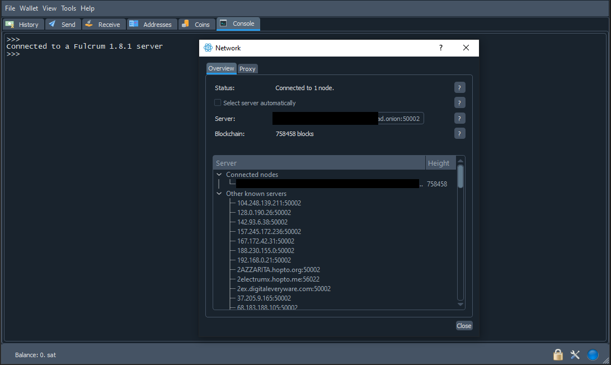
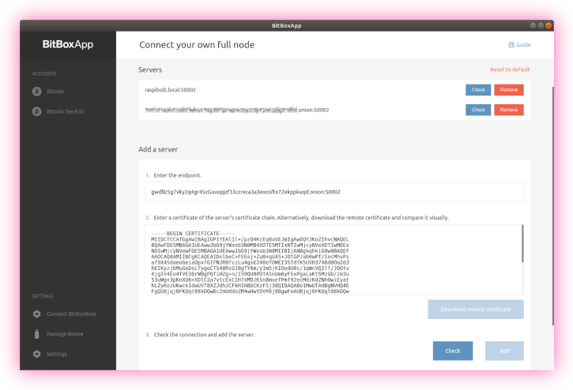

<!-- markdownlint-disable MD014 MD022 MD025 MD033 MD040 -->

# Electrum server
{: .no_toc }

We set up [Electrs](https://github.com/romanz/electrs/){:target="_blank"} to serve as a full Electrum server for use with your Bitcoin software or hardware wallets.

---

## Table of contents
{: .no_toc .text-delta }

1. TOC
{:toc}

---

## Bitcoin with hardware wallets

The best way to safekeep your bitcoin (meaning the best combination of security and usability) is to use a hardware wallet (like [BitBox](https://shiftcrypto.ch/bitbox02){:target="_blank"}, [Ledger](https://www.ledger.com){:target="_blank"} or [Trezor](https://trezor.io){:target="_blank"}) in combination with your own Bitcoin node.
This gives you security, privacy and eliminates the need to trust a third party to verify transactions.

Bitcoin Core on the RaspiBolt itself is not meant to hold funds.

One possibility to use Bitcoin Core with your Bitcoin wallets is to use an Electrum Server as middleware.
It imports data from Bitcoin Core and provides it to software wallets supporting the Electrum protocol.
Wallets like the [BitBoxApp](https://shiftcrypto.ch/app/){:target="_blank"}, [Electrum wallet](https://electrum.org/){:target="_blank"} or [Sparrow Wallet](https://sparrowwallet.com/){:target="_blank"} that support hardware wallets can then be used with your own sovereign Bitcoin node.

---

## Preparations

Make sure that you have [reduced the database cache of Bitcoin Core](bitcoin-client.md#reduce-dbcache-after-full-sync)#prepare-nginx-reverse-proxy after full sync.

### Install dependencies

* Install build tools needed to compile Electrs from the source code

  ```sh
  $ sudo apt install cargo clang cmake
  ```

### Firewall & reverse proxy

In the [Security section](../raspberry-pi/security.md), we already set up NGINX as a reverse proxy.
Now we can add the Electrs configuration.

* Enable NGINX reverse proxy to add SSL/TLS encryption to the Electrs communication.
  Create the configuration file and paste the following content

  ```sh
  $ sudo nano /etc/nginx/streams-enabled/electrs-reverse-proxy.conf
  ```

  ```nginx
  upstream electrs {
    server 127.0.0.1:50001;
  }

  server {
    listen 50002 ssl;
    proxy_pass electrs;
  }
  ```

* Test and reload NGINX configuration

  ```sh
  $ sudo nginx -t
  $ sudo systemctl reload nginx
  ```

* Configure the firewall to allow incoming requests

  ```sh
  $ sudo ufw allow 50002/tcp comment 'allow Electrum SSL'
  ```

---

## Electrs

An easy and performant way to run an Electrum server is to use [Electrs](https://github.com/romanz/electrs){:target="_blank"}, the Electrum Server in Rust.
There are no binaries available, so we will compile the application ourselves.

### Build from source code

We get the latest release of the Electrs source code, verify it, compile it to an executable binary and install it.

* Download the source code for the latest Electrs release.
  You can check the [release page](https://github.com/romanz/electrs/releases){:target="_blank"} to see if a newer release is available.
  Other releases might not have been properly tested with the rest of the RaspiBolt configuration, though.

  ```sh
  $ mkdir /home/admin/rust
  $ cd /home/admin/rust
  $ git clone --branch v0.9.4 https://github.com/romanz/electrs.git
  $ cd electrs
  ```

* To avoid using bad source code, verify that the release has been properly signed by the main developer [Roman Zeyde](https://github.com/romanz){:target="_blank"}.

  ```sh
  $ curl https://romanzey.de/pgp.txt | gpg --import
  $ git verify-tag v0.9.4
  > gpg: Good signature from "Roman Zeyde <me@romanzey.de>" [unknown]
  > gpg: WARNING: This key is not certified with a trusted signature!
  > gpg:          There is no indication that the signature belongs to the owner.
  > Primary key fingerprint: 15C8 C357 4AE4 F1E2 5F3F  35C5 87CA E5FA 4691 7CBB
  ```

* Now compile the source code into an executable binary and install it.
  The compilation process can take up to one hour.

  ```sh
  $ cargo build --locked --release
  $ sudo cp ./target/release/electrs /usr/local/bin/
  ```

### Configuration

* Create the "electrs" service user, and make it a member of the "bitcoin" group

  ```sh
  $ sudo adduser --disabled-password --gecos "" electrs
  $ sudo adduser electrs bitcoin
  ```

* Create the Electrs data directory

  ```sh
  $ sudo mkdir /data/electrs
  $ sudo chown -R electrs:electrs /data/electrs
  ```

* Switch to the "electrs" user and create the config file with the following content

  ```sh
  $ sudo su - electrs
  $ nano /data/electrs/electrs.conf
  ```

  ```sh
  # RaspiBolt: electrs configuration
  # /data/electrs/electrs.conf

  # Bitcoin Core settings
  network = "bitcoin"
  daemon_dir= "/home/bitcoin/.bitcoin"
  daemon_rpc_addr = "127.0.0.1:8332"
  daemon_p2p_addr = "127.0.0.1:8333"

  # Electrs settings
  electrum_rpc_addr = "127.0.0.1:50001"
  db_dir = "/data/electrs/db"
  index_lookup_limit = 1000

  # Logging
  log_filters = "INFO"
  timestamp = true
  ```

* Let's start Electrs manually first to check if everything runs as expected.
  It will immediately start with the initial indexing of the Bitcoin blocks.

  ```sh
  $ electrs --conf /data/electrs/electrs.conf
  ```

  ```sh
  Starting electrs 0.9.4 on aarch64 linux with Config { network: Bitcoin, db_path: "/data/electrs/db/bitcoin", daemon_dir: "/home/bitcoin/.bitcoin", daemon_auth: CookieFile("/home/bitcoin/.bitcoin/.cookie"), daemon_rpc_addr: 127.0.0.1:8332, daemon_p2p_addr: 127.0.0.1:8333, electrum_rpc_addr: 127.0.0.1:50001, monitoring_addr: 127.0.0.1:4224, wait_duration: 10s, jsonrpc_timeout: 15s, index_batch_size: 10, index_lookup_limit: Some(1000), reindex_last_blocks: 0, auto_reindex: true, ignore_mempool: false, sync_once: false, disable_electrum_rpc: false, server_banner: "Welcome to electrs 0.9.4 (Electrum Rust Server)!", args: [] }
  [2021-11-09T07:09:42.744Z INFO  electrs::metrics::metrics_impl] serving Prometheus metrics on 127.0.0.1:4224
  [2021-11-09T07:09:42.744Z INFO  electrs::server] serving Electrum RPC on 127.0.0.1:50001
  [2021-11-09T07:09:42.812Z INFO  electrs::db] "/data/electrs/db/bitcoin": 0 SST files, 0 GB, 0 Grows
  [2021-11-09T07:09:43.174Z INFO  electrs::index] indexing 2000 blocks: [1..2000]
  [2021-11-09T07:09:44.665Z INFO  electrs::chain] chain updated: tip=00000000dfd5d65c9d8561b4b8f60a63018fe3933ecb131fb37f905f87da951a, height=2000
  [2021-11-09T07:09:44.986Z INFO  electrs::index] indexing 2000 blocks: [2001..4000]
  [2021-11-09T07:09:46.191Z INFO  electrs::chain] chain updated: tip=00000000922e2aa9e84a474350a3555f49f06061fd49df50a9352f156692a842, height=4000
  [2021-11-09T07:09:46.481Z INFO  electrs::index] indexing 2000 blocks: [4001..6000]
  [2021-11-09T07:09:47.581Z INFO  electrs::chain] chain updated: tip=00000000dbbb79792303bdd1c6c4d7ab9c21bba0667213c2eca955e11230c5a5, height=6000
  ...
  ```

* Stop Electrs with `Ctrl`-`C` and exit the "electrs" user session.

  ```sh
  $ exit
  ```

### Autostart on boot

Electrs needs to start automatically on system boot.

* As user "admin", create the Electrs systemd unit and copy/paste the following configuration. Save and exit.

  ```sh
  $ sudo nano /etc/systemd/system/electrs.service
  ```

  ```sh
  # RaspiBolt: systemd unit for electrs
  # /etc/systemd/system/electrs.service

  [Unit]
  Description=Electrs daemon
  Wants=bitcoind.service
  After=bitcoind.service

  [Service]

  # Service execution
  ###################
  ExecStart=/usr/local/bin/electrs --conf /data/electrs/electrs.conf

  # Process management
  ####################
  Type=simple
  Restart=always
  TimeoutSec=120
  RestartSec=30
  KillMode=process

  # Directory creation and permissions
  ####################################
  User=electrs

  # /run/electrs
  RuntimeDirectory=electrs
  RuntimeDirectoryMode=0710

  # Hardening measures
  ####################
  # Provide a private /tmp and /var/tmp.
  PrivateTmp=true

  # Use a new /dev namespace only populated with API pseudo devices
  # such as /dev/null, /dev/zero and /dev/random.
  PrivateDevices=true

  # Deny the creation of writable and executable memory mappings.
  MemoryDenyWriteExecute=true

  [Install]
  WantedBy=multi-user.target
  ```

* Enable and start Electrs.

  ```sh
  $ sudo systemctl enable electrs
  $ sudo systemctl start electrs
  ```

* Check the systemd journal to see Electrs' log output.

  ```sh
  $ sudo journalctl -f -u electrs
  ```

  Electrs will now index the whole Bitcoin blockchain so that it can provide all necessary information to wallets.
  With this, the wallets you use no longer need to connect to any third-party server to communicate with the Bitcoin peer-to-peer network.

* Exit the log output with `Ctrl`-`C`

### Remote access over Tor (optional)

To use your Electrum server when you're on the go, you can easily create a Tor hidden service.
This way, you can connect the BitBoxApp or Electrum wallet also remotely, or even share the connection details with friends and family.
Note that the remote device needs to have Tor installed as well.

* Add the following three lines in the section for "location-hidden services" in the `torrc` file.

  ```sh
  $ sudo nano /etc/tor/torrc
  ```

  ```sh
  ############### This section is just for location-hidden services ###
  HiddenServiceDir /var/lib/tor/hidden_service_electrs/
  HiddenServiceVersion 3
  HiddenServicePort 50002 127.0.0.1:50002
  ```

* Reload Tor configuration and get your connection address.

  ```sh
  $ sudo systemctl reload tor
  $ sudo cat /var/lib/tor/hidden_service_electrs/hostname
  > abcdefg..............xyz.onion
  ```

---

💡 Electrs must first fully index the blockchain and compact its database before you can connect to it with your wallets.
This can take a few hours.
Only proceed with the next section once Electrs is ready.

* To check if Electrs is still indexing, you can follow the log output

  ```sh
  $ sudo journalctl -f -u electrs
  ```

## Connect Electrum wallet

[Electrum wallet](https://electrum.org){:target="_blank"} is a well-established, feature-rich Bitcoin wallet for power-users that supports most hardware wallets.

{:target="_blank"}

### Force single server connection

To make sure Electrum only uses your own server and does not connect to any other public server by accident, we'll hardcode the connection directly in the configuration file.

* On your regular computer, open the Electrum `config` file in a text editor.
  It is located in the Electrum data directory.
  Refer to the [official documentation](https://electrum.readthedocs.io/en/latest/faq.html#datadir){:target="_blank"} on how to find it.

* Change `"auto_connect": true,` to `"auto_connect": false,`.
  This prevents any automatic connection to public Electrum servers, which could potentially leak private information.

* Change `"oneserver": false,` to `"oneserver": true,`.
  This ensures that all data is only retrieved from one single server.

### Local connection

If you use Electrum only within your own home network, you can use the local connection details.
To connect from outside your network over Tor, skip to the next section.

* Add (or change) the line containing `"server":` to force Electrum to use your own server.
  You can use the hostname `raspibolt.local` or your IP address.

  ```sh
  "server": "raspibolt.local:50002:s",
  ```

If you start Electrum, the green LED in the bottom right indicates an active connection to your server.

### Remote connection over Tor

If you connect over Tor, make sure that Tor is installed on your regular computer.
There are two options:

* Easy: download, install and run [Tor Browser](https://www.torproject.org){:target="_blank"}.
  * The application must be started manually and run in the background whe you want to connect over Tor.
  * Tor proxy available on port `9150`

* Expert: install Tor as a background service
  * The background service must be installed, and is always active in the background.
  * Tor proxy available on port `9050`
  * See further installation instructions for [Windows](https://bitstobytes.org/tor){:target="_blank"}, [macOS](https://deepdarkweb.github.io/how-to-install-tor-on-macos-tutorial/){:target="_blank"}, and Linux (`sudo apt install tor`).

Now we need to specifiy the Tor address for Electrs and the local Tor proxy port in the Electrum configuration.

* Get the Electrs onion address directly on the RaspiBolt

  ```sh
  $ sudo cat /var/lib/tor/hidden_service_electrs/hostname
  > abcdefg..............xyz.onion
  ```

* Add (or change) the line containing `"server":` to force Electrum to use your own server over Tor.

  ```sh
  "server": "abcdefg..............xyz.onion:50002:s",
  ```

* Add (or change) the folowing line, using the correct port (either `9150` when using the Tor Browser, or `9050` for the Tor background service)

  ```sh
  "proxy": "socks5:127.0.0.1:9150::",
  ```

If you start Electrum, the blue LED in the bottom right indicates an active Tor connection to your server.

---

## Connect BitBoxApp

The [BitBoxApp](https://shiftcrypto.ch/app/){:target="_blank"} is a beginner-friendly companion app to the BitBox02 hardware wallet by Shift Crypto.

### General

On your regular computer, configure the BitBoxApp to use your RaspiBolt:

* In the sidebar, select `Settings` > `Connect your own full node`
* In the field "Enter the endpoint" enter the hostname or ip address and the port, e.g. `raspibolt.local:50002`
* Click on "Download remote certificate"
* Click "Check", you should be prompted with the message "Successfully establised a connection"
* Click "Add" to add your server to the list on the top
* Remove the Shift servers to only connect to your own server

### Tor

If you have Tor installed on your computer, you can access your RaspiBolt remotely over Tor.

* In the sidebar, select `Settings` > `Enable tor proxy`
* Enable it and confirm the proxy address (usually the default `127.0.0.1:9050`)
* When adding your RaspiBolt full node as described above, use your Tor address (e.g. `gwdllz5g7vky2q4gr45zGuvopjzf33czreca3a3exosftx72ekppkuqd.onion:50002`)



---

## Don't trust, verify.

Congratulations, you have now a Bitcoin desktop wallet, capable of securing your bitcoin with support of hardware wallets, running with your own trustless Bitcoin full node!

---

## For the future: Electrs upgrade

Updating Electrs is straight-forward.
You can display the current version with the command below and check the Electrs [release page](https://github.com/romanz/electrs/releases){:target="_blank"} to see if a newer version is available.

🚨 **Check the release notes!**
Make sure to check the [release notes](https://github.com/romanz/electrs/blob/master/RELEASE-NOTES.md){:target="_blank"} first to understand if there have been any breaking changes or special upgrade procedures.

* Check current Electrs version

  ```sh
  $ electrs --version
  ```

* If a newer release is available, you can upgrade by executing the following commands with user "admin"

  ```sh
  $ cd /home/admin/rust/electrs

  # update the local source code and show the latest release tag (example: v9.9.9)
  $ git fetch
  $ git describe --tags --abbrev=0
  > v9.9.9

  # check out the most recent release (replace v9.9.9 with the actual version)
  $ git checkout v9.9.9

  # Compile the source code
  $ cargo clean
  $ cargo build --locked --release

  # Back up the old version and update
  $ sudo cp /usr/local/bin/electrs /usr/local/bin/electrs-old
  $ sudo mv ./target/release/electrs /usr/local/bin/

  # Update the Electrs configuration if necessary (see release notes)
  $ nano /data/electrs/electrs.conf

  # Start Electrs
  $ sudo systemctl restart electrs
  ```

<br /><br />

---

Next: [Blockchain explorer >>](blockchain-explorer.md)
