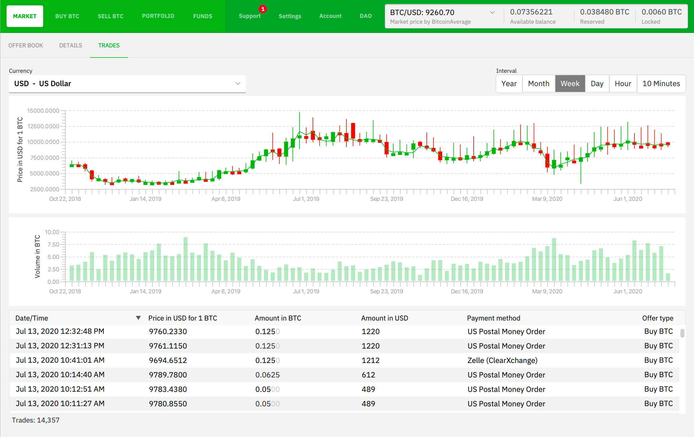
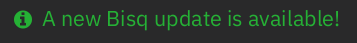

# Bonus guide: Bisq
{: .no_toc }

---

[Bisq](https://bisq.network/){:target="_blank"} is a decentralized bitcoin exchange. 
It is a desktop application that aims at providing a secure, private and censorship-resistant way of exchanging bitcoin for national currencies and other cryptocurrencies over the internet.

Difficulty: Easy
{: .label .label-green }

Status: Tested v3
{: .label .label-green }



---

Table of contents
{: .text-delta }

1. TOC
{:toc}

---

## Introduction

The guide will show you how to:

1. Install Bisq on your local computer
1. Connect Bisq to your Bitcoin node via Tor to preserve maximum privacy
1. Securely set up Bisq

---

## Installation

* Download Bisq on your local computer using the appropriate binary for your OS: [https://bisq.network/downloads/](https://bisq.network/downloads/){:target="_blank"}

* Verify the downloaded binary following [Bisq guidelines](https://bisq.wiki/Downloading_and_installing){:target="_blank"}

* Once you've verified the integrity of the downloaded Bisq binary, install it on your local computer but do NOT launch Bisq yet!

---

## Connect Bisq to your node

### Configure Bitcoin Core

For Bisq to connect to your Bitcoin Core node, the bloom filters have to be activated.

* In `bitcoin.conf`, add the following line under `whitelist=download@127.0.0.1          # for Electrs`. Save and exit.

  ```sh
  $ sudo nano /data/bitcoin/bitcoin.conf
  ```

  ```ini
  whitelist=bloomfilter@127.0.0.1/32    # for Bisq
  ```

* Restart Bitcoin Core (if you didn't set up automatic LND wallet unlock, remember to unlock it after `bitcoind` restarted)

  ```sh
  $ sudo systemctl restart bitcoind
  ```

* Still with user admin, run the following command and make a copy of the .onion address and port (e.g. here, `123...abc.onion:8333`)

  ```sh
  $ sudo tail -n 500 -f /data/bitcoin/debug.log | grep "tor: Got service ID"
  > 022-01-01T22:18:17Z tor: Got service ID 123...abc, advertising service 123...abc.onion:8333
  ```

### First run & configuration

#### Start Bisq from the command line

The first time Bisq is opened using the GUI, it will connect to several remote Bitcoin nodes via Tor. 
To avoid this, we will start Bisq the first time using the command line to force it to connect to your Bitcoin node only.

* On your personal computer where you installed Bisq, open a command line terminal

* We will start Bisq with two flags that will force it to connect to Tor only and using our own Bitcoin Core onion address. 
Replace `123...abc.onion:8333` with your own Bitcoin Core .onion address that you obtained above.
  
  ```sh
  $ /opt/bisq/bin/Bisq -btcNodes=123...abc.onion:8333 -useTorForBtc=true
  ```

#### Network configuration

* Click on the "Settings" tab

* Click on the "Network info" tab

* In the "Bitcoin Network" section, click on "Use custom Bitcoin Core nodes"

* In the box just below, paste your Bitcoin Core node .onion address (`123...abc.onion:8333`)

* Click on any other tab at the top. Bisq will ask you to shut down the program to make your change effective.

* Click "Shut down"

* Start Bisq again, but now using the GUI icon.

* Go back to "Settings" > "Network info", check that only your onion address is listed in the first table 

* Check that the "Bitcoin network peers" counter at the bottom right of the window is equal to 1.

Congrats! Bisq is now connected to your node.

--- 

## Configuration

This section will highlight key configuration options focusing on privacy and security only.  

For the national currency account and trading configuration options, please refer to the Bisq [website](https://bisq.network/getting-started/){:target="_blank"} and [wiki](https://bisq.wiki/Main_Page){:target="_blank"}. 

### Bitcoin Explorer

* Click to "Settings" > "Preferences"

* Click on the three dots of the "Bitcoin Explorer" section

* Use the following information:
  * Name: Choose a name (e.g., `RaspiBolt`)
  * Transaction URL: `https://raspibolt.local:4000/tx/` (replace raspibolt.local with your node IP address if required)
  * Address URL: `https://raspibolt.local:4000/address/` (replace raspibolt.local with your node IP address if required)

* Click "Save"

### Wallet seed

* Click on the "Account" tab

* Click on "Wallet seed"

* Read the pop-up message carefully. Once read, click on "I understand"

* Read carefully the new warning window that appears and click on "Yes and don't ask me again'

* Carefully copy the seed words and wallet date on a paper backup (NOT on any computer)

* Read the "Information" section to understand the importance of the seed words and wallet date

### Backup

* Still in the "Account" tab, now click on "Backup"

* Click on "Select backup location" and select a folder where your Bisq data will be backed-up

* Click on "Backup now (backup is not encrypted)"


### Wallet password

* Still in the "Account" tab, click on "Wallet password"

* Set a strong unique password (e.g., using your password manager) and click on "Set password"

* In the pop-up window that just appeared, read the information and then click on "Set password, I already made a backup". Once done, close the confirmation window.

Congrats! You're now ready to start buying and selling Bitcoin on Bisq in a secure and private way.

---

## Update

Bisq will let you know when a new update is available. Simply follow the instructions on their announcement to download, verify and install the update.



---

## Uninstall

If you stop using Bisq for an extended period of time, it is worth deactivating the bloom filter feature in Bitcoin Core.

* In `bitcoin.conf`, comment out the following line. Save and exit.

  ```sh
  $ sudo nano /data/bitcoin/bitcoin.conf
  ```

  ```ini
  #whitelist=bloomfilter@127.0.0.1/32    # for Bisq
  ```

* Restart Bitcoin Core (if you didn't set up automatic LND wallet unlock, remember to unlock it after `bitcoind` restarted)

  ```sh
  $ sudo systemctl restart bitcoind
  ```

<br /><br />

---

<< Back: [+ Bitcoin](index.md)
