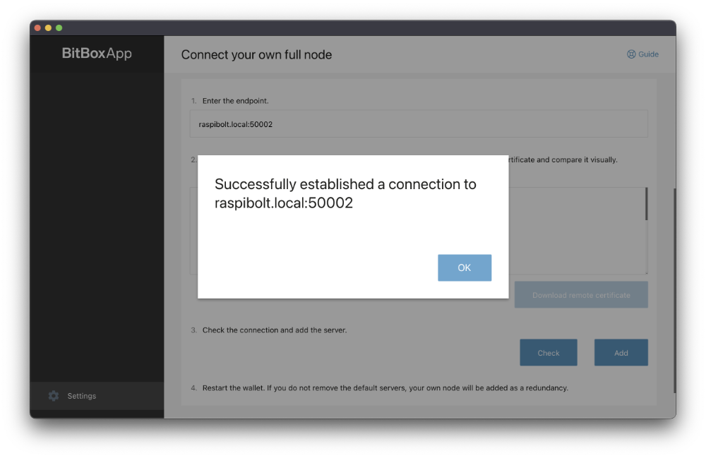
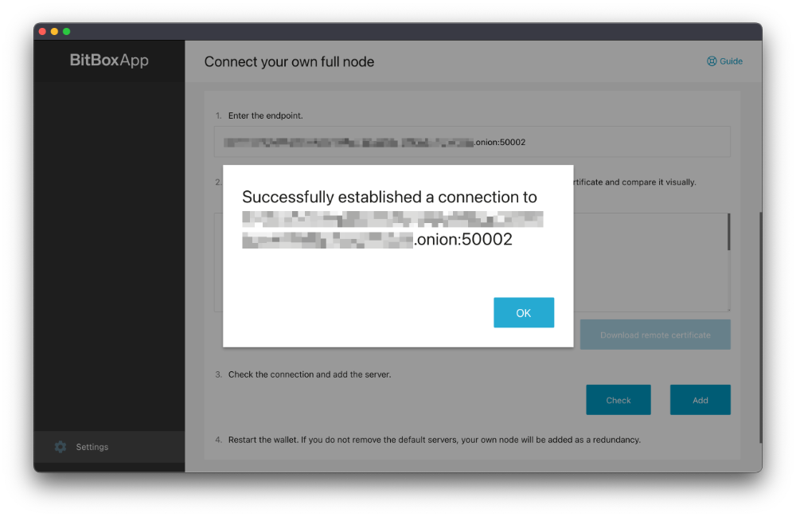

## Bonus guide: BitBoxApp

{: .no_toc }

---

The [BitBoxApp](https://shiftcrypto.ch/app/){:target="_blank"} is a beginner-friendly companion app to the BitBox02 hardware wallet by Shift Crypto. You can configure it to directly connect to your RaspiBolt without using the servers provided by Shift Crypto. This not only improves privacy, but lets you verify your transactions yourself, without the need to trust anyone else.

Difficulty: Easy
{: .label .label-green }

Status: Tested v3
{: .label .label-green }

---

Table of contents
{: .text-delta }

1. TOC
{:toc}

---

## Connecting to your RaspiBolt without Tor

* In the BitBoxApp, open the settings from the sidebar and click on "Connect your own full node".
* Enter the hostname or IP address together with the port in the field *"Enter the endpoint"*, e.g. `raspibolt.local:50002`.
* Click the blue "Download remote certificate" button.
* Test the connection by clicking "Check". You should be prompted with a message like in the screenshot below.
* Click "Add" to add your RaspiBolt to the server list.
* Remove the default Shift Crypto servers (`btc1.shiftcrypto.io` and `btc2.shiftcrypto.io`) to exclusively use your RaspiBolt for future connections. You can always revert to the default settings by clicking "Reset to default".

Restart the BitBoxApp to make sure all changes take effect and you're all set!



## Connecting to your RaspiBolt with Tor

Before configuring the BitBoxApp, make sure Tor (or the Tor Browser) is installed and running on your local system. A Tor hidden service needs to be configured on your RaspiBolt (as explained in [Remote access over Tor in the Electrum server guide](https://raspibolt.org/guide/bitcoin/electrum-server.html#remote-access-over-tor-optional)) in order to connect via Tor to Electrs.

If you have already set up the hidden service but forgot the connection address, you can always reobtain it with the following command (as user "admin" on your RaspiBolt):

```sh
$ sudo cat /var/lib/tor/hidden_service_electrs/hostname
> abcdefg..............xyz.onion
```

* In the BitBoxApp, open the settings from the sidebar and click on "Enable tor proxy".
* Enable the switch and enter the proxy address.

  * If you are using the Tor deamon, the correct address will most likely be `127.0.0.1:9050`. Make sure the Tor daemon is running in the background.

  * If you are using the Tor Browser, the correct address will most likely be `127.0.0.1:9150`. Note that the Tor Browser needs to be open with a connection established.

  A restart of the BitBoxApp is required for the changes to take effect.
* Open the settings once more and click on "Connect your own fullnode".
* Enter the onion address together with the port in the field *Enter the endpoint*, e.g. `abcdefg..............xyz.onion:50002`.
* Click the blue "Download remote certificate" button.
* Test the connection by clicking "Check". This might take a few seconds. You should be prompted with a message like in the screenshot below.
* Click "Add" to add your RaspiBolt to the server list.
* Remove the default Shift Crypto servers (`btc1.shiftcrypto.io` and `btc2.shiftcrypto.io`) to exclusively use your RaspiBolt for future connections. You can always revert to the default settings by clicking "Reset to default".

Restart the BitBoxApp to make sure all changes take effect and you're all set!



<br /><br />

---

<< Back: [+ Bitcoin](index.md)
