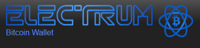
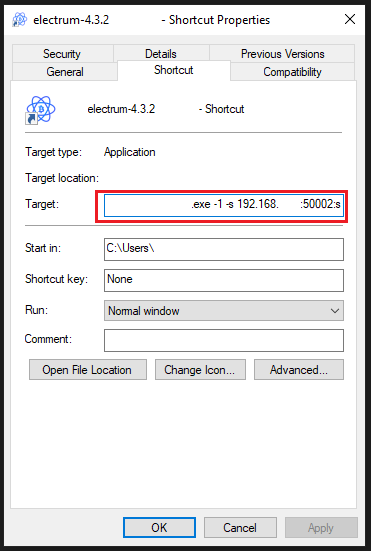
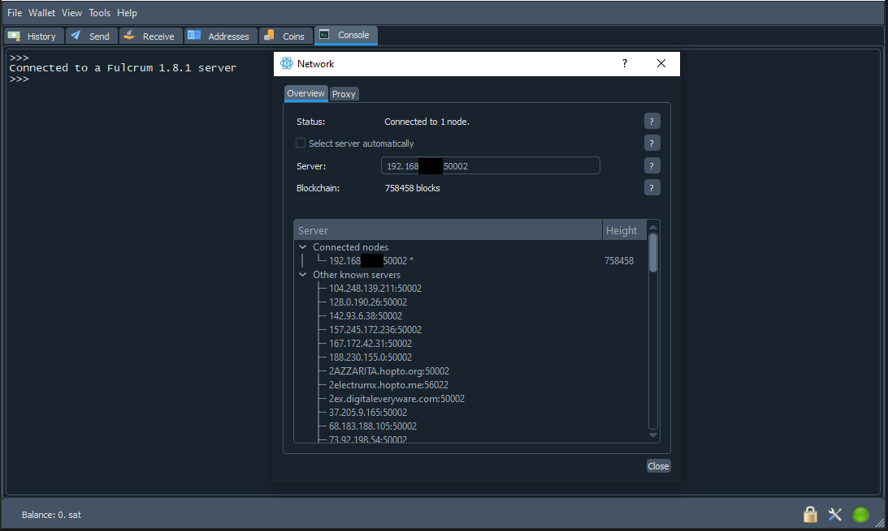
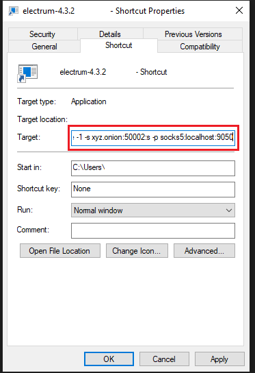
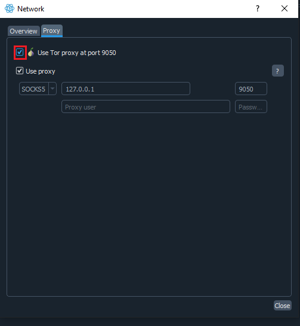

## Bonus guide: Electrum Wallet Desktop

{: .no_toc }

---

[Electrum wallet Desktop](https://electrum.org){:target="_blank"} is a well-established, feature-rich Bitcoin wallet for power-users that supports most hardware wallets.

Difficulty: Easy
{: .label .label-yellow }

Status: Tested v3
{: .label .label-green }



---

Table of contents
{: .text-delta }

1. TOC
{:toc}

---

## Installation

On your local computer, download, verify and install Electrum Wallet.

* [Using the instructions on this page](https://electrum.org/#download){:target="_blank"}:
  * Download the required version for your OS
  * Download the signature file
  * Verify the signature following the instructions on the page depending on your OS
  * Install Electrum Wallet Desktop

## Configuration

### Connect the Electrum wallet to our own Electrum server by forcing the connection to only one server

To make sure Electrum only uses your own server and does not connect to any other public server the first time by accident, we use different methods depending if you are connecting locally or remotely and the operating system that you use on your regular computer.

### Local connection

If you use Electrum only within your own home network, you can use the local connection details.

* Linux
  * Execute the next command in your Linux terminal

  ```sh
  ./electrum -1 -s raspibolt.local:50002:s
  ```

* Windows

  * With your new shortcut created after installation in desktop, right-click it and go to "Properties", click shortcut tab at the top bar, in the box named target, put `"-1 -s raspibolt.local:50002:s"` after `"electrum.exe"`, apply, accept and execute doing double-click on our new shortcut

  ```sh
  C:\Program Files (x86)\Electrum\electrum.exe -1 -s raspibolt.local:50002:s
  ```



* For **macOS** follow the next [instructions](https://deepdarkweb.github.io/how-to-install-tor-on-macos-tutorial/){:target="_blank"}

If you start Electrum, after create your wallet, show the green LED in the bottom right indicating an active connection to your server.



To connect from outside your network over Tor, skip to the next section.

### Remote connection over Tor

If you connect over Tor, make sure that Tor is installed on your regular computer.
There are two options depending on your OS:

* For **Windows**: download, install and run [Tor Browser](https://www.torproject.org){:target="_blank"}
  * The application must be started manually and run in the background when you want to connect over Tor.
  * By default, when you have Tor Browser running, Tor proxy is available on port `9150`, if you want to have `9050` available too, you can run background service on port `9050`, executing `"tor.exe"` file on the installation path route you chose during Tor Browser installation and following the next subpath `...\Tor Browser\Browser\TorBrowser\Tor\tor.exe"`

* For **Linux** only need to execute (`sudo apt install tor`) on the command line and ensure that the Tor service is working and listening at the default ports `9050` and `9150`
  
  ```sh
  $ sudo ss -tulpn | grep tor | grep LISTEN
  ```

Expected output:

  ```sh
  tcp   LISTEN 0      4096           127.0.0.1:9050       0.0.0.0:*    users:(("tor",pid=1847,fd=6))
  tcp   LISTEN 0      4096           127.0.0.1:9051       0.0.0.0:*    users:(("tor",pid=1847,fd=7))
  ```

Now we need to specify the Tor address for Electrum Server and the local Tor proxy port in the Electrum Wallet configuration.

First, get the onion address of your Electrum server directly on the RaspiBolt, depending on whether you chose the Electrs or Fulcrum service

* For Electrs:

  ```sh
  $ sudo cat /var/lib/tor/hidden_service_electrs/hostname
  > ab...yz.onion
  ```

* For Fulcrum:

  ```sh
  $ sudo cat /var/lib/tor/hidden_service_fulcrum/hostname
  > ab...yz.onion.onion
  ```

Now, execute Electrum Wallet choosing the correct way depending on your OS

* Linux

  * Execute the next command in your Linux terminal

  ```sh
  ./electrum -1 -s ab...yz.onion:50002:s -p socks5:localhost:9050
  ```

* Windows

  * With your new shortcut created after installation in Desktop, right-click it and go to properties, click shortcut tab at the top bar, in the box named target put `"-1 -s ab...yz.onion:50002:s -p socks5:localhost:9050"` after `"electrum.exe"`, apply, accept and execute doing double-click on our new shortcut

  ```sh
   C:\Program Files (x86)\Electrum\electrum.exe -1 -s ab...yz.onion:50002:s -p socks5:localhost:9050
  ```



* For **macOS** follow the next [instructions](https://deepdarkweb.github.io/how-to-install-tor-on-macos-tutorial/){:target="_blank"}

If you start Electrum, after create your wallet, show the blue LED in the bottom right indicating an active connection to your server through Tor.


🚨 Ensure you have put check `"Use Tor proxy at port 9050"` in `"Proxy"` settings tab



<br /><br />

---

<< Back: [+ Bitcoin](index.md)
