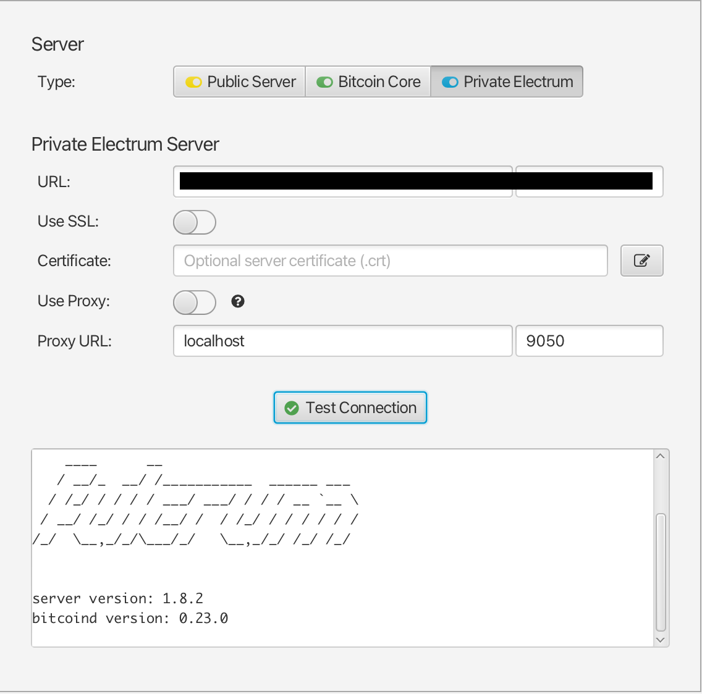

## Bonus guide: Fulcrum server

{: .no_toc }

---

[Fulcrum](https://github.com/cculianu/Fulcrum){:target="_blank"} is a fast & nimble SPV server for Bitcoin Cash, Bitcoin BTC, and Litecoin created by Calin Culianu. It can be used as an alternative to Electrs because of its performance, as we can see in Craig Raw's [comparison](https://www.sparrowwallet.com/docs/server-performance.html){:target="_blank"} of servers

Difficulty: Medium
{: .label .label-yellow }

Status: Tested v3
{: .label .label-green }


---

Table of contents
{: .text-delta }

1. TOC
{:toc}

---

## Requirements

* Bitcoin Core
* Storage space for database (external backup recommended); currently takes up 133GB (as of Aug 2023).

---

Fulcrum is a replacement for an Electrs, these two services cannot be run at the same time (due to the same standard ports used), remember to stop Electrs doing "sudo systemctl stop electrs". Performance issues have been found on Raspberry Pi 4GB, it is recommended to install Fulcrum on 8GB RAM version.

## Preparations

Make sure that you have [reduced the database cache of Bitcoin Core](../../bitcoin/bitcoin-client.md#reduce-dbcache-after-full-sync)

### Install dependencies

* With user "admin", make sure that all necessary software packages are installed

  ```sh
  $ sudo apt install libssl-dev
  ```

### Install zram-swap

zram-swap is a compressed swap in memory and on disk and is necessary for the proper functioning of Fulcrum during the sync process using compressed swap in memory (increase performance when memory usage is high)

* Access to "admin" home folder, clone the repository of GitHub and install zram-swap

  ```sh
  $ cd /home/admin/
  $ git clone https://github.com/foundObjects/zram-swap.git
  $ cd zram-swap && sudo ./install.sh
  ```

* Set following size value in zram configuration file. Save and exit

  ```sh
  $ sudo nano /etc/default/zram-swap
  ```

  ```sh
  #_zram_fraction="1/2" #Comment this line
  _zram_fixedsize="10G" #Uncomment and edit
  ```

* Add kernel parameters to make better use of zram

  ```sh
  $ sudo nano /etc/sysctl.conf
  ```

* Here are the lines you’ll want to add at the end of your /etc/sysctl.conf file to make better use of zram. Save and exit

  ```sh
  vm.vfs_cache_pressure=500
  vm.swappiness=100
  vm.dirty_background_ratio=1
  vm.dirty_ratio=50
  ```

* Then apply the changes with

  ```sh
  $ sudo sysctl --system
  ```

* Restart the service

  ```sh
  $ sudo systemctl restart zram-swap
  ```

* Make sure zram was correctly installed, zram prioritized, and autoboot enabled

  ```sh
  $ sudo cat /proc/swaps
  ```

* Expected output:

  ```sh
  Filename                               Type                 Size           Used    Priority
  /var/swap                              file                 102396         0       -2
  /dev/zram0                             partition            102396         0        5
  ```

* Check the status of zram-swap service

  ```sh
  $ sudo systemctl status zram-swap
  ```

* Expected output, find *enabled* label:

  ```sh
  zram-swap.service - zram swap service
  Loaded: loaded (/etc/systemd/system/zram-swap.service; enabled; vendor preset: enabled)
  Active: active (exited) since Mon 2022-08-08 00:51:51 CEST; 10s ago
  Process: 287452 ExecStart=/usr/local/sbin/zram-swap.sh start (code=exited, status=0/SUCCESS)
  Main PID: 287452 (code=exited, status=0/SUCCESS)
  CPU: 191ms

  Aug 08 00:51:51 node systemd[1]: Starting zram swap service...
  Aug 08 00:51:51 node zram-swap.sh[287471]: Setting up swapspace version 1, size = 4.6 GiB (4972199936 bytes)
  ...
  ```

### Configure Firewall

* Configure the firewall to allow incoming requests

  ```sh
  $ sudo ufw allow 50002/tcp comment 'allow Fulcrum SSL'
  $ sudo ufw allow 50001/tcp comment 'allow Fulcrum TCP'
  ```

### Configure Bitcoin Core

We need to set up settings in Bitcoin Core configuration file - add new lines if they are not present

* In `bitcoin.conf`, add the following line in "# Connections" section. Save and exit

  ```sh
  $ sudo nano /data/bitcoin/bitcoin.conf
  ```

  ```sh
  zmqpubhashblock=tcp://127.0.0.1:8433
  ```

* Restart Bitcoin Core

  ```sh
  $ sudo systemctl restart bitcoind
  ```

## Installation

### Download and set up Fulcrum

We have our Bitcoin Core configuration file set up, and now we can move to next part - installation of Fulcrum

* Check the latest Fulcrum release version. You can also confirm with the [release page](https://github.com/cculianu/Fulcrum/releases){:target="_blank" rel="noopener"}

  ```sh
  $ LATEST_VERSION=$(wget -qO- https://api.github.com/repos/cculianu/Fulcrum/releases/latest | grep -oP '"tag_name": "v\K(.*)(?=")')
  $ echo $LATEST_VERSION
  ```

* Download the application, checksums and signature

  {: .highlight }
  > You can also use the latest release version (`$LATEST_VERSION`). However, please be aware that newer release versions might not have been thoroughly tested with the rest of the RaspiBolt configuration.

  ```sh
  $ VERSION="1.9.7"
  $ cd /tmp
  $ wget https://github.com/cculianu/Fulcrum/releases/download/v$VERSION/Fulcrum-$VERSION-arm64-linux.tar.gz
  $ wget https://github.com/cculianu/Fulcrum/releases/download/v$VERSION/Fulcrum-$VERSION-shasums.txt.asc
  $ wget https://github.com/cculianu/Fulcrum/releases/download/v$VERSION/Fulcrum-$VERSION-shasums.txt
  ```

* Get the public key from the Fulcrum developer

  ```sh
  $ curl https://raw.githubusercontent.com/Electron-Cash/keys-n-hashes/master/pubkeys/calinkey.txt | gpg --import
  ```

* Verify the signature of the text file containing the checksums for the application

  ```sh
  $ gpg --verify Fulcrum-$VERSION-shasums.txt.asc
  > gpg: assuming signed data in 'Fulcrum-1.9.7-sha256sums.txt'
  > gpg: Signature made Fri 24 Nov 2023 08:27:08 AM UTC
  > gpg:                using DSA key D465135F97D0047E18E99DC321810A542031C02C
  > gpg: Good signature from "Calin Culianu (NilacTheGrim) <calin.culianu@gmail.com>" [unknown]
  > gpg: WARNING: This key is not certified with a trusted signature!
  > gpg:          There is no indication that the signature belongs to the owner.
  > Primary key fingerprint: D465 135F 97D0 047E 18E9  9DC3 2181 0A54 2031 C02C
  ```

* Verify the signed checksum against the actual checksum of your download

  ```sh
  $ grep 'arm64-linux.tar.gz' Fulcrum-$VERSION-shasums.txt | sha256sum --check
  ```

Expected output:

  ```sh
  > Fulcrum-1.9.7-arm64-linux.tar.gz: OK
  ```

* Install Fulcrum and check the correct installation requesting the version

  ```sh
  $ tar -xvf Fulcrum-$VERSION-arm64-linux.tar.gz
  $ sudo install -m 0755 -o root -g root -t /usr/local/bin Fulcrum-$VERSION-arm64-linux/Fulcrum Fulcrum-$VERSION-arm64-linux/FulcrumAdmin
  $ Fulcrum --version
  > Fulcrum 1.9.7 (Release f27fc28)
  > Protocol: version min: 1.4, version max: 1.5.2
  > compiled: gcc 9.4.0
  > jemalloc: version 5.2.1-0-gea6b3e9
  > Qt: version 5.15.6
  > rocksdb: version 6.14.6-ed43161
  [...]
  ```

### Data directory

Now that Fulcrum is installed, we need to configure it to run automatically on startup.

* Create the "fulcrum" service user, and add it to "bitcoin" group

  ```sh
  $ sudo adduser --disabled-password --gecos "" fulcrum
  $ sudo adduser fulcrum bitcoin
  ```

* Create the fulcrum data directory

  ```sh
  $ sudo mkdir -p /data/fulcrum/fulcrum_db
  $ sudo chown -R fulcrum:fulcrum /data/fulcrum/
  ```

* Create a symlink to /home/fulcrum/.fulcrum

  ```sh
  $ sudo ln -s /data/fulcrum /home/fulcrum/.fulcrum
  $ sudo chown -R fulcrum:fulcrum /home/fulcrum/.fulcrum
  ```

* Open a "fulcrum" user session

  ```sh
  $ sudo su - fulcrum
  ```

* Change to fulcrum data folder and generate cert and key files for SSL. When it asks you to put some info, press `Enter` until the prompt is shown again, is not necessary to put any info

  ```sh
  $ cd /data/fulcrum
  $ openssl req -newkey rsa:2048 -new -nodes -x509 -days 3650 -keyout key.pem -out cert.pem
  ```

### Configuration

RaspiBolt uses SSL as default for Fulcrum, but some wallets like [BlueWallet](https://bluewallet.io/) do not support SSL over Tor. Thats why we use TCP in configurations as well to let user choose what he needs. You may as well need to use TCP for other reasons.

* Next, we have to set up our Fulcrum configurations. Troubles could be found without optimizations for Raspberry Pi. Choose either one for Raspberry 4GB or 8GB depending on your hardware. Create the config file with the following content. Save and exit

  ```sh
  $ nano /data/fulcrum/fulcrum.conf
  ```

  ```sh
  # RaspiBolt: fulcrum configuration
  # /data/fulcrum/fulcrum.conf

  # Bitcoin Core settings
  bitcoind = 127.0.0.1:8332
  rpccookie = /home/bitcoin/.bitcoin/.cookie

  # Fulcrum server settings
  datadir = /data/fulcrum/fulcrum_db
  cert = /data/fulcrum/cert.pem
  key = /data/fulcrum/key.pem
  ssl = 0.0.0.0:50002
  tcp = 0.0.0.0:50001
  peering = false

  # RPi optimizations
  bitcoind_timeout = 600
  bitcoind_clients = 1
  worker_threads = 1
  db_mem = 1024.0

  # 4GB RAM (default)
  db_max_open_files = 200
  fast-sync = 1024

  # 8GB RAM (comment the last two lines and uncomment the next)
  #db_max_open_files = 400
  #fast-sync = 2048
  ```

* Exit "fulcrum" user session to return to "admin" user session

  ```sh
  $ exit
  ```

### Autostart on boot

Fulcrum needs to start automatically on system boot.

* As user "admin", create the Fulcrum systemd unit and copy/paste the following configuration. Save and exit

  ```sh
  $ sudo nano /etc/systemd/system/fulcrum.service
  ```

  ```sh
  # RaspiBolt: systemd unit for Fulcrum
  # /etc/systemd/system/fulcrum.service

  [Unit]
  Description=Fulcrum
  PartOf=bitcoind.service
  After=bitcoind.service
  StartLimitBurst=2
  StartLimitIntervalSec=20

  [Service]
  ExecStart=/usr/local/bin/Fulcrum /data/fulcrum/fulcrum.conf
  KillSignal=SIGINT
  User=fulcrum
  Type=exec
  TimeoutStopSec=300
  RestartSec=30
  Restart=on-failure

  [Install]
  WantedBy=multi-user.target
  ```

### Run Fulcrum

* Enable fulcrum service and start

  ```sh
  $ sudo systemctl enable fulcrum.service
  $ sudo systemctl start fulcrum.service
  ```

* We can check if everything goes right using these commands

  ```sh
  $ sudo systemctl status fulcrum
  $ sudo journalctl -f -u fulcrum
  ```

Expected output:

  ```sh
  Apr 27 21:20:52 rasp Fulcrum[3994155]: [2023-04-27 21:20:52.264] simdjson: version 0.6.0
  Apr 27 21:20:52 rasp Fulcrum[3994155]: [2023-04-27 21:20:52.264] ssl: OpenSSL 1.1.1  11 Sep 2018
  Apr 27 21:20:52 rasp Fulcrum[3994155]: [2023-04-27 21:20:52.264] zmq: libzmq version: 4.3.3, cppzmq version: 4.7.1
  Apr 27 21:20:52 rasp Fulcrum[3994155]: [2023-04-27 21:20:52.264] Fulcrum 1.9.1 (Release 713d2d7) - Thu Apr 27, 2023 21:20:52.264 EEST - starting up ...
  Apr 27 21:20:52 rasp Fulcrum[3994155]: [2023-04-27 21:20:52.264] Max open files: 524288 (increased from default: 1024)
  Apr 27 21:20:52 rasp Fulcrum[3994155]: [2023-04-27 21:20:52.265] Loading database ...
  Apr 27 21:21:03 rasp Fulcrum[3994155]: [2023-04-27 21:21:03.907] DB memory: 1024.00 MiB
  Apr 27 21:21:03 rasp Fulcrum[3994155]: [2023-04-27 21:21:03.907] Coin: BTC
  Apr 27 21:21:03 rasp Fulcrum[3994155]: [2023-04-27 21:21:03.907] Chain: main
  Apr 27 21:21:05 rasp Fulcrum[3994155]: [2023-04-27 21:21:05.190] Verifying headers ...
  Apr 27 21:21:13 rasp Fulcrum[3994155]: [2023-04-27 21:21:13.337] Initializing header merkle cache ...
  Apr 27 21:21:16 rasp Fulcrum[3994155]: [2023-04-27 21:21:16.074] Checking tx counts ...
  [...]
  ```

Fulcrum will now index the whole Bitcoin blockchain so that it can provide all necessary information to wallets. With this, the wallets you use no longer need to connect to any third-party server to communicate with the Bitcoin peer-to-peer network.

DO NOT REBOOT OR STOP THE SERVICE DURING DB CREATION PROCESS. YOU MAY CORRUPT THE FILES - in case of that happening, start sync from scratch by deleting and recreating `fulcrum_db` folder.

💡 Fulcrum must first fully index the blockchain and compact its database before you can connect to it with your wallets. This can take up to ~3.5 - 4 days. Only proceed with the [Desktop Wallet Section](../../bitcoin/desktop-wallet.md) once Fulcrum is ready.

💡 After the initial sync of Fulcrum, if you want to still use zram, you can return to the default zram config following the next instructions

* As user "admin", access to zram config again and return to default config. Save and exit

  ```sh
  $ sudo nano /etc/default/zram-swap
  ```

  ```sh
  _zram_fraction="1/2"   #Uncomment this line
  #_zram_fixedsize="10G" #Comment this line
  ```

* Then apply the changes with

  ```sh
  $ sudo sysctl --system
  ```

* Restart the service

  ```sh
  $ sudo systemctl restart zram-swap
  ```

* Make sure the change was correctly done

  ```sh
  $ sudo cat /proc/swaps
  ```

* Expected output:

  ```sh
  Filename                                Type                Size           Used    Priority
  /var/swap                              file                 102396         0       -2
  /dev/zram0                             partition            20479          0        5
  ```

## Extras

### Remote access over Tor (optional)

To use your Fulcrum server when you're on the go, you can easily create a Tor hidden service.
This way, you can connect the BitBoxApp or Electrum wallet also remotely, or even share the connection details with friends and family. Note that the remote device needs to have Tor installed as well.

* Ensure that you are logged with user "admin" and add the following three lines in the section for "location-hidden services" in the torrc file. Save and exit

  ```sh
  $ sudo nano /etc/tor/torrc
  ```

* Edit torrc

  ```sh
  ############### This section is just for location-hidden services ###
  # Hidden Service Fulcrum SSL
  HiddenServiceDir /var/lib/tor/hidden_service_fulcrum_ssl/
  HiddenServiceVersion 3
  HiddenServicePort 50002 127.0.0.1:50002

  # Hidden Service Fulcrum TCP
  HiddenServiceDir /var/lib/tor/hidden_service_fulcrum_tcp/
  HiddenServiceVersion 3
  HiddenServicePort 50001 127.0.0.1:50001
  ```

* Reload Tor configuration and get your connection address

  ```sh
  $ sudo systemctl reload tor
  ```
  ```sh
  $ sudo cat /var/lib/tor/hidden_service_fulcrum_ssl/hostname
  > abcdefg..............xyz.onion
  ```
  ```sh
  $ sudo cat /var/lib/tor/hidden_service_fulcrum_tcp/hostname
  > abcdefg..............xyz.onion
  ```

* You should now be able to connect to your Fulcrum server remotely via Tor using SSL or TCP.

### Add banner to Fulcrum server (For fun!)

You can get creative when making your server banner, for example creating your own [ASCII art](https://patorjk.com/software/taag/#p=display&f=Slant&t=Fulcrum). In [Fulcrum docs](https://github.com/cculianu/Fulcrum/blob/master/doc/fulcrum-example-config.conf) you can find additional info about making a banner in the "# Server banner text file - 'banner'" section.

* Create and open `banner.txt` file inside Fulcrum directory

  ```sh
  $ sudo nano /data/fulcrum/banner.txt
  ```

* Paste your own creation into `banner.txt`. Save and exit

  ```sh
      ____      __
     / __/_  __/ /___________  ______ ___
    / /_/ / / / / ___/ ___/ / / / __ `__ \
   / __/ /_/ / / /__/ /  / /_/ / / / / / /
  /_/  \__,_/_/\___/_/   \__,_/_/ /_/ /_/

  server version: $SERVER_VERSION
  bitcoind version: $DAEMON_VERSION
  ```

* Open `fulcrum.conf`

  ```sh
  $ sudo nano /data/fulcrum/fulcrum.conf
  ```

* Specify path to banner at the end of your configuration file. Save and exit

  ```sh
  # Banner path
  banner = /data/fulcrum/banner.txt
  ```

* Restart Fulcrum

  ```sh
  $ sudo systemctl restart fulcrum.service
  ```

Now you should see your banner when connecting to Fulcrum with supported wallet (ex. Sparrow)



### Configure BTC RPC Explorer to Fulcrum API connection and modify the service

To get address balances, either an Electrum server or an external service is necessary. Your local Fulcrum server can provide address transaction lists, balances, and more.

* Change to `btcrpcexplorer` user, enter to `btc-rpc-explorer` folder and open `.env` file

  ```sh
  $ sudo su - btcrpcexplorer
  $ cd btc-rpc-explorer
  $ nano .env
  ```

* Add or modify the following line. Save and exit

  ```sh
  BTCEXP_ELECTRUM_SERVERS=tls://127.0.0.1:50002
  ```

* Return to `admin` user by exiting and open `btcrpcexplorer` service

  ```sh
  $ exit
  $ sudo nano /etc/systemd/system/btcrpcexplorer.service
  ```

* Replace `"After=electrs.service"` to `"After=fulcrum.service"` parameter. Save and exit

  ```sh
  After=fulcrum.service
  ```

* Restart BTC RPC Explorer service to apply the changes

  ```sh
  $ sudo systemctl restart btcrpcexplorer
  ```

### Backup the database

If the database gets corrupted and you don't have a backup, you will have to resync it from scratch, which takes several days. This is why we recommend to make backups of the database once in a while, on an external drive. Like this, if something happens, you'll only have to resync since the date of your latest backup. Before doing the backup, remember to stop Fulcrum doing `"sudo systemctl stop fulcrum"`.

## For the future: Fulcrum upgrade

* As “admin” user, stop the Fulcrum service

  ```sh
  $ sudo systemctl stop fulcrum
  ```

* Verify Bitcoin Core configuration as described in the [Configure Bitcoin Core section](fulcrum.md#configure-bitcoin-core) of this guide

* Download, verify and install the latest Fulcrum binaries as described in the [Download and set up Fulcrum section](fulcrum.md#download-and-set-up-fulcrum) of this guide

* Start Fulcrum service

  ```sh
  $ sudo systemctl start fulcrum
  ```

## Uninstall

### Uninstall Fulcrum

Ensure you are logged with user "admin"

* Stop, disable and delete the service

  ```sh
  $ sudo systemctl stop fulcrum
  $ sudo systemctl disable fulcrum
  $ sudo rm /etc/systemd/system/fulcrum.service
  ```

* Delete "fulcrum" user

  ```sh
  $ sudo userdel -r fulcrum
  ```

* Delete fulcrum directory

  ```sh
  $ sudo rm -rf /data/fulcrum/
  ```

### Uninstall Tor hidden service

* Comment or remove fulcrum hidden service in torrc. Save and exit

  ```sh
  $ sudo nano /etc/tor/torrc
  ```

  ```sh
  ############### This section is just for location-hidden services ###
  # Hidden Service Fulcrum SSL
  #HiddenServiceDir /var/lib/tor/hidden_service_fulcrum/
  #HiddenServiceVersion 3
  #HiddenServicePort 50002 127.0.0.1:50002

  # Hidden Service Fulcrum TCP
  #HiddenServiceDir /var/lib/tor/hidden_service_fulcrum_tcp/
  #HiddenServiceVersion 3
  #HiddenServicePort 50001 127.0.0.1:50001
  ```

* Reload torrc config

  ```sh
  $ sudo systemctl reload tor
  ```

### Uninstall FW configuration

* Display the UFW firewall rules and notes the numbers of the rules for Fulcrum (e.g., X and Y below)

  ```sh
  $ sudo ufw status numbered
  > [...]
  > [X] 50002                   ALLOW IN    Anywhere                   # allow Fulcrum SSL
  > [...]
  > [X] 50002 (v6)              ALLOW IN    Anywhere (v6)              # allow Fulcrum SSL
  > [...]
  > [Y] 50001                   ALLOW IN    Anywhere                   # allow Fulcrum TCP
  > [...]
  > [Y] 50001 (v6)              ALLOW IN    Anywhere (v6)              # allow Fulcrum TCP
  ```

* Delete the rule with the correct number and confirm with "yes"

  ```sh
  $ sudo ufw delete X
  ```

### Uninstall the Zram (optional)

* Navigate to zram-swap folder and uninstall

  ```sh
  $ cd /home/admin/zram-swap
  $ sudo ./install.sh --uninstall
  $ sudo rm /etc/default/zram-swap
  $ sudo rm -rf /home/admin/zram-swap
  ```

* Make sure that the change was done

  ```sh
  $ sudo cat /proc/swaps
  ```

* Expected output:

  ```sh
  Filename                                Type                Size           Used    Priority
  /var/swap                              file                 102396         0       -2
  ```

<br /><br />

---

<< Back: [+ Bitcoin](index.md)
