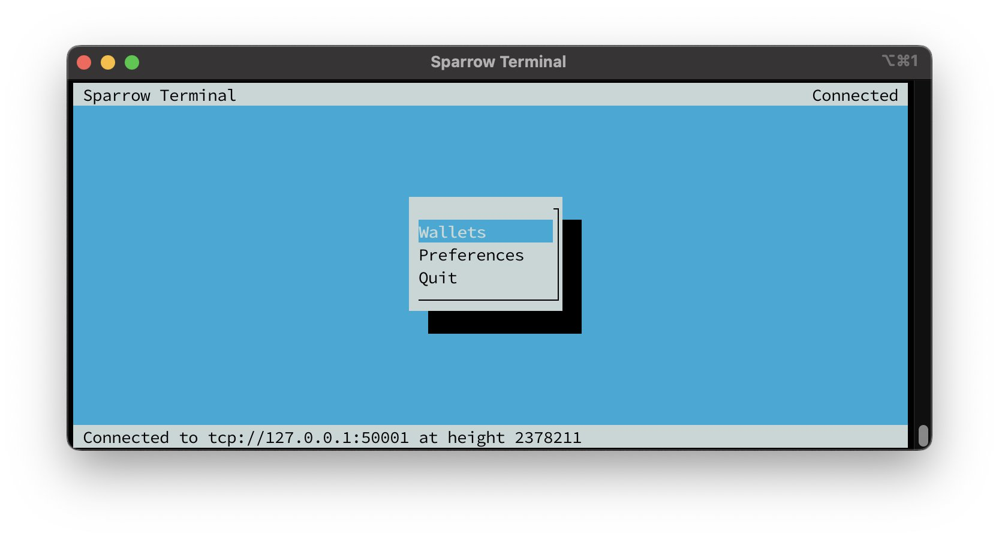
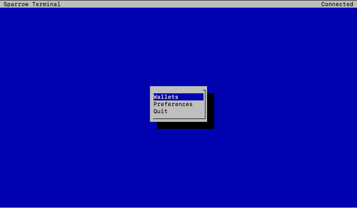
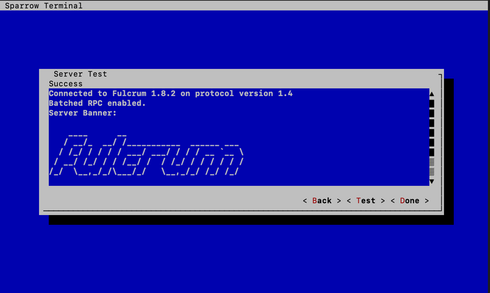

## Bonus guide: Sparrow Terminal
{: .no_toc }

---

Sparrow Terminal is a stripped down version of Sparrow that can be run on systems without displays. It's primarily intended as a configuration utility for running Sparrow as a server daemon

Difficulty: Medium 
{: .label .label-yellow }

Status: Tested v3 
{: .label .label-green }



---

Table of contents
{: .text-delta }

1. TOC
{:toc}

---

## Preparation

### Install tmux
tmux is an open-source terminal multiplexer for Unix-like operating systems. It allows multiple terminal sessions to be accessed simultaneously in a single window. It is useful for running more than one command-line program at the same time

* Install tmux

  ```sh
  $ sudo apt update
  $ sudo apt install tmux
  ```

---

## Installation

### Install Sparrow Server

* Download Sparrow Server and signatures into "/tmp" directory, which is cleared on the reboot. If you want to update or install the latest version, look up the [latest Sparrow Wallet release version](https://github.com/sparrowwallet/sparrow/releases), and change the "VERSION="x.x.x" value line, to that number to download the latest Sparrow server binary.

  ```sh
  $ VERSION="1.8.1"
  $ cd /tmp
  $ wget https://github.com/sparrowwallet/sparrow/releases/download/$VERSION/sparrow-server-$VERSION-aarch64.tar.gz
  $ wget https://github.com/sparrowwallet/sparrow/releases/download/$VERSION/sparrow-$VERSION-manifest.txt.asc
  $ wget https://github.com/sparrowwallet/sparrow/releases/download/$VERSION/sparrow-$VERSION-manifest.txt
  ```
  
* Import keys that signed the release 

  ```sh
  $ curl https://keybase.io/craigraw/pgp_keys.asc | gpg --import
  ```
  
* Verify the release
  
  ```sh
  $ gpg --verify sparrow-$VERSION-manifest.txt.asc
  ```
  ```
  > gpg: assuming signed data in 'sparrow-1.8.1-manifest.txt'
  > gpg: Signature made ...
  > gpg:                using RSA key D4D0D3202FC06849A257B38DE94618334C674B40
  > gpg: Good signature from "Craig Raw <craigraw@gmail.com>" [unknown]
  > gpg: WARNING: This key is not certified with a trusted signature!
  > gpg:          There is no indication that the signature belongs to the owner.
  > Primary key fingerprint: D4D0 D320 2FC0 6849 A257  B38D E946 1833 4C67 4B40
  ```
  
  ```sh
  $ sha256sum --check sparrow-$VERSION-manifest.txt --ignore-missing
  > sparrow-server-1.8.1-aarch64.tar.gz: OK
  ```

* If everything is correct, unpack Sparrow 

  ```sh
  $ tar -xvf sparrow-server-$VERSION-aarch64.tar.gz
  ```

* Move data files to the home “admin” user

  ```sh
  $ sudo mv Sparrow /home/admin/
  ```
 
* Add the Sparrow executable to your PATH by creating a symlink to it within /usr/local/bin, which is already part of PATH.
 
  ```sh
  $ sudo ln -s /home/admin/Sparrow/bin/Sparrow /usr/local/bin/Sparrow
  ```
  
---
 
## Run Sparrow 

* You can run Sparrow with following command

  ```sh
  $ Sparrow
  ```
  
  
  
* In "wallet" tab you can create or restore your wallet

### Connect Sparrow to your backend (optional)

* Open Sparrow Wallet

  ```sh
  $ Sparrow
  ```

* Go to `Preferences > Server > Private Electrum > Continue`
* Set values according to your Electrum Server implementation and test connection

  ```
  # For Electrs (default)
  URL: 127.0.0.1:50001
  Use SSL?: No
  
  # For Fulcrum 
  URL: 127.0.0.1:50002
  Use SSL?: Yes 
  ```

* You are now connected to your own Electrum Server 

  
  
---

## Mix Bitcoin with Sparrow Terminal

### Launch Sparrow using tmux

* Start a new tmux session called "Sparrow"

  ```sh
  $ tmux new -s sparrow_server
  ```

* Launch Sparrow Terminal

  ```sh
  $ Sparrow
  ```

* Connect Sparrow Terminal to your own Electrum Server implementation according to the steps above if not already done

### Create/import wallet

* Go to `Wallets > Create Wallet`

* Paste seed words of the hot wallet you will mix bitcoin with. If you use for example Samourai Wallet - do not forget to paste SW passphrase as well

* Create a strong password for Sparrow Terminal wallet to prevent loss of funds in case of someone getting access to your node/wallet

* Open your Wallet

### Start mixing

* Send Bitcoin to your hot wallet if not already done

* Go to "UTXOs" and select UTXOs you want to mix. Set Premix priority or fee rate

* Choose the pool you desire. If not sure, you can calculate which pool to use based on fees you will pay using [whirlpoolfees](https://www.whirlpoolfees.com/). It is recommended to use the most economical solution. 

* Enter SCODE if available, you will get discount on pool fee. You can monitor SCODEs by following Samourai Wallets twitter account, Whirlpool or SW Telegram group etc.

* Mix selected funds 

* Once confirmed, go to `Accounts > Postmix > UTXOs > Mix To`.

* You can mix to cold storage if desired. Select value for minimum mixes before sending to cold storage

* If you use Whirlpool with Dojo as well - set Postmix index range to "odd". This way you improve chances of getting into a mix by running two separate mixing clients at the same time, using different index ranges to prevent mix failures

### Detaching a session

* Detach tmux session to run ST on the background: 
1. press `ctrl + b` once 
2. press `d` once

Closing or logging out from your node without detaching would cause mixing to stop. ST now runs as a separate process regardless of you disconnecting from node

* You can view tmux sessions using following command

  ```sh
  $ tmux ls
  ```

* You can get back in sessions using

  ```sh
  $ tmux attach
  ```
  
* Or use this if you have other sessions opened

  ```sh
  $ tmux a -t sparrow_server
  ```
  
Learn more about [tmux basics](https://github.com/tmux/tmux/wiki/Getting-Started)

---

## For the Future: Sparrow Terminal update

* Download and install Sparrow Terminal by following the [installation section](#installation), you will overwrite several files.

---

## Uninstall 

### Delete Sparrow

* Delete Sparrow symlinks & directory

  ```sh
  $ sudo rm /usr/local/bin/Sparrow
  $ sudo rm -r /home/admin/Sparrow
  ```
  
<br /><br />

---

<< Back: [+ Bitcoin](index.md)
