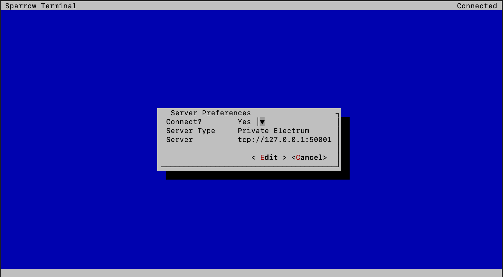

## Bonus guide: Sparrow Terminal
{: .no_toc }

---

Sparrow Terminal is a stripped down version of Sparrow that can be run on systems without displays. It's primarily intended as a configuration utility for running Sparrow as a server daemon

Difficulty: Medium 
{: .label .label-yellow }

Status: Tested v3 
{: .label .label-green }


---

Table of contents
{: .text-delta }

1. TOC
{:toc}

---

## Installation

### Download Sparrow Server

* Download Sparrow Server and signatures into "/tmp" directory, which is cleared on the reboot.

  ```sh
  $ cd /tmp
  $ wget https://github.com/sparrowwallet/sparrow/releases/download/1.7.1/sparrow-server-1.7.1-aarch64.tar.gz
  $ wget https://github.com/sparrowwallet/sparrow/releases/download/1.7.1/sparrow-1.7.1-manifest.txt.asc
  $ wget https://github.com/sparrowwallet/sparrow/releases/download/1.7.1/sparrow-1.7.1-manifest.txt
  ```
  
* Import keys that signed the release 

  ```sh
  $ curl https://keybase.io/craigraw/pgp_keys.asc | gpg --import
  ```
  
* Verify the release
  
  ```sh
  $ gpg --verify sparrow-1.7.1-manifest.txt.asc
  ```
  ```
  > gpg: assuming signed data in 'sparrow-1.7.1-manifest.txt'
  > gpg: Signature made Thu Nov 17 14:08:59 2022 GMT
  > gpg:                using RSA key D4D0D3202FC06849A257B38DE94618334C674B40
  > gpg: Good signature from "Craig Raw <craigraw@gmail.com>" [unknown]
  > gpg: WARNING: This key is not certified with a trusted signature!
  > gpg:          There is no indication that the signature belongs to the owner.
  > Primary key fingerprint: D4D0 D320 2FC0 6849 A257  B38D E946 1833 4C67 4B40
  ```
  
  ```sh
  $ sha256sum --check sparrow-1.7.1-manifest.txt --ignore-missing
  > sparrow-server-1.7.1-aarch64.tar.gz: OK
  ```

* If everything is correct, unpack Sparrow 

  ```sh
  $ tar -xvf sparrow-server-1.7.1-aarch64.tar.gz
  ```
  
---

### Configuration 

* Create a new directory for Sparrow and move data files there

  ```sh
  $ sudo mkdir -p /opt/sparrow-terminal
  $ sudo mv /tmp/Sparrow/* /opt/sparrow-terminal
  ```
 
* Add the Sparrow executable to your PATH by creating a symlink to it wihtin `/usr/local/bin`, which is already part of PATH.
 
  ```sh
  $ sudo ln -s /opt/sparrow-terminal/bin/Sparrow /usr/local/bin/Sparrow
  ```
  
---
 
## Run Sparrow 

* You can run Sparrow with following command

  ```sh
  $ Sparrow
  ```
  
  
  
* In "wallet" tab you can create or restore your wallet

### Connect Sparrow to your backend (optional)

* Open Sparrow Wallet

  ```sh
  $ Sparrow
  ```

* Go to "Preferences > Server > Private Electrum > Continue"
* Set values according to your electrum server implementation and test connection

  ```
  # For Electrs (default)
  URL: 127.0.0.1:50001
  Use SSL?: No
  
  # For Fulcrum 
  URL: 127.0.0.1:50002
  Use SSL?: Yes 
  ```

* You should now be connected to your own Electrum Server 

  

---

## For the Future: Sparrow Terminal update

* Download and install Sparrow Terminal by following the [installation section](#installation), you will overwrite several files.

---

## Uninstall 

### Delete Sparrow

* Delete Sparrow symlinks & directory

  ```sh
  $ sudo rm /usr/local/bin/Sparrow
  $ sudo rm -r /opt/sparrow-terminal
  ```
  
<br /><br />

---

<< Back: [+ Bitcoin](index.md)
