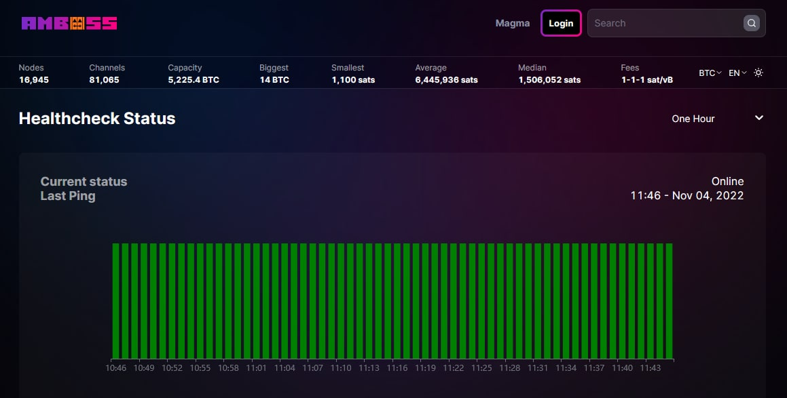

# Bonus guide: ambossping
{: .no_toc }

---

AmbossPing is a simple bash script that sends node health check pings to amboss.space. Additionally, if you have your telegram account linked to your profile in amboss.space, you will receive notifications every time the health check status of your node has been changed. For all of that, you don't need to have Thunderhub installed.
The script is based on Carsten Otto's [bash](https://gist.github.com/C-Otto/cd5d7b0e67fc2e3e212cf13a558b101f) with added reporting for better troubleshooting of the reported statuses if needed.

Difficulty: Easy
{: .label .label-green }

Status: Tested v3
{: .label .label-green }



---

Table of contents
{: .text-delta }

1. TOC
{:toc}

---

## Requirements

* LND

---

## Setup AmbossPing

* With user “admin”, create a new user “ambossping” and make it a member of the “lnd” group

  ```sh
  $ sudo adduser --disabled-password --gecos "" ambossping
  $ sudo adduser ambossping lnd
  ```

* With the “ambossping” user map the LND folder

  ```sh
  $ sudo su - ambossping
  $ ln -s /data/lnd /home/ambossping/.lnd
  ```

---

## Set the script

* Edit the config file and make sure you have the following changes in the beginning.

  ```sh
  $ nano /home/ambossping/ping.sh
  ```

  ```sh
  #!/bin/bash
  URL="https://api.amboss.space/graphql"
  NOW=$(date -u +%Y-%m-%dT%H:%M:%S%z)
  echo "Timestamp: ${NOW}"
  SIGNATURE=$(/usr/local/bin/lncli signmessage "$NOW" | jq -r .signature)
  echo "Signature: ${SIGNATURE}"
  JSON="{\"query\": \"mutation HealthCheck(\$signature: String!, \$timestamp: String!) { healthCheck(signature: \$signature, timestamp: \$timestamp) }\", \"variables\": {\"signature\": \"$SIGNATURE\", \"timestamp\": \"$NOW\"}}"
  echo "Sending ping..."
  echo "$JSON" | curl -s -f --data-binary @- -H "Content-Type: application/json" -X POST --output /dev/null $URL
  exitstatus=$?
  if [ $exitstatus -ne 0 ]
  then
   echo "${NOW} - Error: ${exitstatus}"
  else
   echo "${NOW} - Ping sent"
  fi
  echo " "
  ```

* Make the script executable (check by displaying the file name, it should have become green)

  ```sh
  $ chmod +x /home/ambossping/ping.sh
  ```
  
---

## Test run

* Run the script (while in "ambossping" user session)

  ```sh
  $ /usr/bin/torsocks ./ping.sh
  ```

* You should see something like this in terminal.

  ```ini
  Timestamp: 2022-10-27T15:53:33+0000
  Signature: d71y...uduf
  Sending ping...
  2022-10-27T15:53:33+0000 - Ping sent
  ```
 
---

## Configuring the Ping Schedule

To ensure your [Amboss monitoring dashboard](https://amboss.space/owner?page=monitoring) is accurately updated, you may want to schedule your script to send pings at specific intervals. This section will guide you through setting up a timer server script as an alternative to using crontab.

### Creating a Timer Service

1. **Initiate a Service File:**

   While logged in as an “admin” user, initiate a timer service by creating a new file:

    ```sh
    $ sudo nano /etc/systemd/system/ambossPing.timer
    ```

    Add the following configuration:

    ```ini
    [Unit]
    Description=Timer to activate ambossPing.service
    After=ambossPing.service
    PartOf=ambossPing.service

    [Timer]
    OnBootSec=900
    OnUnitActiveSec=900
    AccuracySec=1

    [Install]
    WantedBy=timers.target
    ```

2. **Set Up the Ping Service:**
   Create a corresponding service file:

    ```sh
    $ sudo nano /etc/systemd/system/ambossPing.service
    ```

    Then, insert this configuration:

    ```ini
    [Unit]
    Description=Amboss Ping syncing service
    Wants=ambossPing.timer

    [Service]
    ExecStart=/home/ambossping/ping.sh >> /home/ambossping/ping.log
    User=ambossping
    RuntimeMaxSec=60

    [Install]
    WantedBy=multi-user.target
    ```

3. **Activate the Services:**
   Enable and start both the timer and service:

    ```sh
    $ sudo systemctl enable ambossPing.service
    $ sudo systemctl enable ambossPing.timer
    $ sudo systemctl start ambossPing.service
    $ sudo systemctl start ambossPing.timer
    ```

This configuration will trigger the bash script every 15 minutes.

### Security Considerations

🚨 Be aware that setting up the timer as described sends pings through the clearnet. Consequently, amboss.space can identify the source of the pings. To maintain privacy, consider routing all traffic from your node through a VPN or setting up your service to use Tor. Note that using Tor may lead to occasional false-positives due to the network's health and availability, which might not accurately reflect your node's status.

To use Tor, modify the `ExecStart` line in the `ambossPing.service` file:

```ini
ExecStart=/usr/bin/torsocks /home/ambossping/ping.sh | /usr/bin/tee -a /home/ambossping/ping.log
```

By following these steps, you can efficiently schedule and secure your Amboss pings, ensuring consistent monitoring and privacy.


---

## Error logs

* Ths script has an error reporting capability that will allow you to troubleshoot better if there are issues reported by the amboss health check.

  You can check for errors in the log file with:

  ```sh
  $ cat ping.log | grep  Error
  ```

  This will show you a list with all collected errors along with the respective time stamp. 
  
  Here we use the curl exit statuses registered after the execution. The most common that can be observed are:

  - **Error: 6** - Couldn't resolve host. The given remote host's address was not resolved.
  - **Error: 22** - HTTP page not retrieved.
  - **Error: 35** - A TLS/SSL connect error. The SSL handshake failed.
  - **Error: 56** - Failure in receiving network data.

  You can find additional information about the Exit Statuses on the [curl documentation](https://everything.curl.dev/usingcurl/returns) site.

  Please remember that the error messages of curl are not explicit and are not always 100% correct. From the error messages, you could make some assumptions about the issues you may experience are caused. From the errors mentioned above, only **Error: 35** leads to remote side issues, though.

---

## Uninstall

* If you want to remove the ambossping and stop reporting health status with this script, delete the “ambossping” user with the “root” user.

  ```sh
  $ sudo su - root

  $ sudo systemctl stop ambossPing.service
  $ sudo systemctl stop ambossPing.timer
  $ sudo systemctl disable ambossPing.service
  $ sudo systemctl disable ambossPing.timer

  $ userdel -r ambossping
  ```