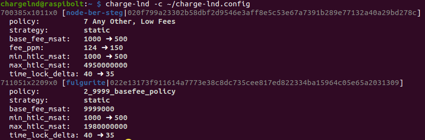

# Bonus guide: charge-lnd
{: .no_toc }

---

[Charge-lnd](https://github.com/accumulator/charge-lnd){:target="_blank"} is a simple policy based fee manager for LND.

Difficulty: Easy
{: .label .label-green }

Status: Tested v3
{: .label .label-green }



---

Table of contents
{: .text-delta }

1. TOC
{:toc}

---

## Requirements

* LND
* Python

---

## Install pip3

`pip` is not installed by default on Raspberry Pi OS Lite (64-bit).

* With user "admin", check if pip3 is already installed with the following command. If you don't get an output with a version number it means you need to install pip3 (otherwise, move to the next section "Install charge-lnd").

  ```sh
  $ pip3 --version
  ```

* If you need to install pip3

  ```sh
  $ sudo apt install python3-pip
  $ pip3 --version
  > pip 20.3.4 from /usr/lib/python3/dist-packages/pip (python 3.9)
  ```

---

## Install charge-lnd

* `charge-lnd` does not require full admin rights to the LND data. Using the 'least privileges' approach, only the following access rights are necessary:
  * `offchain:read`
  * `offchain:write`
  * `onchain:read`
  * `info:read`

* With the "lnd" user, create (or 'bake') a suitably limited LND macaroon, then exit back to "admin"

  ```sh
  $ sudo su - lnd
  $ lncli bakemacaroon offchain:read offchain:write onchain:read info:read --save_to=~/.lnd/data/chain/bitcoin/mainnet/charge-lnd.macaroon
  > Macaroon saved to /home/lnd/.lnd/data/chain/bitcoin/mainnet/charge-lnd.macaroon
  $ exit
  ```

* With user "admin", create a new user "chargelnd" and make it a member of the "lnd" group

  ```sh
  $ sudo adduser --disabled-password --gecos "" chargelnd
  $ sudo adduser chargelnd lnd
  ```

* With the "charge-lnd" user, clone the charge-lnd repository, enter the directory and install the program and required packages using `pip3`

  ```sh
  $ sudo su - chargelnd
  $ git clone https://github.com/accumulator/charge-lnd.git
  $ cd charge-lnd
  $ pip3 install -r requirements.txt .
  ```

* Add the `charge-lnd` binary file location to `PATH`

  ```sh
  $ echo 'export PATH=$PATH:/home/chargelnd/.local/bin' >> /home/chargelnd/.bashrc
  $ source /home/chargelnd/.bashrc
  ```

* Test if the installation was successful by running the program with the -h (help) flag

  ```sh
  $ charge-lnd -h
  > usage: charge-lnd [-h] [--lnddir LNDDIR] [--tlscert TLS_CERT_PATH]
  >                  [--macaroon MACAROON_PATH] [--grpc GRPC] [--electrum-server ELECTRUM_SERVER]
  >                  [--dry-run] [--check] [-v] -c CONFIG
  > optional arguments:
  > -h, --help            show this help message and exit
  > --lnddir LNDDIR       (default ~/.lnd) lnd directory
  > --tlscert TLS_CERT_PATH
  >                       (default [lnddir]/tls.cert) path to lnd TLS certificate
  > --macaroon MACAROON_PATH
  >                       (default [lnddir]/data/chain/bitcoin/mainnet/charge-lnd.macaroon) path to lnd auth macaroon
  > --grpc GRPC           (default localhost:10009) lnd gRPC endpoint
  > --electrum-server ELECTRUM_SERVER
  >                       (optional, no default) electrum server host:port[:s]. 
  >                       Needed for onchain_fee. Append ':s' for SSL connection
  > --dry-run             Do not perform actions (for testing), print what we would do to stdout
  > --check               Do not perform actions, only check config file for valid syntax
  > -v, --verbose         Be more verbose
  > -c CONFIG, --config CONFIG
  >                       path to config file
  ```

* Create a symlink to the LND directory. Place it in the home directory of the "chargelnd" user to match the default LND directory used by charge-lnd (*i.e.* `~/.lnd`)

  ```sh
  $ ln -s /data/lnd /home/chargelnd/.lnd
  ```

* Display the link and check that they’re not shown in red (this would indicate an error)

  ```sh
  $ cd ~/
  $ ls -la
  ```

---

## Configuration file

For this example, we will use a policy that:

1. Defines some default parameters

1. Then starts by looking for channels with very low outbound to apply a very large base fee (9999 sats) that will prevent any foward going out through the channel (and therefore avoid forward failures and a downgrading by the sender of the likelihood to use your node for future path finding)

1. Then ignores some channels that we want to deal with manually (*e.g.* a liquidity sink)

1. And finally apply a fixed fee rate for two groups of channels

🚨 Warning: The policy below is just an example, _do_ change the policy according to your own strategy and needs! All the options are listed and described [here](https://github.com/accumulator/charge-lnd){:target="_blank"}

* Still with user "chargelnd", create and open a configuration file

  ```sh
  $ nano charge-lnd.config
  ```

* Copy-paste the following section, changes the values you'd like to use and add the relevant node pubkeys in the desired policy sections

  ```ini
  #################################################
  # Charge-lnd - Automatic fee policy adjustement #
  #################################################

  ## COMMANDS TO TEST YOUR FEE STRATEGY
  # ~/.local/bin/charge-lnd -c ~/charge-lnd/charge-lnd.config --check
  # ~/.local/bin/charge-lnd -c ~/charge-lnd/charge-lnd.config --dry-run

  ## FEE STRATEGY

  [1_defaults]
  # place holder for your defaults for your fee policies
  # no strategy, so this only sets some defaults
  base_fee_msat = 1000
  min_fee_ppm_delta = 20
  min_htlc_msat = 1000
  max_htlc_msat_ratio = 1
  time_lock_delta = 40

  [2_9999_basefee_policy]
  # '9999BaseFee' should be evaluated first before other fees are set
  # e.g. if local balance is <500,000 sats, increase base fees very high
  chan.max_local_balance = 500000
  strategy = static
  base_fee_msat = 9999000

  [3_ignore_policy]
  # This policy is for ignoring specific nodes (e.g. a LOOP channel that we want to control manually)
  # The pubkey of the choosen nodes have to be listed below, separated with a comma
  node.id = <node_pubkey_1>,
	<node_pubkey_2>
  strategy = ignore

  [4_low_fees_policy]
  node.id = <node_pubkey_3>,
	<node_pubkey_4>,
	<node_pubkey_5>
  strategy = static
  fee_ppm = 50

  [5_high_fees_policy]
  node.id = <node_pubkey_6>,
	<node_pubkey_7>
  strategy = static
  fee_ppm = 200
  ```

* Test if the syntax is correct or if it contains some errors using the --check option.
Indicate where the configuration file is located using the -c option

  ```sh
  $ charge-lnd -c ~/charge-lnd.config --check
  > Configuration file is valid
  ```

* Do a dry-run test which will print out what changes the program would apply of it was to be run.
A small report will be displayed for each channel policy that should be updated.
Adding the -v (verbose) option would add aditional information such as if the channel is enabled or disabled.

  ```sh
  $ charge-lnd -c ~/charge-lnd.config --dry-run
  > 123456x123x1  [<noda_alias>|<node_pukkey>]
  >  policy:          2_9999_basefee_policy
  >  strategy:        static
  >  base_fee_msat:   0 ➜ 9999000
  >  [...]
  ```

* Check each channel to see if the proposed updates are the intended one.
If not, amend the charge-lnd config and re-do dry-run tests until you arrive to the desired results

* Once you are happy with your fee policy, you can manually apply it to your node by running the same command but without the --dry-run test.
Then exit the charge-lnd user.

  ```sh
  $ charge-lnd -c ~/charge-lnd.config
  $ exit
  ```

* Double-check the fee policy on all your channels (e.g. using [RTL](../../lightning/web-app.md) or [lntop](lntop.md)) to ensure that you are happy with the changes!

🔍: _To see all the possible policy types and options and some examples, check the charge-lnd [Github page](https://github.com/accumulator/charge-lnd#charge-lnd){:target="_blank"}._

---

## Automatic fee updates

### Cron job

You can make the script run automatically at regular time intervals by using a cron job. For example, you could run the charge-lnd program every 6 hours.

🚨 Warning: It is not in your interest, nor in the interest of the wider network, to set up very short intervals between each policy change. Frequent channel policy update spams the LN gossip network and results in less accurate LN graphs overall as it takes a long time for a policy update to reach most of the nodes in the network.

* We the "admin" user, create and edit (option -e) the `crontab` file of the "charge-lnd" user (option -u).
If asked, select the `/bin/nano` text editor (type 1 and enter)

  ```sh
  $ sudo crontab -u chargelnd -e
  ```

* At the end of the file, paste the following lines. Then save and exit.

  ```ini
  ##########################################
  # 1 - Fee policy updates with charge-lnd #
  ##########################################

  # Run charge-lnd every 6 hours at the 21st minute; and log the updates in the /tmp/my_charge-lnd.log log file
  21 */6 * * * /home/chargelnd/.local/bin/charge-lnd -c /home/chargelnd/charge-lnd.config > /tmp/my-charge-lnd.log 2>&1; date >> /tmp/my-charge-lnd.log
  ```

  * The stars and numbers at the start defines the interval at which the job will be run. You can double-check it by using this online tool: [https://crontab.guru](https://crontab.guru/#21_*/6_*_*_*){:target="_blank"}.
  * `/home/charge-lnd/.local/bin/charge-lnd -c /home/chargelnd/charge-lnd.config` is the command to be run and where to find it (its path) together with the required option(s) (here the location of the configuration file).
  * `> /tmp/my-charge-lnd.log 2>&1; date >> /tmp/my-charge-lnd.log` records the updates in a `my-charge-lnd.log` log file.

### Checking the logs

If you need to check the log files:

* Use `less` to read the entire log file. Type "g" to go the start of the log, "G" to the end, use the arrows to move up and down and exit by pressing "q".

* You can search for a specific string by typing "?" followed by the string to be searched (e.g. a node alias) and then press enter.

  ```sh
  $ less /tmp/my-charge-lnd.log
  ```

* To look for updates of a specific channel with an alias 'NodeAliasName'

  ```sh
  $ cat /tmp/my-charge-lnd.log | grep -A 7 NodeAliasName
  ```

---

## Upgrade

* Let's check what is the latest available version at [https://github.com/accumulator/charge-lnd/releases](https://github.com/accumulator/charge-lnd/releases){:target="_blank"} and what version of `charge-lnd` we are running

  ```sh
  $ sudo su - chargelnd
  $ cd charge-lnd
  $ pip3 show charge-lnd
  > Name: charge-lnd
  > Version: 0.2.10
  ```

* Fetch the latest version and install it (*e.g.* v9.9.9)

  ```sh
  $ git fetch
  $ git tag | sort --version-sort | tail -n 1
  > v9.9.9
  $ git reset --hard HEAD
  > HEAD is now at [...]
  $ git checkout v9.9.9
  > Note: switching to 'v9.9.9'.
  > [...]
  $ pip3 install -r requirements.txt .
  > [...]
  ```

---

## Uninstall

If you want to uninstall `charge-lnd`:

* Log in with the "admin" user and delete the "charge-lnd" user

  ```sh
  $ sudo userdel -r charge-lnd
  $ exit
  ```

<br /><br />

---

<< Back: [+ Lightning](index.md)
