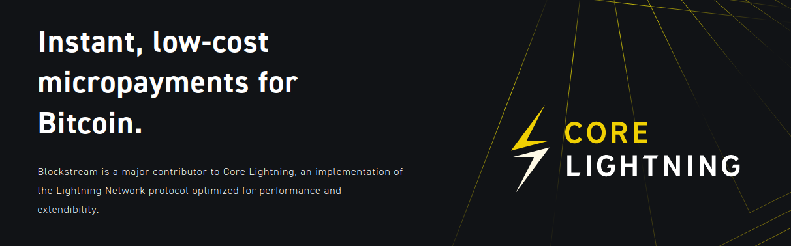

# Bonus guide: Core Lightning
{: .no_toc }

---

[CLN - Core Lightning](https://github.com/ElementsProject/lightning/blob/master/README.md){:target="_blank"} 
is a lightweight, highly customizable and standard compliant implementation of the Lightning Network protocol. 
It can be used for the RaspiBolt as a replacement for LND or it can be run alongside it to create a second lightning nodes running on the same machine.

Difficulty: Medium
{: .label .label-yellow }

Status: Tested v3
{: .label .label-green }



---

Table of contents
{: .text-delta }

1. TOC
{:toc}

---

## Introduction

Core Lightning (previously c-lightning) was one of the first implementation of the Bitcoin Lightning Network.

---

## Requirements

* Bitcoin Core

---

## Installation

We will download, verify, install and configure CLN on your RaspiBolt setup. This can be done independently from an existing LND installation. In fact, you can run both at the same time if you wish to.  

### User Creation

* As "admin", create a new user named "lightningd" and add it to groups "bitcoin" and "debian-tor". Also add "admin" to group "lightningd" for later use.

  ```sh
  $ sudo adduser --disabled-password --gecos "" lightningd
  $ sudo usermod -a -G bitcoin,debian-tor lightningd
  $ sudo adduser admin lightningd
  ```

### Data directories

* Create data directories for CLN and future plugins. Adjust permissions afterwards.

  ```sh
  $ sudo mkdir /data/lightningd
  $ sudo mkdir /data/lightningd-plugins-available
  $ sudo chown -R lightningd:lightningd /data/lightningd
  $ sudo chown -R lightningd:lightningd /data/lightningd-plugins-available
  ```

### Dependencies & Symbolic Links

* Install required dependencies to compile CLN's source code.

  ```sh
  $ sudo apt-get install -y \
    autoconf automake build-essential git libtool libgmp-dev libsqlite3-dev \
    python3 python3-pip net-tools zlib1g-dev libsodium-dev gettext
  $ pip3 install --user --upgrade pip
  ```

* Open a "lightningd" user session and create symbolic links to `bitcoin` and `lightningd` data directories.

  ```sh
  $ sudo su - lightningd
  $ ln -s /data/lightningd /home/lightningd/.lightning
  $ ln -s /data/bitcoin /home/lightningd/.bitcoin
  ```

* Display the links and check that they're not shown in red (indicating errors).

  ```sh
  $ ls -la
  ```

### Download

* As user "lightningd" download the git repository to the home folder of user "lightningd".

  ```sh
  $ git clone https://github.com/ElementsProject/lightning.git
  $ cd lightning
  $ git fetch --all --tags
  $ git checkout v23.08.1
  ``` 

* Don't trust, verify! Check who released the current version and get their signing keys and verify checksums. Verification step should output `Good Signature`.

  ```sh
  $ curl https://raw.githubusercontent.com/ElementsProject/lightning/master/contrib/keys/rustyrussell.txt | gpg --import
  $ git verify-tag v23.08.1
  ```

* Download user specific python packages.

  ```sh
  $ pip3 install --user mako
  ```

### Building CLN

* Configure and build the source code. Experimental features will be activated. Read more about them [here](https://lightning.readthedocs.io/lightningd-config.5.html#experimental-options).

  ```sh
  $ ./configure
  $ make
  ```

## Configuration

### Config File

* Create and edit the configuration file for CLN.

  ```sh
  $ cd /home/lightningd/.lightning
  $ nano config
  ```

* Insert the following content, adjust parameters in brackets to your likings. At least remove the brackets or else lightningd will not start up correctly! Choose if you want to replicate CLN's channel database file to separate storage. It's good practice to keep a synchronous state of the database somewhere else to be able to recover off-chain funds in case of emergency.

  ```ini
  alias=<your fancy alias>
  rgb=<your hex color>
  network=bitcoin
  log-file=/data/lightningd/cln.log
  log-level=info
  # for admin to interact with lightning-cli
  rpc-file-mode=0660
  # default fees and channel min size
  fee-base=<1000>
  fee-per-satoshi=<1>
  min-capacity-sat=<your minchansize>
  ## optional
  # wumbo channels
  large-channels
  # channel confirmations needed
  funding-confirms=2
  # wallet settings (replication recommended, adjust backup path)
  wallet=sqlite3:///data/lightningd/bitcoin/lightningd.sqlite3:/home/lightningd/lightningd.sqlite3
  # no replication:
  #wallet=sqlite3:///data/lightningd/bitcoin/lightning.sqlite3
  # network
  proxy=127.0.0.1:9050
  bind-addr=0.0.0.0:9736
  addr=statictor:127.0.0.1:9051/torport=9736
  always-use-proxy=true
  # experimental options
  # use anchor channels
  experimental-anchors
  # enable dual fund option
  experimental-dual-fund
  ```

### Shortcuts & Aliases

* Create shortcuts and aliases for easier command handling.

  ```sh
  $ cd ~/
  $ nano .bashrc
  ```

* Append the following at the end of the file.

  ```ini
  alias lightning-cli="~/lightning/cli/lightning-cli"
  alias lightningd="~/lightning/lightningd/lightningd"
  alias hsmtool="~/lightning/tools/hsmtool"
  ```

### Autostart on boot

* As "admin", create a systemd service that is automatically run on system startup.

  ```sh
  $ sudo nano /etc/systemd/system/lightningd.service
  ```

* Insert the following content:

  ```ini
  # RaspiBolt: systemd unit for lightningd
  # /etc/systemd/system/lightningd.service
  
  [Unit]
  Description=Core Lightning daemon
  Requires=bitcoind.service
  After=bitcoind.service
  Wants=network-online.target
  After=network-online.target
  
  [Service]
  ExecStart=/bin/sh -c '/home/lightningd/lightning/lightningd/lightningd \
                         --conf=/data/lightningd/config \
                         --daemon \
                         --pid-file=/run/lightningd/lightningd.pid'
  
  ExecStop=/bin/sh -c '/home/lightningd/lightning/cli/lightning-cli stop'

  RuntimeDirectory=lightningd
  
  User=lightningd
  
  # process management
  Type=simple
  PIDFile=/run/lightningd/lightningd.pid
  Restart=on-failure
  TimeoutSec=240
  RestartSec=30
  
  # hardening measures
  PrivateTmp=true
  ProtectSystem=full
  NoNewPrivileges=true
  PrivateDevices=true
  
  [Install]
  WantedBy=multi-user.target
  ```

* Enable and startup CLN.

  ```sh
  $ sudo systemctl daemon-reload
  $ sudo systemctl enable lightningd.service
  $ sudo systemctl start lightningd.service
  ```

* Daemon information is now written into system journal. See the journal for CLN messages with the following command.

  ```sh
  $ sudo journalctl -f -u lightningd
  ```

## CLN in action

* If `lightningd.service` started without errors, we can check out and try CLN commands.

  ```sh
  $ sudo su - lightningd 
  $ lightning-cli --version
  $ lightning-cli getinfo
  $ lightning-cli listfunds
  $ exit
  ```

## Allow user "admin" to work with CLN

* Allow "admin" to access lightningd commands. Create a symlink, adjust permissions and create aliases.

  ```sh
  $ ln -s /data/lightningd /home/admin/.lightning
  $ sudo chmod -R g+x /data/lightningd/bitcoin/
  $ nano .bash_aliases
  ```

  ```ini
  alias lightning-cli="/home/lightningd/lightning/cli/lightning-cli"
  alias lightningd="/home/lightningd/lightning/lightningd/lightningd"
  alias hsmtool="/home/lightningd/lightning/tools/hsmtool"
  ```
  
* Save and exit (Ctrl+O and Ctrl+X).

  ```sh
  $ source .bash_aliases
  ```  

## Backup

* It is at least recommended to backup the wallet file `hsm_secret` that you can find in CLN's data directory `home/lightningd/.lightning/bitcoin/`. 
* For more detailed information, please have a look at the official [docs](https://lightning.readthedocs.io/FAQ.html#how-to-backup-my-wallet) and RaspiBlitz' incredible [FAQ](https://github.com/rootzoll/raspiblitz/blob/dev/FAQ.cl.md#backups).


## Upgrade CLN

* Upgrade CLN with care and follow the instructions on CLN repository completely to understand the changes.
* Remove the git repository or `git pull` from within and redo the verification and building steps as described above.
* Verify with `lightning-cli --version` that the update applied.
* It is likely necessary to update the `c-lightning-REST` plugin as well. Don't forget to copy the `certs` directory from your prior plugin installation to the new one in order to preserve the access credentials.
* Restart the systemd service for the update to take effect and reload configuration.

  ```sh
  $ sudo systemctl restart lightningd.service
  ```
  

## Optional Steps

### Wallet Encryption

* Encrypt `hsm_secret` with a password as user "lightningd". Choose a password and take a note!

   ```sh
  $ hsmtool encrypt .lightning/bitcoin/hsm_secret
  > YourFancyPassword
  ```

* Adjust systemd service after encrypting. Edit `ExecStart` command and add parameter `--encrypted-hsm`, like so:

  ```ini
  ExecStart=/bin/sh -c '/home/lightningd/lightning/lightningd/lightningd \
                         --conf=/data/lightningd/config \
                         --daemon \
                         --encrypted-hsm \
                         --pid-file=/run/lightningd/lightningd.pid'
  ```

* With this change CLN requires you to enter the password on every restart. To automate this follow the steps below to auto-unlock on startup.

### Auto-Unlocking on Startup

* As user "lightningd", create a password file to auto-unlock on startup (equivalent to LND's wallet password) and enter the choosen encryption password from the step above.

  ```sh
  $ nano ~/.lightningdpw
  ```

  ```ini
  YourFancyPassword
  ```

* As "admin", adjust permissions of the password file (read-only for the user).

  ```sh
  $ sudo chmod 0600 /home/lightningd/.lightningdpw
  ```

* Change systemd service accordingly. Open systemd file.

  ```sh
  $ sudo nano /etc/systemd/system/lightningd.service
  ```

* Edit `ExecStart` line like this:

  ```ini
  ExecStart=/bin/sh -c ' (cat /home/lightningd/.lightningdpw;echo;cat /home/lightningd/.lightningdpw) | \
                         /home/lightningd/lightning/lightningd/lightningd \
                         --conf=/data/lightningd/config \
                         --daemon \
                         --encrypted-hsm \
                         --pid-file=/run/lightningd/lightningd.pid'
  ```

* Reload systemd configuration and restart it:

  ```sh
  $ sudo systemctl daemon-reload
  $ sudo systemctl start lightningd.service
  ```

## c-lightning-Rest & RTL

c-lightning-Rest: REST APIs for c-lightning written with node.js and provided within the [RTL repository](https://github.com/Ride-The-Lightning/c-lightning-REST). In this chapter we are going to add c-lightning-Rest as CLN plugin and furthermore connect RTL for CLN node management. The installation of RTL is already described [here](../../lightning/web-app.md), so we are focusing on its configuration.

### c-lightning-Rest plugin

* Setting up c-lightning-Rest as plugin for CLN. First we download and verify the c-lightning-Rest package:

  ```sh
  $ sudo su - lightningd
  $ wget https://github.com/Ride-The-Lightning/c-lightning-REST/archive/refs/tags/v0.10.7.tar.gz
  $ wget https://github.com/Ride-The-Lightning/c-lightning-REST/releases/download/v0.10.7/v0.10.7.tar.gz.asc
  ```

* Get the author's key and verify the release:

  ```sh
  $ curl https://keybase.io/suheb/pgp_keys.asc | gpg --import
  $ gpg --verify v0.10.7.tar.gz.asc v0.10.7.tar.gz
  ```
  
* Output should be like:

  ```
  gpg:                using RSA key 3E9BD4436C288039CA827A9200C9E2BC2E45666F
  gpg: Good signature from "saubyk (added uid) <39208279+saubyk@users.noreply.github.com>" [unknown]
  gpg:                 aka "Suheb (approves) <39208279+saubyk@users.noreply.github.com>" [unknown]
  gpg:                 aka "Suheb <39208279+saubyk@users.noreply.github.com>" [unknown]
  gpg: WARNING: This key is not certified with a trusted signature!
  gpg:          There is no indication that the signature belongs to the owner.
  Primary key fingerprint: 3E9B D443 6C28 8039 CA82  7A92 00C9 E2BC 2E45 666F
  ```
  
* Extract the archive and install with `npm`:

  ```sh
  $ tar xvf v0.10.7.tar.gz 
  $ cd c-lightning-REST-0.10.7
  $ npm install --only=prod
  ```
  
* Copy content to plugin datadir:

  ```sh
  $ cp -r ~/c-lightning-REST-0.10.7/ /data/lightningd-plugins-available/
  ```

* Setup c-lightning-Rest as plugin in CLN's config file:

  ```sh
  $ nano /data/lightningd/config
  ```
  
* Add at the end of the file:

  ```ini
  # cln-rest-plugin
  plugin=/data/lightningd-plugins-available/c-lightning-REST-0.10.7/clrest.js
  rest-port=3092
  rest-docport=4091
  rest-protocol=http
  ```
  
* Add a sample config file and run the plugin once manually to create required `access.macaroon`
  
  ```sh
  $ cd /data/lightningd-plugins-available/c-lightning-REST-0.10.7
  $ cp sample-cl-rest-config.json cl-rest-config.json
  ```

* Edit the config file:

  ```sh
  $ nano cl-rest-config.json
  ```

* Insert / Modify:

  ```ini
  {
    "PORT": 3092,
    "DOCPORT": 4091,
    "PROTOCOL": "http",
    "EXECMODE": "production",
    "RPCCOMMANDS": ["*"],
    "DOMAIN": "localhost",
    "BIND": "::"
  }
  ```

* Run cl-rest.js manually (note: there will be errors doing so! that's ok, we are initially generating macaroons this way): 

  ```sh  
  $ node cl-rest.js
  ```
  
* Exit with Ctrl+C after RSA keys have been written. Now you should see a new folder being created in `/data/lightningd-plugins-available/c-lightning-REST-0.10.7/` called `certs` which contains the required `access.macaroon` for the next steps.
  
* Go back to the "admin" user:

  ```sh
  $ exit
  ``` 

* Copy `access.macaroon` to home directory of user `rtl`:  
  
  ```sh
  $ sudo cp /data/lightningd-plugins-available/c-lightning-REST-0.10.7/certs/access.macaroon /home/rtl/
  $ sudo chown rtl:rtl /home/rtl/access.macaroon
  ```
  
* Restart `lightningd.service` and look for errors in cln's log: `tail -f /data/lightningd/cln.log`. Positive results look like this:

  ```
  UNUSUAL plugin-plugin.js: --- Starting the cl-rest server ---
  UNUSUAL plugin-plugin.js: --- cl-rest api server is ready and listening on port: 3092 ---
  UNUSUAL plugin-plugin.js: --- cl-rest doc server is ready and listening on port: 4091 ---
  ```

### Access over Tor

The Zeus mobile app will access the node via Tor.

* Add the following three lines in the section for “location-hidden services” in the `torrc` file. Save and exit.

  ```sh
  $ sudo nano /etc/tor/torrc
  ```

  ```ini
  ############### This section is just for location-hidden services ###
  HiddenServiceDir /var/lib/tor/hidden_service_cln_rest/
  HiddenServiceVersion 3
  HiddenServicePort 8080 127.0.0.1:3092
  ```

* Reload Tor configuration and get your connection address.

   ```sh
   $ sudo systemctl reload tor
   $ sudo cat /var/lib/tor/hidden_service_cln_rest/hostname
   > abcdefg..............xyz.onion
   ```

* Save the onion address in a safe place (e.g., password manager)

### Configuring RTL

* By the following configuration we tell RTL to connect to our CLN node. Change to user `rtl`:

  ```sh
  $ sudo su - rtl
  $ nano /home/rtl/RTL/RTL-Config.json
  ```

* Edit or add the following content. Adjust `multiPass` to your desired login password, if not already set.

  ```ini
  {
    "multiPass": "<yourfancypassword>",
    "port": "3000",
    "defaultNodeIndex": 1,
    "dbDirectoryPath": "/home/rtl/", 
    "SSO": {
      "rtlSSO": 0,
      "rtlCookiePath": "",
      "logoutRedirectLink": ""
    },
    "nodes": [
      {
        "index": 1,
        "lnNode": "CLN Node",
        "lnImplementation": "CLN",
        "Authentication": {
          "macaroonPath": "/home/rtl",
          "configPath": "/data/lightningd/config"
        },
        "Settings": {
          "userPersona": "OPERATOR",
          "themeMode": "DAY",
          "themeColor": "INDIGO",
          "fiatConversion": true,
          "currencyUnit": "USD",
          "logLevel": "INFO",
          "lnServerUrl": "http://127.0.0.1:3092",
          "unannouncedChannels": false
        }
      }
    ],
  }
  ```

* As user admin, startup RTL and connect via browser: 

  ```sh
  $ exit
  $ sudo systemctl start rtl
  ```
* Access RTL via your local IP: `https://<your-local-ip>:4001`

## Connect Zeus

* As user admin, install dependencies:

  ```sh
  $ sudo apt install qrencode
  ```

* Prepare QR data:

  ```sh
  $ cd /data/lightningd-plugins-available/c-lightning-REST-0.10.7/certs
  $ xxd -ps -u -c 1000 access.macaroon
  ```

* The output of the `xxd` command is the hexidecimal value of your macaroon access credential. Copy this value and substitute it, along with the contents of the Tor `hidden_service_cln_rest` hostname value, into the following file:

  ```sh
  $ nano cln-qr-code-template.txt
  ```

  ```
  c-lightning-rest://http://<tor-address>:8080?&macaroon=<macaroon-in-hexadecimal>&protocol=http
  ```

* Generate a QR code:

  ```sh
  $ qrencode -t utf8 -r cln-qr-code-template.txt
  $ chmod 644 cln-qr-code-template.txt
  ```
* A QR code should be generated in the terminal.

* Open the Zeus mobile application, click on the `+` sign to add a new node. Select `c-lightning-REST` from the "Node interface" dropdown and tap the "Scan C-Lightning-REST QR" button. Scan the QR code from the terminal. Zeus should read the configuration data.

* Save the QR code as an image:

  ```sh
  $ qrencode -t png -r cln-qr-code-template.txt -o cln-qr-code.png
  $ chmod 644 cln-qr-code.png
  ```


<br /><br />

---

<< Back: [+ Lightning](index.md)
