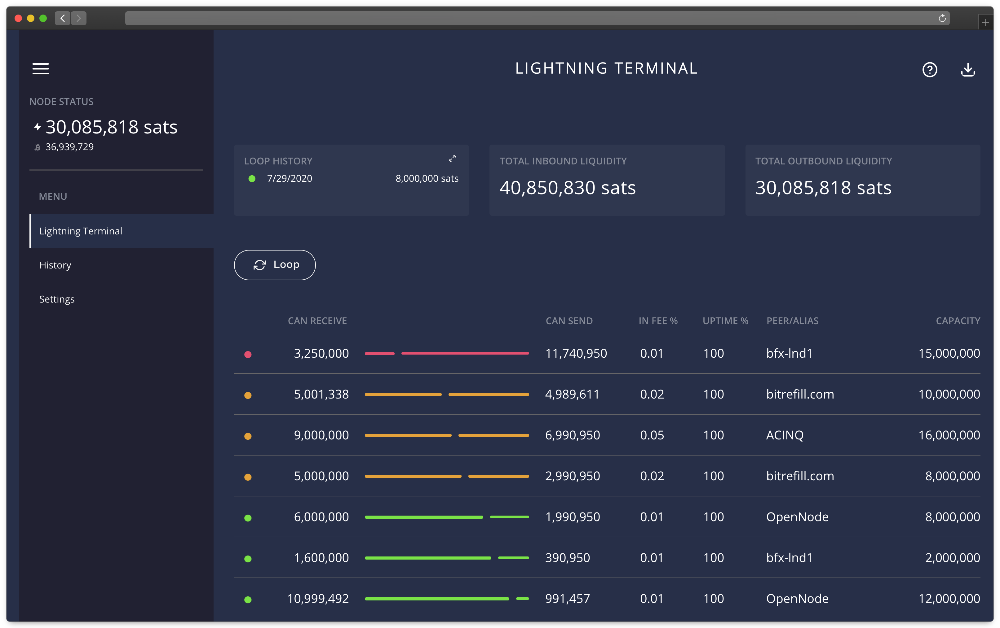
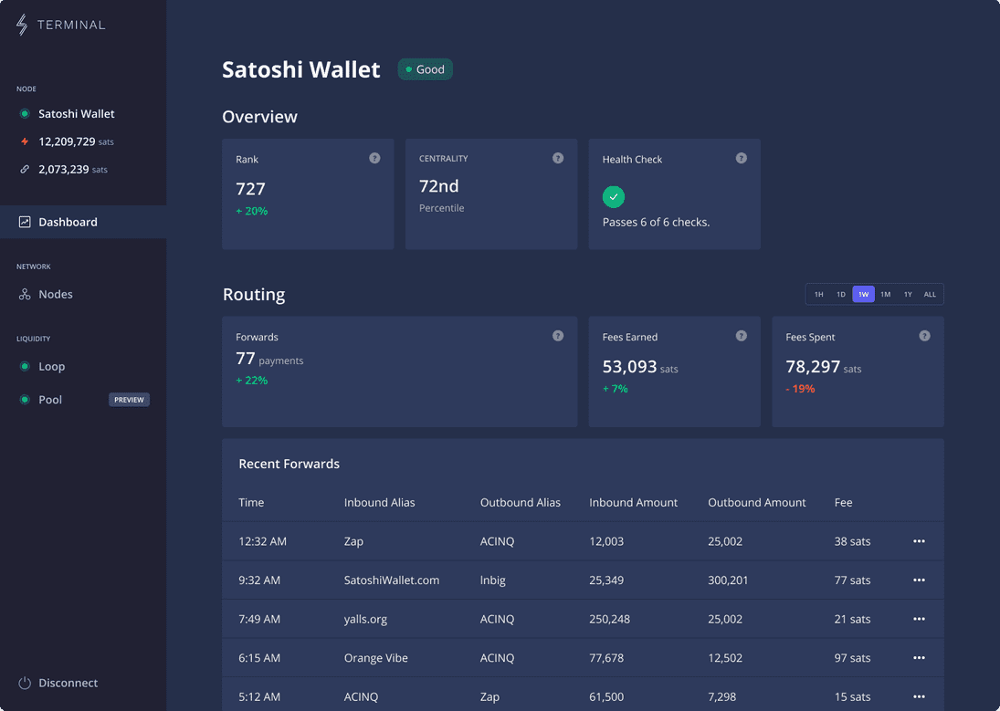

# Bonus guide: Lightning Terminal
{: .no_toc }

[Lightning Terminal](https://github.com/lightninglabs/lightning-terminal){:target="_blank"} is a web UI to help LND node operators managing their channels liquidity with the use of the Loop and Pool commercial services.

Difficulty: Medium
{: .label .label-yellow }

Status: Tested v3
{: .label .label-green }



---

Table of contents
{: .text-delta }

1. TOC
{:toc}

---

## Introduction

Lightning Terminal, developped by Lighining Labs, aims at providing additional tools for LND node operators to manage their node and channel balances. Below is a summary of Lighting Terminal's features:

* Visualize your channel balances in a web GUI
* Run a single daemon (`litd`) that integrates the Loop (`loopd`), Pool (`poold`) and Faraday (`faraday`) daemons
* Loop client (`loop`): Perform submarine swaps with the LOOP node using the CLI or web GUI
* Pool client (`pool`): Buy and sell inbound liquidity using the peer-to-peer auction-based Pool exchange using the CLI or web GUI 
* Faraday client (`frcli`): Run the Faraday daemon on your node that provides a CLI-based LN node accounting service

Because Pool is alpha software, Lightning Terminal is also alpha software.  

---

## Preparations

### Firewall

* Configure the UFW firewall to allow incoming HTTPS requests:

  ```sh
  $ sudo ufw allow 8443/tcp comment 'allow Lightning Terminal SSL'
  $ sudo ufw status
  ```

---

## Installation

### Download, verify and install

* With the "admin" user, download the latest arm64 binary and its checksum and verify the integrity of the binary

  ```sh
  $ cd /tmp
  $ wget https://github.com/lightninglabs/lightning-terminal/releases/download/v0.6.5-alpha/lightning-terminal-linux-arm64-v0.6.5-alpha.tar.gz
  $ wget https://github.com/lightninglabs/lightning-terminal/releases/download/v0.6.5-alpha/manifest-v0.6.5-alpha.txt
  $ sha256sum --check manifest-v0.6.5-alpha.txt --ignore-missing
  > lightning-terminal-linux-arm64-v0.6.5-alpha.tar.gz: OK
  ```

* Import the project's lead maintainer (Oliver Gugger) PGP key from Keybase 

  ```sh
  $ curl https://keybase.io/guggero/pgp_keys.asc | gpg --import
  > [...]
  > gpg: key 8E4256593F177720: "Oliver Gugger <gugger@gmail.com>" 1 new signature
  > [...]
  ```
  
* Using the key, verify the authenticity of the checksums file
  
  ```sh
  $ wget https://github.com/lightninglabs/lightning-terminal/releases/download/v0.6.5-alpha/manifest-v0.6.5-alpha.sig
  $ gpg --verify manifest-v0.6.5-alpha.sig manifest-v0.6.5-alpha.txt
  > [...]
  > gpg: Good signature from "Oliver Gugger <gugger@gmail.com>" [unknown]
  > [...]
  ```

* Now that the authenticity and integrity of the binary has been proven, unzip the binary and install Lightning Terminal

  ```sh
  $ tar -xzf lightning-terminal-linux-arm64-v0.6.5-alpha.tar.gz
  $ sudo install -m 0755 -o root -g root -t /usr/local/bin lightning-terminal-linux-arm64-v0.6.5-alpha/*
  $ litd --lnd.version
  > litd version 0.14.2-beta commit=lightning-terminal-v0.6.5-alpha
  ```

### User and data directories

* Create the “lit” service user, and make it a member of the “bitcoin” and “lnd” groups

  ```sh
  $ sudo adduser --disabled-password --gecos "" lit
  $ sudo usermod -a -G bitcoin,lnd lit
  ```

* Create the Lightning Terminal, Loop, Pool and Faraday data directories

  ```sh
  $ sudo mkdir /data/lit /data/loop /data/pool /data/faraday
  $ sudo chown -R lit:lit /data/lit /data/loop /data/pool /data/faraday
  ```

* Add the "admin" user to the "lit" group

  ```sh
  $ sudo adduser admin lit
  ```

* With the "admin" user, create symlinks to the Lightning Terminal, Loop, Pool and Faraday directories

  ```sh
  $ ln -s /data/lit /home/admin/.lit
  $ ln -s /data/loop /home/admin/.loop
  $ ln -s /data/pool /home/admin/.pool
  $ ln -s /data/faraday /home/admin/.faraday
  ```

* Open a “lit” user session
  
  ```sh 
  $ sudo su - lit
  ```

* Create symlinks to the LND, Lightning Terminal, Loop, Pool and Faraday directories

  ```sh
  $ ln -s /data/lnd /home/lit/.lnd
  $ ln -s /data/lit /home/lit/.lit
  $ ln -s /data/loop /home/lit/.loop
  $ ln -s /data/pool /home/lit/.pool
  $ ln -s /data/faraday /home/lit/.faraday
  ```

* Display the links and check that they’re not shown in red (this would indicate an error)

  ```sh
  $ ls -la
  ```

### Configuration

The Lightning Terminal daemon (`litd`) has its own configuration file. 
The settings for Pool, Faraday, Loop can all be put in the configuration file 

* Still with the "lit" user, create the configuration file and paste the following content (set the `uipassword` with your password [E] and adjust to your alias; and paste password [B] as required in the Faraday section). Save and exit.

  ```sh
  $ cd ~/.lit
  $ nano lit.conf
  ```
  
  ```ini  
  # RaspiBolt: Lightning Terminal configuration
  # /home/lit/.lit/lit.conf
  
  #######################
  # Application Options #
  #######################
  
  # The host:port to listen for incoming HTTP/2 connections on for the web UI only. (default:127.0.0.1:8443)
  httpslisten=0.0.0.0:8443
  
  # Your password for the UI must be at least 8 characters long
  uipassword=Password[E]

  # Remote options
  remote.lit-debuglevel=debug

  # Remote lnd options
  remote.lnd.rpcserver=127.0.0.1:10009
  remote.lnd.macaroonpath=~/.lnd/data/chain/bitcoin/mainnet/admin.macaroon
  remote.lnd.tlscertpath=~/.lnd/tls.cert
  
  #################
  #     Loop      #
  #################
  
  loop.loopoutmaxparts=5
  
  #################
  #     Pool      #
  #################
  
  # This option avoids the creation of channels with nodes with whom you already have a channel (set to 0 if you don't mind)
  pool.newnodesonly=1
  # Path to Pool's own macaroon
  pool.macaroonpath=~/.pool/mainnet/pool.macaroon
    
  ##################
  #     Faraday    #
  ##################
  
  # If connect_bitcoin is set to 1, Faraday can connect to a bitcoin node (with --txindex set) to provide node accounting services
  faraday.connect_bitcoin=1
  # The minimum amount of time that a channel must be monitored for before recommending termination
  faraday.min_monitored=72h
  # Path to Faraday's own macaroon
  faraday.macaroonpath=~/.faraday/mainnet/faraday.macaroon
    
  ###################
  # Faraday-Bitcoin #
  ###################
  
  # The Bitcoin node IP is the IP address of the Raspibolt, i.e. an address like 192.168.0.20
  faraday.bitcoin.host=192.168.0.171
  # bitcoin.user provides to Faraday the bicoind RPC username, as specified in our bitcoin.conf
  faraday.bitcoin.user=raspibolt
  # bitcoin.password provides to Faraday the bitcoind RPC password, as specified in our bitcoin.conf
  faraday.bitcoin.password=Password[B]
  ```

🔍 *Notice that the options for Faraday, Loop and Pool can be set in this configuration file but you must prefix the software with a dot as we made here. Use samples configuration files shown in github repo of each software for more options*

* Exit the "lit" user session

  ```sh
  $ exit
  ```

---

## Run Lightning Terminal

### Manual start

* Still with user “lit”, we first start Lightning Terminal manually to check if everything works fine.

  ```sh
  $ litd
  ```

* Test that Lightning Terminal is working by visiting the web UI
  * Past the following URL in your browser: [https://raspibolt.local::8443/](https://raspibolt.local::8443/){:target="_blank"} (replace raspibolt.local by your node IP address if required)
  * Note that the first time you connect, your browser will display a warning due to the fact the SSL certificate is self-generated. On Firefox, simply click "Advanced" and then "Accept the risks and continue" (or similar wording in other browsers)
  * Enter password [E] when prompted.
  * (Optional) Follow the walkthrough to have a first introduction to Lightning Terminal GUI. Otherwise, click "No thanks" to skip it.

* Close the browser window, go back to the terminal and stop Lightning Terminal by pressing Ctrl+C. Then exit the "lit" user.

  ```sh
  $ exit
  ```

### Autostart on boot

Now we’ll make sure Lightning Terminal starts as a service on the Raspberry Pi so it’s always running. In order to do that, we create a systemd unit that starts the service on boot directly after LND.

* Create the Lightning Terminal systemd unit with the following content. Save and exit.
  
  ```sh
  $ sudo nano /etc/systemd/system/litd.service
  ```

  ```ini
  # RaspiBolt: systemd unit for litd
  # /etc/systemd/system/litd.service
  
  [Unit]
  Description=Lightning Terminal Daemon
  After=lnd.service
  
  [Service]
  
  # Service execution
  ###################
  ExecStart=/usr/local/bin/litd
  
  # Process management
  ####################
  Type=simple
  Restart=always
  RestartSec=30
  TimeoutSec=240
  LimitNOFILE=128000
  
  # Directory creation and permissions
  ####################################
  User=lit
  
  # Hardening measures
  ####################
  # Provide a private /tmp and /var/tmp.
  PrivateTmp=true
  
  # Mount /usr, /boot/ and /etc read-only for the process.
  ProtectSystem=full
  
  # Disallow the process and all of its children to gain
  # new privileges through execve().
  NoNewPrivileges=true
  
  # Use a new /dev namespace only populated with API pseudo devices
  # such as /dev/null, /dev/zero and /dev/random.
  PrivateDevices=true
  
  # Deny the creation of writable and executable memory mappings.
  MemoryDenyWriteExecute=true
  
  [Install]
  WantedBy=multi-user.target
  ```
  
* Enable and start the service and check its status and logging output
  
  ```sh
  $ sudo systemctl enable litd
  $ sudo systemctl start litd
  $ sudo systemctl status litd
  >* litd.service - Lightning Terminal Daemon
  >   Loaded: loaded (/etc/systemd/system/litd.service; enabled; vendor preset: enabled)
  >   Active: active (running) since Mon 2021-12-27 19:16:10 GMT; 22h ago
  > [...]
  ```
  
* Check the live logging activity. Press Ctrl+C to exit.
  
  ```sh
  $ sudo journalctl -f -u litd
  ```

### Aliases

For now, softwares packaged in Lightning Terminal are all listening to the same port 8443. This is not the default behavior set in the code of these sofware so you must always indicate the RPC port as well as the TLS certificate of Lightning Terminal when using them, using flags (e.g., `pool --rpcserver=localhost:8443 --tlscertpath=~/.lit/tls.cert accounts list`, do not try it now as Lightning Terminal is not running yet!).  

Rather than always typing the flags, we can create aliases for the "admin" user.

* With user "admin", create an alias file and paste the following line. Save and exit.

  ```sh
  $ cd
  $ nano .bash_aliases
  ```

  ```ini
  ######################
  # Lightning Terminal #
  ######################
  
  alias litfaraday="frcli --rpcserver=localhost:8443 --tlscertpath=~/.lit/tls.cert"
  alias litloop="loop --rpcserver=localhost:8443 --tlscertpath=~/.lit/tls.cert"
  alias litpool="pool --rpcserver=localhost:8443 --tlscertpath=~/.lit/tls.cert" 
  ```

* Activate the aliases

  ```sh
  $ source .bashrc
  ```

* To use Loop, Pool or Faraday from the CLI, use the alias followed by the desired command (e.g., `litpool accounts list`, much simpler!)### Aliases

### Settings

* Log in to your Lightning Terminal by pasting [https://raspibolt.local:8443/](https://raspibolt.local:8443/){:target="_blank"} in your web browser (replace rapsibolt.local by your node IP address if needed).

* In the left menu, click on "Settings"

* Click on "Channel balance mode" and select the case that best corresponds to your usage of your LN node
  * Choose "Receiving" if you plan to mostly receive LN payments (e.g. if you're a merchant)
  * Choose "Sending" if you plan to mostly send LN payments (e.g. if you're a casual end-user)
  * Choose "Routing" if your main goal is to route payments (e.g. if you're a LN router)

* Go back to "Settings"

* Click on "Bitcoin Transaction URL" and replace the default URL (`https://mempool.space/tx/{txid}`) by your own explorer (`https://raspibolt.local:4000/tx/{txid}`, replace raspibolt.local by your node IP if necessary). This will preserve your privacy when looking up transactions from the Terminal.

* Optional: Replace the default Lightning Node URL (`https://1ml.com/node/{pubkey}`) by the Amboss explorer (`https://amboss.space/node/{pubkey}`

* Click "Save changes"

### Lightning Node Connect



#### Introduction

Lightning Node Connect allows to connect to Lightning Terminal and the node from the web via Lightning Lab's [web Terminal](https://terminal.lightning.engineering/){:target="_blank"}. Like, the Lightning Terminal web UI, the Terminal dashboard offers an overview of the channels and the Loop and Pool services but it also offers an health check and ranking information, gives a summary of recent routing and payment events and payments can be made and received. For more information, check out the Lighning Labs [blog post announcement](https://lightning.engineering/posts/2021-11-30-lightning-terminal/){:target="_blank"}.

*Note:* Contrary to the Lightning Terminal web UI that can only be accessed in your LAN, the web Terminal can be used (securely) from anywhere.

#### How to connect

* Log in to your Lightning Terminal by pasting [https://raspibolt.local:8443/](https://raspibolt.local:8443/){:target="_blank"} in your web browser (replace rapsibolt.local by your node IP address if needed).
* In the left menu, click on "Lightning Node Connect"
* Click on the "Create a new session" button and choose a name (e.g. test #1)
* Click the "Submit" button, a pairing phrase will be copied to your clipboard
* Open Lightning Labs web Terminal in a new tab in your browser: [https://terminal.lightning.engineering/#/](https://terminal.lightning.engineering/#/){:target="_blank"}
* Click on the "Connect to my node" button in the top right corner
* Paste the pairing phrase in the box
* Click "Connect" (if it fails, reload the page, create a new session/pairing phrase and try again)
* Paste your Password [F] (twice)

Congrats! You've connected your node to the web Terminal and can now manage it from anywhere.

---

## Lightning Terminal in action

### Loop

[Loop](https://github.com/lightninglabs/loop){:target="_blank"} is a non-custodial service offered by Lightning Labs that makes it easy to move bitcoin into and out of the Lightning Network: deposit to a Bitcoin address without closing channels with Loop In, convert outbound liquidity into inbound liquidity with Loop Out, refill depleted Lightning channels with Loop In.

You can loop in/out using the CLI (check `litloop --help`), the Lightning Terminal, the web Terminal or the Ride The Lightning web UI (see [next section of the guide](#optional-set-up-the-loop-service-in-ride-the-lightning))

* **For more information:** Check out the Loop [webpage](https://lightning.engineering/loop/){:target="_blank"}, [documentation page](https://docs.lightning.engineering/lightning-network-tools/loop){:target="_blank"}, [GitHub repository](https://github.com/lightninglabs/loop){:target="_blank"} and the Lightning Labs [blog post announcement](https://blog.lightning.engineering/announcement/2020/02/05/loop-beta.html){:target="_blank"}.

### Pool

[Pool](https://github.com/lightninglabs/pool){:target="_blank"} is a marketplace for Lightning channels. You can rent a channel when you need inbound liquidity or earn an income by leasing a channel.

Pool requires to fund an account from your LND onchain wallet. This account will be used to draw the sats required to open channels and pay the Pool fees. Make sure you fund your LND wallet with at least the amount of sats you'd like to have in your Pool account. Note that using Pool will trigger the automatic creation of an LSAT identification token that costs 1,000 sats.

You can use Pool using the CLI (check `litpool --help`), the Lightning Terminal or the web Terminal.

* **For more information:** Check out the Pool [webpage](https://lightning.engineering/pool/){:target="_blank"}, [documentation](https://docs.lightning.engineering/lightning-network-tools/pool){:target="_blank"}, [GitHub repository](https://github.com/lightninglabs/pool){:target="_blank"} and Lightning Labs [blog post announcement](https://blog.lightning.engineering/announcement/2020/02/05/loop-beta.html){:target="_blank"}.

### Faraday

[Faraday](https://github.com/lightninglabs/faraday){:target="_blank"} is a suite of accounting CLI-based tools for LND node operators.

* To check the list of available commands

  ```sh
  $ litfaraday --help
  > NAME:
  >   frcli - command line tool for faraday
  > [...]
  ```
 
* **For more information:** Check out the Faraday [documentation page](https://docs.lightning.engineering/lightning-network-tools/faraday){:target="_blank"}, the [GitHub repository](https://github.com/lightninglabs/faraday){:target="_blank"}, the Lightning Labs [blog post announcement](https://lightning.engineering/posts/2020-04-02-faraday/){:target="_blank"} and their latest feature [blog post](https://lightning.engineering/posts/2020-09-15-faraday-accounting/){:target="_blank"}.

---

## Optional: Set up the Loop service in Ride The Lightning

If you have installed [Ride The Lightning](../../web-app.md), you can use the Loop submarine swap service directly from the RTL GUI:

* Go the the navigation menu in the top left (if it's hidden, click on the hamburger symbol)
* Click on "Node Config"
* Click on the "Services" tab
* If it's disabled, click on "Enable Loop service"
* In "Loop Server URL", replace `https://localhost:8081` by `https://localhost:8443`
* In "Loop Macaroon Path", the path should be `/home/lit/.loop/mainnet`
* Then click the "Update" button
* Go back to the navigation menu and click on "Services", then "Loop"
* You can now perform loop ins and loop outs directly from RTL

---

## Upgrade

* Check your Lightning Terminal version

  ```sh
  $ litd --lnd.version
  > litd version 0.14.1-beta commit=lightning-terminal-v0.6.1-alpha
  ```

* Read the [release notes](https://github.com/lightninglabs/lightning-terminal/releases){:target="_blank"} in case there is any breaking change to be aware of.

* Stop the Lightning Terminal systemd service

  ```sh
  $ sudo systemctl stop litd
  ```

* Install the new version following the same installation process explained in this guide [here](lightning-terminal.md#download-verify-and-install)

* Restart the service

  ```sh
  $ sudo systemctl start litd
  ```

---

## Uninstall

🚨 Warning: Before uninstalling Lightning Terminal, you might want to make sure that there is no on-going channel leases or LOOP swaps and that you've closed your Pool account. You might also want to make some backup of key files (LSAT token, databases etc) located in the /data directories).

* Stop and disable the systemd service and then delete the service file

  ```sh
  $ sudo systemctl stop litd
  $ sudo systemctl disable litd
  $ cd /etc/systemd/system
  $ sudo rm litd.service
  ```
  
* Remove the Lightning Terminal binaries

  ```sh
  $ cd /usr/local/bin
  $ sudo rm frcli litcli litd loop pool
  ```
  
* Remove the "admin" user symlinks

  ```sh
  $ cd ~/
  $ rm .faraday .lit .loop .pool
  ```

* Remove the /data Lighting Terminal, Loop, Pool and Faraday directories

  ```sh
  $ cd /data
  $ sudo rm -R faraday lit loop pool
  ```

* Remove (or comment out) the aliases from the `.bash_aliases` file

  ```sh
  $ nano .bash_aliases
  ```
  
  ```ini  
  #alias litfaraday="frcli --rpcserver=localhost:8443 --tlscertpath=~/.lit/tls.cert"
  #alias litloop="loop --rpcserver=localhost:8443 --tlscertpath=~/.lit/tls.cert"
  #alias litpool="pool --rpcserver=localhost:8443 --tlscertpath=~/.lit/tls.cert" 
  ```

* Finally, with the "root" user, delete the "lit" user

  ```sh
  $ sudo su -
  $ userdel -r lit
  ```

<br /><br />

---

<< Back: [+ Lightning](index.md)
