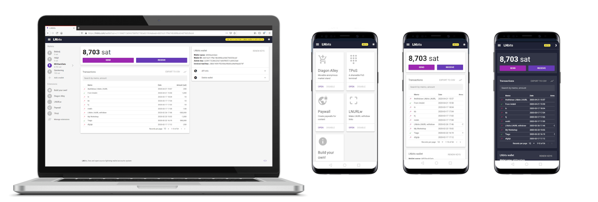
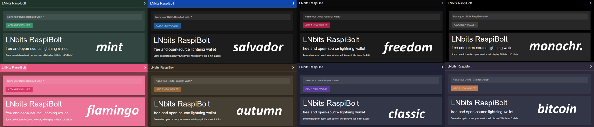
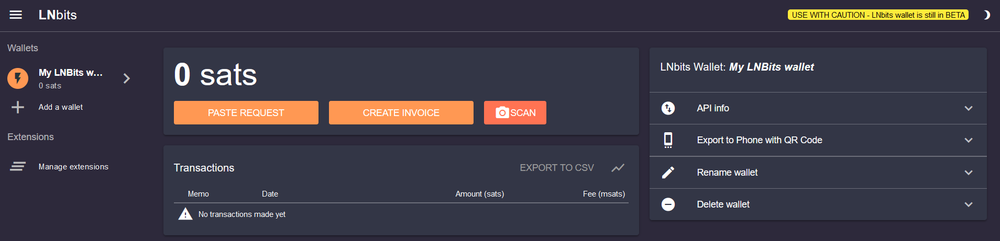

# Bonus guide: LNBits, a lightning wallet/accounts system

{: .no_toc }

---

[LNBits](https://github.com/lnbits/lnbits-legend){:target="_blank"} is a free and open-source lightning-network wallet/accounts system.

⚠️ _USE WITH CAUTION - LNBits wallet is still in BETA_

Difficulty: Easy
{: .label .label-green }

Status: Tested v3
{: .label .label-green }



---

Table of contents
{: .text-delta }

1. TOC
{:toc}

---

## Preparations

### Install dependencies

* Install necessary dependencies using the apt package manager.

  ```sh
  $ sudo apt install libffi-dev libpq-dev python3-venv
  ```

### Firewall & reverse proxy

* Enable NGINX reverse proxy to route external encrypted HTTPS traffic internally to LNBits.

  ```sh
  $ sudo nano /etc/nginx/streams-enabled/lnbits-reverse-proxy.conf
  ```

  ```nginx
  upstream lnbits {
    server 127.0.0.1:5000;
  }
  server {
    listen 4003 ssl;
    proxy_pass lnbits;
  }
  ```

* Test and reload NGINX configuration.

  ```sh
  $ sudo nginx -t
  $ sudo systemctl reload nginx
  ```

* Configure the firewall to allow incoming HTTPS requests.

  ```sh
  $ sudo ufw allow 4003/tcp comment 'allow LNBits SSL'
  $ sudo ufw status
  ```

---

## LNBits

### Installation

* Create a new user and add it to the "lnd" group.

  ```sh
  $ sudo adduser --disabled-password --gecos "" lnbits
  $ sudo adduser lnbits lnd
  ```

* Create a data directory for LNBits and give ownership to the new user.

  ```sh
  $ sudo mkdir /data/lnbits
  $ sudo chown -R lnbits:lnbits /data/lnbits
  ```

* Open a new "lnbits" user session and create symlinks to the LND and LNBits data directories.

  ```sh
  $ sudo su - lnbits
  $ ln -s /data/lnd /home/lnbits/.lnd
  $ ln -s /data/lnbits /home/lnbits/.lnbits
  ```

* Download the source code directly from GitHub, create a virtual environment, and install all dependencies with pip.

  ```sh
  $ git clone --branch 0.9.4 https://github.com/lnbits/lnbits
  $ cd lnbits
  $ python3 -m venv venv
  $ ./venv/bin/pip install setuptools wheel --upgrade
  $ ./venv/bin/pip install -r requirements.txt
  ```

### Configuration

* Copy the example configuration file and open it.

  ```sh
  $ cp .env.example .env
  $ nano .env
  ```

* Change the default path of the LNBits data folder

  ```ini
  #LNBITS_DATA_FOLDER="./data"
  LNBITS_DATA_FOLDER="/home/lnbits/.lnbits"
  ```
  
* Choose the colour theme for the webpage, _e.g._ "bitcoin". You can choose among the following options: `autumn`, `bitcoin`, `classic`, `flamingo`, `freedom`, `mint`, `monochrome` and  `salvador`.



  ```ini
  LNBITS_THEME_OPTIONS="bitcoin"
  ```

* Select the wallet that you want to use as backend, _e.g._ the LND REST API

  ```ini
  LNBITS_BACKEND_WALLET_CLASS=LndRestWallet
  ```

* Comment out all wallet parameters blocks execpt the one you selected just above, e.g. `LndRestWallet`

  ```ini
  # ClicheWallet
  #CLICHE_ENDPOINT=ws://127.0.0.1:12000
  
  # SparkWallet
  #SPARK_URL=http://localhost:9737/rpc
  #SPARK_TOKEN=myaccesstoken
  
  # CoreLightningWallet
  #CORELIGHTNING_RPC="/home/bob/.lightning/bitcoin/lightning-rpc"
  
  # LnbitsWallet
  #LNBITS_ENDPOINT=https://legend.lnbits.com
  #LNBITS_KEY=LNBITS_ADMIN_KEY
  
  # LndRestWallet
  LND_REST_ENDPOINT=https://127.0.0.1:8080/
  LND_REST_CERT="/home/bob/.config/Zap/lnd/bitcoin/mainnet/wallet-1/data/chain/bi>
  LND_REST_MACAROON="/home/bob/.config/Zap/lnd/bitcoin/mainnet/wallet-1/data/chai>
  # To use an AES-encrypted macaroon, set
  # LND_REST_MACAROON_ENCRYPTED="eNcRyPtEdMaCaRoOn"
  
  [...]
  
  # EclairWallet
  #ECLAIR_URL=http://127.0.0.1:8283
  #ECLAIR_PASS=eclairpw
  ```

* Edit the LND REST wallet parameters with the following lines
  
  ```ini
  LND_REST_ENDPOINT=https://127.0.0.1:8080
  LND_REST_CERT="/home/lnbits/.lnd/tls.cert"
  LND_REST_MACAROON="/home/lnbits/.lnd/data/chain/bitcoin/mainnet/admin.macaroon"
  ```

* Save (Ctrl+o) and close (Ctrl+x).

* Restrict read/write permission to the "lnbits" user only.

  ```sh
  $ chmod 600 /home/lnbits/lnbits/.env
  ```

* Build the static files

  ```sh
  $ ./venv/bin/python build.py
  ```

### First start

* Make sure we are in the LNBits app directory and start the application.

  ```sh
  $ cd ~/lnbits-legend
  $ ./venv/bin/uvicorn lnbits.__main__:app --port 5000
  ```

Now point your browser to the secure access point provided by the nginx web proxy, for example <https://raspibolt.local:4003> (or your node's IP address like <https://192.168.0.20:4003>).

Your browser will display a warning because we use a self-signed SSL certificate. Click on "Advanced" and proceed to the LNBits web interface.

* Stop LNBits in the terminal with `Ctrl`-`C` and exit the "lnbits" user session.

  ```sh
  $ exit
  ```

### Autostart on boot

* As user "admin", create the service file.

  ```sh
  $ sudo nano /etc/systemd/system/lnbits.service
  ```

* Paste the following configuration. Save and exit.

  ```sh
  # RaspiBolt: systemd unit for LNBits
  # /etc/systemd/system/lnbits.service

  Description=LNBits
  After=lnd.service
  PartOf=lnd.service

  [Service]
  WorkingDirectory=/home/lnbits/lnbits

  ExecStart=/bin/sh -c 'cd /home/lnbits/lnbits-legend && ./venv/bin/uvicorn lnbits.__main__:app --port 5000'
  User=lnbits
  Restart=always
  TimeoutSec=120
  RestartSec=30
  StandardOutput=journal
  StandardError=journal

  # Hardening measures
  PrivateTmp=true
  ProtectSystem=full
  NoNewPrivileges=true
  PrivateDevices=true

  [Install]
  WantedBy=multi-user.target
  ```

* Enable the service, start it, and check the status and log output.

  ```sh
  $ sudo systemctl enable lnbits.service
  $ sudo systemctl start lnbits.service
  $ sudo systemctl status lnbits.service
  $ sudo journalctl -f -u lnbits
  ```

* You can now access LNBits from within your local network by browsing to <https://raspibolt.local:4003>{:target="_blank"} (or your equivalent IP address).

---

### LNBits in action

* Access the LNBits homepage in your browser by browsing to <https://raspibolt.local:4003>{:target="_blank"} (or your equivalent IP address)
* Type a wallet name, _e.g._ "My LNBits wallet #1"
* Click on "ADD NEW WALLET" button. You will land on the wallet homepage:



You can fund your wallet and then send or receive lightning payments. You can also enable one or more extensions built by the community.
Below is a list of resources to learn how to use LNBits and the extensions:
* [Awesome LNBits](https://github.com/cryptoteun/awesome-lnbits){:target="_blank"}: a list of resources for the extensions and projects built on LNBits
* [the LNBits Youtube channel](https://www.youtube.com/channel/UCGXU2Ae5x5K-5aKdmKqoLYg){:target="_blank"}
* [the LNBits GitHub channel](https://github.com/lnbits/lnbits)

### Remote access over Tor (optional)

* Add the following three lines in the "location-hidden services" section in the `torrc` file.
  Save and exit.

  ```sh
  $ sudo nano /etc/tor/torrc
  ```

  ```sh
  ############### This section is just for location-hidden services ###
  # Hidden service LNBits
  HiddenServiceDir /var/lib/tor/hidden_service_lnbits/
  HiddenServiceVersion 3
  HiddenServicePort 80 127.0.0.1:5000
  ```

* Reload Tor configuration and get your connection address.

  ```sh
  $ sudo systemctl reload tor
  $ sudo cat /var/lib/tor/hidden_service_lnbits/hostname
  > abcdefg..............xyz.onion
  ```

* With the [Tor browser](https://www.torproject.org){:target="_blank"}, you can access this onion address from any device.

---

## For the future: LNBits update

Updating to a [new release](https://github.com/lnbits/lnbits-legend/releases){:target="_blank"} is straight-forward, but make sure to check out the release notes first.

* From user "admin", stop the service and open a "lnbits" user session.

  ```sh
  $ sudo systemctl stop lnbits
  $ sudo su - lnbits
  ```

* Fetch the latest GitHub repository information, display the release tags (use the latest `0.8.0` in this example), and update:

  ```sh
  $ cd /home/lnbits/lnbits-legend
  $ git fetch
  $ git reset --hard HEAD
  $ git tag | grep -E "v[0-9]+.[0-9]+.[0-9]+$" | sort --version-sort | tail -n 1
  > 0.9.4
  $ git checkout 0.9.4
  $ ./venv/bin/pip install -r requirements.txt
  $ ./venv/bin/python build.py
  $ exit
  ```

* Start the service again.

  ```sh
  $ sudo systemctl start lnbits
  ```

<br /><br />

---

<< Back: [+ Lightning](index.md)
