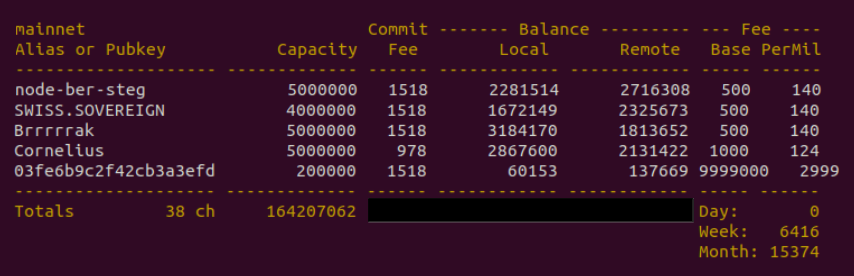

# Bonus guide: lnchannels
{: .no_toc }

---

The following script was created by [RobClark56](https://github.com/robclark56){:target="_blank"} to display a summary of all your channels.

Difficulty: Easy
{: .label .label-green }

Status: Tested v3
{: .label .label-green }



---

Table of contents
{: .text-delta }

1. TOC
{:toc}

---

## Install the script

* As user “admin”, download the script

  ```sh
  $ cd /tmp
  $ wget https://raw.githubusercontent.com/raspibolt/raspibolt/master/resources/lnchannels
  ```
  
* You can investigate the content of the script to ensure that there is no malicious code in it. Once done press q to quit.
  
  ```sh
  $ less lnchannels
  > #!/bin/bash
  > # RaspiBolt channel overview display, by robclark56
  > [...]
  ```
  
* Make the script executable (check by displaying the file name, it should have become green)
  
  ```sh
  $ chmod +x lnchannels
  $ ls -la
  ```

* Move the file to the  global bin(aries) folder and clean the `/tmp` directory

  ```sh
  $ sudo mv lnchannels /usr/local/bin
  $ cd
  ```

---

## lnbalance in action

* With the "admin" user, run `lnchannels`

  ```sh
  $ lnchannels
  > mainnet                            Commit ------- Balance --------- --- Fee ----
  > Alias or Pubkey           Capacity   Fee        Local       Remote   Base PerMil
  > -------------------- ------------- ------ ------------ ------------ ----- ------
  > ACINQ                      2100000    280      2000000       100000  1000    100
  > [...]
  > -------------------- ------------- ------ ------------ ------------ ----- ------
  > Totals         12 ch      12407062   2655      6100001      6307061 Day:     123
                                                                       Week:     752
                                                                      Month:   20385
  ```

---

## Uninstall

* To uninstall `lnchannels`

  ```sh
  $ sudo rm /usr/local/bin/lnchannels
  $ cd
  ```

<br /><br />

---

<< Back: [+ Lightning](index.md)
