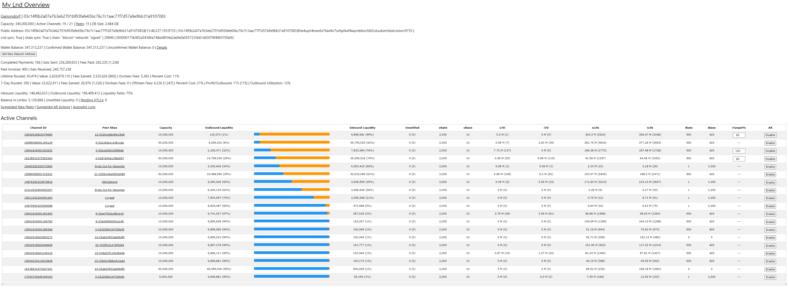

# Bonus guide: LNDg
{: .no_toc }

---

[LNDg](https://github.com/cryptosharks131/lndg){:target="_blank"} is a lite GUI web interface to help you manually manage your node and automate operations such as rebalancing, fee adjustemnts and channel node opening.

Difficulty: Hard
{: .label .label-red }

Status: Tested v3
{: .label .label-green }



---

Table of contents
{: .text-delta }

1. TOC
{:toc}

---

## Requirements

* LND
* virtualenv
* uwsgi

---

## Preparations

### Python virtual environment

[Virtualenv](https://virtualenv.pypa.io/en/latest/){:target="_blank"} is a tool to create isolated Python environments. 

* With user "admin", check if `virtualenv` is already installed on yout node. If not, use `apt` to install it.

  ```sh
  $ virtualenv --version
  > -bash: virtualenv: command not found
  $ sudo apt update
  $ sudo apt install virtualenv
  ```

### Firewall

* Configure firewall to allow incoming HTTP requests:

  ```sh
  $ sudo ufw allow 8889/tcp comment 'allow LNDg SSL'
  $ sudo ufw status
  ```

---

## LNDg

### Installation

We do not want to run LNDg alongside bitcoind and lnd because of security reasons. 
For that we will create a separate user and we will be running the code as the new user. 

* Create a new user and make it a member of the "lnd" group to give it read access to the LND macaroons and data
  
  ```sh
  $ sudo adduser --disabled-password --gecos "" lndg
  $ sudo adduser lndg lnd
  $ sudo adduser lndg www-data
  ```
  
* Log in with the lndg user and create a symbolic link to the LND data directory

  ```sh
  $ sudo su - lndg
  $ ln -s /data/lnd /home/lndg/.lnd
  ```

* Clone the latest release of the project GitHub repository and enter it

  ```sh
  $ git clone --branch v1.3.1 https://github.com/cryptosharks131/lndg.git
  $ cd lndg

* Setup a Python virtual environment

  ```sh
  $ virtualenv -p python .venv
  ```

* Install required dependencies and initialize some settings for your django site. 
A first time password will be output, save it somewhere safe (e.g., your password manager).

  ```sh
  $ .venv/bin/pip install -r requirements.txt
  $ .venv/bin/python initialize.py
  [...]
  > FIRST TIME LOGIN PASSWORD:abc...123\
  ```

* Generate some initial node data for your dashboard.

  ```sh
  $ .venv/bin/python jobs.py
  ```

### First start

* Still with the "lndg" user, start the server

  ```sh
  $ cd ~/lndg
  $ .venv/bin/python manage.py runserver 0.0.0.0:8889
  > [...]
  > Starting development server at http://0.0.0.0:8889/
  > Quit the server with CONTROL-C.
  ```

* Now point your browser to the LNDg Python server, for example http://raspibolt.local:8889 
(or your node's IP address, e.g. http://192.168.0.20:8889). 

* The initial login user is "lndg-admin" and the password is the one generated just above. 
If you didn't save the password, you can get it again with: `nano /home/lndg/lndg/data/lndg-admin.txt`

* Shut down the server with `Ctrl+c` 

* For extra security, delete the text file that contains the password

  ```sh
  $ rm /home/lndg/lndg/data/lndg-admin.txt
  ```

### Web server configuration

* Install uwsgi within the LNDg Python virtual environment

  ```sh
  $ .venv/bin/python -m pip install uwsgi
  ```

* Create the initialization file and paste the following lines. Save and exit.

  ```sh
  $ nano lndg.ini
  ```

  ```ini
  # lndg.ini file
  [uwsgi]
  
  ###########################
  # Django-related settings #
  ###########################
  # the base directory (full path)
  chdir           = /home/lndg/lndg
  # Django's wsgi file
  module          = lndg.wsgi
  # the virtualenv (full path)
  home            = /home/lndg/lndg/.venv
  #location of log files
  logto           = /var/log/uwsgi/%n.log

  ############################
  # process-related settings #
  ############################
  # master
  master          = true
  # maximum number of worker processes
  processes       = 1
  # the socket (use the full path to be safe
  socket          = /home/lndg/lndg/lndg.sock
  # ... with appropriate permissions - may be needed
  chmod-socket    = 660
  # clear environment on exit
  vacuum          = true
  ```

* Create the uwsgi parameter file and paste the following lines. Save and exit.

  ```sh
  $ nano uwsgi_params
  ```

  ```ini
  uwsgi_param  QUERY_STRING       $query_string;
  uwsgi_param  REQUEST_METHOD     $request_method;
  uwsgi_param  CONTENT_TYPE       $content_type;
  uwsgi_param  CONTENT_LENGTH     $content_length;
  
  uwsgi_param  REQUEST_URI        "$request_uri";
  uwsgi_param  PATH_INFO          "$document_uri";
  uwsgi_param  DOCUMENT_ROOT      "$document_root";
  uwsgi_param  SERVER_PROTOCOL    "$server_protocol";
  uwsgi_param  REQUEST_SCHEME     "$scheme";
  uwsgi_param  HTTPS              "$https if_not_empty";
  
  uwsgi_param  REMOTE_ADDR        "$remote_addr";
  uwsgi_param  REMOTE_PORT        "$remote_port";
  uwsgi_param  SERVER_PORT        "$server_port";
  uwsgi_param  SERVER_NAME        "$server_name";
  ```

* Exit the "lndg" user session

  ```sh
  $ exit
  ```

* Create the uwsgi service file

  ```sh
  $ sudo nano /etc/systemd/system/uwsgi.service
  ```
  
  ```ini
  [Unit]
  Description=LNDg uWSGI app
  After=lnd.service
  PartOf=lnd.service
  
  [Service]
  ExecStart=/home/lndg/lndg/.venv/bin/uwsgi --ini /home/lndg/lndg/lndg.ini
  User=lndg
  Group=www-data
  Restart=on-failure
  # Wait 4 minutes before starting to give LND time to fully start.  Increase if needed.
  TimeoutStartSec=240
  RestartSec=30
  KillSignal=SIGQUIT
  Type=notify
  NotifyAccess=all
  
  [Install]
  WantedBy=sockets.target
  ```

* Create a nginx configuration file for the LNDg website with a server listening on port 4890

  ```sh
  $ sudo nano /etc/nginx/sites-available/lndg-ssl.conf
  ```

* Paste the following configuration lines. Save and exit.

  ```ini
  upstream django {
    server unix:///home/lndg/lndg/lndg.sock; # for a file socket
  }
  
  server {
    # the port your site will be served on
    listen 8889 ssl;
    listen [::]:8889 ssl;
    ssl_certificate /etc/ssl/certs/nginx-selfsigned.crt;
    ssl_certificate_key /etc/ssl/private/nginx-selfsigned.key;
    ssl_session_timeout 4h;
    ssl_protocols TLSv1.3;
    ssl_prefer_server_ciphers on;
  
    # the domain name it will serve for
    server_name _;
    charset     utf-8;
  
    # max upload size
    client_max_body_size 75M;
  
    # max wait for django time
    proxy_read_timeout 180;
  
    # Django media
    location /static {
        alias /home/lndg/lndg/gui/static; # your Django project's static files - amend as required
    }
  
    # Finally, send all non-media requests to the Django server.
    location / {
        uwsgi_pass  django;
        include     /home/lndg/lndg/uwsgi_params; # the uwsgi_params file
    }
  }
  ```

* Create a symlink in the `sites-enabled` directory

  ```sh
  $ sudo ln -sf /etc/nginx/sites-available/lndg-ssl.conf /etc/nginx/sites-enabled/
  ```

* Open the nginx configuration file

  ```sh
  $ sudo nano /etc/nginx/nginx.conf
  ```

* Paste the following configuration lines between the existing `event` and `stream` blocks . Save and exit.

  ```ini
  http {
  
          ##
          # Basic Settings
          ##
  
          sendfile on;
          tcp_nopush on;
          types_hash_max_size 2048;
          # server_tokens off;
  
          # server_names_hash_bucket_size 64;
          # server_name_in_redirect off;
  
          include /etc/nginx/mime.types;
          default_type application/octet-stream;
  
          ##
          # SSL Settings
          ##
  
          ssl_protocols TLSv1.3;
          ssl_prefer_server_ciphers on;
  
          ##
          # Logging Settings
          ##
  
          access_log /var/log/nginx/access.log;
          error_log /var/log/nginx/error.log;
  
          ##
          # Gzip Settings
          ##
  
          gzip on;
  
          # gzip_vary on;
          # gzip_proxied any;
          # gzip_comp_level 6;
          # gzip_buffers 16 8k;
          # gzip_http_version 1.1;
          # gzip_types text/plain text/css application/json application/javascript text/xml application/xml application/xml+rss text/javascript;
  
          ##
          # Virtual Host Configs
          ##
  
          include /etc/nginx/conf.d/*.conf;
          include /etc/nginx/sites-enabled/*;
  }

* Create the log and sock files

  ```sh
  # Log file
  $ sudo mkdir /var/log/uwsgi
  $ sudo touch /var/log/uwsgi/lndg.log
  $ sudo chgrp -R www-data /var/log/uwsgi
  $ sudo chmod 660 /var/log/uwsgi/lndg.log
  
  # Sock file
  $ sudo touch /home/lndg/lndg/lndg.sock
  $ sudo chown lndg:www-data /home/lndg/lndg/lndg.sock
  $ sudo chmod 660 /home/lndg/lndg/lndg.sock

* Test the nginx configuration

  ```sh
  $ sudo nginx -t
  > nginx: the configuration file /etc/nginx/nginx.conf syntax is ok
  > nginx: configuration file /etc/nginx/nginx.conf test is successful
  ```

* Enable and start the uwsgi service

  ```sh
  $ sudo systemctl enable uwsgi
  $ sudo systemctl start uwsgi
  $ sudo systemctl status uwsgi
  > [...]
  > Sep 25 22:47:21 raspibolt systemd[1]: Starting LNDg uWSGI app...
  > Sep 25 22:47:21 raspibolt uwsgi[1371109]: [uWSGI] getting INI configuration from /home/lndg/lndg/lndg.ini
  > Sep 25 22:47:22 raspibolt systemd[1]: Started LNDg uWSGI app.
  ```

* To check the uwsgi logs

  ```sh
  $ sudo journalctl -f -u uwsgi
  ```

* Restart nginx

  ```sh
  $ sudo systemctl restart nginx
  ```

You can now access LNDg from within your local network by browsing to https://raspibolt.local:8889 (or your equivalent IP address).

### Backend refreshes

LNDg uses a Python script (`~/lndg/jobs.py`), to gather data about your node that is then displayed in the GUI dashboard. 
To have updated information in the GUI, it is necessary to regularly run the script to collect new data.

* As user “lndg”, create a bash file to call `jobs.py` and paste the following lines. Save and exit.

  ```sh
  $ sudo su - lndg
  $ cd lndg
  $ nano ~/lndg/jobs.sh
  ```

  ```ini
  #!/bin/bash
  
  /home/lndg/lndg/.venv/bin/python /home/lndg/lndg/jobs.py
  ```

* Make the script executable by user “lndg” then exit the "lndg" user session

  ```sh
  $ chmod u+x jobs.sh
  $ exit
  ```

* Create a service file for the `jobs.sh` script

  ```sh
  $ sudo nano /etc/systemd/system/jobs-lndg.service
  ```

  ```ini
  # RaspiBolt: systemd unit for LNDg
  # /etc/systemd/system/jobs-lndg.service
  
  [Unit]
  Description=LNDg jobs
  After=lnd.service

  [Service]
  WorkingDirectory=/home/lndg/lndg
  ExecStart=/usr/bin/bash /home/lndg/lndg/jobs.sh
  User=lndg
  
  StandardError=append:/var/log/lnd_jobs_error.log
  
  Restart=always
  RestartSec=30

  [Install]
  WantedBy=multi-user.target
  ```

* Create a timer file to run `jobs.sh` every 60 seconds. Save and exit.

  ```sh
  $ sudo nano /etc/systemd/system/jobs-lndg.timer
  ```

  ```ini
  [Unit]
  Description=Run Lndg Jobs Every 60 Seconds

  [Timer]
  OnBootSec=300
  OnUnitActiveSec=60
  AccuracySec=1
  
  [Install]
  WantedBy=timers.target
  ```

* Enable the timer to run the jobs service file at the specified interval. Check the status of the timer and exit with `Ctrl`+`c`.

  ```sh
  $ sudo systemctl enable jobs-lndg.timer
  $ sudo systemctl start jobs-lndg.timer
  $ sudo systemctl status jobs-lndg.timer
  ```

### Rebalancer runs

LNDg uses a Python script (`~/lndg/rebalancer.py`), to automatically create circular rebalancing payments based on user-defined parameters.

* Log in with user "lndg" and enter the LNDg repository

  ```sh
  $ sudo su - lndg
  $ cd lndg
  ```

* As user “lndg”, create a bash file to call `rebalance.py` and paste the following lines. Save and exit.

  ```sh
  $ nano /home/lndg/lndg/rebalancer.sh
  ```
  
  ```ini
  #!/bin/bash

  /home/lndg/lndg/.venv/bin/python /home/lndg/lndg/rebalancer.py
  ```
* Make the script executable by user “lndg” then exit the "lndg" user session

  ```sh
  $ chmod u+x rebalancer.sh
  $ exit
  ```

* Create a service file for the `rebalancer.sh` script

  ```sh
  $ sudo nano /etc/systemd/system/rebalancer-lndg.service
  ```

  ```ini
  [Unit]
  Description=Run Rebalancer For Lndg

  [Service]
  User=lndg
  Group=lndg
  ExecStart=/usr/bin/bash /home/lndg/lndg/rebalancer.sh
  StandardError=append:/var/log/lnd_rebalancer_error.log
  RuntimeMaxSec=3600
  ```

* Create a timer file to run `jobs.sh` every 60 seconds. Save and exit.

  ```sh
  $ sudo nano /etc/systemd/system/rebalancer-lndg.timer
  ```

  ```ini
  [Unit]
  Description=Run Lndg Jobs Every 60 Seconds

  [Timer]
  OnBootSec=300
  OnUnitActiveSec=60
  AccuracySec=1
  
  [Install]
  WantedBy=timers.target
  ```

* Enable and start the timer to run the rebalancer service file at the specified interval. Check the status of the timer and exit with `Ctrl`+`c`.

  ```sh
  $ sudo systemctl enable rebalancer-lndg.timer
  $ sudo systemctl start rebalancer-lndg.timer
  $ sudo systemctl status rebalancer-lndg.timer
  ```

### HTLC failure stream data

* Log in with user "lndg" and enter the LNDg repository

  ```sh
  $ sudo su - lndg
  $ cd lndg
  ```

* As user “lndg”, create a bash file to call `htlc_stream.py` and paste the following lines. Save and exit.

  ```sh
  $ nano /home/lndg/lndg/htlc_stream.sh
  ```
  
  ```ini
  #!/bin/bash

  /home/lndg/lndg/.venv/bin/python /home/lndg/lndg/htlc_stream.py
  ```

* Make the script executable by user “lndg” then exit the "lndg" user session

  ```sh
  $ chmod u+x htlc_stream.sh
  $ exit
  ```

* Create a service file for the `htlc_stream.sh` script

  ```sh
  $ sudo nano /etc/systemd/system/htlc-stream-lndg.service
  ```

  ```ini
  [Unit]
  Description=Run HTLC Stream For Lndg

  [Service]
  User=lndg
  Group=lndg
  ExecStart=/usr/bin/bash /home/lndg/lndg/htlc_stream.sh
  StandardError=append:/var/log/lnd_htlc_stream_error.log
  Restart=on-failure
  RestartSec=60s
  
  [Install]
  WantedBy=multi-user.target
  ```

* Enable, start and then check the status of the service. Exit with `Ctrl`+`c`.

  ```sh
  $ sudo systemctl enable htlc-stream-lndg.service
  $ sudo systemctl start htlc-stream-lndg.service
  $ sudo systemctl status htlc-stream-lndg.service
  ```

---

## Remote access over Tor (optional) 

Do you want to access LNDg remotely? You can easily do so by adding a Tor hidden service on the RaspiBolt and accessing LNDg with the Tor browser from any device.

* Add the following three lines in the “location-hidden services” section in the `torrc file`. Save and exit.

  ```sh
  $ sudo nano /etc/tor/torrc
  ```

  ```ini
  # Hidden service LNDg
  HiddenServiceDir /var/lib/tor/hidden_service_lndg/
  HiddenServiceVersion 3
  HiddenServicePort 443 127.0.0.1:8889
  ```

* Reload Tor configuration and get your connection address.

  ```sh
  $ sudo systemctl reload tor
  $ sudo cat /var/lib/tor/hidden_service_lndg/hostname
  > abcdefg..............xyz.onion
  ```

With the Tor browser, you can access this onion address from any device.

---

## For the future: LNDg update

* With user "admin", stop all the LNDg services and open a “lndg” user session.

  ```sh
  $ sudo systemctl stop htlc-stream-lndg.service
  $ sudo systemctl stop rebalancer-lndg.timer
  $ sudo systemctl stop jobs-lndg.timer
  $ sudo systemctl stop uwsgi.service
  $ sudo su - lndg
  ```

* Fetch the latest GitHub repository information, display the release tags (use the latest 1.3.0 in this example), and update:

  ```sh
  $ cd /home/lndg/lndg
  $ git fetch
  $ git reset --hard HEAD
  $ git tag
  $ git checkout v1.3.1
  $ ./.venv/bin/pip install -r requirements.txt
  $ exit
  ```
  
* Start the services again.

  ```sh
  $ sudo systemctl start uwsgi.service
  $ sudo systemctl start jobs-lndg.timer
  $ sudo systemctl start rebalancer-lndg.timer
  $ sudo systemctl start htlc-stream-lndg.service
  ```

---

## Uninstall

* Stop and disable all the LNDg timers and background services

  ```sh
  $ sudo systemctl stop htlc-stream-lndg.service rebalancer-lndg.timer rebalancer-lndg.service jobs-lndg.timer jobs-lndg.service
  $ sudo systemctl disable htlc-stream-lndg.service rebalancer-lndg.timer rebalancer-lndg.service jobs-lndg.timer jobs-lndg.service
  

* Stop and disable uwsgi

  ```sh
  $ sudo systemctl stop uwsgi.service
  $ sudo systemctl disable uwsgi.service
  ``` 

* Delete all the LNDg systemd files
 
  ```sh
  $ cd /etc/systemd/system/
  $ sudo rm htlc-stream-lndg.service rebalancer-lndg.timer rebalancer-lndg.service jobs-lndg.timer jobs-lndg.service uwsgi.service
  $ cd
  ```

* Display the UFW firewall rules and notes the numbers of the rules for Mempool (e.g., X and Y below)
  
  ```sh
  $ sudo ufw status numbered
  > [...]
  > [X] 8889/tcp                   ALLOW IN    Anywhere                   # allow LNDg SSL
  > [...]
  > [Y] 8889/tcp (v6)              ALLOW IN    Anywhere (v6)              # allow LNDg SSL
  ```

* Delete the two LNDg rules (check that the rule to be deleted is the correct one and type “y” and “Enter” when prompted)
  
  ```sh
  $ sudo ufw delete Y
  $ sudo ufw delete X
  ```

* Delete the nginx LNDg configuration file and symlink

  ```sh
  $ sudo rm /etc/nginx/sites-available/lndg-ssl.conf
  $ sudo rm /etc/nginx/sites-enabled/lndg-ssl.conf
  ```

* Delete or comment out the HTTP server block from the `nginx.conf` file (unless you use it for another service, e.g. [Mempool](../bitcoin/mempool.md))

  ```sh
  $ sudo nano /etc/nginx/nginx.conf
  ```

  ```ini
  #http {
  # [...]
  #}
  ```

* Test the nginx configuration & restart nginx

  ```sh
  $ sudo nginx -t
  > nginx: the configuration file /etc/nginx/nginx.conf syntax is ok
  > nginx: configuration file /etc/nginx/nginx.conf test is successful
  $ sudo systemctl restart nginx
  ```

* Delete the uwsgi log file

  ```sh
  $ sudo rm /var/log/uwsgi/lndg.log
  ```

* Delete the “lndg” user. Do not worry about the userdel: mempool mail spool (/var/mail/lndg) not found.
 
  ```sh
  $ sudo su -
  $ userdel -r lndg
  > userdel: lndg mail spool (/var/mail/lndg) not found]
  $ exit
  ```

<br /><br />

---

<< Back: [+ Lightning](index.md)
