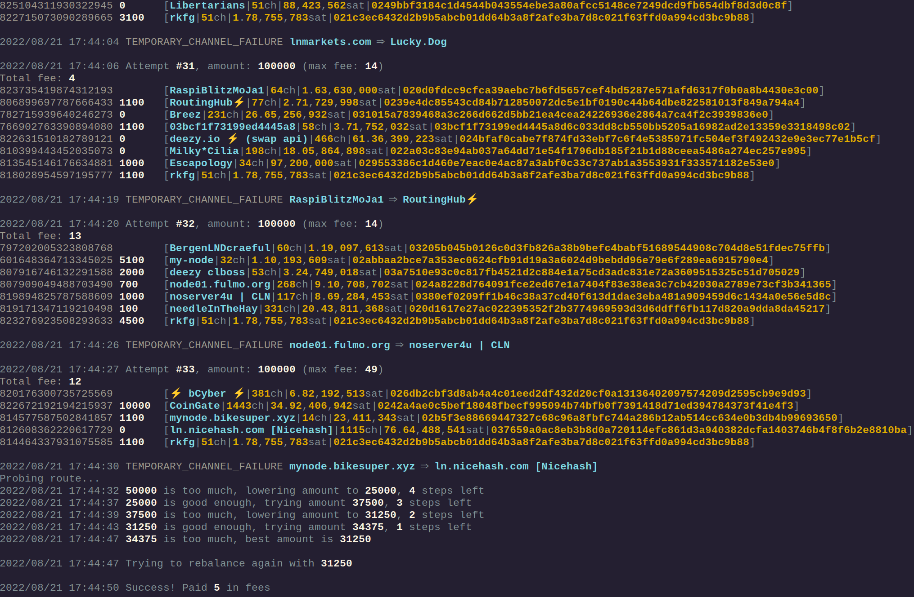

# Bonus guide: regolancer
{: .no_toc }

---

[regolancer](https://github.com/rkfg/regolancer){:target="_blank"} simple LND rebalancer written in Go.

Difficulty: Easy
{: .label .label-green }

Status: Tested v3
{: .label .label-green }



---

Table of contents
{: .text-delta }

1. TOC
{:toc}


---

## Requirements

* LND
* Go

---

## Install Go

* To install Go follow the instructions provided in the [bonus guide](../raspberry-pi/go.md#install-go).

---

## Install regolancer

* With user “admin”, create a new user “regolancer” and make it a member of the “lnd” group

  ```sh
  $ sudo adduser --disabled-password --gecos "" regolancer
  $ sudo adduser regolancer lnd
  ```

* With the “regolancer” user map the LND folder and install the program

  ```sh
  $ sudo su - regolancer

  $ ln -s /data/lnd /home/regolancer/.lnd

  $ go install github.com/rkfg/regolancer@v1.6.3
  ```
Note: Adjust the "regolancer@v1.6.3" part from the commands below to the actual version you have installed.

* Confirm installed version

  ```sh
  $ go/bin/regolancer -v
  Regolancer v1.6.3, built with go1.19.2
  Source: https://github.com/rkfg/regolancer
  ```

* Create a working copy of the sample config file. You can use either .json or .toml configs, up to your preference.  

  ```sh
  $ cp /home/regolancer/go/pkg/mod/github.com/rkfg/regolancer@v1.6.3/config.json.sample /home/regolancer/config.json
  ```

* Make the newly created config.json file writable.

  ```sh
  $ chmod 644 /home/regolancer/config.json
  ```

---

## Configuration

* Edit the config file and make sure you have the following changes in the beginning.

  ```sh
  $ nano /home/regolancer/config.json
  ```

  ```ini
  "macaroon_dir": "/home/regolancer/.lnd/data/chain/bitcoin/mainnet/",
  "macaroon_filename": "admin.macaroon",
  "network": "mainnet",
  "tlscert": "/home/regolancer/.lnd/tls.cert",
  ```

Adjust the rest of the file as you wish with the options [regolancer config sample](https://github.com/rkfg/regolancer/blob/master/config.json.sample){:target="_blank"} provides, save, and exit.

---

## First run

* Run the Rebalancer (while in "regolancer" user session)

  ```sh
  $ go/bin/regolancer -f /home/regolancer/config.json
  ```

The regolancer will run until it finds a hit and will stop after that unless you have utilized the "--allow-rapid-rebalance" parameter, which will retry the same rebalance instantly until a fail. 
To run it continuously, you will need to run it in a loop or a cron.

---

## Upgrade

* From user “admin”, open a “regolancer” user session and run the install script.

  ```sh
  $ sudo su - regolancer
  $ go install github.com/rkfg/regolancer@latest
  ```

* Confirm if the upgrade was successfull

  ```sh
  $ go/bin/regolancer -v
  Regolancer v1.8.0, built with go1.19.2
  Source: https://github.com/rkfg/regolancer
  ```

---

## Uninstall

* If you want to uninstall regolancer, delete the “regolancer” user with the “root” user.

  ```sh
  $ userdel -r regolancer
  ```

Don't forget to remove any cronjobs or screens you may have set up in other users.
