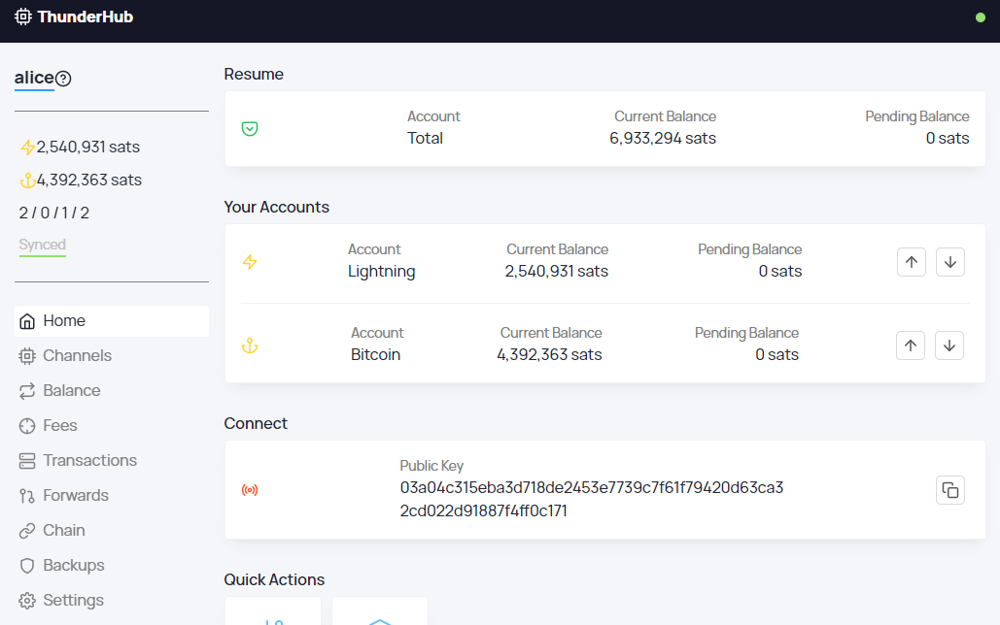

# Bonus Guide: Install ThunderHub

{: .no_toc }

---

[ThunderHub](https://github.com/apotdevin/thunderhub){:target="_blank"} is an open source LND node manager where you can manage and monitor your node on any device or browser. It allows you to take control of the lightning network with a simple and intuitive UX and the most up-to-date tech stack.

Difficulty: Medium
{: .label .label-yellow }

Status: Tested v3
{: .label .label-green }



---

Table of contents
{: .text-delta }

1. TOC
{:toc}

---

## Preparations

### Check Node.js

* Node.js v16 should have been installed for the BTC RPC Explorer and RTL. We can check our version of Node.js with user "admin":
  
  ```sh
  $ node -v
  > v16.14.2
  ```

* If the version is v14.15 or above, you can move to the next section. If Node.js is not installed, follow [this guide](https://raspibolt.org/guide/bitcoin/blockchain-explorer.html#install-nodejs){:target="_blank"} to install it.

### Firewall & Reverse Proxy

* Configure firewall to allow incoming HTTP requests from your local network to the web server.

  ```sh
  $ sudo ufw allow 4002 comment 'allow ThunderHub SSL'
  ```

* Enable NGINX reverse proxy to route external encrypted HTTPS traffic internally to Thunderhub

  ```sh
  $ sudo nano /etc/nginx/streams-enabled/thunderhub-reverse-proxy.conf
  ```

  ```nginx
  upstream thunderhub {
    server 127.0.0.1:3010;
  }
  server {
    listen 4002 ssl;
    proxy_pass thunderhub;
  }
  ```

* Test and reload NGINX configuration
  
  ```sh
  $ sudo nginx -t
  $ sudo systemctl reload nginx
  ```
  
---

## ThunderHub

### Installation

We do not want to run Thunderhub code alongside `bitcoind` and `lnd` because of security reasons.
For that we will create a separate user and we will be running the code as the new user.
We are going to install Thunderhub in the home directory since it doesn't need too much space.

* Create a new "thunderhub" user. The new user needs read-only access to the `tls.cert` and our `admin.macaroon`, so we add him to the "lnd" group. Open a new session.

  ```sh
  $ sudo adduser --disabled-password --gecos "" thunderhub
  $ sudo adduser thunderhub lnd
  $ sudo cp /data/lnd/data/chain/bitcoin/mainnet/admin.macaroon /home/thunderhub/admin.macaroon
  $ sudo chown thunderhub:thunderhub /home/thunderhub/admin.macaroon
  $ sudo su - thunderhub
  ```

* Download the source code directly from GitHub and install all dependencies using NPM.

  ```sh
  $ git clone https://github.com/apotdevin/thunderhub.git
  $ cd thunderhub
  $ npm install
  $ npm run build
  ```

### Configuration

* Still with user "thunderhub", create a symbolic link pointing to your lnd data directory.
  Check if the link is working. If nothing is displayed in red you are good to go.

  ```sh
  $ ln -s /data/lnd /home/thunderhub/.lnd
  $ ls -la
  ```

* Copy and open the configuration file

  ```sh
  $ cd ~/thunderhub
  $ cp .env .env.local
  $ nano .env.local
  ```

* Edit the following lines, save and exit:

  ```ini
  # -----------
  # Server Configs
  # -----------
  LOG_LEVEL='debug'
  TOR_PROXY_SERVER=socks://127.0.0.1:9050
  NODE_ENV=production
  PORT=3010

  # -----------
  # Account Configs
  # -----------
  ACCOUNT_CONFIG_PATH='/home/thunderhub/thunderhub/thubConfig.yaml'
  ```

* If not already done, change your directory and edit your `thubConfig.yaml`. Change your `accountpassword`.

  ```sh
  $ cd ~/thunderhub
  $ nano thubConfig.yaml 
  ```

  ```ini
  masterPassword: 'PASSWORD' # Default password unless defined in account
  accounts:
    - name: 'RaspiBolt'
      serverUrl: '127.0.0.1:10009'
      macaroonPath: '/home/thunderhub/admin.macaroon'
      certificatePath: '/home/thunderhub/.lnd/tls.cert'
      password: 'accountpassword'
  ```

---

## First Start

Test starting Thunderhub manually first to make sure it works.

* Let's do a first start to make sure it's running as expected.
  Make sure we are in the Thunderhub directory and start the web server.

  ```sh
  $ cd ~/thunderhub
  $ npm run start
  ```

* Now point your browser to `https://raspibolt.local:4002` (or whatever you chose as hostname) or the ip address (e.g. `https://192.168.0.20:4002`).
  You should see the home page of ThunderHub.

* Stop ThunderHub in the terminal with `Ctrl`-`C` and exit the "thunderhub" user session.

  ```sh
  $ exit
  ```

---

## Autostart on boot

Now we'll make sure ThunderHub starts as a service on the Raspberry Pi so it's always running.
In order to do that we create a systemd unit that starts the service on boot directly after LND.

* As user "admin", create the service file.

  ```sh
  $ sudo nano /etc/systemd/system/thunderhub.service
  ```

* Paste the following configuration. Save and exit.

  ```ini
  # RaspiBolt: systemd unit for Thunderhub
  # /etc/systemd/system/thunderhub.service

  [Unit]
  Description=Thunderhub
  Wants=lnd.service
  After=network.target lnd.service

  [Service]
  WorkingDirectory=/home/thunderhub/thunderhub
  ExecStart=/usr/bin/npm run start
  User=thunderhub
  Restart=always
  TimeoutSec=120
  RestartSec=30
  StandardOutput=null
  StandardError=journal

  [Install]
  WantedBy=multi-user.target
  ```

* Enable the service, start it and check log logging output.

  ```sh
  $ sudo systemctl enable thunderhub.service
  $ sudo systemctl start thunderhub.service
  $ sudo journalctl -f -u thunderhub
  ```

* You can now access ThunderHub from within your local network by browsing to <https://raspibolt.local:4002> (or your equivalent ip address).

---

## Remote access over Tor (optional)

Do you want to access ThunderHub remotely?
You can easily do so by adding a Tor hidden service on the RaspiBolt and accessing ThunderHub with the Tor browser from any device.

* Add the following three lines in the section for "location-hidden services" in the `torrc` file.
  Save and exit.

  ```sh
  $ sudo nano /etc/tor/torrc
  ```

  ```ini
  ############### This section is just for location-hidden services ###
  # Hidden Service Thunderhub
  HiddenServiceDir /var/lib/tor/hidden_service_thunderhub/
  HiddenServiceVersion 3
  HiddenServicePort 80 127.0.0.1:3010
  ```

* Restart Tor and get your connection address.

  ```sh
  $ sudo systemctl reload tor
  $ sudo cat /var/lib/tor/thunderhub/hostname
  > abcdefg..............xyz.onion
  ```

* With the [Tor browser](https://www.torproject.org), you can access this onion address from any device.
  Please be aware that this access is not password protected and should not be shared widely.

**Congratulations!**
You now have Thunderhub up and running.

---

## Upgrade

Updating to a [new release](https://github.com/apotdevin/thunderhub/releases) should be straight-forward.

* From user "admin", stop the service and open a "thunderhub" user session.

  ```sh
  $ sudo systemctl stop thunderhub
  $ sudo su - thunderhub
  ```

* Run the update command provided within the package:

  ```sh
  $ cd ~/thunderhub
  $ npm run update
  $ exit
  ```

* Start the service again.

  ```sh
  $ sudo systemctl start thunderhub
  ```

---

## Uninstall

### Uninstall service

* Stop, disable and delete the Thunderhub systemd service

   ```sh
  $ sudo systemctl stop thunderhub
  $ sudo systemctl disable thunderhub
  $ sudo rm /etc/systemd/system/thunderhub.service
  ```

### Uninstall FW configuration

* Display the UFW firewall rules and notes the numbers of the rules for Thunderhub (e.g., X and Y below)

  ```sh
  $ sudo ufw status numbered
  > [...]
  > [X] 4002                   ALLOW IN    Anywhere                   # allow Thunderhub SSL
  > [...]
  > [Y] 4002 (v6)              ALLOW IN    Anywhere (v6)              # allow Thunderhub SSL
  ```

* Delete the two Thunderhub rules (check that the rule to be deleted is the correct one and type "y" and "Enter" when prompted)

  ```sh
  $ sudo ufw delete Y
  $ sudo ufw delete X  
  ```

### Uninstall Thunderhub

* Delete the "thunderhub" user. It might take a long time as the Thunderhub user directory is big. Do not worry about the `userdel: thunderhub mail spool (/var/mail/thunderhub) not found`.

  ```sh
  $ sudo su -
  $ userdel -r thunderhub
  > userdel: thunderhub mail spool (/var/mail/thunderhub) not found
  ```

### Uninstall Tor hidden service

* Comment or remove fulcrum hidden service in torrc. Save and exit

  ```sh
  $ sudo nano /etc/tor/torrc
  ```

  ```sh
  ############### This section is just for location-hidden services ###
  # Hidden Service Thunderhub
  #HiddenServiceDir /var/lib/tor/hidden_service_thunderhub/
  #HiddenServiceVersion 3
  #HiddenServicePort 80 127.0.0.1:3010
  ```

* Reload torrc config

  ```sh
  $ sudo systemctl reload tor
  ```

---

## Extras

### Access to your Amboss node account

* In the "Home" screen - "Quick Actions" section, click on Amboss icon "Login", wait to the top right corner notification to show you "Logged in" and click again on the Amboss icon "Go to". This will open a secondary tab in your browser to access your Amboss account node.

Advice: If you can't do "Login", maybe the cause is because you don't have a channel opened yet. Planning to open a small size channel to can be connected with the Lightning Network and to the Amboss node.

* Making sure we are connected to the Amboss account, now back to Thunderhub for the next steps.

### Enable auto backups and healthcheck notifications to Amboss account

1. Open the “Settings” by pressing the cogwheel in the top right corner of the Thunderhub
1. Switch to "Yes" -> Amboss: "Auto backups" and "Healthcheck Pings"
1. Test pushing a backup to Amboss by entering in the "Tools" section, to the left main menu
1. Press to "Push" button to test the correct working
1. Go back to Amboss website and access "Account" in the main menu
1. Access to "Backup" and ensure that the last date of the backup is the same as before done. It is recommended to download the backup file and store it in a safe place for future recovers. The backup file will be updated automatically in Amboss for every channel opening and closing. You could do this too in the "Tools" section in Thunderhub, "Backups" -> "Backup all channels" -> "Download" button.
1. In Amboss, access "Monitoring" to configure "Healthcheck Settings".

Feel free to link to Telegram bot notifications, enable different notifications, complete your public node profile in Amboss, and other things in the different sections of your account.

### Recovering channels using Thunderhub method

After possible data corruption of your LND node, ensure that this old node is completely off. Once you have synced the new node, on-chain recovered with seeds, full on-chain re-scan complete and Thunderhub installed, access to the Thunderhub dashboard

1. Access to the "Tools" section, "Backups" -> "Recover Funds from channels" -> "Recover" button
1. Enter the complete string text of your previously downloaded channels backup file in the step before and push the "Recover" button. All of the channels that you had opened in your old node will be forced closed and they will appear in the "Pending" tab in the "Channels" section until closings are confirmed

⚠️ Use this guide as a last resort if you have lost access to your node or are unable to start LND due to a fatal error. This guide will close all your channels. Your funds will become available on-chain at varying speeds.

---
  
<br /><br />

<<Back: [+ Lightning](index.md)
