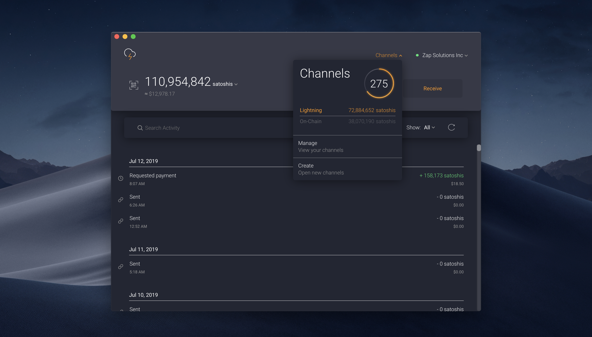

# Bonus guide: Zap Desktop
{: .no_toc }

The [desktop app Zap](https://github.com/LN-Zap/zap-desktop){:target="_blank"} is a cross-platform Lightning Network wallet focused on user experience and ease of use.

Difficulty: Easy
{: .label .label-green }

Status: Tested v3
{: .label .label-green }



---

Table of contents
{: .text-delta }

1. TOC
{:toc}

---

## Preparations

### Update LND TLS certificate

We enable access to LND through Remote Procedure Calls (RPC), allowing the Zap Desktop application to communicate with LND directly. This access is restricted to devices on the local network.

* With user "admin", open the LND configuration file

  ```sh
  $ sudo nano ~/.lnd/lnd.conf
  ```

* Add the following lines to the section `[Application Options]`. The netmask `/16` restricts access to all computers with an IP address of 192.168.*.* (i.e., the local network).
  
  ```ini
  # Add local network IP address to LND's TLS certificate
  tlsextraip=192.168.0.0/16
  rpclisten=0.0.0.0:10009
  ```
  
* Backup and delete the existing `tls.cert` and `tls.key` files and restart LND to recreate them. 

  ```sh
  $ sudo mv ~/.lnd/tls.cert ~/.lnd/tls.cert.bak
  $ sudo mv ~/.lnd/tls.key ~/.lnd/tls.key.bak
  $ sudo systemctl restart lnd
  ```

### Firewall

* Configure the UFW firewall to allow incoming requests from the local network only  
  
  ```sh
  $ sudo ufw allow from 192.168.0.0/16 to any port 10009 comment 'allow LND grpc from local LAN'
  $ sudo ufw status
  ```

### Install lndconnect

We will connect Zap to the RaspiBolt using a connection string that includes the connection and authentication information. 
[lndconnect](https://github.com/LN-Zap/lndconnect){:target="_blank"}, created by Zap, is a utility that generates a QR Code or URI to connect applications to LND instances.

* Still with the "admin" user, download the binary and install it

  ```sh
  $ cd /tmp
  $ wget https://github.com/LN-Zap/lndconnect/releases/download/v0.2.0/lndconnect-linux-arm64-v0.2.0.tar.gz
  $ tar -xvf lndconnect-linux-arm64-v0.2.0.tar.gz
  $ sudo install -m 0755 -o root -g root -t /usr/local/bin lndconnect-linux-arm64-v0.2.0/lndconnect
  $ cd
  ```

* Generate the connection string (the `-i` option include the local IP; the `-j` option generates a string rather than the default QR code)
  
  ```sh
  $ lndconnect -i -j
  > lndconnect://192.168.0.20:10009?cert=...
  ```

---

## Zap

Now that we configured the node, we can install Zap on the local computer and connect it to our node.

### Installation

Download and install Zap for your operating system following [this guide from Zap](https://github.com/LN-Zap/zap-desktop#install){:target="_blank"}. Before installing Zap, you can verify the release following [this guide](https://github.com/LN-Zap/zap-desktop/blob/master/docs/SIGNATURES.md){:target="_blank"}.

### Connection

* Launch Zap
* Choose the `Connect to your node` option
* Paste the connection string generated above (starting with with `lndconnect://...`)
* Add a wallet name (e.g., "MyRaspiBoltNode")
* Click "Next". In the new window, check that the displayed IP belongs to your node, then click "Next".

### Security

* Go to "File" > "Preferences" > "Security" and enable the application password

You're set! You can now use Zap on your computer to send and receive LN payments, open and close channels, and monitor your node.

---

## Update

Zap download and install updates automatically by default. If you want to disable the auto-update and update Zap manually: 
* Go to "File" > "Preferences" > "General"
* Click on the autoupdate slider
* Click "Save"

---

## Uninstall

If you stop using Zap, it is safer to restrict access to LND gRPC. But make sure that no other program requires access to it (e.g., if you've installed Lightning Terminal with a remote connection to LND)

* Open the LND configuration file and comment out the following two lines:

  ```sh
  $ sudo nano ~/.lnd/lnd.conf
  ```
  
  ```ini
  #tlsextraip=192.168.0.0/16
  #rpclisten=0.0.0.0:10009
  ```

* Backup and delete the existing `tls.cert` and `tls.key` files and restart LND to recreate them. 

  ```sh
  $ sudo mv ~/.lnd/tls.cert ~/.lnd/tls.cert.bak
  $ sudo mv ~/.lnd/tls.key ~/.lnd/tls.key.bak
  $ sudo systemctl restart lnd
  ```

* Display the firewall status and note the number of LND grpc rule (e.g. below, X)
  
  ```sh
  $ sudo ufw status numbered
  > [...]
  > [ X] 10009                      ALLOW IN    192.168.0.0/16             # allow LND grpc from local LAN
  > [...]
  ```

* Delete the rule. When prompted, check that you are deleting the desired rule and confirm.

  ```sh
  $ sudo ufw delete X
  ```

<br /><br />

---

<< Back: [+ Lightning](index.md)
