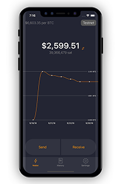
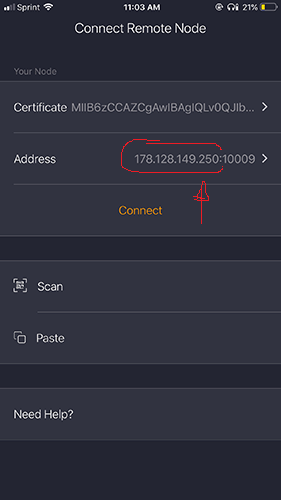
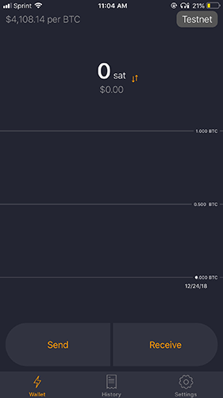

## Bonus guide: Zap iOS Lightning Wallet
{: .no_toc }

Difficulty: Intermediate
{: .label .label-yellow }

Status: Not tested v3
{: .label .label-yellow }

---

Table of contents
{: .text-delta }

1. TOC
{:toc}

---

This guide describes how to use Zap iOS from within your own network, the same that also connects your RaspiBolt.



Zap is a free Lightning Network wallet focused on good user experience and ease of use. It is in alpha testing, so **use it at your own risk**. You can find more details in the [Zap iOS GitHub repository](https://github.com/LN-Zap/zap-iOS){:target="_blank"}. If you find bugs, you can contribute to this project by [reporting issues](https://github.com/LN-Zap/zap-iOS/issues){:target="_blank"}.

### Preparation on the RaspiBolt

#### Prepare LND Node for gRPC access
First we make sure that LND is listening for connections from other computers on the gRPC interface.

* Login as user "admin"

* Allow connections to the RaspiBolt from your own network. Check how the ip address of your Pi is starting with, eg. 192.168.0 or 192.168.1 , and use the address accordingly. Ending with .0/24 will allow all IP addresses from that network.

  Add the following lines to the section `[Application Options]`:
  `$ sudo nano /home/bitcoin/.lnd/lnd.conf`
  ```
  rpclisten=0.0.0.0:10009
  tlsextraip=0.0.0.0
  ```

* Delete tls.cert (restarting LND will recreate it):
  `$ sudo rm /home/bitcoin/.lnd/tls.*`

* Restart LND :
  `$ sudo systemctl restart lnd`

* Copy the files `tls.cert` and `lnd.conf` to user "admin", as it is needed for lncli:
  ```
  $ sudo cp /home/bitcoin/.lnd/{tls.cert,lnd.conf} /home/admin/.lnd
  $ sudo cp /home/bitcoin/.lnd/data/chain/bitcoin/mainnet/admin.macaroon /home/admin/.lnd/data/chain/bitcoin/mainnet
  ```

* Unlock wallet
  `$ lncli unlock`

* Allow the ufw firewall to listen on 10009 from the LAN:
  `$ sudo ufw allow from 192.168.0.0/24 to any port 10009 comment 'allow LND grpc from local LAN'`

* restart and check the firewall:
  `$ sudo ufw enable`
  `$ sudo ufw status`

#### Install LND Connect
The nifty helper tool LND Connect helps to pair the RaspiBolt with the iPhone, encoding connection and authorization information either into a QR code or a connection string.

* As user "admin", download, extract and install the current release from the [release page](https://github.com/LN-Zap/lndconnect/releases).
  ```
  $ cd /tmp
  $ wget https://github.com/LN-Zap/lndconnect/releases/download/v0.2.0/lndconnect-linux-armv7-v0.2.0.tar.gz
  $ sudo tar -xvf lndconnect-linux-armv7-v0.2.0.tar.gz --strip=1 -C /usr/local/bin
  ```
* Display the help page to make sure it works.
  ```
  $ lndconnect -h
  ```

### Connect Zap iOS to your RaspiBolt

* Now simply run lndconnect to generate the QR code we’ll scan from our iPhone
  ```
  $ lndconnect --lnddir=/home/admin/.lnd -i
  ```
  Depending on your screen size use `CMD`+`+` and `CMD`+`-` to adjust the size of the QR code.

* If you can't resize the QR code or have visualization problems, you can
  * add the option `-j` to the above command and generate a code you can copy/paste into the app
  * or use the option `-o` to write the QR code into a PNG image.

  See https://github.com/LN-Zap/lndconnect for more details.

* Open the Zap iOS on your phone.

* Scan the QR code and check/modify the ip address you want to use to connect. It should be something like `192.168.x.x`.
  

* A successful connection will take you into the Zap iOS application:
  

🚨 REMEMBER: If you change `lnd.conf` you need to delete & recreate the `tls.cert`, and also re-create and re-scan the QR code from the Zap iOS app. Do not forget to copy the new `tls.cert` and `admin.macaroon` files to the admin user.

💡 It is perfectly possible to use Zap iOS on-the-go (from the public internet) and connect to your node at home, but this involves creating new TLS certificates and reduces security. You need to set `tlsextraip=<YOUR_PUBLIC_IP>` and allow the ufw firewall to listen on 10009 from everywhere.

### Connect Zap iOS to RaspiBolt over Tor

* Edit LND config file to enable REST interface on port 8080
  ```
  $ sudo nano /home/bitcoin/.lnd/lnd.conf
  ```

  ```
  # add the following line in the [Application Options] section
  restlisten=localhost:8080
  ```

* Add a hidden service to torrc
  ```
  $ sudo nano /etc/tor/torrc
  ```

  ```
  # add to the hidden service section
  HiddenServiceDir /var/lib/tor/lnd/
  HiddenServicePort 8080 127.0.0.1:8080
  ```

* Restart tor
  ```
  $ sudo systemctl restart tor
  ```

* Find and copy onion hostname
  ```
  $ sudo cat /var/lib/tor/lnd/hostname
  ```

* Display LNDConnect QR code
  ```
  $ lndconnect --host=ENTER_ONION_ADDRESS --port=8080
  ```

* Create new wallet in Zap iOS and scan QR code

---

<< Back: [+ Lightning](index.md)
