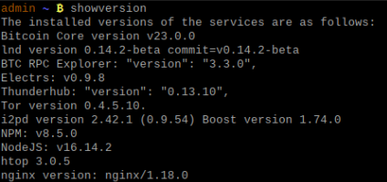

# Bonus guide: Aliases
{: .no_toc }

---

Aliases are shortcuts for commands that can save time and make it easier to execute common and frequent commands. The following aliases do not display information in a fancy way, but they make it easier to execute commands.

Difficulty: Easy
{: .label .label-green }

Status: Tested v3
{: .label .label-green }



---

Table of contents
{: .text-delta }

1. TOC
{:toc}

---

## Acknowledgments

The following list of aliases was derived from contributions by [RobClark56](https://github.com/robclark56) and [2FakTor](https://github.com/twofaktor).

---

## Set up aliases

* With user "admin", access to `home` folder and download the aliases list provided by Raspibolt community at Github. ⚠️ This command will automatically overwrite the previous file you downloaded.

  ```sh
  $ cd /home/admin
  $ wget https://raw.githubusercontent.com/raspibolt/raspibolt/master/resources/.bash_aliases -O .bash_aliases
  ```

* Inspect the list of aliases to make sure it does not do bad things and modify it with your personal aliases if you want. Exit with Ctrl-X

  ```sh
  $ nano .bash_aliases --linenumbers
  ```

* Execute a `source` command to register changes of the `.bash_aliases` file in the .bashrc file

  ```sh
  $ source /home/admin/.bashrc 
  ```

---

## Aliases in action

* Simply type "alias" to display all available aliases

  ```sh
  [...]
  alias enableallmain='sudo systemctl enable bitcoind electrs btcrpcexplorer lnd rtl scb-backup'
  alias enablebitcoind='sudo systemctl enable bitcoind'
  alias enablebtcrpcexplorer='sudo systemctl enable btcrpcexplorer'
  alias enablecircuitbreaker='sudo systemctl enable circuitbreaker'
  alias enablecln='sudo systemctl enable cln'
  alias enablefulcrum='sudo systemctl enable fulcrum'
  [...]
  ```

* Test some of the aliases to see if it has been installed properly

  ```sh
  $ showmainversion
  > The installed versions of the services are as follows:
  > Bitcoin Core version v23.0.0
  > lnd version 0.15.0-beta commit=v0.15.0-beta
  > BTC RPC Explorer: "version": "3.3.0",
  > Electrs: v0.9.8
  > RTL: "version": "0.12.3",
  > Tor version 0.4.5.10.
  > NPM: v8.5.0
  > NodeJS: v16.14.2
  > htop 3.0.5
  > lntop version v0.3.0
  > nginx version: nginx/1.18.0
  ```

  ```sh
  $ livehealth
  > Every 1.0s: vcgencmd measure_clock arm; vcgencmd measure_temp raspibolt: Tue Dec 14 15:00:21 2021
  > frequency(48)= 124121523
  > temp=37.0'C
  ```

---

## Uninstall

* To remove these special aliases, with user "admin", simply delete the `.bash_aliases` and execute a source command to register changes. The aliases will be gone with the next login.

  ```sh
  $ rm ~/.bash_aliases
  ```

* Execute a source command to register changes to the .bashrc file:

  ```sh
  $ source /home/admin/.bashrc 
  ```

<br /><br />

---

<< Back: [+ Raspberry Pi](index.md)
