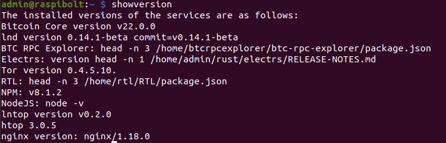

# Bonus guide: Aliases
{: .no_toc }

---

Aliases are shortcuts for commands that can save time and make it easier to execute common and frequent commands. The following aliases do not display information in a fancy way, but they make it easier to execute commands.

Difficulty: Easy
{: .label .label-green }

Status: Tested v3
{: .label .label-green }



---

Table of contents
{: .text-delta }

1. TOC
{:toc}

---

## Acknowledgments

The following list of aliases was derived from contributions by [RobClark56](https://github.com/robclark56){:target="_blank"} and `marcosdub`.

---

## Set up aliases

* With user "admin", create a `.bash_aliases` file in `nano`

  ```sh
  $ nano ~/.bash_aliases
  ```

* Paste the following lines in `nano`

  ```ini
  ##################
  # GENERAL STATUS #
  ##################

  alias livehealth='sudo watch -n 1 "vcgencmd measure_clock arm; vcgencmd measure_temp"'

  alias showversion='echo The installed versions of the services are as follows: ; \
    bitcoind --version ; \
    lnd --version ; \
    echo "BTC RPC Explorer: $(cat /home/btcrpcexplorer/btc-rpc-explorer/package.json 2>/dev/null | jq '.version' < /home/btcrpcexplorer/btc-rpc-explorer/package.json)" ; \
    echo "Electrs: version $(head -n 1 /home/admin/rust/electrs/RELEASE-NOTES.md)" ;
    tor --version ; \
    echo "RTL: $(cat /home/rtl/RTL/package.json 2>/dev/null | jq '.version' < /home/rtl/RTL/package.json)" ; \
    echo NPM: v`npm --version` ; \
    echo NodeJS: node -v ; \
    lntop --version ; \
    htop --version ; nginx -v'

  alias statuservices='echo The status of the services is as follows, press the space key to advance: ; \
    sudo systemctl status bitcoind lnd rtl electrs btcrpcexplorer tor ssh fail2ban ufw vncserver-x11-serviced'

  ##################
  # START SERVICES #
  ##################

  alias startbitcoind='sudo systemctl start bitcoind'
  alias startelectrs='sudo systemctl start electrs'
  alias startexplorer='sudo systemctl start btcrpcexplorer'
  alias startlnd='sudo systemctl start lnd'
  alias startrtl='sudo systemctl start rtl'

  ##################
  # SERVICE STATUS #
  ##################

  alias statusbitcoind='sudo systemctl status bitcoind'
  alias statuselectrs='sudo systemctl status electrs'
  alias statusexplorer='sudo systemctl status btcrpcexplorer'
  alias statuslnd='sudo systemctl status lnd'
  alias statusrtl='sudo systemctl status rtl'

  ##################
  # STOP SERVICES  #
  ##################

  alias stopbitcoind='sudo systemctl stop bitcoind'
  alias stopelectrs='sudo systemctl stop electrs'
  alias stopcexplorer='sudo systemctl stop btcrpcexplorer'
  alias stoplnd='sudo systemctl stop lnd'
  alias stoprtl='sudo systemctl stop rtl'

  ##################
  #  SERVICE LOGS  #
  ##################

  alias bitcoindlogs='sudo tail -f /mnt/ext/bitcoin/debug.log'
  alias electrslogs='sudo journalctl -f -u electrs'
  alias btcrpcexplorerlogs='sudo journalctl -f -u btcrpcexplorer'
  alias lndlogs='sudo journalctl -f -u lnd'
  alias rtllogs='sudo journalctl -f -u rtl'

  ##################
  #       LND      #
  ##################

  alias unlock='lncli unlock'
  alias newaddress='lncli newaddress p2wkh'
  alias txns='lncli listchaintxns'
  alias getinfo='lncli getinfo'
  alias walletbalance='lncli walletbalance'
  alias peers='lncli listpeers'
  alias channels='lncli listchannels'
  alias channelbalance='lncli channelbalance'
  alias pendingchannels='lncli pendingchannels'
  alias openchannel='lncli openchannel'
  alias connect='lncli connect'
  alias payinvoice='lncli payinvoice'
  alias addinvoice='lncli addinvoice'

  ##################
  # LND Watchtower #
  ##################

  alias wtclientinfo='lncli wtclient towers'
  alias wtserverinfo='lncli tower info'

  ```

* Execute a `source` command to register changes to the `.bash_aliases` file

  ```sh
  $ source ~/.bash_aliases
  ```

---

## Aliases in action

* Test some of the aliases to see if it has been installed properly

  ```sh
  $ livehealth
  > Every 1.0s: vcgencmd measure_clock arm; vcgencmd measure_temp raspibolt: Tue Dec 14 15:00:21 2021
  > frequency(48)= 124121523
  > temp=37.0'C
  ```

  ```sh
  $ showversion
  > The installed versions of the services are as follows:
  > Bitcoin Core version v22.0.0
  > lnd version 0.14.1-beta commit=v0.14.1-beta
  > BTC RPC Explorer: head -n 3 /home/btcrpcexplorer/btc-rpc-explorer/package.json
  > Electrs: version head -n 1 /home/admin/rust/electrs/RELEASE-NOTES.md
  > Tor version 0.4.5.10.
  > RTL: head -n 3 /home/rtl/RTL/package.json
  > NPM: v8.1.2
  > NodeJS: node -v
  > lntop version v0.2.0
  > htop 3.0.5
  > nginx version: nginx/1.18.0
  ```

---

## Uninstall

* To remove these special aliases, with user "admin", simply delete the `.bash_aliases`. The aliases will be gone with the next login.

  ```sh
  $ rm ~/.bash_aliases
  ```

<br /><br />

---

<< Back: [+ Raspberry Pi](index.md)
