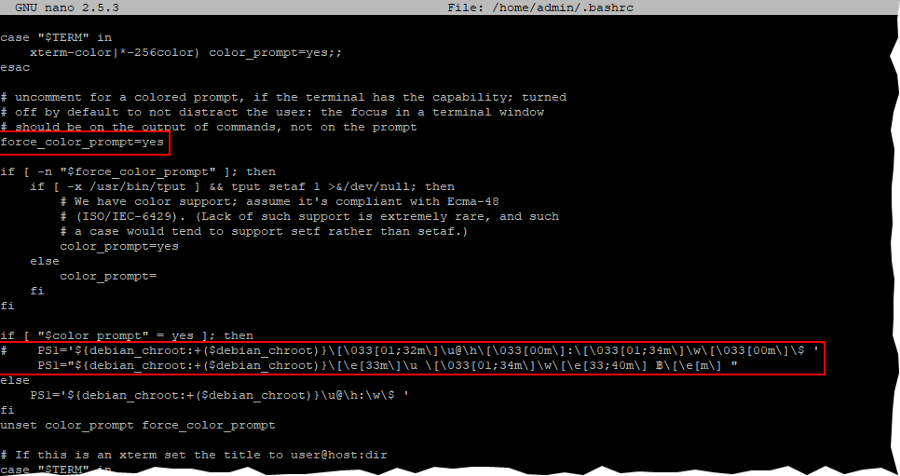
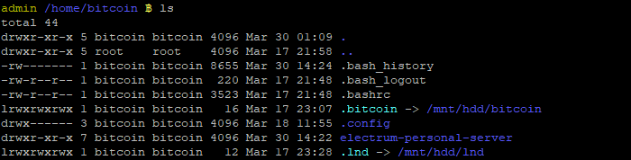

## Bonus guide: Pimp the command line
{: .no_toc }

Difficulty: Easy
{: .label .label-green }

Status: Tested v3
{: .label .label-green }

---

Table of contents
{: .text-delta }

1. TOC
{:toc}

---

### Command prompt

You can prettify your command prompt for each user by enabling color output and setting a custom prompt.

* Open and edit `.bashrc`  as shown below, save and exit

  ```sh
  $ nano /home/admin/.bashrc
  ```

  ```bash
  # enable color prompt (uncomment, if commented out)
  force_color_prompt=yes

  # pimp prompt (comment/replace the PS1 line)
  PS1="${debian_chroot:+($debian_chroot)}\[\e[33m\]\u \[\033[01;34m\]\w\[\e[33m\] ₿\[\e[m\] "

  # set "ls" to always use the -la option, to list details of all files (including hidden), as default
  # simply insert the following line at the end of the file, or replace existing "alias ls='ls --color=auto'" if already present in the "enable color support of ls" section
  alias ls='ls -la --color=always'
  ```



* Reload configuration

  ```sh
  $ source /home/admin/.bashrc
  ```



### Bash completion
As user “admin”, install bash completion scripts for Bitcoin Core and all Lightning projects. You then can complete partial commands by pressing the Tab key (e.g. bitcoin-cli getblockch [Tab] → bitcoin-cli getblockchaininfo )

  ```sh
  $ cd /tmp/
  $ wget https://raw.githubusercontent.com/bitcoin/bitcoin/master/contrib/completions/bash/bitcoin-cli.bash
  $ wget https://raw.githubusercontent.com/bitcoin/bitcoin/master/contrib/completions/bash/bitcoin-tx.bash
  $ wget https://raw.githubusercontent.com/bitcoin/bitcoin/master/contrib/completions/bash/bitcoind.bash
  $ wget https://raw.githubusercontent.com/lightningnetwork/lnd/master/contrib/lncli.bash-completion
  $ sudo mv bitcoin-cli.bash bitcoin-tx.bash bitcoind.bash lncli.bash-completion /etc/bash_completion.d/
  ```

Bash completion will be enabled after your next login.

---

<< Back: [+ Raspberry Pi](index.md)
