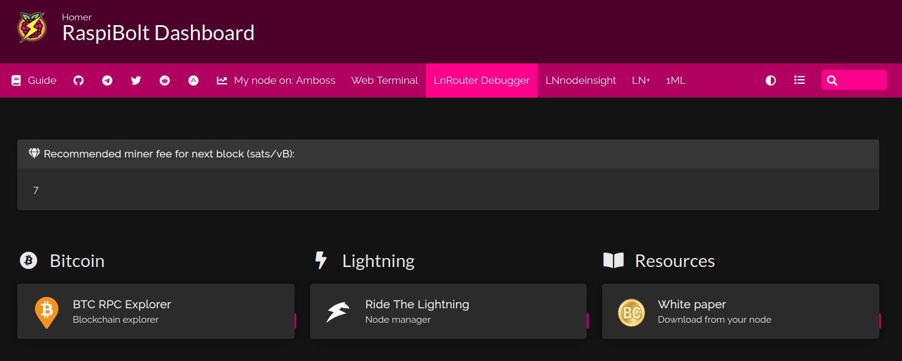

# Bonus guide: Homer
{: .no_toc }

---

We set up [Homer](https://github.com/bastienwirtz/homer#readme){:target="_blank"}, a simple browser-based dashboard for quick access to all our self-hosted web services and other useful links for a lighnting node operator. The dashboard can be easily edited from a YAML configuration file. 

Difficulty: Easy
{: .label .label-green }

Status: Tested v3
{: .label .label-green }



---

Table of contents
{: .text-delta }

1. TOC
{:toc}

---

## Introduction

The dashboard contains the following items that you can edit at any time:

* a title and the RaspiBolt logo

* a top banner containing clearnet external links to various useful websites:
  * *the RaspiBolt guide*
  * *the various RaspiBolt community groups (Telegram, Reddit, Twitter, Amboss)*
  * *your node profile on several lightning network explorers (Amboss, Web Terminal, LnRouter Terminal Debugger, LNnodeinsight and 1ML)*

* a welcome message displaying the next block miner fee from the Mempool blockchain explorer public API. It refreshes every 10 seconds.

* links to your self-hosted web services, organized by categories (e.g., "Bitcoin", "Lightning", "Resources"). We will create a link for the BTC RPC Explorer web app (under "Bitcoin", one for the Ride The Lightning web app (under "Lightning") and one to dowload the white paper directly from your blockchain via a BTC RPC Explorer function (under "Resources").

This guide assumes that you have followed the main RaspiBolt guide and installed both [BTC RPC Explorer](https://raspibolt.org/guide/bitcoin/blockchain-explorer.html) and [Ride The Lightning](https://raspibolt.org/guide/lightning/web-app.html). If not, you could edit the configuration file to remove their links from the dashboard.

---

## Preparations

### Firewall

* Configure the UFW firewall to allow incoming HTTPS requests

  ```sh
  $ sudo ufw allow 4091/tcp comment 'allow Homer SSL'
  $ sudo ufw status
  ```

---

## Homer

### Installation

* Create the "homer" service user, create the data directory and open a new session 

  ```sh
  $ sudo adduser --disabled-password --gecos "" homer
  $ sudo mkdir /data/homer
  $ sudo chown homer:homer /data/homer
  $ sudo su - homer
  ```

* Retrieve the source code repository and install Homer

  ```sh
  $ git clone https://github.com/bastienwirtz/homer.git
  $ cd homer
  $ npm install
  $ npm run build
  ```

### Logos

Homer allows for the use of icons and images. We'll import a few logos to make the dashboard look nicer.

* Still with user "Homer", create a folder that will contain all the logos in the Homer data folder

  ```sh
  $ mkdir /data/homer/tools
  $ cd /data/homer/tools
  ```

* Download the RaspiBolt, BTC RPC Explorer and Ride The Lightning logos from a [GitHub repository](https://github.com/VajraOfIndra/awesome-bitcoin-logos) containing a collection of Bitcoin and Lightning apps logos. 
Then check that all the logos are in the folder.

  ```sh
  $ wget https://raw.githubusercontent.com/VajraOfIndra/awesome-bitcoin-logos/main/png/raspibolt3.png
  $ wget https://raw.githubusercontent.com/VajraOfIndra/awesome-bitcoin-logos/main/png/btcrpcexplorer.png
  $ wget https://raw.githubusercontent.com/VajraOfIndra/awesome-bitcoin-logos/main/png/rtl.png
  $ wget https://raw.githubusercontent.com/VajraOfIndra/awesome-bitcoin-logos/main/png/old-bitcoin.png
  $ ls -la
  ```

* Exit the "homer" user

  ```sh
  $ exit
  ```

### Website data folder

The build command generated all the required files for the Homer website. We just need to move it to the proper location expected by the nginx web server.

* Move the distributable output into a nginx website data folder

  ```sh
  $ sudo rsync -av --delete /home/homer/homer/dist/ /var/www/homer/
  ```

By default, the logos for Homer are located in the `/var/www/homer/assets/tools` folder. 
However, if you want to re-install Homer for whatever reason, you will have to re-download and re-move all the logos. Instead, let's create a symlink to our folder containing all the logos.

* Delete the existing tools directory and replace it with a symlink to the logos folder

  ```sh
  $ sudo rm -r /var/www/homer/assets/tools
  $ sudo ln -s /data/homer/tools /var/www/homer/assets
  ```

### nginx

* Create a nginx configuration file for the Homer website with a HTTPS server listening on port 4091

  ```sh 
  $ sudo nano /etc/nginx/sites-available/homer-ssl.conf
  ```

  ```ini
  ## homer-ssl.conf
  
  
  server {
      listen 4091 ssl;
      listen [::]:4091 ssl;
      server_name _;
  
      ssl_certificate /etc/ssl/certs/nginx-selfsigned.crt;
      ssl_certificate_key /etc/ssl/private/nginx-selfsigned.key;
      ssl_session_timeout 4h;
      ssl_protocols TLSv1.3;
      ssl_prefer_server_ciphers on;

      access_log /var/log/nginx/access_homer.log;
      error_log /var/log/nginx/error_homer.log;
 
      root /var/www/homer;
      index index.html;
  
  
  }
  ```

* Create a symlink in the sites-enabled directory

  ```sh
  $ sudo ln -sf /etc/nginx/sites-available/homer-ssl.conf /etc/nginx/sites-enabled/
  ```

* Open the existing nginx configuration file

  ```sh
  $ sudo nano /etc/nginx/nginx.conf
  ```

* Paste the following web server configuration lines between the "events" and "streams" contexts. Note: Skip this step if you have already installed a program that requires a nginx http server (e.g., [Mempool](../bitcoin/mempool.md)).

  ```sh
  http {

          ##
          # Basic Settings
          ##

          sendfile on;
          tcp_nopush on;
          types_hash_max_size 2048;
          server_tokens off;

          # server_names_hash_bucket_size 64;
          # server_name_in_redirect off;

          include /etc/nginx/mime.types;
          default_type application/octet-stream;

          ##
          # SSL Settings
          ##

          ssl_protocols TLSv1.3;
          ssl_prefer_server_ciphers on;

          ##
          # Logging Settings
          ##

          access_log /var/log/nginx/access.log;
          error_log /var/log/nginx/error.log;

          ##
          # Gzip Settings
          ##
 
          gzip on;
 
          # gzip_vary on;
          # gzip_proxied any;
          # gzip_comp_level 6;
          # gzip_buffers 16 8k;
          # gzip_http_version 1.1;
          # gzip_types text/plain text/css application/json application/javascript text/xml application/xml application/xml+rss text/javascript;

          ##
          # Virtual Host Configs
          ##

          include /etc/nginx/conf.d/*.conf;
          include /etc/nginx/sites-enabled/*;
  }

  ```

A sample configuration file is available at `/home/homer/homer/dist/assets/config.yml.dist`. We will create a configuration file derived from this default configuration but tailored to the RaspiBolt.

* Create a new configuration file in the Homer data directory and paste the following configuration settings and change the following items:
  * In the last six links in the "Optional navbar" section, in the `name:` entry, you can replace "My node" by your node alias
  * Still in these last six links, in the `url:` entry, replace `<node_pubkey>` with your own node pubkey
  * **Trick:** To easily find and replace all the occurence of `<node_pubkey>` in nano, after pasting the lines below:
    * Press `Ctrl`+`w` and then `Ctrl`+`r`
    * In the prompt, type or paste `<node_pubkey>` and press `Enter`; then paste your node pubkey and press `Enter`.
    * Nano will highlight the first occurence of the search term. Press `y` to replace it with your node pubkey
    * Nano will then move to the next occurence. Repeat these steps until all occurences have been found and replaced!

  ```sh
  $ sudo nano /data/homer/config.yml
  ```

  ```ini
  ################################
  # HOMEPAGE CONFIGURATION       #
  ################################
  title: "RaspiBolt Web Services"
  subtitle: "Homer dashboard"
  logo: "assets/tools/raspibolt3.png"
  
  header: true
  footer: '<p><em>The Times 03/Jan/2009 Chancellor on brink of second bailout for banks.</em> (Bitcoin genesis block)</p>'
  columns: 3
  connectivityCheck: true

  ################################
  # Optional theme customization #
  ################################
  theme: default
  colors:
    light:
      highlight-primary: "#3367d6"
      highlight-secondary: "#4285f4"
      highlight-hover: "#5a95f5"
      background: "#f5f5f5"
      card-background: "#ffffff"
      text: "#363636"
      text-header: "#ffffff"
      text-title: "#303030"
      text-subtitle: "#424242"
      card-shadow: rgba(0, 0, 0, 0.1)
      link: "#3273dc"
      link-hover: "#363636"
    dark:
      highlight-primary: "#4c0029"
      highlight-secondary: "#b20060"
      highlight-hover: "#ff008a"
      background: "#131313"
      card-background: "#2b2b2b"
      text: "#eaeaea"
      text-header: "#ffffff"
      text-title: "#fafafa"
      text-subtitle: "#f5f5f5"
      card-shadow: rgba(0, 0, 0, 0.4)
      link: "#ff008a"
      link-hover: "#fffa1b"

  ################################
  # Optional message             #
  ################################
  message:
    url: https://mempool.space/api/v1/fees/recommended
    mapping:
      content: 'fastestFee'
    refreshInterval: 10000
    style: "is-dark"
    title: "Recommended miner fee for next block (sats/vB):"
    icon: "fas fa-gem"
    content: "Oops... something's not working, I can't fetch that information!"
  
  ################################
  # Optional navbar              #
  ################################  
  links:
    - name: "Guide"
      icon: "fas fa-book"
      url: "https://www.raspibolt.org/"
      target: "_blank"
    - name: ""
      icon: "fab fa-github"
      url: "https://github.com/raspibolt/raspibolt"
      target: "_blank"
    - name: ""
      icon: "fab fa-telegram"
      url: "https://t.me/raspibolt/"
      target: "_blank"
    - name: ""
      icon: "fab fa-twitter"
      url: "https://twitter.com/raspibolt"
      target: "_blank"
    - name: ""
      icon: "fab fa-reddit"
      url: "https://www.reddit.com/r/raspibolt/"
      target: "_blank"
    - name: ""
      icon: "fab fa-adn"
      url: "https://www.amboss.space/community/2f1891ba-e145-4297-a1ed-70ab4b6dcc3a"
      target: "_blank"
    - name: "My node on: Amboss"
      icon: "fas fa-chart-line"
      url: "https://www.amboss.space/node/<node_pubkey>"
      target: "_blank"
    - name: "Web Terminal"
      url: "https://terminal.lightning.engineering/#/<node_pubkey>"
      target: "_blank"
    - name: "LnRouter Debugger"
      url: "https://lnrouter.app/scores/terminal?id=<node_pubkey>"
      target: "_blank"
    - name: "LNnodeinsight"
      url: "https://lnnodeinsight.com/?/<node_pubkey>"
      target: "_blank"
    - name: "LN+"
      url: "https://lightningnetwork.plus/nodes/<node_pubkey>"
      target: "_blank"
    - name: "1ML"
      url: "https://1ml.com/node/<node_pubkey>"
      target: "_blank"


  ################################
  # Services                     #
  ################################
  # First level array represents a group. Second level arrays represent items.
  services:
    - name: "Bitcoin"
      icon: "fab fa-bitcoin"
      items:
        - name: "BTC RPC Explorer"
          logo: "assets/tools/btcrpcexplorer.png"
          subtitle: "Blockchain explorer"
          tag: "app"
          url: "https://raspibolt.local:4000/"
          target: "_blank"
        #- name: "Mempool"
        #  logo: "assets/tools/mempool.png"
        #  subtitle: "Mempool visualizer"
        #  tag: "app"
        #  url: "https://raspibolt.local:4081/"
        #  target: "_blank"
    - name: "Lightning"
      icon: "fas fa-bolt"
      items:
        - name: "Ride The Lightning"
          logo: "assets/tools/rtl.png"
          subtitle: "Node manager"
          tag: "app"
          url: "https://raspibolt.local:4001/rtl/login"
          target: "_blank"
    - name: "Resources"
      icon: "fas fa-book-open"
      items:
        - name: "White paper"
          logo: "assets/tools/old-bitcoin.png"
          subtitle: "Download from your node"
          tag: "app"
          url: "https://raspibolt.local:4000/bitcoin-whitepaper"
          target: "_blank"
  ```

🔍 *Note:* Your self-hosted web service links are configured in the last "Services" section. The default configuration enables the links for BTC RPC Explorer in the "Bitcoin" group and Ride The Lightning in the "Lightning" group. To add more web services, simply add a new item under the relevant group. An example is provided with [Mempool](../bitcoin/mempool.md) (to enable it, simply uncomment the 6 lines of the Mempool item). You can also add more groups/columns by changing the value of the `columns:` variable, at the top of the configuration file.

* Create a symlink to the configuration file and change its ownshership to the "www-data" user

  ```sh
  $ sudo ln -s /data/homer/config.yml /var/www/homer/assets/config.yml
  ```
  
* Change the ownership of the Homer web folder to the “www-data” user

  ```sh
  $ sudo chown -hR www-data:www-data /var/www/homer
  ```

* Test and reload nginx configuration

  ```sh
  $ sudo nginx -t
  > nginx: the configuration file /etc/nginx/nginx.conf syntax is ok
  > nginx: configuration file /etc/nginx/nginx.conf test is successful
  $ sudo systemctl restart nginx
  ```

### First start

* Test starting Homer manually first to make sure it works.

  ```sh
  $ sudo su - homer
  $ cd homer
  $ npm run serve
  ```
  
* Wait a couple of minutes for the server to start, until the following message is displayed

  ```sh
  > [...]
  >   App running at:
  >   - Local:   http://localhost:8081 
  >   - Network: http://192.168.0.171:8081
  ```

* Now point your browser to the secure access point provided by the nginx server, for example https://raspibolt.local:4091 (or your node's IP address, e.g. https://192.168.0.20:4091).  

Your browser will display a warning, because we use a self-signed SSL certificate. There’s nothing we can do about that, because we would need a proper domain name (e.g. https://yournode.com) to get an official certificate which browsers recognize. Click on “Advanced” and proceed to the Homer dashboard interface.

* If everything worked, stop Homer in the terminal with `Ctrl`+`C` and exit the "homer" user session.

  ```sh
  $ exit
  ```

### Autostart on boot

Now we’ll make sure Homer starts as a service on the Raspberry Pi so it’s always running. In order to do that, we create a systemd unit that starts the service on boot directly.

* As user “admin”, create the service file.

  ```sh
  $ sudo nano /etc/systemd/system/homer.service
  ```

  ```ini
  # RaspiBolt: systemd unit for Homer
  # /etc/systemd/system/homer.service
  
  [Unit]
  Description=Homer
  After=network.target
  
  [Service]
  WorkingDirectory=/home/homer/homer
  ExecStart=/usr/bin/npm run serve
  User=homer
  
  Restart=always
  RestartSec=30
  
  [Install]
  WantedBy=multi-user.target
  ```

* Enable the service, start it and check log logging output.

  ```sh
  $ sudo systemctl enable homer
  $ sudo systemctl start homer
  $ sudo journalctl -f -u homer
  > [...]
  > Apr 06 00:28:21 raspibolt npm[20097]:   App running at:
  > Apr 06 00:28:21 raspibolt npm[20097]:   - Local:   http://localhost:8081
  > Apr 06 00:28:21 raspibolt npm[20097]:   - Network: http://192.168.X.XXX:8081

  ```

* Wait a few minutes for the server to start and for the logs to show that the app is running. Then, point your browser to the secure access point provided by the nginx server, for example https://raspibolt.local:4091 (or your node's IP address, e.g. https://192.168.0.20:4091).  

You're set! You can now use the dashboard to have a quick access to your self-hosted web services and some external websites. If you have installed bonus programs like [Mempool](../bitcoin/mempool.md), [ThunderHub](../lightning/thunderhub.md), [LNBits](../lightning/lnbits.md), Bitfeed, LNDg, Lightning Terminal etc, you can add them to your dashboard.

---

## Personalize your homepage

You can easily personalize your Homer homepage by editing the YAML configuration file.

* Edit the configuration file

  ```sh
  $ sudo nano /data/homer/config.yml
  ```

* Once you finish editing the file, save and close and then refresh your Homer webpage.

### Adding a new group

This guide set three groups: "Bitcoin", "Lightning" and "Resources". You can add as many groups as you want. 

* If you want to add a new group (e.g., a "Sysadmin" group), go to the "Services" section at the end of the file 
* Add the following lines under the `Services:` entry:
  
  ```ini
    - name: "Sysadmin"
      icon: "fab fa-wave-pulse"
      items:
  ```

**Note:** Make sure that there are two spaces in front of the `-` in the first line. Homer will not load is there are some alignment issues.

You can now add one or more items (e.g., web services) to your new group.

Since you created a new group, you might want to display it in new column.

* In the first section "Homepage configuratioN", change the column value to the desired number of columns

  ```ini
  columns: 4
  ```

### Adding a web service button

If you want to add a new web service button to one of your existing group, add some item configuration lines under the `items:` entry. 

* For example if you want to add the Mempool web service under the "Bitcoin" group, add the following lines (the `[...]` and the lines above represent the existing configuration lines in the file, do NOT copy/paste)
  
  ```ini
    - name: "Bitcoin"
      icon: "fab fa-bitcoin"
      items:
        [...]
        - name: "Mempool"
          logo: "assets/tools/mempool.png"
          subtitle: "Mempool visualizer"
          tag: "app"
          url: "https://raspibolt.local:4081/"
          target: "_blank"
  ```

### Using logos

In general if you want to use logos in Homer, you simply need to use the `logo:` entry and paste the path of the PNG between double-quotes as value.

You can find a collection of Bitcoin and Lightning logos in the following GitHub repository: [Awesome Bitcoin Logos](https://github.com/VajraOfIndra/awesome-bitcoin-logos/#awesome-bitcoin-logos=){:target="_blank"}


* Click on the logo you would like to use
* Then click on the "Download" button (top right banner just above the logo image)
* Copy the URL to the clipboard, e.g., https://raw...mempool.png
* With user "homer" on your node, move to the logo folder and download the file by pasting the URL after `wget`

  ```sh
  $ sudo su - homer
  $ cd /data/homer/tools
  $ wget https://raw...mempool.png
  $ ls -la
  $ exit
  ```

### Using icons

In general if you want to use logos in Homer, you simply need to use the `icon:` entry in place of `logo:` and then use a Font Awesome icon code between qdouble-quotes value.

You can search for icons from the [Font Awesome website](https://fontawesome.com/search){:target="_blank"}.

* Search for an icon with a keyword in the search box; e.g., "coin"
* Click on an icon you want to use; e.g., "coins"
* Select the style you prefer (e.g. bold, thin etc)
* In the HTML code snippet, make a note of the green text; e.g, `fa-solid fa-coins`
* Paste this code snippet, between double quotes, as value after `icon:`

**Notes:**
* Not all Font Awesome icons are accepted by Homer. 
* You can replace `fa-solid` by `fas`; `fa-brands` by `fab` etc.

### More

Read about styling options on the [Bulma CSS framework webpage](https://bulma.io/documentation/components/message/#colors){:target="_blank"}.

You can edit many more features such as the API-based welcome message, the top banner clearnet links, the footer and many more things. Check the full configuration guidelines in the [Homer repository](https://github.com/bastienwirtz/homer/blob/main/docs/configuration.md){:target="_blank"}.

---

## For the future: Homer upgrade

Updating to a [new release](https://github.com/bastienwirtz/homer/releases){:target="_blank"} is straight-forward. Make sure to read the release notes first.

* From user “admin”, stop the service and open a "homer" user session.

  ```sh
  $ sudo systemctl stop homer
  $ sudo su - homer
  ```

* Fetch the latest GitHub repository information (v9.99.9 in this example), and update:

  ```sh
  $ cd homer
  $ git fetch
  $ git tag | sort --version-sort | tail -n 1
  > v9.99.9
  $ git checkout v9.99.9
  $ npm install
  $ npm run build
  $ exit
  ```
  
* With the "admin" user, copy over the updated distributable output and re-create the symlink to the configuration file

  ```sh
  $ sudo rsync -av --delete /home/homer/homer/dist/ /var/www/homer/
  $ sudo ln -s /data/homer/config.yml /var/www/homer/assets/config.yml
  $ sudo ln -s /data/homer/tools /var/www/homer/assets/
  $ sudo chown -R www-data:www-data /var/www/homer
  ```

* Start the service again.

  ```sh
  $ sudo systemctl start homer
  $ sudo journalctl -f -u homer
  ```

---

## Uninstall

* Stop the systemd service and delete the configuration file

  ```sh
  $ sudo systemctl stop homer
  $ sudo systemctl disable homer
  $ sudo rm /etc/systemd/system/homer.service
  ```

* Display the UFW firewall rules and notes the numbers of the rules for Homer (e.g., X and Y below)

  ```sh
  $ sudo ufw status numbered
  > [...]
  > [X] 4091/tcp                   ALLOW IN    Anywhere                   # allow Homer SSL
  > [...]
  > [Y] 4091/tcp (v6)              ALLOW IN    Anywhere (v6)              # allow Homer SSL
  ```

* Delete the two Homer rules (check that the rule to be deleted is the correct one and type “y” and “Enter” when prompted)

  ```sh
  $ sudo ufw delete Y
  $ sudo ufw delete X 
  ```

* Delete the nginx website directory, the web server configuration file and its symlink

  ```sh
  $ sudo rm -r /var/www/homer
  $ sudo rm /etc/nginx/sites-available/homer-ssl.conf
  $ sudo rm /etc/nginx/sites-enabled/homer-ssl.conf
  ```

* Delete (or comment out) the web server context from the main nginx configuration file. Note: Skip this step if you run another program that depends on the nginx web server (e.g., [Mempool](../bitcoin/mempool.md)).

  ```sh
  $ sudo nano /etc/nginx/nginx.conf
  ```
  
  ```ini
  #http {
  
        ##
        # Basic Settings
        ##

        #sendfile on;
        # [...]
  
  #}

* Test and reload nginx configuration

  ```sh
  $ sudo nginx -t
  > nginx: the configuration file /etc/nginx/nginx.conf syntax is ok
  > nginx: configuration file /etc/nginx/nginx.conf test is successful
  $ sudo systemctl restart nginx
  ```

* Delete the "homer" user. Do not worry about the `userdel: mempool mail spool (/var/mail/homer) not found`.

  ```sh
  $ sudo su -
  $ userdel -r homer
  > userdel: homer mail spool (/var/mail/homer) not found
  ```

* (Optional) Delete the data folder that contains the YAML configuration file and the logos picture files for the Homer dashboard. If you plan to reinstall Homer in the future, you could keep this data folder to not lose your configuration settings.

  ```sh
  $ sudo rm -r /data/homer
  ```

<br /><br />

------

<< Back: [+ Raspberry Pi](index.md)


