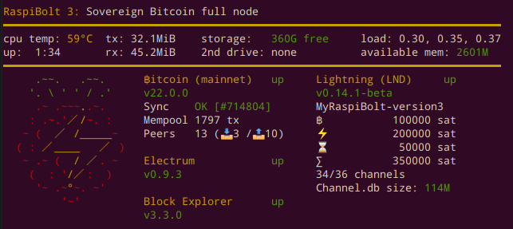

# Bonus guide: System overview
{: .no_toc }

To get a quick overview of the system status, you can use [a shell script](https://github.com/raspibolt/raspibolt-pulse){:target="_blank"} that gathers the most relevant data.
You can configure it to be shown on each login.

Difficulty: Easy
{: .label .label-green }

Status: Tested v3
{: .label .label-green }



---

## Installation

This script can be run by user "admin" without root privileges, but you should still check it yourself.

* Install necessary software packages

  ```sh
  $ sudo apt install jq net-tools netcat
  ```

* Download the script. 

  ```sh
  $ cd /tmp/
  $ git clone https://github.com/raspibolt/raspibolt-pulse
  ```

* Inspect the scripts to make sure it does not do bad things.
  Exit with `Ctrl`-`X`

  ```sh
  $ cd /tmp/raspibolt-pulse
  $ nano *.sh --linenumbers
  ```
  
* Install the script and make it executable

  ```sh
  $ sudo chmod +x *.sh
  $ sudo cp *.sh /usr/local/bin
  $ sudo mv /usr/local/bin/raspibolt-pulse-switch.sh /usr/local/bin/raspibolt
  ```

* You can now run the script with user "admin"

  ```sh
  $ raspibolt
  ```

---

## Show on login (optional)

You can run the welcome script automatically every time you log in.
If you're in a hurry, you can always press `Ctrl`-`C` to skip the script.

* As user "admin", add the `raspibolt` command to the end of your `.bashrc` file

  ```sh
  $ echo "raspibolt" >> ~/.bashrc
  ```

In case you are upgrading from a previous version of the script, you need to disable the old script to avoid seeing both on startup.
In earlier versions, the script was executed by the "Message of the day" mechanism.

* To get rid of all MOTD output, simply rename the following directory:

  ```sh
  $ sudo mv /etc/update-motd.d /etc/update-motd.d.backup
  ```
## Uninstall
```sh
sudo rm /usr/local/bin/raspibolt
 ```
```sh
rm -rf /tmp/raspibolt-pulse
```
Locate the line you added to your ~/.bashrc file that displays “raspibolt” on login:
Delete the line containing "raspibolt"
```sh
nano ~/.bashrc
 ```

<br /><br />

------

<< Back: [+ Raspberry Pi](index.md)
