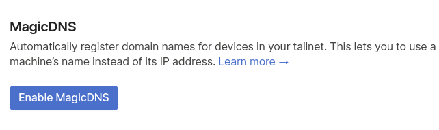
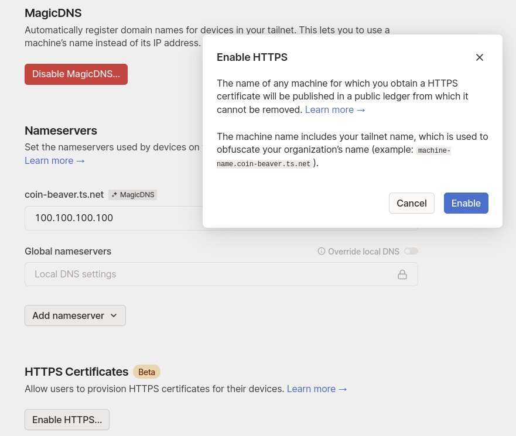

# Bonus guide: Tailscale
{: .no_toc }

Difficulty: Intermediate
{: .label .label-yellow }

Status: Tested v3 
{: .label .label-green }

We set up [Tailscale](https://tailscale.com/download/linux/rpi-bullseye){:target="blank"}, tailscale lets you easily manage access to private resources, quickly SSH into devices on your network, and work securely from anywhere in the world.

---

## Table of contents
{: .no_toc .text-delta }

1. TOC
{:toc}

---

### Introduction
[Tailscale](https://tailscale.com) tailscale lets you easily manage access to private resources, quickly SSH into devices on your network, and work securely from anywhere in the world.

---

## Dependencies

### apt-transport-https

To run tailscale, we need to install apt-transport-https

* With user "admin", let's install apt-transport-https.

```sh
  $ sudo apt-get update
  $ sudo apt-get install apt-transport-https
```

## Install Tailscale
* Add Tailscale’s package signing key and repository

```sh
  $ curl -fsSL https://pkgs.tailscale.com/stable/raspbian/bullseye.noarmor.gpg | sudo tee /usr/share/keyrings/tailscale-archive-keyring.gpg > /dev/null
  $ curl -fsSL https://pkgs.tailscale.com/stable/raspbian/bullseye.tailscale-keyring.list | sudo tee /etc/apt/sources.list.d/tailscale.list
```

* Install Tailscale

```sh
  $ sudo apt-get update
  $ sudo apt-get install tailscale
```

* Connect your machine to your Tailscale network and authenticate in your browser

```sh
  $ sudo tailscale up
```

* You’re connected! You can find your Tailscale IPv4 address by running

```sh
  $ tailscale ip -4
```

## Configure dns and certificate

* Go to the dns settings in the tailscale admin [panel](https://login.tailscale.com/admin/dns){:target="_blank"}

* Enable Magic DNS and HTTPS Certificates
  
  

  

* Generate your ssl certificate
  
```sh
  $ sudo tailscale cert machine-name.your-tailscale-domain.ts.net
```

* Move the certificates to /etc/ssl folder
  
```sh
  $ sudo mv machine-name.your-tailscale-domain.ts.net.key /etc/ssl/private/machine-name.your-tailscale-domain.ts.net.key
  $ sudo mv machine-name.your-tailscale-domain.ts.net.crt /etc/ssl/certs/machine-name.your-tailscale-domain.ts.net.crt
```

* Edit your nginx config
  
```sh
  $ sudo nano /etc/nginx/nginx.conf
```

* Replace nginx-selfsigned .crt and .key with machine-name.your-tailscale-domain.ts.net

```sh
  ssl_certificate /etc/ssl/certs/machine-name.your-tailscale-domain.ts.net.crt;
  ssl_certificate_key /etc/ssl/private/machine-name.your-tailscale-domain.ts.net.key;
```

### Access your node

* Instead of using https://raspibolt.local or your local ip address you can use https://machine-name.your-tailscale-domain.ts.net or the external ip from the tailscale vpn

```sh
  $ tailscale ip -4
```

* to access RTL for example you would use https://machine-name.your-tailscale-domain.ts.net:4001

* to access zeus with tailscale you need to change from onion address to the tailscale address

```sh
  $ lndconnect --host=machine-name.your-tailscale-domain.ts.net --port=8080
``` 

### For the future: Tailscale upgrade

* As “admin” user, run:

```sh
 $ sudo apt-get update
 $ sudo apt-get install tailscale
```

### Uninstall Tailscale

* Uninstall tailscale package

```sh
 $ sudo apt-get remove tailscale
```

* Rename the certificate in nginx.conf

```sh
  $ sudo nano /etc/nginx/nginx.conf
```

```sh
  ssl_certificate /etc/ssl/certs/nginx-selfsigned.crt;
  ssl_certificate_key /etc/ssl/private/nginx-selfsigned.key;
```