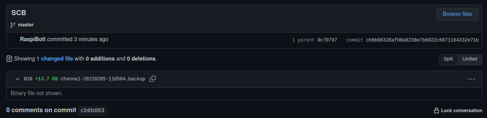

<!-- markdownlint-disable MD014 MD022 MD025 MD033 MD040 -->
# Channel backup
{: .no_toc }

We set up a local or remote "Static Channel Backup" for Lightning. A monitoring script keeps it up-to-date to enable the recovery of your Lightning funds in case of hardware failure.



---

## Table of contents
{: .no_toc .text-delta }

1. TOC
{:toc}

---

## Why are Lightning channel backups important?

The Static Channels Backup (SCB) is a feature of LND that allows for the on-chain recovery of lightning channel balances in the case of a bricked node. Despite its name, it does not allow the recovery of your LN channels but increases the chance that you'll recover all (or most) of your off-chain (local) balances.

The SCB contains all the necessary channel information used for the recovery process called Data Loss Protection (DLP). It is a safe backup mechanism with no risk of provoking penalty transactions that could lead to losing channel balances. The SCB contains all necessary peer and channel information, allowing LND to send a request to force-close the channel on their end to all your previous online peers. Without this method, you would need to contact your peers manually or wait for them to force-close on their own eventually.

This SCB-based recovery method has several consequences worth bearing in mind:

* This method relies on the goodwill of the peer: a malicious peer could refuse to force-close the channel, and the funds would remain locked up.

* Recovery only works with online peers: LND cannot send a request to force-close the channel if a peer is offline. Therefore, the funds in that channel will remain locked up until this peer comes back online, or possibly forever if that peer doesn't come back.

* The backup needs to be up-to-date: Since LND needs to know about your peers and channels, the SCB needs to be updated every time you open a new channel.

You need to set up an automated SCB update mechanism that:

1. Creates or updates your SCB file each time you open a channel (or close one, although this is less important)
1. Stores the SCB file to a different backup location to ensure that it is available in case of a failing SSD.

You can read more about SCBs in [this section of 'Mastering the Lighning Network'](https://github.com/lnbook/lnbook/blob/ec806916edd6f4d1b2f9da2fef08684f80acb671/05_node_operations.asciidoc#node-and-channel-backups){:target="_blank"}.

---

## Choose your preferred backup method(s)

This guide covers two automated backup methods:

* **LOCAL**: store the backup on a USB thumbdrive or microSD card plugged into your Pi
* **REMOTE**: send the encrypted backup to a private GitHub repository

| Method      | Requires hardware | Requires GitHub account | Protects against                       | Relies on 3rd-party |
| :---------: | :---------------: |:----------------------: |:-------------------------------------: |:------------------: |
| LOCAL       | YES               | NO                      | Drive failure only                     |NO                   |
| REMOTE      | NO                | YES                     | Drive failure & widespread node damage |YES                  |

We recommend to use both methods, but you can choose either one of them, depending on your own requirements and preferences. Whatever method you choose:

1. follow the "Preparations" section first, then
1. follow the optional local or/and remote backup sections.
1. Finally, follow the "Test" section that works for whatever method you've chosen.

---

## Preparations

We prepare a shell script that automatically updates the LND SCB file on a change in your backup location(s).

### Check SCB file location

By default, LND saves the SCB file here: `~/.lnd/data/chain/bitcoin/mainnet/channel.backup`. Ensure that the `lnd.conf` does not contain the `backupfilepath` option that modifies the backup location (as was used in a previous version of the RaspiBolt v3).

* With the "admin" user, check that your `lnd.conf` file does not contain this line. If so, delete it or comment it out and restart LND.

  ```sh
  $ sudo nano /data/lnd/lnd.conf
  ```

  ```ini
  #backupfilepath=/data/lnd-backup/channel.backup
  ```

  ```sh
  $ sudo systemctl restart lnd
  ```

### Install inotify-tools

Installing `inotify-tools` allows us to use `inotify`, an application that monitors files and directories for changes.

We will use it to monitor the `channel.backup` file and detect updates by LND each time a channel is opened or closed.

* Install `inotify-tools`

  ```sh
  $ sudo apt install inotify-tools
  ```

### Create script

We create a shell script to monitor `channel.backup` and make a copy to our backup locations if it changes.

* Create a new shell script file

  ```sh
  $ sudo nano /usr/local/bin/scb-backup
  ```

* Check the following lines of code and paste them into the text editor. By default, both local and remote backup methods are disabled. We will enable one or both of them in the next sections, depending on your preferences. Save and exit.

  ```ini
  #!/bin/bash

  # Safety bash script options
  # -e causes a bash script to exit immediately when a command fails
  # -u causes the bash shell to treat unset variables as an error and exit immediately.
  set -eu

  # The script waits for a change in /data/lnd/data/chain/bitcoin/mainnet/channel.backup.
  # When a change happens, it creates a backup of the file locally
  #   on a storage device and/or remotely in a GitHub repo

  # By default, both methods are used. If you do NOT want to use one of the
  #   method, replace "true" by "false" in the two variables below:
  LOCAL_BACKUP_ENABLED=false
  REMOTE_BACKUP_ENABLED=false

  # Locations of source SCB file and the backup target directories (local and remote)
  SCB_SOURCE_FILE="/data/lnd/data/chain/bitcoin/mainnet/channel.backup"
  LOCAL_BACKUP_DIR="/mnt/static-channel-backup-external"
  REMOTE_BACKUP_DIR="/data/lnd/remote-lnd-backup"

  # Local backup function
  run_local_backup_on_change () {
    echo "Copying backup file to local storage device..."
    echo "$1"
    cp "$SCB_SOURCE_FILE" "$1"
    echo "Success! The file is now locally backed up!"
  }

  # Remote backup function
  run_remote_backup_on_change () {
    echo "Entering Git repository..."
    cd $REMOTE_BACKUP_DIR || exit
    echo "Making a timestamped copy of channel.backup..."
    echo "$1"
    cp "$SCB_SOURCE_FILE" "$1"
    echo "Committing changes and adding a message"
    git add .
    git commit -m "Static Channel Backup $(date +"%Y%m%d-%H%M%S")"
    echo "Pushing changes to remote repository..."
    git push --set-upstream origin master
    echo "Success! The file is now remotely backed up!"
  }


  # Monitoring function
  run () {
    while true; do

        inotifywait $SCB_SOURCE_FILE
        echo "channel.backup has been changed!"

        LOCAL_BACKUP_FILE="$LOCAL_BACKUP_DIR/channel-$(date +"%Y%m%d-%H%M%S").backup"
        REMOTE_BACKUP_FILE="$REMOTE_BACKUP_DIR/channel-$(date +"%Y%m%d-%H%M%S").backup"

        if [ "$LOCAL_BACKUP_ENABLED" == true ]; then
          echo "Local backup is enabled"
          run_local_backup_on_change "$LOCAL_BACKUP_FILE"
        fi

        if [ "$REMOTE_BACKUP_ENABLED" == true ]; then
          echo "Remote backup is enabled"
          run_remote_backup_on_change "$REMOTE_BACKUP_FILE"
        fi

    done
  }

  run
  ```

* Make the script executable

  ```sh
  $ sudo chmod +x /usr/local/bin/scb-backup
  ```

### Run backup script in background

We set up the backup script as a systemd service to run in the background and start automatically on system startup.

* Create a new service file

  ```sh
  sudo nano /etc/systemd/system/scb-backup.service
  ```

* Paste the following lines. Save and exit.

  ```ini
  # RaspiBolt: systemd unit for automatic SCB backup
  # /etc/systemd/system/scb-backup.service

  [Unit]
  Description=SCB Backup daemon
  After=lnd.service

  [Service]
  ExecStart=/usr/local/bin/scb-backup
  Restart=always
  RestartSec=1
  User=lnd

  [Install]
  WantedBy=multi-user.target
  ```

* Enable and start the service, check its status (it should be 'active')

  ```sh
  $ sudo systemctl enable scb-backup.service
  $ sudo systemctl start scb-backup.service
  $ sudo systemctl status scb-backup.service
  ```

---

## Option 1: Local backup

Follow this section if you want a local backup. If you only want a remote backup, skip to the [next section](#option-2-remote-backup-preparations).

### Storage device size

The `channel.backup` file is very small in size (<<1 MB) so even the smallest USB thumbdrive or microSD card will do the job.

### Formatting

* To ensure that the storage device does not contain malicious code, we will format it on our local computer (select a name easy to recognize like "SCB backup" and choose the FAT filesystem). The following external guides explain how to format your USB thumbdrive or microSD card on [Windows](https://www.techsolutions.support.com/how-to/how-to-format-a-usb-drive-in-windows-12893){:target="_blank"}, [macOS](https://www.techsolutions.support.com/how-to/how-to-format-a-usb-drive-on-a-mac-12899){:target="_blank"}, or [Linux](https://phoenixnap.com/kb/linux-format-usb){:target="_blank"}.

* Once formatted, plug the storage device into your Pi. If using a thumbdrive, use one of the black USB2 ports.

###  Set up a mounting point for the storage device

* Create the mounting directory and make it immutable

  ```sh
  $ sudo mkdir /mnt/static-channel-backup-external
  $ sudo chattr +i /mnt/static-channel-backup-external
  ```

* List active block devices and copy the `UUID` of your backup device into a text editor on your local computer (e.g. here `123456`).

  ```sh
  $ lsblk -o NAME,MOUNTPOINT,UUID,FSTYPE,SIZE,LABEL,MODEL
  > NAME   MOUNTPOINT UUID                                 FSTYPE   SIZE LABEL      MODEL
  > sda                                                           931.5G            SSD_PLUS_1000GB
  > |-sda1 /boot      DBF3-0E3A                            vfat     256M boot
  > `-sda2 /          b73b1dc9-6e12-4e68-9d06-1a1892663226 ext4   931.3G rootfs
  > sdb               123456                               vfat     1.9G SCB backup UDisk
  ```

* Get the "lnd" user identifier (UID) and the "lnd" group identifier (GID) from the `/etc/passwd` database of all user accounts. Copy these values into a text editor on your local computer (e.g. here GID `XXXX` and UID `YYYY`)

  ```sh
  $ awk -F ':' '$1=="lnd" {print "GID: "$3" / UID: "$4}'  /etc/passwd
  > GID: XXXX / UID: YYYY
  ```

* Edit your Filesystem Table configuration file and add the following as a new line at the end, replacing `123456`, `XXXX` and `YYYY` with your own `UUID`, `GID` and `UID`

  ```sh
  $ sudo nano /etc/fstab
  ```

  ```ini
  UUID=123456 /mnt/static-channel-backup-external vfat auto,noexec,nouser,rw,sync,nosuid,nodev,noatime,nodiratime,nofail,umask=022,gid=XXXX,uid=YYYY 0 0
  ```

  🔍 *more: [fstab guide](https://www.howtogeek.com/howto/38125/htg-explains-what-is-the-linux-fstab-and-how-does-it-work/){:target="_blank"}*

* Mount the drive and check the file system. Is “/mnt/static-channel-backup-external” listed?

  ```sh
  $ sudo mount -a
  $ df -h /mnt/static-channel-backup-external
  > Filesystem      Size  Used Avail Use% Mounted on
  > /dev/sdb        1.9G  4.0K  1.9G   1% /mnt/static-channel-backup-external
  ```

### Enable the local backup function in the script

* Enable the local backup in the script by changing the variable value for `LOCAL_BACKUP_ENABLED` at line 14 to `true`. Save and exit.

  ```sh
  $ sudo nano --linenumbers /usr/local/bin/scb-backup
  ```

  ```ini
  $ LOCAL_BACKUP_ENABLED=true
  ```

* Restart the systemd service to activate the change

  ```sh
  $ sudo systemctl restart scb-backup
  ```

---

## Option 2: Remote backup preparations

Follow this section if you want a remote backup. If you already set up a local backup, and don't want a remote backup, skip to the [next section](#test-1).

### Create a GitHub repository

* Go to [GitHub](https://github.com/){:target="_blank"}, sign up for a new user account, or log in with an existing one

* Create a new repository: [https://github.com/new](https://github.com/new){:target="_blank"}
  * Type the following repository name: `remote-lnd-backup`
  * Select "Private" (rather than the default "Public")
  * Click on "Create repository"

### Clone the repository to your node

* Using the "lnd" user, create a pair of SSH keys. When prompted, press "Enter" to confirm the default SSH directory and not set up a password.

  ```sh
  $ sudo su - lnd
  $ ssh-keygen -t rsa -b 4096
  > Generating public/private rsa key pair.
  > [...]
  ```

* Display the public key

  ```sh
  $ cat ~/.ssh/id_rsa.pub
  > ssh-rsa 1234abcd... lnd@raspibolt
  ```

* Go back to the GitHub repository webpage
  * Click on "Settings", then "Deploy keys", then "Add deploy key"
  * Type a title (e.g., "SCB")
  * In the "Key" box, copy/paste the string generated above starting (e.g. `ssh-rsa 5678efgh... lnd@raspibolt`)
  * Tick the box "Allow write access" to enable this key to push changes to the repository
  * Click "Add key"

* Set up global Git configuration values (the name and email are required but can be dummy values). Then, move to the LND data folder and clone your newly created empty repository. Replace `YourUserName` with your own GitHub username. When prompted "Are you sure you want to continue connecting", type `yes` and press "Enter".

  ```sh
  $ git config --global user.name "RaspiBolt"
  $ git config --global user.email "raspibolt@dummyemail.com"
  $ cd ~/.lnd
  $ git clone git@github.com:YourUserName/remote-lnd-backup.git
  > Cloning into 'remote-lnd-backup'...
  > [...]
  ```

### Test

* Still with user "lnd", enter your local Git repository, create a dummy file and push it to your remote GitHub repository

  ```sh
  $ cd remote-lnd-backup
  $ touch test
  $ git add .
  $ git commit -m "testing"
  $ git push --set-upstream origin master
  ```

* Check that a copy of the test file is now in your remote GitHub repository (in the `[ <> Code ]` tab).

* Go back to the SSH session, delete the test file, commit this change and exit the "lnd" user

  ```sh
  $ rm test
  $ git add .
  $ git commit -m 'removing test file'
  $ git push
  $ exit
  ```

### Enable the remote backup function in the script

* Enable the remote backup in the script by changing the variable value for `REMOTE_BACKUP_ENABLED` at line 15 to `true`. Save and exit.

  ```sh
  $ sudo nano --linenumbers /usr/local/bin/scb-backup
  ```

  ```ini
  $ REMOTE_BACKUP_ENABLED=true
  ```

* Restart the systemd service to activate the change

  ```sh
  $ sudo systemctl restart scb-backup
  ```

---

## Test

The automated backup is now up and running.
To test if everything works, we now cause the default `channel.backup` file to change.
Then we check if a copy gets stored at the intended backup location(s).

* Follow the system log entries for the SCB backup service in real-time

  ```sh
  $ sudo journalctl -f -u scb-backup.service
  > [...]
  > Feb 05 10:55:09 raspibolt scb-backup.sh[25782]: Watches established.
  ```

* Start your SSH program (eg. PuTTY) a second time and log in as "admin". Commands for the second session start with the prompt $2.
* Simulate a `channel.backup` file change with the `touch` command (don't worry! it simply updates the timestamp of the file but not its content) and then exit the session.

  ```sh
  $2 sudo touch /data/lnd/data/chain/bitcoin/mainnet/channel.backup
  $2 exit
  ```

* Switch back to the first SSH session. In the logs, you should see new entries similar to these (depending on which backup methods you enabled):

  ```sh
  > [...]
  > Feb 05 11:05:11 raspibolt scb-backup.sh[25885]: Local backup is enabled
  > Feb 05 11:05:11 raspibolt scb-backup.sh[25885]: Copying backup file to local storage device...
  > Feb 05 11:05:11 raspibolt scb-backup.sh[25885]: Success! The file is now locally backed up!
  > [...]
  > Feb 05 11:05:13 raspibolt scb-backup.sh[25885]: Success! The file is now remotely backed up!
  > Feb 05 11:05:13 raspibolt scb-backup.sh[25885]: Waiting for an update of the SCB file...
  > [...]
  ```

* If you enabled the local backup, check the content of your local storage device. It should now contain a backup file with the date/time corresponding to the test made just above

  ```sh
  $ ls -la /mnt/static-channel-backup-external
  > -rwxr-xr-x 1 lnd  lnd  14011 Feb  5 10:59 channel-20220205-105949.backup
  ```

* If you enabled the remote backup, check your GitHub repository (in the `[ <> Code ]` tab). It should now contain the latest timestamped backup file

You're set! Each time you open a new channel or close an existing one, the monitoring script will automatically save a timestamped copy of the  backup file to your backup location(s).

<br /><br />

---

Next: [Web app >>](web-app.md)

