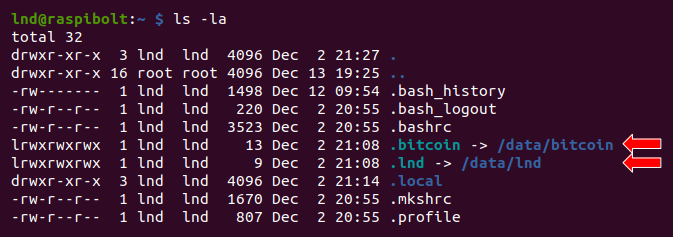

<!-- markdownlint-disable MD014 MD022 MD025 MD033 MD040 -->
# Lightning client
{: .no_toc }

We set up [LND](https://github.com/lightningnetwork/lnd/blob/master/README.md){:target="_blank"}, the Lightning Network Daemon by [Lightning Labs](https://lightning.engineering/){:target="_blank"}.

---

## Table of contents
{: .no_toc .text-delta }

1. TOC
{:toc}

---

## Installation

The installation of LND is straight-forward, but the application is quite powerful and capable of things not explained here. Check out their [GitHub repository](https://github.com/lightningnetwork/lnd/){:target="_blank"} for a wealth of information about their open-source project and Lightning in general.

### Download

We'll download, verify and install LND.

* As user "admin", download the application, checksums and signature

  ```sh
  $ cd /tmp
  $ wget https://github.com/lightningnetwork/lnd/releases/download/v0.15.0-beta/lnd-linux-arm64-v0.15.0-beta.tar.gz
  $ wget https://github.com/lightningnetwork/lnd/releases/download/v0.15.0-beta/manifest-v0.15.0-beta.txt
  $ wget https://github.com/lightningnetwork/lnd/releases/download/v0.15.0-beta/manifest-roasbeef-v0.15.0-beta.sig
  ```

* Get the public key from the LND developer, [Olaoluwa Osuntokun](https://keybase.io/roasbeef){:target="_blank"}, who signed the manifest file; and add it to your GPG keyring

  ```sh
  $ curl https://raw.githubusercontent.com/lightningnetwork/lnd/master/scripts/keys/roasbeef.asc | gpg --import
  > ...
  > gpg: key 372CBD7633C61696: public key "Olaoluwa Osuntokun <laolu32@gmail.com>" imported
  > ...
  ```

* Verify the signature of the text file containing the checksums for the application

  ```sh
  $ gpg --verify manifest-roasbeef-v0.15.0-beta.sig manifest-v0.15.0-beta.txt
  > gpg: Signature made Fri Jun 24 00:50:22 2022 EEST
  > gpg:                using RSA key 60A1FA7DA5BFF08BDCBBE7903BBD59E99B280306
  > gpg: Good signature from "Olaoluwa Osuntokun <laolu32@gmail.com>" [unknown]
  > gpg: WARNING: This key is not certified with a trusted signature!
  > gpg:          There is no indication that the signature belongs to the owner.
  > Primary key fingerprint: E4D8 5299 674B 2D31 FAA1  892E 372C BD76 33C6 1696
  >     Subkey fingerprint: 60A1 FA7D A5BF F08B DCBB  E790 3BBD 59E9 9B28 0306
  ```

* Verify the signed checksum against the actual checksum of your download

  ```sh
  $ sha256sum --check manifest-v0.15.0-beta.txt --ignore-missing
  > lnd-linux-arm64-v0.15.0-beta.tar.gz: OK
  ```

* Install LND

  ```sh
  $ tar -xzf lnd-linux-arm64-v0.15.0-beta.tar.gz
  $ sudo install -m 0755 -o root -g root -t /usr/local/bin lnd-linux-arm64-v0.15.0-beta/*
  $ lnd --version
  > lnd version 0.15.0-beta commit=v0.15.0-beta
  ```

### Data directory

Now that LND is installed, we need to configure it to work with Bitcoin Core and run automatically on startup.

* Create the "lnd" service user, and add it to the groups "bitcoin" and "debian-tor"

  ```sh
  $ sudo adduser --disabled-password --gecos "" lnd
  $ sudo usermod -a -G bitcoin,debian-tor lnd
  ```

* Add the user "admin" to the group "lnd"

  ```sh
  $ sudo adduser admin lnd
  ```

* Create the LND data directory

  ```sh
  $ sudo mkdir /data/lnd
  $ sudo chown -R lnd:lnd /data/lnd
  ```

* Open a "lnd" user session

  ```sh
  $ sudo su - lnd
  ```

* Create symbolic links pointing to the LND and bitcoin data directories

  ```sh
  $ ln -s /data/lnd /home/lnd/.lnd
  $ ln -s /data/bitcoin /home/lnd/.bitcoin
  ```

* Display the links and check that they're not shown in red (this would indicate an error)

  ```sh
  $ ls -la
  ```
  

### Wallet password

LND includes a Bitcoin wallet that manages your on-chain and Lightning coins.
It is password protected and must be unlocked when LND starts.
This creates the dilemma that you either manually unlock LND after each restart of your Raspberry Pi, or you store the password somewhere on the node.

For this initial setup, we choose the easy route: we store the password in a file that allows LND to unlock the wallet automatically.
This is not the most secure setup, but you can improve it later if you want, with the bonus guides linked below.
To give some perspective: other Lightning implementations like c-lightning or Eclair don't even have a password.

* As user "lnd", create a text file and enter your LND wallet `password [C]`. Save and exit.

  ```sh
  $ nano /data/lnd/password.txt
  ```

* Tighten access privileges and make the file readable only for user "lnd":

  ```sh
  $ chmod 600 /data/lnd/password.txt
  ```

To improve the security of your wallet, check out these more advanced methods:

* Example by LND: [using a password manager with named pipe](https://github.com/lightningnetwork/lnd/blob/master/docs/wallet.md#more-secure-example-with-password-manager-and-using-a-named-pipe){:target="_blank"}
* More to come...

### Configuration

* Create the LND configuration file and paste the following content (adjust to your alias).
  Save and exit.

  ```sh
  $ nano /data/lnd/lnd.conf
  ```

  ```sh
  # RaspiBolt: lnd configuration
  # /data/lnd/lnd.conf

  [Application Options]
  alias=YOUR_FANCY_ALIAS
  debuglevel=info
  maxpendingchannels=5
  listen=localhost

  # Password: automatically unlock wallet with the password in this file
  # -- comment out to manually unlock wallet, and see RaspiBolt guide for more secure options
  wallet-unlock-password-file=/data/lnd/password.txt
  wallet-unlock-allow-create=true

  # Channel settings
  bitcoin.basefee=1000
  bitcoin.feerate=1
  minchansize=100000
  accept-keysend=true
  accept-amp=true
  protocol.wumbo-channels=true
  protocol.no-anchors=false
  coop-close-target-confs=24

  # Watchtower
  wtclient.active=true

  # Performance
  gc-canceled-invoices-on-startup=true
  gc-canceled-invoices-on-the-fly=true
  ignore-historical-gossip-filters=1
  sync-freelist=true
  stagger-initial-reconnect=true
  routing.strictgraphpruning=true

  # Database
  [bolt]
  db.bolt.auto-compact=true
  db.bolt.auto-compact-min-age=168h

  [Bitcoin]
  bitcoin.active=1
  bitcoin.mainnet=1
  bitcoin.node=bitcoind

  [tor]
  tor.active=true
  tor.v3=true
  tor.streamisolation=true
  ```

🔍 *This is a standard configuration. Check the official LND [sample-lnd.conf](https://github.com/lightningnetwork/lnd/blob/master/sample-lnd.conf){:target="_blank"} with all possible options, and visit the [Lightning Node Management](https://www.lightningnode.info/){:target="_blank"} site by Openoms to learn more.*

---

## Run LND

Still with user "lnd", we first start LND manually to check if everything works fine.

```sh
$ lnd
```

```
Attempting automatic RPC configuration to bitcoind
Automatically obtained bitcoind's RPC credentials
2021-11-13 08:16:34.985 [INF] LTND: Version: 0.14.2-beta commit=v0.14.2-beta, build=production, logging=default, debuglevel=info
2021-11-13 08:16:34.985 [INF] LTND: Active chain: Bitcoin (network=mainnet)
...
2021-11-13 08:16:35.028 [INF] LTND: Waiting for wallet encryption password. Use `lncli create` to create a wallet, `lncli unlock` to unlock an existing wallet, or `lncli changepassword` to change the password of an existing wallet and unlock it.
```

The daemon prints the status information directly to the command line.
This means that we cannot use that session without stopping the server.
We need to open a second SSH session.

### Wallet setup

Start your SSH program (eg. PuTTY) a second time, connect to the Pi and log in as "admin".
Commands for the **second session** start with the prompt `$2` (which must not be entered).

Once LND is started, the process waits for us to create the integrated Bitcoin wallet.

* Start a "lnd" user session

  ```sh
  $2 sudo su - lnd
  ```

* Create the LND wallet

  ```sh
  $2 lncli create
  ```

* Enter your `password [C]` as wallet password (it must be exactly the same you stored in `password.txt`).
  To create a a new wallet, select `n` when asked if you have an existing cipher seed.
  Just press enter if asked about an additional seed passphrase, unless you know what you're doing.
  A new cipher seed consisting of 24 words is created.

  ```
  Do you have an existing cipher seed mnemonic or extended master root key you want to use?
  Enter 'y' to use an existing cipher seed mnemonic, 'x' to use an extended master root key
  or 'n' to create a new seed (Enter y/x/n): n

  Your cipher seed can optionally be encrypted.
  Input your passphrase if you wish to encrypt it (or press enter to proceed without a cipher seed passphrase):

  Generating fresh cipher seed...

  !!!YOU MUST WRITE DOWN THIS SEED TO BE ABLE TO RESTORE THE WALLET!!!

  ---------------BEGIN LND CIPHER SEED---------------
  1. secret     2. secret    3. secret     4. secret
  ...
  ```

These 24 words is all that you need to restore the Bitcoin on-chain wallet.
The current state of your channels, however, cannot be recreated from this seed.
For this, the Static Channel Backup stored at `/data/lnd-backup/channel.backup` is updated continuously.

🚨 This information must be kept secret at all times.
* **Write these 24 words down manually on a piece of paper and store it in a safe place.**
You can use a simple piece of paper, write them on a proper [backup card](https://shiftcrypto.ch/backupcard/backupcard_print.pdf){:target="_blank"}), or even stamp the seed words into metal (see this [DIY guide](https://www.econoalchemist.com/post/backup){:target="_blank"}).
This piece of paper is all an attacker needs to completely empty your on-chain wallet!
Do not store it on a computer.
Do not take a picture with your mobile phone.
**This information should never be stored anywhere in digital form.**

* Exit the user "lnd" user session, and then exit the second SSH session altogether

  ```sh
  $2 exit
  $2 exit
  ```

* Back in your first SSH session with user "lnd", LND is still running.
  Stop LND with `Ctrl-C`.

* Start LND agin and check if the wallet is unlocked automatically.
  On success, stop LND again.

  ```sh
  $ lnd
  >...
  > Started LND Lightning Network Daemon.
  > Attempting automatic RPC configuration to bitcoind
  > Automatically obtained bitcoinds RPC credentials
  > ...
  > LTND: Attempting automatic wallet unlock with password
  > LNWL: Opened wallet
  > ...

  # stop LND with `Ctrl-C`
  ```

### Autostart on boot

Now, let's set up LND to start automatically on system startup.

* Exit the second "lnd" user session back to "admin"

  ```sh
  $ exit
  ```

* Create LND systemd unit with the following content. Save and exit.

  ```sh
  $ sudo nano /etc/systemd/system/lnd.service
  ```

  ```sh
  # RaspiBolt: systemd unit for lnd
  # /etc/systemd/system/lnd.service

  [Unit]
  Description=LND Lightning Network Daemon
  Wants=bitcoind.service
  After=bitcoind.service

  [Service]

  # Service execution
  ###################
  ExecStart=/usr/local/bin/lnd

  # Process management
  ####################
  Type=simple
  Restart=always
  RestartSec=30
  TimeoutSec=240
  LimitNOFILE=128000

  # Directory creation and permissions
  ####################################
  User=lnd

  # /run/lightningd
  RuntimeDirectory=lightningd
  RuntimeDirectoryMode=0710

  # Hardening measures
  ####################
  # Provide a private /tmp and /var/tmp.
  PrivateTmp=true

  # Mount /usr, /boot/ and /etc read-only for the process.
  ProtectSystem=full

  # Disallow the process and all of its children to gain
  # new privileges through execve().
  NoNewPrivileges=true

  # Use a new /dev namespace only populated with API pseudo devices
  # such as /dev/null, /dev/zero and /dev/random.
  PrivateDevices=true

  # Deny the creation of writable and executable memory mappings.
  MemoryDenyWriteExecute=true

  [Install]
  WantedBy=multi-user.target
  ```

* Enable, start and unlock LND

  ```sh
  $ sudo systemctl enable lnd
  $ sudo systemctl start lnd
  $ systemctl status lnd
  ```

* Now, the daemon information is no longer displayed on the command line but written into the system journal.
  You can check on it using the following command (and exit with `Ctrl-C`).

  ```sh
  $ sudo journalctl -f -u lnd
  ```

### Allow user "admin" to work with LND

We interact with LND using the application `lncli`.
At the moment, only the user "lnd" has the necessary access privileges.
To make the user "admin" the main administrative user, we make sure it can interact with LND as well.

* Newly added groups become active only in a new user session.
  Log out from SSH.

  ```sh
  $ exit
  ```

* Log in as user "admin" again.

* Link the LND data directory in the user "admin" home.
  As a member or the group "lnd", admin has read-only access to certain files.
  We also need to make all directories browsable for the group (with `g+X`) and allow it to read the file `admin.macaroon`

  ```sh
  $ ln -s /data/lnd /home/admin/.lnd
  $ sudo chmod -R g+X /data/lnd/data/
  $ sudo chmod g+r /data/lnd/data/chain/bitcoin/mainnet/admin.macaroon
  ```

* Check if you can use `lncli` by querying LND for information

  ```sh
  $ lncli getinfo
  ```

## LND in action

Now your Lightning node is ready.
This is also the point of no return.
Up until now, you can just start over.
Once you send real bitcoin to your RaspiBolt, you have "skin in the game".

### Funding your Lightning node

* Generate a new Bitcoin address (p2wkh = native SegWit/Bech32) to receive funds on-chain and send a small amount of Bitcoin to it from any wallet of your choice.

  [`newaddress`](https://api.lightning.community/#newaddress){:target="_blank"}

  ```sh
  $ lncli newaddress p2wkh
  > "address": "bc1..."
  ```

* Check your LND wallet balance

  [`walletbalance`](https://api.lightning.community/#walletbalance){:target="_blank"}

  ```sh
  $ lncli walletbalance
  {
      "total_balance": "712345",
      "confirmed_balance": "0",
      "unconfirmed_balance": "712345"
  }
  ```

As soon as your funding transaction is mined (1 confirmation), LND will show its amount as "confirmed_balance".

💡 If you want to open a few channels, you might want to send a few transactions.
If you have only one UTXO, you need to wait for the change to return to your wallet after every new channel opening.


### Opening channels

Although LND features an optional "autopilot", we manually open some channels.

We recommend to go on [Amboss.Space](https://www.amboss.space/){:target="_blank"} or [1ML.com](https://1ml.com){:target="_blank"} and look for a mix of big and small nodes with decent Node Ranks.
Another great way to find peers to collaboratively set up channels is [LightningNetwork+](https://lightningnetwork.plus/){:target="_blank"}.

To connect to a remote node, you need its URI that looks like `<pubkey>@host`:

* the `<pubkey>` is just a long hexadecimal number, like `03864ef025fde8fb587d989186ce6a4a186895ee44a926bfc370e2c366597a3f8f`
* the `host` can be a domain name, an ip address or a Tor onion address, followed by the port number (usually `:9735`)

Just grab the whole URI above the big QR code and use it as follows (we will use the ACINQ node as an example):

* **Connect** to the remote node, with the full URI.

  [`connect`](https://api.lightning.community/#connectpeer){:target="_blank"}

  ```sh
  $ lncli connect 03864ef025fde8fb587d989186ce6a4a186895ee44a926bfc370e2c366597a3f8f@34.239.230.56:9735
  ```

* **Open a channel** using the `<pubkey>` only (*i.e.*, the part of the URI before the `@`) and the channel capacity in satoshis.

  [`openchannel`](https://api.lightning.community/#openchannel){:target="_blank"}

  One Bitcoin equals 100 million satoshis, so at $10'000/BTC, $10 amount to 0.001 BTC or 100'000 satoshis.
  To avoid mistakes, you can just use an [online converter](https://www.buybitcoinworldwide.com/satoshi/to-usd/){:target="_blank"}.

  The command as a built-in fee estimator, but to avoid overpaying fees, you can manually control the fees for the funding transaction by using the `sat_per_byte` argument as follows (to select the appropriate fee, in sats/vB, check [mempool.space](https://mempool.space/){:target="_blank"})
  ```sh
  $ lncli openchannel --sat_per_vbyte 8 03864ef025fde8fb587d989186ce6a4a186895ee44a926bfc370e2c366597a3f8f 100000 0
  ```

* **Check your funds**, both in the on-chain wallet and the channel balances.

  [`walletbalance`](https://api.lightning.community/#walletbalance){:target="_blank"} or [`channelbalance`](https://api.lightning.community/#channelbalance){:target="_blank"}

  ```sh
  $ lncli walletbalance
  $ lncli channelbalance
  ```

* **List active channels**. Once the channel funding transaction has been mined and gained enough confirmations, your channel is fully operational.
  That can take an hour or more.

  [`listchannels`](https://api.lightning.community/#listchannels){:target="_blank"}

  ```sh
  $ lncli listchannels
  ```

* **Make a Lightning payment**. These work with invoices, so everytime you buy something or want to send money, you need to get an invoice first.
  To try, why not send me a single satoshi to view my Twitter profile?

  * Click on this Tippin.me link: <https://tippin.me/@Stadicus3000>
  * Click on "Copy request" to copy the invoice data
  * Pay me 1 satoshi (~ $0.0001) 🤑

    ```sh
    * lncli payinvoice lnbc10n1pw......................gsj59
    ```

### Adding watchtowers

Lightning channels need to be monitored to prevent malicious behavior by your channel peers.
If your RaspiBolt goes down for a longer period of time, for instance due to a hardware problem, a node on the other side of one of your channels might try to close the channel with an earlier channel balance that is better for them.

Watchtowers are other Lightning nodes that can monitor your channels for you.
If they detect such bad behavior, they can react on your behalf, and send a punishing transaction to close this channel.
In this case, all channel funds will be sent to your LND on-chain wallet.

A watchtower can only send such a punishing transaction to your wallet, so you don't have to trust them.
It's good practice to add a few watchtowers, just to be on the safe side.

* With user "LND", add the [Lightning Network+ watchtower](https://lightningnetwork.plus/watchtower){:target="_blank"} as a first example

  ```sh
  $ sudo su - lnd
  $ lncli wtclient add 023bad37e5795654cecc69b43599da8bd5789ac633c098253f60494bde602b60bf@iiu4epqzm6cydqhezueenccjlyzrqeruntlzbx47mlmdgfwgtrll66qd.onion:9911
  ```

* Check if the watchtower is active

  ```sh
  $ lncli wtclient towers
  {
      "towers": [
          {
              "pubkey": "023bad37e5795654cecc69b43599da8bd5789ac633c098253f60494bde602b60bf",
              "addresses": [
                  "iiu4epqzm6cydqhezueenccjlyzrqeruntlzbx47mlmdgfwgtrll66qd.onion:9911"
              ],
              "active_session_candidate": true,
              "num_sessions": 0,
              "sessions": [
              ]
          },
      ]
  }
  ```
* Check out this [list of altruistic public watchtowers](https://github.com/openoms/lightning-node-management/issues/4){:target="_blank"} maintained by Openoms, and add a few more.

* If you want to list your towers

  ```sh
  $ lncli wtclient towers
  ```

* If you want to deactivate an active tower

  ```sh
  $ lncli wtclient remove <pubkey>
  ```

### More commands

A quick reference with common commands to play around with:

* list all arguments for the CLI (command line interface)

  ```sh
  $ lncli
  ```

* get help for a specific command

  ```sh
  $ lncli help [COMMAND]
  ```

* Find out some general stats about your node:
  [`getinfo`](https://api.lightning.community/#getinfo){:target="_blank"}

  ```sh
  $ lncli getinfo
  ```

* Check the peers you are currently connected to:
  [`listpeers`](https://api.lightning.community/#listpeers){:target="_blank"}

  ```sh
  $ lncli listpeers
  ```

* Check the status of your pending channels:
  [`pendingchannels`](https://api.lightning.community/#pendingchannels){:target="_blank"}

  ```sh
  $ lncli pendingchannels
  ```

* Check the status of your active channels:
  [`listchannels`](https://api.lightning.community/#listchannels){:target="_blank"}

  ```sh
  $ lncli listchannels
  ```

* Before paying an invoice, you should decode it to check if the amount and other infos are correct:
  [`decodepayreq`](https://api.lightning.community/#decodepayreq){:target="_blank"}

  ```sh
  $ lncli decodepayreq [INVOICE]
  ```

* Pay an invoice:

  ```sh
  $ lncli payinvoice [INVOICE]
  ```

* Send a payment to a node without invoice using AMP (both sender and receiver nodes have to have AMP enabled):
  [`sendpayment`](https://api.lightning.community/#sendpayment){:target="_blank"}

  ```sh
  $ lncli sendpayment --amp --fee_limit 1 --dest=<node_pubkey> --final_cltv_delta=144 --amt=<amount_in_sats>
  ```

* Check the payments that you sent:
  [`listpayments`](https://api.lightning.community/#listpayments){:target="_blank"}

  ```sh
  $ lncli listpayments
  ```

* Create an invoice:
  [`addinvoice`](https://api.lightning.community/#addinvoice){:target="_blank"}

  ```sh
  $ lncli addinvoice [AMOUNT_IN_SATOSHIS]
  ```

* List all invoices:
  [`listinvoices`](https://api.lightning.community/#listinvoices){:target="_blank"}

  ```sh
  $ lncli listinvoices
  ```

* to close a channel, you need the following two arguments that can be determined with `listchannels` and are listed as "channelpoint": `FUNDING_TXID`:`OUTPUT_INDEX`

  [`closechannel`](https://api.lightning.community/#closechannel){:target="_blank"}

  ```sh
  $ lncli listchannels
  $ lncli closechannel --sat_per_vbyte <fee> [FUNDING_TXID] [OUTPUT_INDEX]
  ```

* to force close a channel (if your peer is offline or not cooperative), use `--force`

  ```sh
  $ lncli closechannel --force [FUNDING_TXID] [OUTPUT_INDEX]
  ```

🔍 _more: full [LND API reference](https://api.lightning.community/){:target="_blank"}_

---

## For the future: upgrade LND

Upgrading LND can lead to a number of issues.
**Always** read the [LND release notes](https://github.com/lightningnetwork/lnd/releases){:target="_blank"} completely to understand the changes. These also cover a lot of additional topics and many new features not mentioned here.

* Check your lnd version

  ```sh
  $ lnd --version
  ```

* As "admin" user, stop the LND service
  `$ sudo systemctl stop lnd`

* Download, verify and install the latest LND binaries as described in the [LND section](lightning-client.md#installation) of this guide.

* Restart the services with the new configuration

  ```sh
  $ sudo systemctl restart lnd
  ```

<br /><br />

---

Next: [Channel backup >>](channel-backup.md)
