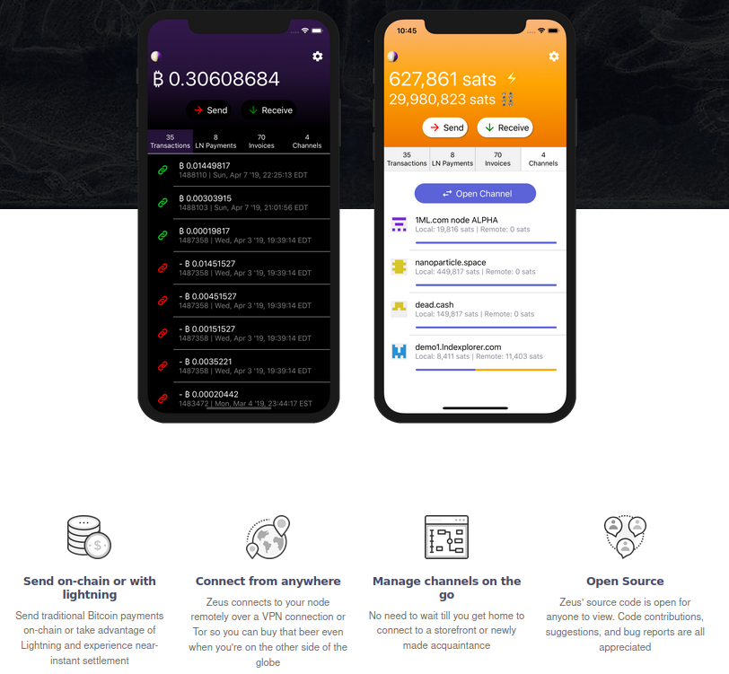
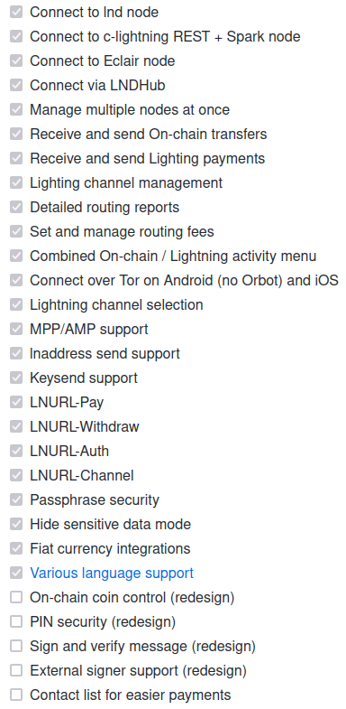

<!-- markdownlint-disable MD014 MD022 MD025 MD033 MD040 -->
# Mobile app
{: .no_toc }

We install [Zeus](https://zeusln.app/){:target="_blank"}, a cross-platform mobile app that connect to your LN node over Tor.
Make payments with lightning or on-chain and manage your channels while you're on the go.



---

## Table of contents
{: .no_toc .text-delta }

1. TOC
{:toc}

---

## Preparations

### Access over Tor

Zeus will access the node via Tor.

* Add the following three lines in the section for “location-hidden services” in the `torrc` file. Save and exit.

  ```sh
  $ sudo nano /etc/tor/torrc
  ```

  ```ini
  ############### This section is just for location-hidden services ###
  HiddenServiceDir /var/lib/tor/hidden_service_lnd_rest/
  HiddenServiceVersion 3
  HiddenServicePort 8080 127.0.0.1:8080
  ```

* Reload Tor configuration and get your connection address.

   ```sh
   $ sudo systemctl reload tor
   $ sudo cat /var/lib/tor/hidden_service_lnd_rest/hostname
   > abcdefg..............xyz.onion
   ```

* Save the onion address in a safe place (e.g., password manager)

### Install lndconnect

[lndconnect](https://github.com/LN-Zap/lndconnect){:target="_blank"}, created by Zap, is a utility that generates QR Code or URI to connect applications to lnd instances.

* Download the binary and install it

  ```sh
  $ cd /tmp
  $ wget https://github.com/LN-Zap/lndconnect/releases/download/v0.2.0/lndconnect-linux-arm64-v0.2.0.tar.gz
  $ tar -xvf lndconnect-linux-arm64-v0.2.0.tar.gz
  $ sudo install -m 0755 -o root -g root -t /usr/local/bin lndconnect-linux-arm64-v0.2.0/lndconnect
  $ cd
  ```

### Create a lndconnect QR code

lnconnect generates a URI and displays it as a QR code that Zeus can read.

* Still with the "admin" user, use the following command. Make sure to replace the .onion address with the one you generated above.

  ```sh
  $ lndconnect --host=abcdefg..............xyz.onion --port=8080
  ```

* It will be a big QR code, so maximize your terminal window and use `CTRL`+`-` to shrink the code further to fit the screen

* Keep the SSH session with the QR code opened, it will be needed later

---

## Installation

### Install the Zeus app

Download the Zeus app for your mobile phone.
Check the [Zeus website](https://zeusln.app/){:target="_blank"} for the direct download links to the Apple App Store or Google Play.  

On Android, if you can't or do not want to use Google Play, you can get Zeus from the [F-Droid store](https://f-droid.org/en/packages/app.zeusln.zeus/){:target="_blank"} or simply [download the APK](https://zeusln.app/){:target="_blank"}, tap it and install it. If it's the first time you install an APK on your phone you will be asked to authorize the app to install unknown apps, simply follow the on-screen instructions to do so.

---

### Connect Zeus to your node

* Open Zeus and tap on "GET STARTED"

* Tap on "Connect a node" and then tap on the "+" at the top right to add your node

* Enter a Nickname for your node (e.g., "RaspiBolt")

* Click on "SCAN LNDCONNECT CONFIG" and, if prompted, allow Zeus to use the camera

* Scan the QR code generated earlier

* Click on "SAVE NODE CONFIG". Zeus is now connecting to your node, and it might take a while the first time.

---

### Security

Anyone using Zeus on your phone has control over your node and all its funds. It is strongly recommended to set up a password for the app.

* In the app, tap on the Zeus icon in the top-left corner
* Click on "Security" and "Set/Change Password" to enter a password or PIN
* Save your password or PIN somewhere safe, e.g., in your password manager

---

## Zeus in action

Below is a list of Zeus existing and planned features:



---

## Update

To update Zeus, update the app using the same app store you used to install it.

---

## Uninstall

To uninstall, you need to uninstall the app on your phone and deactivate the LND REST API Tor hidden service

* Uninstall the app on your phone

* To deactivate the LND REST API Tor hidden service, comment out the hidden service lines in  `torrc` and reload Tor

  ```sh
  $ sudo nano /etc/tor/torrc
  ```

  ```ini
  #HiddenServiceDir /var/lib/tor/hidden_service_lnd_rest/
  #HiddenServiceVersion 3
  #HiddenServicePort 8080 127.0.0.1:8080
  ```

  ```sh
  $ sudo systemctl reload tor
  ```

<br /><br />

---

Next: [Bonus section >>](../bonus/index.md)
