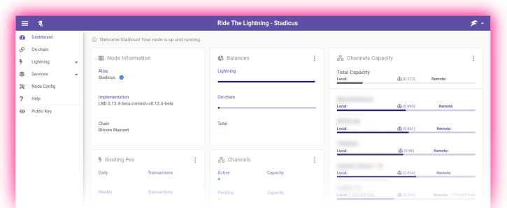

<!-- markdownlint-disable MD014 MD022 MD025 MD033 MD040 -->
# Web app
{: .no_toc }

We install [Ride The Lightning](https://github.com/Ride-The-Lightning/RTL#readme){:target="_blank"}, a powerful web interface to manage your Lightning node.



---

## Table of contents
{: .no_toc .text-delta }

1. TOC
{:toc}

---

## Preparations

### Install Node.js

Starting with user “admin”, we add the Node.js package repository.
We’ll use version 16 which is the latest stable version.
If you installed BTC RPC Explorer, then you've already accomplished this step.

* Add the Node.js software repository

  ```sh
  $ curl -fsSL https://deb.nodesource.com/setup_16.x | sudo -E bash -
  ```

* Install Node.js using the apt package manager
  ```
  $ sudo apt install nodejs
  ```

### Firewall & reverse proxy

In the [Security section](../raspberry-pi/security.md#prepare-nginx-reverse-proxy), we already set up NGINX as a reverse proxy.
Now we can add the RTL configuration.

* Enable NGINX reverse proxy to route external encrypted HTTPS traffic internally to RTL

  ```sh
  $ sudo nano /etc/nginx/streams-enabled/rtl-reverse-proxy.conf
  ```
  ```nginx
  upstream rtl {
    server 127.0.0.1:3000;
  }
  server {
    listen 4001 ssl;
    proxy_pass rtl;
  }
  ```

* Test and reload NGINX configuration

  ```sh
  $ sudo nginx -t
  $ sudo systemctl reload nginx
  ```

* Configure firewall to allow incoming HTTPS requests:

  ```sh
  $ sudo ufw allow 4001/tcp comment 'allow RTL SSL'
  $ sudo ufw status
  ```

## Ride the Lightning

### Installation

We do not want to run Ride the Lightning alongside bitcoind and lnd because of security reasons. For that we will create a separate user and we will be running the code as the new user. We are going to install Ride the Lightning in the home directory since it doesn’t take much space and doesn’t use a database.

* Create a new user, copy the LND credentials and open a new session
  ```sh
  $ sudo adduser --disabled-password --gecos "" rtl
  $ sudo cp /data/lnd/data/chain/bitcoin/mainnet/admin.macaroon /home/rtl/admin.macaroon
  $ sudo chown rtl:rtl /home/rtl/admin.macaroon
  $ sudo su - rtl
  ```

* Download the PGP keys that are used to sign the software release

  ```
  $ curl https://keybase.io/suheb/pgp_keys.asc | gpg --import
  > gpg: key 00C9E2BC2E45666F: public key "saubyk (added uid) <39208279+saubyk@users.noreply.github.com>" imported
  ```

* Retrieve the source code repository, check for the latest release and verify the code signature

  ```sh
  $ git clone https://github.com/Ride-The-Lightning/RTL.git
  $ cd RTL

  $ git tag | sort --version-sort | tail -n 1
  > v0.12.2

  $ git checkout v0.12.2

  $ git verify-tag v0.12.2
  > gpg: Good signature from "saubyk (added uid) <39208279+saubyk@users.noreply.github.com>" [unknown]
  > gpg:                 aka "Suheb <39208279+saubyk@users.noreply.github.com>" [unknown]
  > gpg: WARNING: This key is not certified with a trusted signature!
  > gpg:          There is no indication that the signature belongs to the owner.
  > Primary key fingerprint: 3E9B D443 6C28 8039 CA82  7A92 00C9 E2BC 2E45 666F
  ```

* Now install RTL through the Node Package Manager (NPM).
  Downloading all dependencies can sometimes be very slow, so be patient and let the process run its course.

  ```sh
  $ npm install --only=prod
  ```

The installation can take some time, and can hang on a single package for a long time.
If that happens, just be patient and wait a bit longer.
If anything's wrong, it will time out sooner or later.

Also, there might be a lot of confusing output.
If you something similar to the following at the end, installation was successful:

```
...
added 307 packages from 224 contributors and audited 1648 packages in 2336.773s

7 packages are looking for funding
  run `npm fund` for details

found 23 vulnerabilities (21 moderate, 2 high)
  run `npm audit fix` to fix them, or `npm audit` for details
```

### Configuration

Now we take the sample configuration file and add change it to our needs.

* Copy the sample config file, and open it in the text editor.

  ```sh
  cp Sample-RTL-Config.json ./RTL-Config.json
  nano RTL-Config.json
  ```

* Set password [E] to access the RTL web interface. This should be a dedicated password not used anywhere else.

  ```sh
    "multiPass": "YourPassword[E]"
  ```

* Specify the values where RTL can find the authentication macaroon file and the LND configuration

  ```sh
    "macaroonPath": "/home/rtl"
    "configPath": "/data/lnd/lnd.conf"
  ```
* Save and exit


### First start

Test starting "Ride the Lightning" manually first to make sure it works.

```sh
$ cd /home/rtl/RTL
$ node rtl
> Server is up and running, please open the UI at http://localhost:3000
```

Now point your browser to the secure access point provided by the NGINX web proxy, for example <https://raspibolt.local:4001> (or your nodes ip address, e.g. <https://192.168.0.20:4001>).

Your browser will display a warning, because we use a self-signed SSL certificate.
There's nothing we can do about that, because we would need a proper domain name (e.g. https://yournode.com) to get an official certificate which browsers recognize.
Click on "Advanced" and proceed to the RTL web interface.

If everything worked, stop RTL in the terminal with `CTRL`-`C` and exit the "rtl" user session.

```sh
$ exit
```

### Autostart on boot

Now we'll make sure Ride The Lightning starts as a service on the Raspberry Pi so it's always running.
In order to do that, we create a systemd unit that starts the service on boot directly after LND.

* As user "admin", create the service file.

  ```sh
  $ sudo nano /etc/systemd/system/rtl.service
  ```

* Paste the following configuration. Save and exit.

  ```sh
  # RaspiBolt: systemd unit for Ride the Lightning
  # /etc/systemd/system/rtl.service

  [Unit]
  Description=Ride the Lightning
  After=lnd.service

  [Service]
  WorkingDirectory=/home/rtl/RTL
  ExecStart=/usr/bin/node rtl
  User=rtl

  Restart=always
  RestartSec=30

  [Install]
  WantedBy=multi-user.target
  ```

* Enable the service, start it and check log logging output.

  ```sh
  $ sudo systemctl enable rtl
  $ sudo systemctl start rtl
  $ sudo journalctl -f -u rtl
  ```

## Optional

### Remote access over Tor

You can easily add a Tor hidden service on the RaspiBolt and access the Ride the Lightning interface with the Tor browser from any device.

* Add the following three lines in the section for "location-hidden services" in the `torrc` file. Save and exit

  ```sh
  $ sudo nano /etc/tor/torrc
  ```

  ```sh
  ############### This section is just for location-hidden services ###
  HiddenServiceDir /var/lib/tor/hidden_service_rtl/
  HiddenServiceVersion 3
  HiddenServicePort 80 127.0.0.1:3000
  ```

  Update Tor configuration changes and get your connection address.

  ```sh
  $ sudo systemctl reload tor
  $ sudo cat /var/lib/tor/hidden_service_rtl/hostname
  > abcefg...................zyz.onion
  ```

With the Tor browser (link this), you can access this onion address from any device.

**Congratulations!**
You now have Ride the Lightning running to manage your Lightning service on our own node.

### Enable 2-Factor-Authentication

If you want to be extra careful, you can enable 2FA for access to your RTL interface.

* Log in to RTL
* Click on the RTL logo top right, and choose "Settings"
* Select the "Authentication" tab and click on the "Enable 2FA" button
* Follow the instructions, using a 2FA app like Google Authenticator or Authy

## For the future: RTL upgrade

Updating to a [new release](https://github.com/Ride-The-Lightning/RTL/releases){:target="_blank"} is straight-forward.
Make sure to read the release notes first.

* From user "admin", stop the service and open a "rtl" user session.

  ```sh
  $ sudo systemctl stop rtl
  $ sudo su - rtl
  ```

* Fetch the latest GitHub repository information, display the latest release tag (`v0.12.2` in this example), and update:

  ```sh
  $ cd /home/rtl/RTL
  $ git fetch
  $ git tag | sort --version-sort | tail -n 1
  $ git checkout v0.12.2
  $ git verify-tag v0.12.2
  $ npm install --only=prod
  $ exit
  ```

* Start the service again.

  ```sh
  $ sudo systemctl start rtl
  $ sudo journalctl -f -u rtl
  ```

<br /><br />

---

Next: [Mobile app >>](mobile-app.md)
