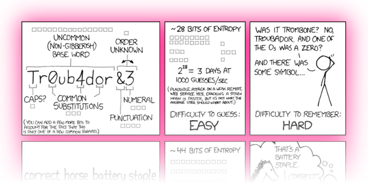

<!-- markdownlint-disable MD014 MD022 MD025 MD040 -->


# Preparations
{: .no_toc }

Let's get all the necessary hardware parts and prepare some passwords.

---

## Table of contents
{: .no_toc .text-delta }

1. TOC
{:toc}

---

## Raspberry Pi & other hardware platforms
This guide builds on the readily available and very flexible Raspberry Pi 4.
It is a fantastic piece of hardware, a tiny computer-on-a-chip that costs about $60 and consumes very little energy.

While the Raspberry Pi is the best choice for most, this guide also works with other computing platforms, clouds servers, or virtual machines that run Debian.
It only uses standard Debian instructions.

## Hardware requirements

You need the following hardware:

* Raspberry Pi 4, with 4+ GB RAM
* official Raspberry Pi power adapter: other adapters are a common cause for reliability issues
* external storage: 1+ TB with USB3, an SSD is recommended

Whaaat? No microSD card? Yes, we'll boot the operating system directly to the external drive.

The complete Bitcoin blockchain must be stored locally to run a Lightning node, currently about 500 GB and growing.
You can buy a cheap hard disk enclosure and reuse an old hard disk.
We recommend getting a modern 2.5" SSD that can be powered through the USB connection to the Pi directly.
This also speeds up the initial sync time for the blockchain significantly.

You might also want to get this optional hardware:

* optional: Raspberry Pi case to protect your Pi and cool it down
* optional: a small USB thumbdrive or microSD card to create regular local backups of your Lightning channels

---

## Write down your passwords

You will need several passwords, and it's easiest to write them all down in the beginning, instead of bumping into them throughout the guide.
They should be unique and very secure, at least 12 characters in length. Do **not use uncommon special characters**, spaces, or quotes (‘ or “).

```console
[ A ] Master user password
[ B ] Bitcoin RPC password
[ C ] LND wallet password
[ D ] BTC-RPC-Explorer password (optional)
[ E ] Ride The Lightning password
```



If you need inspiration for creating your passwords: the [xkcd: Password Strength](https://xkcd.com/936/){:target="_blank"} comic is funny and contains a lot of truth.
Store a copy of your passwords somewhere safe (preferably in an open-source password manager like [KeePassXC](https://keepassxc.org/){:target="_blank"}), or whaterver password manager you're already using, and keep your original notes out of sight once your system is up and running.

<br /><br />

---

Next: [Operating system >>](operating-system.md)
