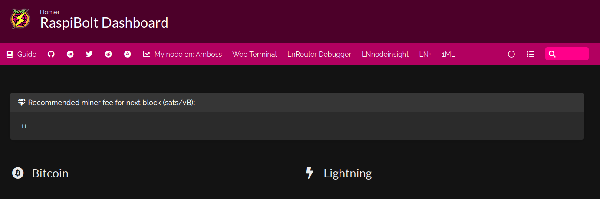

<!-- markdownlint-disable MD014 MD022 MD025 MD033 MD040 -->

# Web dashboard
{: .no_toc }

We set up [Homer](https://github.com/bastienwirtz/homer#readme){:target="_blank"}, a simple static web dashboard to keep our web services on hand, from a simple YAML configuration file. 

The dashboard contains the following configurable features:
* A title and RaspiBolt logo
* A top banner containing clearnet exertnal links to various useful websites:
  * the RaspiBolt guide
  * the various RaspiBolt community groups (Telegram, Reddit, Twitter, Amboss)
  * the node profile on several lightning explorers (Amboss, Web Terminal, 1ML)
* a welcome message displaying the next block miner fee from the mempool.space API
* links to our self-hosted web services, organized by categories (e.g., "Bitcoin", "Lightning") 

Here we'll install Homer and set up the basic configuration. We'll then add the relevant web services (BTC RPC Explorer, Ride The Lightning) later in the guide after having installed them.

*Note:* If you don't plan to use any self-hosted web services (e.g., if you plan to use CLI-only), you can skip this entire web dashboard section.



---

## Table of contents
{: .no_toc .text-delta }

1. TOC
{:toc}

---

## Preparations

### Firewall

* Configure the UFW firewall to allow incoming HTTPS requests

  ```sh
  $ sudo ufw allow 4091/tcp comment 'allow Homer SSL'
  $ sudo ufw status
  ```

---

## Homer

### Installation

* Create the "homer" service user, create the data directory and open a new session 

  ```sh
  $ sudo adduser --disabled-password --gecos "" homer
  $ mkdir /data/homer
  $ sudo chown homer:homer /data/homer
  $ sudo su - homer
  ```

* Retrieve the source code repository and install Homer

  ```sh
  $ git clone https://github.com/bastienwirtz/homer.git
  $ cd homer
  $ npm install
  $ npm run build
  ```

* Exit the "homer" user session back to user "admin"

  ```sh
  $ exit
  ```

* Move the distributable output into a webroot folder and change its ownership to the “www-data” user.

  ```sh
  $ sudo rsync -av --delete /home/homer/homer/dist/ /var/www/homer/
  $ sudo chown -R www-data:www-data /var/www/homer
  ```

### Logos

We download the RaspiBolt v3 logo and place it inside the website data folder.

* Download the logo and move it to the Homer web data folder

  ```sh
  $ cd ~/tmp
  $ wget https://raw.githubusercontent.com/VajraOfIndra/RaspiBolt/homer-new/images/raspibolt3-logo-no-text.png
  $ sudo mv raspibolt3-logo-no-text.png /var/www/homer/assets/tools
  ```

### nginx

* Switch back to the "homer" user and create a nginx configuration file for the Homer website with a HTTPS server listening on port 4091

  ```sh
  $ sudo su - homer 
  $ nano /etc/nginx/sites-available/homer-ssl.conf
  ```

  ```ini
  ## homer-ssl.conf
  
  
  server {
      listen 4091 ssl;
      listen [::]:4091 ssl;
      server_name _;
  
      ssl_certificate /etc/ssl/certs/nginx-selfsigned.crt;
      ssl_certificate_key /etc/ssl/private/nginx-selfsigned.key;
      ssl_session_timeout 4h;
      ssl_protocols TLSv1.3;
      ssl_prefer_server_ciphers on;

      access_log /var/log/nginx/access_homer.log;
      error_log /var/log/nginx/error_homer.log;
 
      root /var/www/homer;
      index index.html;
  
  
  }
  ```

* Exit the "homer" user session back to user "admin"

  ```sh
  $ exit
  ```

* Create a symlink in the sites-enabled directory

  ```sh
  $ sudo ln -sf /etc/nginx/sites-available/homer-ssl.conf /etc/nginx/sites-enabled/
  ```

* Test and reload nginx configuration

  ```sh
  $ sudo nginx -t
  > nginx: the configuration file /etc/nginx/nginx.conf syntax is ok
  > nginx: configuration file /etc/nginx/nginx.conf test is successful
  $ sudo systemctl restart nginx
  ```

### Configuration

A sample configuration file is available at `/home/homer/homer/dist/assets/config.yml.dist`. We will create a configuration file derived from this default configuration but tailored to the RaspiBolt. First, we add a link to the Cockpit web service and also some links to some handy RaspiBolt-related external websites in the toolbar.

* Create a new configuration file in the Homer data directory and paste the following configuration settings. In the url entries in the service section, replace `raspibolt.local` with your own IP. Save and exit.

  ```sh
  $ sudo nano /data/homer/config.yml
  ```

  ```ini
  ---
  ################################
  # HOMEPAGE CONFIGURATION       #
  ################################
  title: "RaspiBolt Dashboard"
  subtitle: "Homer"
  logo: "assets/tools/raspibolt3-logo-no-text.png"
  
  header: true
  footer: '<p><em>The Times 03/Jan/2009 Chancellor on brink of second bailout for banks.</em> (Bitcoin genesis block)</p>'
  columns: 2
  connectivityCheck: true

  ################################
  # Optional theme customization #
  ################################
  theme: default
  colors:
    light:
      highlight-primary: "#3367d6"
      highlight-secondary: "#4285f4"
      highlight-hover: "#5a95f5"
      background: "#f5f5f5"
      card-background: "#ffffff"
      text: "#363636"
      text-header: "#ffffff"
      text-title: "#303030"
      text-subtitle: "#424242"
      card-shadow: rgba(0, 0, 0, 0.1)
      link: "#3273dc"
      link-hover: "#363636"
    dark:
      highlight-primary: "#4c0029"
      highlight-secondary: "#b20060"
      highlight-hover: "#ff008a"
      background: "#131313"
      card-background: "#2b2b2b"
      text: "#eaeaea"
      text-header: "#ffffff"
      text-title: "#fafafa"
      text-subtitle: "#f5f5f5"
      card-shadow: rgba(0, 0, 0, 0.4)
      link: "#ff008a"
      link-hover: "#fffa1b"

  ################################
  # Optional message             #
  ################################
  message:
    url: https://mempool.space/api/v1/fees/recommended
  mapping:
    content: 'fastestFee'
  refreshInterval: 10000
  style: "is-dark"
  title: "Recommended miner fee for next block (sats/vB):"
  icon: "fas fa-gem"
  content: "Oops... something's not working, I can't fetch that information!"
  
  ################################
  # Optional navbar              #
  ################################  
  links:
    - name: "Guide"
      icon: "fas fa-book"
      url: "https://www.raspibolt.org/"
      target: "_blank"
    - name: ""
      icon: "fab fa-github"
      url: "https://github.com/raspibolt/raspibolt"
      target: "_blank"
    - name: ""
      icon: "fab fa-telegram"
      url: "https://t.me/raspibolt/"
      target: "_blank"
    - name: ""
      icon: "fab fa-twitter"
      url: "https://twitter.com/raspibolt"
      target: "_blank"
    - name: ""
      icon: "fab fa-reddit"
      url: "https://www.reddit.com/r/raspibolt/"
      target: "_blank"
    - name: ""
      icon: "fab fa-adn"
      url: "https://www.amboss.space/community/2f1891ba-e145-4297-a1ed-70ab4b6dcc3a"
      target: "_blank"
    - name: "Indra on Amboss"
      icon: "fas fa-chart-line"
      url: "https://www.amboss.space/node/<node_pubkey>"
      target: "_blank"
    - name: "Indra on Web Terminal"
      icon: "fas fa-chart-line"
      url: "https://terminal.lightning.engineering/#/<node_pubkey>"
      target: "_blank"
    - name: "Indra on 1ML"
      icon: "fas fa-chart-line"
      url: "https://1ml.com/node/<node_pubkey>"
      target: "_blank"

  ################################
  # Services                     #
  ################################
  # First level array represents a group. Second level arrays represent items.
  services:
    - name: "Bitcoin"
      icon: "fab fa-bitcoin"
      items:
    - name: "Lightning"
      icon: "fas fa-bolt"
      items:
  ```
  
🔍 * If you want to tweak the dashboard to your own taste, check the full configuration guidelines on the [Homer repository](https://github.com/bastienwirtz/homer/blob/main/docs/configuration.md){:target="_blank"}. Search for compatible icons on the [Font Awesome webpage](https://fontawesome.com/icons){:target="_blank"}. Read about styling options on the [Bulma CSS framework webapge](https://bulma.io/documentation/components/message/#colors){:target="_blank"}.

* Create a symlink to the configuration file and change its ownshership to the "www-data" user

  ```sh
  $ sudo ln -s /data/homer/config.yml /var/www/homer/assets/config.yml
  $ sudo chown homer:www-data /var/www/homer/assets/config.yml
  ```

### First start

* Test starting Homer manually first to make sure it works.

  ```sh
  $ sudo su - homer
  $ cd homer
  $ npm run serve
  ```
  
Now point your browser to the secure access point provided by the nginx server, for example https://raspibolt.local:4091 (or your nodes IP address, e.g. https://192.168.0.20:4091).  

Your browser will display a warning, because we use a self-signed SSL certificate. There’s nothing we can do about that, because we would need a proper domain name (e.g. https://yournode.com) to get an official certificate which browsers recognize. Click on “Advanced” and proceed to the Homer dashboard interface.

* If everything worked, stop Homer in the terminal with `Ctrl`+`C` and exit the "homer" user session.

  ```sh
  $ exit
  ```

### Autostart on boot

Now we’ll make sure Homer starts as a service on the Raspberry Pi so it’s always running. In order to do that, we create a systemd unit that starts the service on boot directly.

* As user “admin”, create the service file.

  ```sh
  $ sudo nano /etc/systemd/system/homer.service
  ```

  ```ini
  # RaspiBolt: systemd unit for Homer
  # /etc/systemd/system/homer.service
  
  [Unit]
  Description=Homer
  After=lnd.service
  
  [Service]
  WorkingDirectory=/home/homer/homer
  ExecStart=/usr/bin/npm run serve
  User=homer
  
  Restart=always
  RestartSec=30
  
  [Install]
  WantedBy=multi-user.target
  ```

* Enable the service, start it and check log logging output.

  ```sh
  $ sudo systemctl enable homer
  $ sudo systemctl start homer
  $ sudo journalctl -f -u homer
  ```

You're set! You can now use the dashboard to have a quick access to Cockpit and some external websites. We will add more web services in the Bitcoin and Lightning sections of the guide.

---

## For the future: Homer upgrade

Updating to a [new release](https://github.com/bastienwirtz/homer/releases){:target="_blank"} is straight-forward. Make sure to read the release notes first.

* From user “admin”, stop the service and open a "homer" user session.

  ```sh
  $ sudo systemctl stop homer
  $ sudo su - homer
  ```

* Fetch the latest GitHub repository information (v9.99.9 in this example), and update:

  ```sh
  $ cd homer
  $ git fetch
  $ git describe --tags --abbrev=0
  $ git checkout v9.99.9
  $ npm install
  $ npm run build
  $ exit
  ```
  
* With the "admin" user, copy over the updated distributable output and re-create the symlink to the configuration file

  ```sh
  $ sudo rsync -av --delete /home/homer/homer/dist/ /var/www/homer/
  $ sudo chown -R www-data:www-data /var/www/homer
  $ sudo ln -s /data/homer/config.yml /var/www/homer/assets/config.yml
  $ sudo chown www-data:www-data /var/www/homer/assets/config.yml
  ```

* Start the service again.

  ```sh
  $ sudo systemctl start homer
  $ sudo journalctl -f -u homer
  ```

<br /><br />

---

Next: [Bitcoin >>](../bitcoin/index.md)
