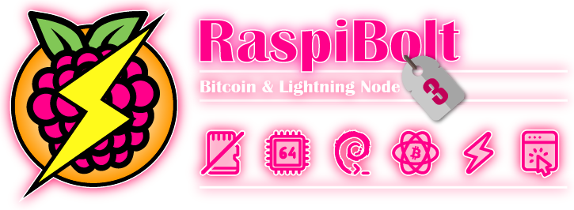

<!-- markdownlint-disable MD014 MD022 MD025 MD033 MD040 -->


 
Build your own "do-everything-yourself" Bitcoin full node that will make you a sovereign peer in the Bitcoin and Lightning network.
{: .fs-6 }

No need to trust anyone else.
{: .fs-6 }

---

## What is the RaspiBolt?

With this guide, you can set up a Bitcoin and Lightning node from scratch, doing everything yourself.
You will learn about Linux, Bitcoin, and Lightning.
As a result, you'll have your very own RaspiBolt node, built by you and no one else.

There are many reasons why you should run your own Bitcoin node.

* **Keep Bitcoin decentralized.** Use your node to help enforce your Bitcoin consensus rules.
* **Take back your sovereignty.** Let your node validate your own Bitcoin transactions. No need to ask someone else to tell you what's happening in the Bitcoin network.
* **Improve your privacy.** Connect your wallets to your node so that you no longer need to reveal their whole financial history to external servers.
* **Be part of Lightning.** Run your own Lightning node for everyday payments and help building a robust, decentralized Bitcoin Lightning network.

Did we mention that it's fun, as well?

---

## RaspiBolt overview

This guide explains how to set up your own Bitcoin node on a cheap Raspberry Pi.
But it works on most hardware platforms because it only uses standard Debian Linux commands.

### Features

Your Bitcoin node will offer the following functionality:

* **Bitcoin**: direct and trustless participation in the Bitcoin peer-to-peer network, full validation of blocks and transactions
* **Electrum server**: connect your compatible wallets (including hardware wallets) to your own node
* **Blockchain Explorer**: web-based Explorer to privately look up transactions, blocks, and more
* **Lightning**: full client with stable long-term channels and a web-based management interface
* **Always on**: services are constantly synced and available 24/7
* **Reachable from anywhere**: connect to all your services through the Tor network

### Target audience

We strive to give foolproof instructions.
But the goal is also to do everything ourselves.
Shortcuts that involve trusting someone else are not allowed.
This makes this guide quite technical, but we try to make it as straightforward as possible.
You'll gain a basic understanding of the how and why.

If you like to learn about Linux, Bitcoin, and Lightning, then this guide is for you.

### Structure

We aim to keep the core of this guide well maintained and up-to-date:

1. [Raspberry Pi](raspberry-pi.md): prepare the hardware and set up the operating system
1. [Bitcoin](bitcoin.md): sync your own Bitcoin full node, Electrum server, and Blockchain Explorer
1. [Lightning](lightning.md): run your own Lightning client with web-based node management

The bonus section contains more specific guides that build on top of the main section.
More fun, lots of knowledge, but with lesser maintenance guarantees.
Everything is optional.

* [Bonus guides](./bonus/index.md)

Running into issues?

* [Troubleshooting](troubleshooting.md): first aid to debug your system
* [FAQ](faq.md): frequently asked questions and further reading

---

## Community

This is a community project.
Find help and other RaspiBolt users on the following platforms:

* [Github Issues / Knowledge Base](https://github.com/raspibolt/raspibolt/issues){:target="_blank"}
* Reddit sub: [r/raspibolt](https://www.reddit.com/r/raspibolt/){:target="_blank"}
* Telegram group: [t.me/raspibolt](https://t.me/raspibolt){:target="_blank"}

And feel free to join the many other contributors if you see something that can be improved!

---

## Already running an earlier version of the RaspiBolt?

Unfortunately, a seamless update is not possible because RaspiBolt 3 uses an entirely different 64-bit operating system.
The general structure of the setup stays the same, however.
We recommend setting up the RaspiBolt from scratch, but you can then copy over essential data.

[Read how to do that in the FAQ section](faq.md#can-i-update-my-raspibolt-2-to-the-new-version).

## Looking for an older version of this guide?

If you're looking for an older version of this guide, you can still check out the archived source files for [version 1](https://github.com/raspibolt/raspibolt/blob/raspibolt-v1-deprecated/index.md){:target="_blank"} and [version 2](https://v2.raspibolt.org){:target="_blank"}.

  

---

Get started: [Backstory >>](backstory.md)
