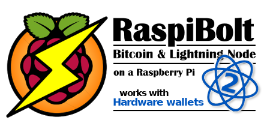

<!-- markdownlint-disable MD014 MD022 MD025 MD033 MD040 -->

## Beginner’s Guide to ️Lightning️ on a Raspberry Pi
{: .no_toc }

I love to tinker and build stuff.
I am also fascinated with digital currencies, so I recently built my own Bitcoin / Lightning Full Node with a simple low-cost Raspberry Pi.
I now basically run my own bank using free open-source software and some cheap hardware.

{:target="_blank"}

---

The **RaspiBolt version 2** builds on the Raspberry Pi 4. If you're looking for the old version: [check out the old source files on GitHub](https://github.com/raspibolt/raspibolt/blob/1.0/index.md).

---

## Table of contents
{: .no_toc .text-delta }

1. TOC
{:toc}

---

This project was as much about the learning process as about the result.
And I think I succeeded: I learned a lot and my node runs very well.
This guide is my attempt to share my learnings and encourage you to run a node yourself.

## Why am I excited about Bitcoin and Lightning?

**Bitcoin as new technology** is an incredibly interesting endeavor, especially because of its interdisciplinary nature.
**Bitcoin as sound money** is going to have a major impact on economic principles and society as a whole.
In my opinion, a solid, anti-fragile base layer for this future monetary network is the killer app for blockchains and will be more important than the most novel feature of competing altcoin projects.

At the moment, Bitcoin is more of a store of value and not really suited for small everyday transactions.
Due to limitations of the blockchain and the growth of its usage, fees have risen and business models relying on cheap transactions are being priced out.
This is fine.
**Truly decentralized blockchains are a scarce resource** and cannot scale to accommodate all global transactions.
The current scaling pains are a great motivator to build better technology to scale exponentially, as opposed to just making everything bigger for linear scaling.

This is where the **Lightning Network** comes in.
As one of several new blockchain “extensions”, its promise is to accommodate nearly unlimited transactions, with instant payment confirmation, minimal fees and increased privacy.
It sounds almost too good to be true, but in contrast to ubiquitous ICO with their own token, this technology is well researched, committed to the cypherpunk open-source ethos and leverages the solid underpinnings of Bitcoin.

Bitcoin's security model requires both full nodes and miners to be decentralized.
While the full-node-using economy must be decentralized to stop fake bitcoins that do not abide to consensus from being accepted as payments, the miners must be  decentralized to stop censorship of transactions and to make transactions irreversible.

To preserve the decentralized nature of this monetary system, I think it is important that everybody can run their own trustless Bitcoin full node, preferably on cheap hardware like a Raspberry Pi.
If Bitcoin is digital gold, then a full node wallet is your own personal goldsmith who checks for you that received payments are genuine.

This is why I set out to build my **RaspiBolt** and think that I have now - through numerous iterations - quite a good configuration that I would like to share as my modest contribution to the community.
I am not a systems specialist, so please feel free to point out improvements.

## About this guide

### Structure

1. Introduction (this page)
1. [Preparations](raspibolt_10_preparations.md): get all required parts
1. [Raspberry Pi](raspibolt_20_pi.md): set up and configure the Pi as a Linux server
1. [Security](raspibolt_21_security.md): secure and harden your installation
1. [Privacy](raspibolt_22_privacy.md): configure Tor networking for improved privacy
1. [Bitcoin](raspibolt_30_bitcoin.md): run Bitcoin Core as a fully validating node
1. [Lightning](raspibolt_40_lnd.md): spin up the Lightning Network Daemon (LND)
1. [Electrum](raspibolt_50_electrs.md): use your node with Hardware Wallets
1. [Bonus Section](raspibolt_60_bonus.md): go beyond with optional topics
1. [Troubleshooting](raspibolt_70_troubleshooting.md): debug your system if you have problems
1. [FAQ](raspibolt_faq.md): frequently asked questions and further reading

### Purpose

My aim is to set up a Bitcoin and Lightning node that

* is as fully validating Bitcoin Full Node and does not require any trust in a 3rd party,
* is reliably running 24/7,
* is part of and supports the decentralization of the Lightning network by routing payments and
* can be used to send and receive personal payments using the command line interface.

This server is set up without graphical user interface and is used remotely using the Secure Shell (SSH) command line.

**The good old days**: this was the original goal of this guide, back in 2017, simply buying a Blockaccino.

{:target="_blank"}

### Target audience

This guide strives to give simple and foolproof instructions.
But the goal is also to do everything ourselves, no shortcuts that involve trust in a 3rd party allowed.
This makes this guide quite technical and lengthy, but I try to make it as straightforward as possible and explain everything for you to gain a basic understanding of the how and why.

If you like to learn about Linux, Bitcoin and Lightning, this guide is for you.

## A word of caution
All components of the Lightning network are still under development and we are dealing with real money here.
Unfortunately, nobody uses the Lightning Testnet, so we will go straight for Mainnet.
But please be aware that you should start with small amounts that you are willing to lose.

## Community Support
Find help and other Raspibolt users on the following platforms:
* [Github Issues / Knowledge Base](https://github.com/raspibolt/raspibolt/issues)
* Reddit sub: [r/raspibolt](https://www.reddit.com/r/raspibolt/)
* Telegram group: [t.me/raspibolt](https://t.me/raspibolt)

---

Get started: [Preparations >>](raspibolt_10_preparations.md)
