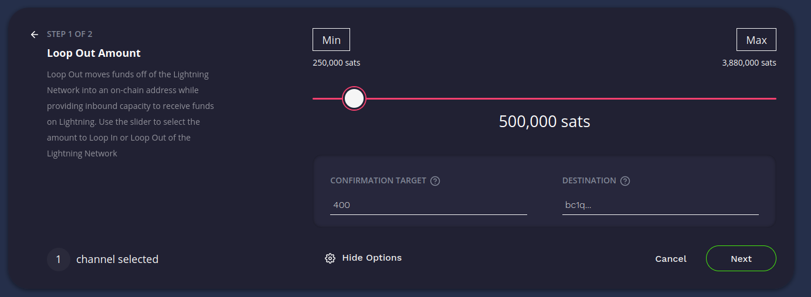
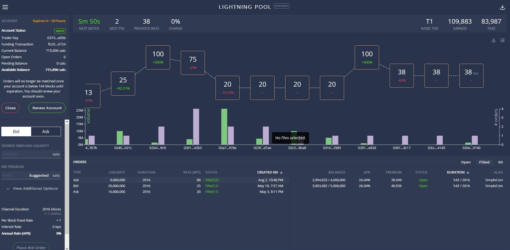

# Bonus guide: Lightning Terminal
{: .no_toc }

---

We install [Lightning Terminal](https://github.com/lightninglabs/lightning-terminal){:target="_blank"}, a browser-based interface for managing channel liquidity.


---

Table of contents
{: .text-delta }

1. TOC
{:toc}

---

## Introduction

Lightning Terminal, developped by Lighining Labs, aims at providing additional tools for operators to manage their node and channel balances. Below is a summary of Lighting Terminal's features:

* Visualize your channel balances in a web GUI
* Run a single daemon (`litd`) that integrates the Loop (`loopd`), Pool (`poold`) and Faraday (`faraday`) daemons
* Loop client (`loop`): Perform submarine swaps with the LOOP node using the CLI or web GUI
* Pool client (`pool`): Buy and sell inbound liquidity using the peer-to-peer auction-based Pool exchange using the CLI or web GUI 
* Faraday client (`frcli`): Run the Faraday daemon on your node that provides a CLI-based LN node accounting service

Because Pool is alpha software, Lightning Terminal is alpha software too.  

---

## Installation

### Download, verify and install

* With the "admin" user, download the latest arm64 binary and its checksum and verify the integrity of the binary

  ```sh
  $ cd /tmp
  $ wget https://github.com/lightninglabs/lightning-terminal/releases/download/v0.6.1-alpha/lightning-terminal-linux-arm64-v0.6.1-alpha.tar.gz
  $ wget https://github.com/lightninglabs/lightning-terminal/releases/download/v0.6.1-alpha/manifest-v0.6.1-alpha.txt
  $ sha256sum --check manifest-v0.6.1-alpha.txt --ignore-missing
  > lightning-terminal-linux-arm64-v0.6.1-alpha.tar.gz: OK

* Import the project's lead maintainer (Oliver Gugger) PGP key from Keybase 

  ```sh
  $ curl https://keybase.io/guggero/pgp_keys.asc | gpg --import
  > [...]
  > gpg: key 8E4256593F177720: "Oliver Gugger <gugger@gmail.com>" 1 new signature
  > [...]
  ```
  
* Using the key, verify the authenticity of the checksums file
  
  ```sh
  $ wget https://github.com/lightninglabs/lightning-terminal/releases/download/v0.6.1-alpha/manifest-v0.6.1-alpha.sig
  $ gpg --verify manifest-v0.6.1-alpha.sig manifest-v0.6.1-alpha.txt
  > [...]
  > gpg: Good signature from "Oliver Gugger <gugger@gmail.com>" [unknown]
  > [...]
  ```

* Now that the authenticity and integrity of the binary has been proven, unzip the binary and install Lightning Terminal

  ```sh
  $ tar -xzf lightning-terminal-linux-arm64-v0.6.1-alpha.tar.gz
  $ sudo install -m 0755 -o root -g root -t /usr/local/bin lightning-terminal-linux-arm64-v0.6.1-alpha/*
  $ litd --lnd.version
  > litd version 0.14.1-beta commit=lightning-terminal-v0.6.1-alpha
  ```

### User and data directories

* Create the “lit” service user, and make it a member of the “bitcoin” and “lnd” groups

  ```sh
  $ sudo adduser --disabled-password --gecos "" lit
  $ sudo usermod -a -G bitcoin,lnd lit
  ```

* Create the Lightning Terminal, Loop, Pool and Faraday data directories

  ```sh
  $ sudo mkdir /data/lit /data/loop /data/pool /data/faraday
  $ sudo chown -R lit:lit /data/lit /data/loop /data/pool /data/faraday
  ```

* Add the "admin" user to the "lit" group

  ```sh
  $ sudo adduser admin lit
  ```

* With the "admin" user, create symlinks to the Lightning Terminal, Loop, Pool and Faraday directories

  ```sh
  $ ln -s /data/lit /home/admin/.lit
  $ ln -s /data/loop /home/admin/.loop
  $ ln -s /data/pool /home/admin/.pool
  $ ln -s /data/faraday /home/admin/.faraday
  ```

* Open a “lit” user session
  
  ```sh 
  $ sudo su - lit
  ```

* Create symlinks to the LND, Lightning Terminal, Loop, Pool and Faraday directories

  ```sh
  $ ln -s /data/lnd /home/lit/.lnd
  $ ln -s /data/lit /home/lit/.lit
  $ ln -s /data/loop /home/lit/.loop
  $ ln -s /data/pool /home/lit/.pool
  $ ln -s /data/faraday /home/lit/.faraday
  ```

* Display the links and check that they’re not shown in red (this would indicate an error)

  ```sh
  $ ls -la
  ```

### Configuration

The Lightning Terminal daemon (`litd`) has its own configuration file. 
The settings for Pool, Faraday, Loop can all be put in the configuration file 

* Still with the "lit" user, create the configuration file and paste the following content (set the `uipassword` with your password [E] and adjust to your alias; and paste password [B] as required in the Faraday section). Save and exit.

  ```sh
  $ cd ~/.lit
  $ nano lit.conf
  ```
  
  ```ini  
  # RaspiBolt: Lightning Terminal configuration
  # /home/lit/.lit/lit.conf
  
  #######################
  # Application Options #
  #######################
  
  # The host:port to listen for incoming HTTP/2 connections on for the web UI only. (default:127.0.0.1:8443)
  httpslisten=0.0.0.0:8443
  
  # Your password for the UI must be at least 8 characters long
  uipassword=Password[E]

  # Remote options
  remote.lit-debuglevel=debug

  # Remote lnd options
  remote.lnd.rpcserver=127.0.0.1:10009
  remote.lnd.macaroonpath=/home/lit/.lnd/data/chain/bitcoin/mainnet/admin.macaroon
  remote.lnd.tlscertpath=/home/lit/.lnd/tls.cert
  
  #################
  #     Loop      #
  #################
  
  loop.loopoutmaxparts=5
  
  #################
  #     Pool      #
  #################
  
  # This option avoids the creation of channels with nodes with whom you already have a channel (set to 0 if you don't mind)
  pool.newnodesonly=1
  # Path to Pool's own macaroon
  pool.macaroonpath=/home/lit/.pool/mainnet/pool.macaroon
    
  ##################
  #     Faraday    #
  ##################
  
  # If connect_bitcoin is set to 1, Faraday can connect to a bitcoin node (with --txindex set) to provide node accounting services
  faraday.connect_bitcoin=1
  # The minimum amount of time that a channel must be monitored for before recommending termination
  faraday.min_monitored=72h
  # Path to Faraday's own macaroon
  faraday.macaroonpath=/home/lit/.faraday/mainnet/faraday.macaroon
    
  ###################
  # Faraday-Bitcoin #
  ###################
  
  # The Bitcoin node IP is the IP address of the Raspibolt, i.e. an address like 192.168.0.20
  faraday.bitcoin.host=192.168.0.171
  # bitcoin.user provides to Faraday the bicoind RPC username, as specified in our bitcoin.conf
  faraday.bitcoin.user=raspibolt
  # bitcoin.password provides to Faraday the bitcoind RPC password, as specified in our bitcoin.conf
  faraday.bitcoin.password=Password[B]
  ```

🔍 *Notice that the options for Faraday, Loop and Pool can be set in this configuration file but you must prefix the software with a dot as we made here. Use samples configuration files shown in github repo of each software for more options*

### Aliases

For now, softwares packaged in Lightning Terminal are all listening to the same port 8443. This is not the default behavior set in the code of these sofware so you must always indicate the RPC port as well as the TLS certificate of Lightning Terminal when using them, using flags (e.g., `pool --rpcserver=localhost:8443 --tlscertpath=~/.lit/tls.cert accounts list`, do not try it now as Lightning Terminal is not running yet!).  

Rather than always typing the flags, we can create aliases for the "admin" user.

* Still with user "admin", create an alias file and paste the following line. Save and exit.

  ```sh
  $ cd ~/
  $ nano .bash_aliases
  ```

  ```ini
  ######################
  # Lightning Terminal #
  ######################
  
  alias litfaraday="frcli --rpcserver=localhost:8443 --tlscertpath=~/.lit/tls.cert"
  alias litloop="loop --rpcserver=localhost:8443 --tlscertpath=~/.lit/tls.cert"
  alias litpool="pool --rpcserver=localhost:8443 --tlscertpath=~/.lit/tls.cert" 
  ```

* Activate the aliases

  ```sh
  $ source .bashrc
  ```

* To use Loop, Pool or Faraday from the CLI, use the alias followed by the desired command (e.g., `litpool accounts list`, much simpler!)

---

## Run Lightning Terminal

### Manual start

* Still with user “lit”, we first start Lightning Terminal manually to check if everything works fine.

  ```sh
  $ litd
  ```

* Test that Lightning Terminal is working by visiting the web UI
  * Past the following URL in your browser: [https://raspibolt.local::8443/](https://raspibolt.local::8443/){:target="_blank"} (replace raspibolt.local by your node IP address if required)
  * Note that the first time you connect, your browser will display a warning due to the fact the SSL certificate is self-generated. On Firefox, simply click "Advanced" and then "Accept the risks and continue" (or similar wording in other browsers)
  * Enter password [E] when prompted.
  * (Optional) Follow the walkthrough to have a first introduction to Lightning Terminal GUI. Otherwise, click "No thanks" to skip it.

* Close the browser window, go back to the terminal and stop Lightning Terminal by pressing Ctrl+C. Then exit the "lit" user.

  ```sh
  $ exit
  ```

### Autostart on boot

Now we’ll make sure Lightning Terminal starts as a service on the Raspberry Pi so it’s always running. In order to do that, we create a systemd unit that starts the service on boot directly after LND.

* Create the Lightning Terminal systemd unit with the following content. Save and exit.
  
  ```sh
  $ sudo nano /etc/systemd/system/litd.service
  ```

  ```ini
  # RaspiBolt: systemd unit for litd
  # /etc/systemd/system/litd.service
  
  [Unit]
  Description=Lightning Terminal Daemon
  After=lnd.service
  
  [Service]
  
  # Service execution
  ###################
  ExecStart=/usr/local/bin/litd
  
  # Process management
  ####################
  Type=simple
  Restart=always
  RestartSec=30
  TimeoutSec=240
  LimitNOFILE=128000
  
  # Directory creation and permissions
  ####################################
  User=lit
  
  # Hardening measures
  ####################
  # Provide a private /tmp and /var/tmp.
  PrivateTmp=true
  
  # Mount /usr, /boot/ and /etc read-only for the process.
  ProtectSystem=full
  
  # Disallow the process and all of its children to gain
  # new privileges through execve().
  NoNewPrivileges=true
  
  # Use a new /dev namespace only populated with API pseudo devices
  # such as /dev/null, /dev/zero and /dev/random.
  PrivateDevices=true
  
  # Deny the creation of writable and executable memory mappings.
  MemoryDenyWriteExecute=true
  
  [Install]
  WantedBy=multi-user.target
  ```
  
* Enable and start the service and check its status and logging output
  
  ```sh
  $ sudo systemctl enable litd
  $ sudo systemctl start litd
  $ sudo systemctl status litd
  >* litd.service - Lightning Terminal Daemon
  >   Loaded: loaded (/etc/systemd/system/litd.service; enabled; vendor preset: enabled)
  >   Active: active (running) since Mon 2021-12-27 19:16:10 GMT; 22h ago
  > [...]
  ```
  
* Check the live logging activity. Press Ctrl+C to exit.
  
  ```sh
  $ sudo journalctl -f -u litd
  ```

---

## Lightning Terminal in action

### Loop

[Loop](https://github.com/lightninglabs/loop){:target="_blank"} is a non-custodial service offered by Lightning Labs that makes it easy to move bitcoin into and out of the Lightning Network: deposit to a Bitcoin address without closing channels with Loop In, convert outbound liquidity into inbound liquidity with Loop Out, refill depleted Lightning channels with Loop In.



As an example, we will show how to use loop out to move some sats out of a channel and receive it onchain. This could help a merchant when a channel has been used for payments and is now all outbound. By using loop out, some liquidity is moved to the other side which allows the channel to be used again by clients, while the funds oved onchain can now be stored in cold storage.

#### Loop out

* Log in to Lightning Terminal
* Click on the "Loop" button
* Select a channel which is mostly outbound (they will be colour-coded in red in the Terminal)
  * e.g. a channel with 1,000,000 sats on your side and 0 sats on the remote side
* Click on the "Loop Out" button
* The slider represents your local (outbound) balance. Select how much of it you want to send on your onchain address, which is also the amount you want to move to the remote (inbound) side of the channel.
  * e.g. to move 500,000 sats (out of 1,000,000 sats) onchain, place the slider at the 500,000 sats mark
* Click on "Additional Options"
* Specify a confirmation target. Tp reduce fees, and if the mempool is not busy (check [mempool.space](https://mempool.space/){:target="_blank"}), use a very large value (e.g. 400, the maximum allowed) to get a fee close to 1 sa/vB.
* If you're ok with the sats going to your LND wallet, leave the "Destination" blank. If you want to send it to an external wallet, paste a segwit address from that external wallet.
* Click "Next"
* Review the proposed transaction and fees (in sats and % of the amount sent). The fee is an estimation of the total fee that includes: 1) the on-chain fee + 2) the service fee for Loop Out; + 3) the estimated off-chain routing fee. The real fee might differ from this estimation.
* If you're happy with the fees, click "Confirm"

Congrats! You've done your first lightning submarine swap!

#### More information

* The Lightning Terminal web UI can also be used to Loop In
* You can loop out/in using the RTL web UI (see [next section of the guide](rtl.md))
* You can loop out/in using the CLI (which displays more fee details)
* To get more information, check out the following resources:
  * Loop webpage: [https://lightning.engineering/loop/](https://lightning.engineering/loop/){:target="_blank"}
  * Loop documentation: [https://docs.lightning.engineering/lightning-network-tools/loop](https://docs.lightning.engineering/lightning-network-tools/loop){:target="_blank"}
  * GitHub repository: [https://github.com/lightninglabs/loop](https://github.com/lightninglabs/loop){:target="_blank"}
  * Lightning Labs blog post announcement: [https://blog.lightning.engineering/announcement/2020/02/05/loop-beta.html](https://blog.lightning.engineering/announcement/2020/02/05/loop-beta.html){:target="_blank"}


### Pool

[Pool](https://github.com/lightninglabs/pool){:target="_blank"} is a marketplace for Lightning channels. You can rent a channel when you need inbound liquidity or earn an income by leasing a channel.



#### Preparations

Pool requires to fund an account from your LND onchain wallet. This account will be used to draw the sats required to open channels and pay Pool fees. Make sure you fund your LND wallet with at least the amount of sats you'd like to have in your Pool account.

#### Create a Pool account

* Log in to the Lightning Terminal UI
* In the left menu, click on "Lightning Pool"
* Click "Open an account"
* Type the desired amount whit which you want to fund your account
* Change the "Expires in" parameters if you'd like a longer expiration deadline (closing or reopening an account at the end of the account lifetime requires one or two onchain transactions and therefore onchain fees; if you plan to use Pool long-term, increase the duration to save on fees)
* Select a confirmation target you are comfortable with (e.g. 1 sat/vB)
* Click "Fund"

#### Submit a bid

You can use the sats in your account to open channels to bidders and earn a one-off premium based on channel size and rate.

* In the left menu, click on "Bid"
* In "Desired Inbound Liquidity", select the size of the channel you are looking for, e.g. `2000000`
* In "Bid Premium", select a premium you are ready to pay, expressed in sats. Check the recent awarded auctions for reasonable expectations.
  * If the last few auctions offered 25 bps and you'd like to pay the same rate, multiply your desired channel size by the rate and divide by 100,000:
    * 25 * 2,000,000 / 100,000 = 5,000 sats -> Use `5000` as the "Ask premium"
    * Check at the bottom of the menu that the rate is indeed 25 bps
* Click on "View additional options"
* Select a channel duration. The peer that will open a 2M sats channel to your node will be committed to keep the channel opened for this duration at the minimum. If they close before, they will not be paid the premium and will be banned from the Pool server.
* Select a minimum channel size (e.g. `1000000` sats) that you are ok with. It could be the same value as the desired channel size above.
* Choose a max batch fee rate. check the on-going rate at the top of the Terminal and select a value slightly higher.
* Choose if you want a channel only from Tier 1 (T1) nodes or from any nodes. The Tier ranking is done by Lightning Labs based on a number of parameters (e.g. node capacity, number of channels, uptime etc). T1 nodes are nodes that are considered as potentially good routers, i.e. they have more capacity, channels, uptime etc than T0 nodes. Expect to pay a higher rate for T1 nodes than for T0 nodes.
* Review your bid details at the bottom. In particular, check that your offered premium rate is what you expect.
* If you want to submit the bid, click on "Place bid oreder".
* The bid will appear in the open orders section of the central panel. 
* You can now close Lightning Terminal. Your bid will be taken into consideration by the Pool server and if an ask matches your bid, a channel will be opened to your node and sats will be taken from your Pool account to pay for the fees (a share of the onchain fees + Pool service fees + premium to peer that opens the channel)

Congrats! You've done your first Pool bid!

#### More information

* If you want to earn sats to open channels to bidders, choose "Ask" instead of "Bid"
* To get more information, check out the following resources:
  * Pool webpage: [https://lightning.engineering/pool/](https://lightning.engineering/pool/){:target="_blank"}
  * Pool documentation: [https://docs.lightning.engineering/lightning-network-tools/pool](https://docs.lightning.engineering/lightning-network-tools/pool){:target="_blank"}
  * GitHub repository: [https://github.com/lightninglabs/pool](https://github.com/lightninglabs/pool){:target="_blank"}
  * Lightning Labs blog post announcement: [https://blog.lightning.engineering/announcement/2020/02/05/loop-beta.html](https://blog.lightning.engineering/announcement/2020/02/05/loop-beta.html){:target="_blank"}

### Faraday

[Faraday](https://github.com/lightninglabs/faraday){:target="_blank"} is a suite of accounting CLI-based tools for LND node operators.

* Check the Faraday commands

  ```sh
  $ litfaraday --help
  > NAME:
  >   frcli - command line tool for faraday
  > [...]
  ```
  
The following commands are avaialble:

* `insights`: expose metrics gathered for one or many channels.
* `revenue`: generate a revenue report over a time period for one or many channels.
* `outliers`: close recommendations based whether channels are outliers based on a variety of metrics.
* `threshold`: close recommendations based on thresholds a variety of metrics.
* `audit`: produce an accounting report for your node over a period of time. 
* `fiat`: get the USD price for an amount of Bitcoin at a given time, currently obtained from CoinCap's historical price API.
* `closereport`: provides a channel specific fee report, including fees paid on chain.

#### More information

* To obtain more details about each of these commands, type `litfaraday <command_name> --help`
* To get more information, check out the following resources:
  * Faraday documentation: [https://docs.lightning.engineering/lightning-network-tools/faraday](https://docs.lightning.engineering/lightning-network-tools/faraday){:target="_blank"}
  * GitHub repository: [https://github.com/lightninglabs/faraday](https://github.com/lightninglabs/faraday){:target="_blank"}
  * Lightning Labs blog posts:
    * Announcement: [https://lightning.engineering/posts/2020-04-02-faraday/](https://lightning.engineering/posts/2020-04-02-faraday/){:target="_blank"}
    * Latest feature: [https://lightning.engineering/posts/2020-09-15-faraday-accounting/](https://lightning.engineering/posts/2020-09-15-faraday-accounting/){:target="_blank"}

---

## Upgrade

* Check your Lightning Terminal version

  ```sh
  $ litd --lnd.version
  > litd version 0.14.1-beta commit=lightning-terminal-v0.6.1-alpha
  ```

* Read the [release notes](https://github.com/lightninglabs/lightning-terminal/releases){:target="_blank"} in case there is any breaking change to be aware of.

* Stop the Lightning Terminal systemd service

  ```sh
  $ sudo systemctl stop litd
  ```

* Install the new version following the same installation process explained in this guide [here](lightning-terminal.md#download-verify-and-install)

* Restart the service

  ```sh
  $ sudo systemctl start litd
  ```

---

## Uninstall

🚨 Warning: Before uninstalling Lightning Terminal, you might want to make sure that there is no on-going channel leases or LOOP swaps and that you've closed your Pool account. You might also want to make some backup of key files (LSAT token, databases etc) located in the /data directories).

* Stop and disable the systemd service and then delete the service file

  ```sh
  $ sudo systemctl stop litd
  $ sudo systemctl disable litd
  $ cd /etc/systemd/system
  $ sudo rm litd.service
  ```
  
* Remove the Lightning Terminal binaries

  ```sh
  $ cd /usr/local/bin
  $ sudo rm frcli litcli litd loop pool
  ```
  
* Remove the "admin" user symlinks

  ```sh
  $ cd ~/
  $ rm .faraday .lit .loop .pool
  ```

* Remove the /data Lighting Terminal, Loop, Pool and Faraday directories

  ```sh
  $ cd /data
  $ sudo rm -R faraday lit loop pool
  ```

* Remove (or comment out) the aliases from the `.bash_aliases` file

  ```sh
  $ nano .bash_aliases
  ```
  
  ```ini  
  #alias litfaraday="frcli --rpcserver=localhost:8443 --tlscertpath=~/.lit/tls.cert"
  #alias litloop="loop --rpcserver=localhost:8443 --tlscertpath=~/.lit/tls.cert"
  #alias litpool="pool --rpcserver=localhost:8443 --tlscertpath=~/.lit/tls.cert" 
  ```

* Finally, with the "root" user, delete the "lit" user

  ```sh
  $ sudo su -
  $ userdel -r lit


<br /><br />

---

Next: [Ride The Lightning >>](rtl.md)
