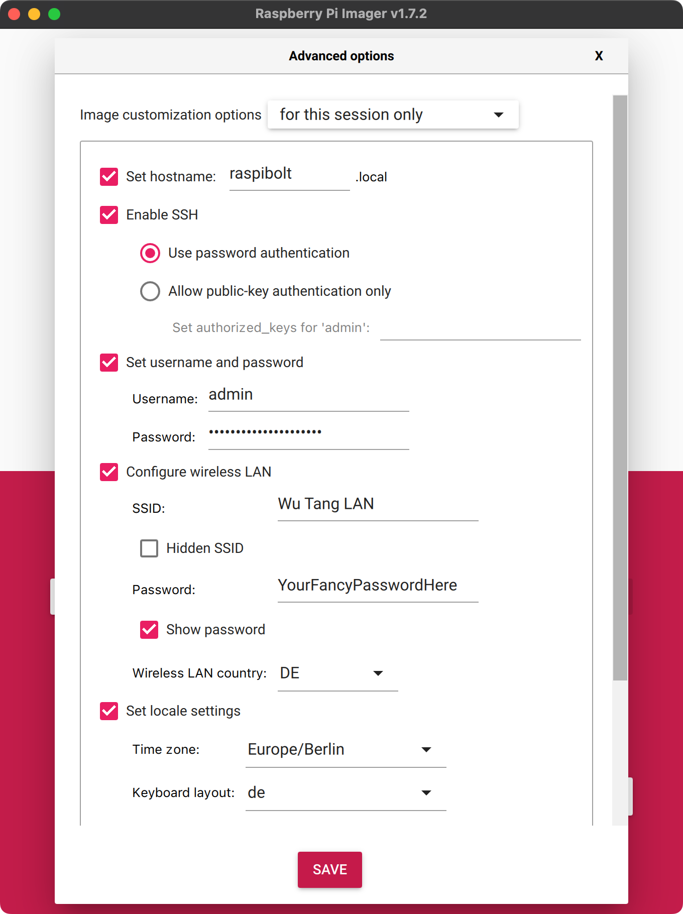

<!-- markdownlint-disable MD014 MD022 MD025 MD033 MD040 -->


# Operating system
{: .no_toc }

We configure the Raspberry Pi and install the Linux operating system.

---

## Table of contents
{: .no_toc .text-delta }

1. TOC
{:toc}

---

## Which operating system to use?

We use the Raspberry Pi Operating System (RasPi OS) Lite, without a graphical user interface, and in the 64-bit version.
This provides the best stability for the Raspberry Pi and makes the initial setup a breeze.

RasPi OS is based on the [Debian 11](https://www.debian.org/){:target="_blank"} Linux distribution, which is available for most  hardware platforms.
To make this guide as universal as possible, it uses only standard Debian commands.
As a result, it should work smoothly with Raspberry Pis while still being compatible with most other hardware platforms running Debian.

## Get Raspberry Pi OS

We will use the "Rasberry Pi Imager" application to write the operating system to the external drive.
Unfortunately, the 64-bit version of the Raspberry Pi OS is not integrated yet, so we need to download it manually.

* Download the latest [RasPi OS Lite (64-bit)](https://downloads.raspberrypi.org/raspios_lite_arm64/images/){:target="_blank"} disk image.
  Simply get the ZIP file named similarly to `2021-10-30-raspios-bullseye-arm64-lite.zip`.
  Its size should be around 400 MB.

* Download and install the [Raspberry Pi Imager](https://www.raspberrypi.com/software/){:target="_blank"} for your regular operating system.

## Configure boot options

Start the Raspberry Pi Imager and open the "Advanced options" by pressing `Ctrl`+`Shift`+`X` simultaneously.
You can now pre-configure the operating system even before it's started for the first time.

Configure the advanced options as follows:

* **Set hostname**: choose and enter a local network name for your node, for example `raspibolt`.

  Note: if you're using a different platform, you can adjust the hostname later by replacing it in the file `/etc/hostname` and adding it at the end of the first line in `/etc/hosts`.

* **Enable SSH**: activate the checkbox, select "Use password authentication", and set your `password [A]`

  This will allow you to connect to the Raspberry Pi remotely using "Secure SHell" without ever connecting it to a keyboard or screen.

* **Configure wifi**: if you'll run the RaspiBolt connected to your wireless network, simply enter the wifi name ("SSID") and password.
  Also change "Wifi country" to the two-letter [ISO2 code](https://www.iso.org/obp/ui/#search){:target="_blank"} of your country (e.g., `US`).

  If you'll connect your RaspiBolt with a network cable, simply skip this setting.

* **That's it.**
  You can ignore the other options.

* Click "SAVE".

## Write the operating system to the external drive

* Connect the external drive to your regular computer
* Click on "CHOOSE OS" and select "Use custom"
* Select the downloaded RasPi OS disk image file
* Click on "CHOOSE STORAGE"
* Select your external drive
* Click on "WRITE"
* Read the warning carefully and make sure you selected the right drive, then click "YES"

The Raspberry Pi Imager now writes the operating system to your drive and verifies it.
It should display a "Success" message after.

## Start your Pi

* Safely eject the external drive from your computer
* Connect it to your Pi
* If you did not configure the Wifi settings: connect the Pi to your network with an ethernet cable
* Start the Pi by connecting it to the power adapter using the USB-C cable

## Does it boot?

The 🔴 red LED on the Pi will indicate that the device is powered on.

The 🟢 green LED should be flickering constantly after a few seconds, indicating activity.
If the green LED is lit constantly, without flickering, your Pi is probably not yet configured to boot from USB.

To enable booting from USB, follow these steps:

1. Get your hands on a microSD card (all data will be deleted, but you only need it once)
1. Using the [Raspberry Pi Imager](https://www.raspberrypi.com/software/){:target="_blank"}, write config bootloader to enable "USB Boot" to the microSD card
  (select Misc utility images / Bootloader / USB Boot)
1. Boot your Pi with this microSD card
1. Once the green LED blinks constantly, you can disconnect the power
1. Remove the microSD card and start your Pi again with the SSD connected

This procedure is also explained in more detail in the helpful guide [How to Boot Raspberry Pi 4 From a USB SSD](https://www.tomshardware.com/how-to/boot-raspberry-pi-4-usb){:target="_blank"}.

Your Raspberry Pi should now boot from the SSD attached via USB.

## Fallback: if you can't boot from your external drive

We assume that you can boot directly from the external drive.
This method works for most modern drives, but if it doesn't work in your case, please follow the fallback instructions [Boot from microSD card instead of external drive](bonus/raspberry-pi/boot-from-microsd-card.md).

  

---

Next: [Remote access >>](remote-access.md)
