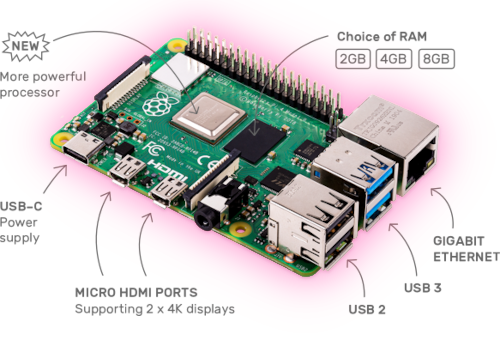

<!-- markdownlint-disable MD014 MD022 MD025 MD040 -->


# Raspberry Pi
{: .no_toc }

This guide builds on the easily available and very flexible Raspberry Pi 4.
This amazing piece of hardware is a tiny computer-on-a-chip, costs about $60 and consumes very little energy.

In the following sections, we will start it up and prepare the operating system for your RaspiBolt.
