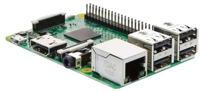
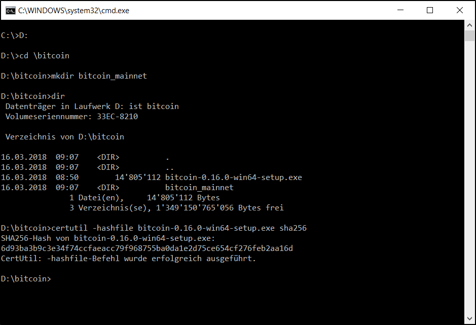
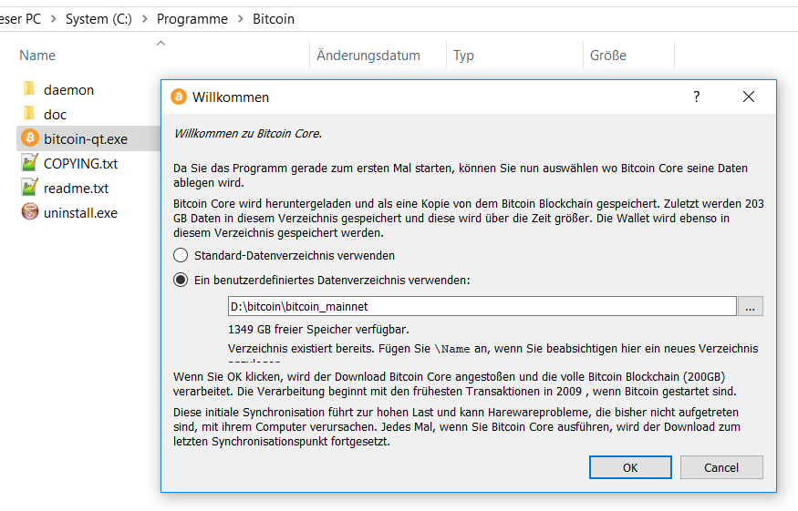

[ [Intro](README.md) ] -- [ **Preparations** ] -- [ [Raspberry Pi](raspibolt_20_pi.md) ] -- [ [Bitcoin](raspibolt_30_bitcoin.md) ] -- [ [Lightning](raspibolt_40_lnd.md) ] -- [ [Mainnet](raspibolt_50_mainnet.md) ] -- [ [Bonus](raspibolt_60_bonus.md) ] -- [ [FAQ](raspibolt_faq.md) ] -- [ [Updates](raspibolt_updates.md) ]

-------
### Beginner’s Guide to ️⚡Lightning️⚡ on a Raspberry Pi
--------

# Preparations

## Hardware requirements
This guide builds on the easily available and very flexible Raspberry Pi. This amazing piece of hardware is a tiny computer-on-a-chip, costs about $35 and consumes very little energy.

  
*Raspberry Pi 3: a tiny computer for less than $40*

It is advisable to get the latest Raspberry Pi for good performance:
* Raspberry Pi 3 Model B or better
* Micro SD card: 8 GB or more, incl. adapter to your regular computer
* USB power adapter: 5V/1.2A (more ampere is fine) + Micro USB cable
* External hard disk: 500 GB or more
* Optional: Raspberry Pi case

I used a Raspberry Pi 3 Model B and set it up with a 8 GB SD card. To run a Lightning node, the full Bitcoin blockchain must be stored locally, which is ~200 GB and growing. I bought a cheap hard disk enclosure and reused an old 500 GB hard disk that was lying around. A modern 2.5" hard disk that is powered by the USB connection to the Pi does work as well, as long as you use a decent power supply (2.5A+).

## Download the Bitcoin blockchain
The Bitcoin blockchain records all transactions and basically defines who owns how many bitcoin. This is the most crucial of all information and we should not rely on someone else to provide this data. To set up our Bitcoin Full Node on mainnet, we need to

* download the whole blockchain (~ 200 GB),
* verify every Bitcoin transaction that ever occurred and every block ever mined,
* create an index database for all transactions, so that we can query it later on,
* calculate all bitcoin address balances (called the UTXO set).

:point_right: See [Running a Full Node](https://bitcoin.org/en/full-node) for additional information.

Although we will set up the RaspiBolt for the Bitcoin testnet first, the validation of the Bitcoin mainnet blockchain can take several days. This is the reason why we already start this task now.

### Using a regular computer
You can imagine that the Raspberry Pi is not quite up to this huge task. The download is not the problem, but to initially process the whole blockchain would take weeks or months due to its low computing power and lack of memory. We need to download and verify the blockchain with Bitcoin Core on a regular computer, and then transfer the data to the Pi. This needs to be done only once. After that the Pi can easily keep up with new blocks.

This guide assumes that you will use a  Windows machine for this task, but it works with most operating systems. You need to have about 250 GB free disk space available, internally or on an external hard disk (but not the one reserved for the Pi). As indexing creates heavy read/write traffic, the faster your hard disk the better. An internal drive or an external USB3 hard disk will be significantly faster than one with a USB2 connection.

We will later format the external hard disk of the Pi with the Ext4 file system, which is suited best for our use case. Using SCP, we then copy the blockchain from the Windows computer over the local network.

### Download and verify Bitcoin Core
Download the Bitcoin Core installer from [bitcoincore.org/en/download](https://bitcoincore.org/en/download) and store it in the directory you want to use to download the blockchain. To check the authenticity of the program, we calculate its checksum and compare it with the checksums provided. 

In Windows, I’ll preface all commands you need to enter with `>` , so with the command `> cd bitcoin` , just enter `cd bitcoin` and hit enter.

Open the Windows command prompt (`Win+R`, enter `cmd`, hit `Enter`), navigate to the bitcoin directory (for me, it's on drive `D:`, check in Windows Explorer) and create the new directory `bitcoin_mainnet`. Then calculate the checksum of the already downloaded program.
```
> D:
> cd \bitcoin
> mkdir bitcoin_mainnet
> dir
> certutil -hashfile bitcoin-0.17.0.1-win64-setup.exe sha256
a624de6c915871fed12cbe829d54474e3c8a1503b6d703ba168d32d3dd8ac0d3
```


Compare this value with the [release signatures](https://bitcoin.org/bin/bitcoin-core-0.16.3/SHA256SUMS.asc). For the Windows v0.17.0.1 setup binaries, its
```
32 bit:  400c88eae33df6a0754972294769741dce97a706dc22d1438f8091d7647d5506
64 bit:  a624de6c915871fed12cbe829d54474e3c8a1503b6d703ba168d32d3dd8ac0d3
```
Usually, you would also need to check the signature of this file, but it's a pain on Windows, so we will do it on the Pi later on.

### Installing Bitcoin Core
Execute the Bitcoin Core installation file (you might need to right-click and choose "Run as administrator") and install it using the default settings. Start the program `bitcoin-qt.exe` in the directory "C:\Program Files\Bitcoin". Choose your new “bitcoin_mainnet” folder as the custom data directory.



:warning::warning::warning::warning::warning::warning::warning::warning::warning::warning::warning::warning::warning:

**IMPORTANT: The next step is crucial, otherwise your whole Bitcoin blockchain might be useless!**

Bitcoin Core opens and starts immediately syncing the blockchain, but we need to set one additional setting in the “bitcoin.conf” file. Using the menu, open `Settings` / `Options` and click the button `Open Configuration File`. Enter the following line:

```
txindex=1
```
⚠️⚠️⚠️⚠️⚠️⚠️⚠️⚠️⚠️⚠️⚠️⚠️⚠️   

If your computer has a lot of memory, you can increase the database in-memory cache by adding the following line (with megabytes of memory to use, adjusted to your computer) as well:

```
dbcache=6000
```
Save and close the text file, quit Bitcoin Core using `File` / `Exit` and restart the program. The program will start syncing again. 

Let the blockchain sync for now, we can already start working on the Pi.

---
Next: [Raspberry Pi >>](raspibolt_20_pi.md)
