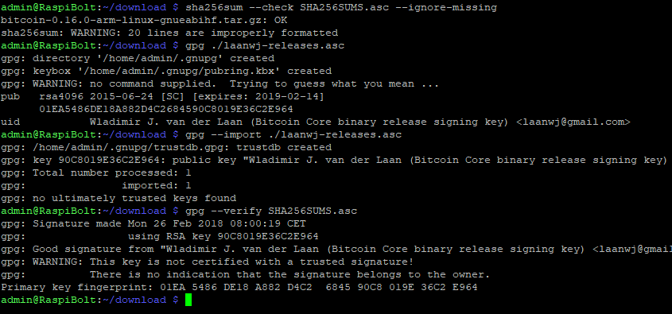
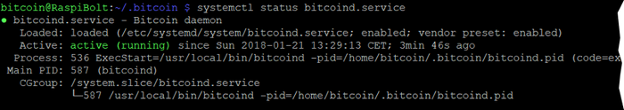
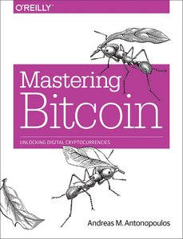

[ [Intro](README.md) ] -- [ [Preparations](raspibolt_10_preparations.md) ] -- [ [Raspberry Pi](raspibolt_20_pi.md) ] -- [ **Bitcoin** ] -- [ [Lightning](raspibolt_40_lnd.md) ] -- [ [Mainnet](raspibolt_50_mainnet.md) ] -- [ [Bonus](raspibolt_60_bonus.md) ] -- [ [FAQ](raspibolt_faq.md) ] -- [ [Updates](raspibolt_updates.md) ]

-------
### Beginner’s Guide to ️⚡Lightning️⚡ on a Raspberry Pi
--------

# Bitcoin
The base of the Lightning node is a fully trustless [Bitcoin Core](https://bitcoin.org/en/bitcoin-core/) node. It keeps a complete copy of the blockchain and validates all transactions and blocks. By doing all this work ourselves, nobody else needs to be trusted.

In the beginning, we will use the Bitcoin testnet to familiarize ourselves with its operations. This sync is handled directly by the Pi and should not take longer than a few hours. Just let it sync overnight.

### Installation
We will download the software directly from bitcoin.org, verify its signature to make sure that we use an official release and install it.

* Login as "admin" and create a download folder  
  `$ mkdir /home/admin/download`  
  `$ cd /home/admin/download`  

We download the latest Bitcoin Core binaries (the application) and compare the file with the signed checksum. This is a precaution to make sure that this is an official release and not a malicious version trying to steal our money.

* Get the latest download links at bitcoin.org/en/download (ARM Linux 32 bit), they change with each update. Then run the following  commands (with adjusted filenames) and check the output where indicated:  
  `$ wget https://bitcoin.org/bin/bitcoin-core-0.16.0/bitcoin-0.16.0-arm-linux-gnueabihf.tar.gz`  
  `$ wget https://bitcoin.org/bin/bitcoin-core-0.16.0/SHA256SUMS.asc`  
  `$ wget https://bitcoin.org/laanwj-releases.asc`

* Check that the reference checksum matches the real checksum  
  `$ sha256sum --check SHA256SUMS.asc --ignore-missing`  
  `> bitcoin-0.16.0-arm-linux-gnueabihf.tar.gz: OK`

* Manually check the fingerprint of the public key:  
  `$ gpg ./laanwj-releases.asc`  
  `> 01EA5486DE18A882D4C2684590C8019E36C2E964`

* Import the public key of Wladimir van der Laan, verify the signed checksum file and check the fingerprint again in case of malicious keys  
  `$ gpg --import ./laanwj-releases.asc`  
  `$ gpg --verify SHA256SUMS.asc`  
  `> gpg: Good signature from Wladimir ...`  
  `> Primary key fingerprint: 01EA 5486 DE18 A882 D4C2  6845 90C8 019E 36C2 E964`  



* Now we know that the keys from bitcoin.org are valid, so we can also verify the Windows binary checksums. Compare the following output with the checksum of your Windows Bitcoin Core download.  
  `$ cat SHA256SUMS.asc | grep win` 
```
7558249b04527d7d0bf2663f9cfe76d6c5f83ae90e513241f94fda6151396a29  bitcoin-0.16.0-win32-setup.exe
60d65d6e57f42164e1c04bb5bb65156d87f0433825a1c1f1f5f6aebf5c8df424  bitcoin-0.16.0-win32.zip
6d93ba3b9c3e34f74ccfaeacc79f968755ba0da1e2d75ce654cf276feb2aa16d  bitcoin-0.16.0-win64-setup.exe
42706da1a95b2db8c5808529f73c2063a0dd770f71e0c8506bfa86dc0f3403ef  bitcoin-0.16.0-win64.zip
```
* Extract the Bitcoin Core binaries, install them and check the version.  
  `$ tar -xvf bitcoin-0.16.0-arm-linux-gnueabihf.tar.gz`  
  `$ sudo install -m 0755 -o root -g root -t /usr/local/bin bitcoin-0.16.0/bin/*`  
  `$ bitcoind --version`  
  `> Bitcoin Core Daemon version v0.16.0`

### Prepare Bitcoin Core directory
We use the Bitcoin daemon, called “bitcoind”, that runs in the background without user interface and stores all data in a the directory  `/home/bitcoin/.bitcoin`. Instead of creating a real directory, we create a link that points to a directory on the external hard disk. 

* While logged in with user "admin", change to user “bitcoin”  
  `$ sudo su bitcoin`

* We add a symbolic link that points to the external hard disk.  
  `$ ln -s /mnt/hdd/bitcoin /home/bitcoin/.bitcoin`

* Navigate to the home directory an d check the symbolic link (the target must not be red). The content of this directory will actually be on the external hard disk.  
  `$ cd `  
  `$ ls -la`


### Configuration
Now, the configuration file for bitcoind needs to be created. Open it with Nano and paste the configuration below. Save and exit.  
`$ nano /home/bitcoin/.bitcoin/bitcoin.conf`

```bash
# RaspiBolt LND Mainnet: bitcoind configuration
# /home/bitcoin/.bitcoin/bitcoin.conf

# remove the following line to enable Bitcoin mainnet
testnet=1

# Bitcoind options
server=1
daemon=1
txindex=1
disablewallet=1

# Connection settings
rpcuser=raspibolt
rpcpassword=PASSWORD_[B]

onlynet=ipv4
zmqpubrawblock=tcp://127.0.0.1:28332
zmqpubrawtx=tcp://127.0.0.1:28333

# Raspberry Pi optimizations
dbcache=100
maxorphantx=10
maxmempool=50
maxconnections=40
maxuploadtarget=5000
```
:warning: Change rpcpassword to your secure `password [B]`, otherwise your funds might get stolen.

:point_right: additional information: [configuration options](https://en.bitcoin.it/wiki/Running_Bitcoin#Command-line_arguments) in Bitcoin Wiki

### Autostart bitcoind
The system needs to run the bitcoin daemon automatically in the background, even when nobody is logged in. We use “systemd“, a daemon that controls the startup process using configuration files.

* Exit the “bitcoin” user session back to user “admin”  
  `$ exit`

* Create the configuration file in the Nano text editor and copy the following paragraph.  
  `$ sudo nano /etc/systemd/system/bitcoind.service`

```bash
# RaspiBolt LND Mainnet: systemd unit for bitcoind
# /etc/systemd/system/bitcoind.service

[Unit]
Description=Bitcoin daemon
Wants=getpublicip.service
After=getpublicip.service

# for use with sendmail alert (coming soon)
#OnFailure=systemd-sendmail@%n

[Service]
ExecStartPre=/bin/sh -c 'sleep 30'
ExecStart=/usr/local/bin/bitcoind -daemon -conf=/home/bitcoin/.bitcoin/bitcoin.conf -pid=/home/bitcoin/.bitcoin/bitcoind.pid
PIDFile=/home/bitcoin/.bitcoin/bitcoind.pid
User=bitcoin
Group=bitcoin
Type=forking
KillMode=process
Restart=always
TimeoutSec=120
RestartSec=30

[Install]
WantedBy=multi-user.target
```
* Save and exit
* Enable the configuration file  
  `$ sudo systemctl enable bitcoind.service`
* Copy `bitcoin.conf` to user "admin" home directory for RPC credentials  
  `$ mkdir /home/admin/.bitcoin`   
  `$ sudo cp /home/bitcoin/.bitcoin/bitcoin.conf /home/admin/.bitcoin/` 
* Restart the Raspberry Pi  
  `$ sudo shutdown -r now`

### Verification of bitcoind operations
After rebooting, the bitcoind should start and begin to sync and validate the Bitcoin blockchain.

* Wait a bit, reconnect via SSH and login with the user “admin”.

* Check the status of the bitcoin daemon that was started by systemd (exit with `Ctrl-C`)  

  `$ systemctl status bitcoind.service`




* See bitcoind in action by monitoring its log file (exit with `Ctrl-C`)  
  `$ sudo tail -f /home/bitcoin/.bitcoin/testnet3/debug.log`

* Use the Bitcoin Core client `bitcoin-cli` to get information about the current blockchain  
  `$ bitcoin-cli getblockchaininfo`

* Please note:
  * When “bitcoind” is still starting, you may get an error message like “verifying blocks”. That’s normal, just give it a few minutes.
  * Among other infos, the “verificationprogress” is shown. Once this value reaches almost 1 (0.999…), the blockchain is up-to-date and fully validated.

### Explore bitcoin-cli
If everything is running smoothly, this is the perfect time to familiarize yourself with Bitcoin Core and play around with `bitcoin-cli` until the blockchain is up-to-date.

* A great point to start is the book **Mastering Bitcoin** by Andreas Antonopoulos - which is open source - and in this regard especially chapter 3 (ignore the first part how to compile from source code):
  * you definitely need to have a [real copy](https://bitcoinbook.info/) of this book!
  * get the [official PDF version](https://conferences.oreilly.com/oscon/oscon-or/public/content/mastering-bitcoin-second-edition) for free
  * read online on [Github](https://github.com/bitcoinbook/bitcoinbook)



* For a thorough deep dive, check out [**Learning Bitcoin from the Command Line**](https://github.com/ChristopherA/Learning-Bitcoin-from-the-Command-Line/blob/master/README.md) by Christopher Allen.


👉 additional information: [bitcoin-cli reference](https://en.bitcoin.it/wiki/Original_Bitcoin_client/API_calls_list)

Once the blockchain is synced on testnet, the Lightning node can be set up.

-----

### Bitcoin Core upgrade
If you want to upgrade to a new release of Bitcoin Core in the future, check out the FAQ section:  
[How to upgrade Bitcoin Core](https://github.com/Stadicus/guides/blob/master/raspibolt/raspibolt_faq.md#how-to-upgrade-bitcoin-core)

-----
Next: [Lightning >>](raspibolt_40_lnd.md)
