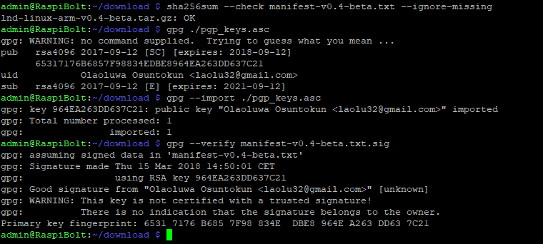
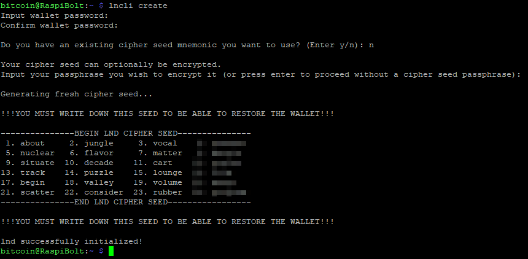
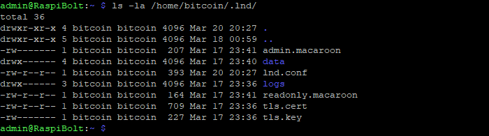

[ [Intro](README.md) ] -- [ [Preparations](raspibolt_10_preparations.md) ] -- [ [Raspberry Pi](raspibolt_20_pi.md) ] -- [ [Bitcoin](raspibolt_30_bitcoin.md) ] -- [ **Lightning** ] -- [ [Mainnet](raspibolt_50_mainnet.md) ] -- [ [Bonus](raspibolt_60_bonus.md) ] -- [ [FAQ](raspibolt_faq.md) ] -- [ [Updates](raspibolt_updates.md) ]

-------
### Beginner’s Guide to ️⚡Lightning️⚡ on a Raspberry Pi
--------

# Lightning: LND

We will now download and install the LND (Lightning Network Daemon) by [Lightning Labs](http://lightning.engineering/). Check out their [Github repository](https://github.com/lightningnetwork/lnd/blob/master/README.md) for a wealth of information about their open-source project and Lightning in general.

```
$ cd /home/admin/download
$ rm *
$ wget https://github.com/lightningnetwork/lnd/releases/download/v0.5-beta/lnd-linux-armv7-v0.5-beta.tar.gz
$ wget https://github.com/lightningnetwork/lnd/releases/download/v0.5-beta/manifest-v0.5-beta.txt
$ wget https://github.com/lightningnetwork/lnd/releases/download/v0.5-beta/manifest-v0.5-beta.txt.sig
$ wget https://keybase.io/roasbeef/pgp_keys.asc

$ sha256sum --check manifest-v0.5-beta.txt --ignore-missing
> lnd-linux-armv7-v0.5-beta.tar.gz: OK

$ gpg ./pgp_keys.asc
> BD599672C804AF2770869A048B80CD2BB8BD8132

$ gpg --import ./pgp_keys.asc
$ gpg --verify manifest-v0.5-beta.txt.sig
> gpg: Good signature from "Olaoluwa Osuntokun <laolu32@gmail.com>" [unknown]
> Primary key fingerprint: BD59 9672 C804 AF27 7086  9A04 8B80 CD2B B8BD 8132
>      Subkey fingerprint: F803 7E70 C12C 7A26 3C03  2508 CE58 F7F8 E20F D9A2

$ tar -xzf lnd-linux-armv7-v0.5-beta.tar.gz
$ sudo install -m 0755 -o root -g root -t /usr/local/bin lnd-linux-armv7-v0.5-beta/*
$ lnd --version
> lnd version 0.5.0-beta commit=3b2c807288b1b7f40d609533c1e96a510ac5fa6d
```


### LND configuration
Now that LND is installed, we need to configure it to work with Bitcoin Core and run automatically on startup.

* Open a "bitcoin" user session  
  `$ sudo su - bitcoin` 

* Create the LND working directory and the corresponding symbolic link  
  `$ mkdir /mnt/hdd/lnd`  
  `$ ln -s /mnt/hdd/lnd /home/bitcoin/.lnd`  
  `$ ls -la`


* Create the LND configuration file and paste the following content (adjust to your alias). Save and exit.  
  `$ nano /home/bitcoin/.lnd/lnd.conf`

```bash
# RaspiBolt: lnd configuration
# /home/bitcoin/.lnd/lnd.conf

[Application Options]
debuglevel=info
maxpendingchannels=5
alias=YOUR_NAME [LND]
color=#68F442
nat=true

[Bitcoin]
bitcoin.active=1

# enable either testnet or mainnet
bitcoin.testnet=1
#bitcoin.mainnet=1

bitcoin.node=bitcoind

[autopilot]
autopilot.active=1
autopilot.maxchannels=5
autopilot.allocation=0.6
```
:point_right: Additional information: [sample-lnd.conf](https://github.com/lightningnetwork/lnd/blob/master/sample-lnd.conf) in the LND project repository

### Run LND

Again, we first start the program manually as user "bitcoin" to check if everything works fine.

`$ lnd`

The daemon prints the status information directly to the command line. This means that we cannot use that session without stopping the server. We need to open a second SSH session.

### LND wallet setup

Start your SSH program (eg. PuTTY) a second time, connect to the Pi and log in as "admin". Commands for the **second session** start with the prompt `$2` (which must not be entered).

Once LND is started, the process waits for us to create the integrated Bitcoin wallet (it does not use the "bitcoind" wallet). 

* Start a "bitcoin" user session   
  `$2 sudo su - bitcoin`

* Create the LND wallet  

  `$2 lncli --network=testnet create` 

* If you want to create a new wallet, enter your `password [C]` as wallet password, select `n` regarding an existing seed and enter the optional `password [D]` as seed passphrase. A new cipher seed consisting of 24 words is created.



These 24 words, combined with your passphrase (optional `password [D]`)  is all that you need to restore your Bitcoin wallet and all Lighting channels. The current state of your channels, however, cannot be recreated from this seed, this requires a continuous backup and is still under development for LND.

:warning: This information must be kept secret at all times. **Write these 24 words down manually on a piece of paper and store it in a safe place.** This piece of paper is all an attacker needs to completely empty your wallet! Do not store it on a computer. Do not take a picture with your mobile phone. **This information should never be stored anywhere in digital form.**

* exit "bitcoin" user session  
  `$2 exit`

Let's authorize the "admin" user to work with LND using the command line interface `lncli`. For that to work, we need to copy the Transport Layer Security (TLS) certificate and the permission files (macaroons) to the admin home folder.

* Check if the TLS certificates have been created  
  `$2 sudo ls -la /home/bitcoin/.lnd/`

* Check if permission files `admin.macaroon` and `readonly.macaroon` have been created.  
  `$2 sudo ls -la /home/bitcoin/.lnd/data/chain/bitcoin/testnet/`



* Copy permission files and TLS cert to user "admin"   
  `$2 cd /home/bitcoin/`  
  `$2 sudo cp --parents .lnd/data/chain/bitcoin/testnet/admin.macaroon /home/admin/`  
  `$2 sudo cp /home/bitcoin/.lnd/tls.cert /home/admin/.lnd`  
  `$2 sudo chown -R admin:admin /home/admin/.lnd/`  
* Make sure that `lncli` works by unlocking your wallet (enter `password [C]` ) and getting some node infos.   
  `$2 lncli --network=testnet unlock`
* Check the current state of LND 
  `$2 lncli --network=testnet getinfo`

You can also see the progress of the initial sync of LND with Bitcoin in the first SSH session. 

Check for the following two lines to make sure that the port forwarding is successfully set up using UPnP. If LND is not able to configure your router (that may not support UPnP, for example), your node will still work, but it will not be able to router transactions for other network participants.

```
[INF] SRVR: Scanning local network for a UPnP enabled device
[INF] SRVR: Automatically set up port forwarding using UPnP to advertise external IP
```

Let's stop the server for the moment and focus on our primary SSH session again.

* `$2 lncli --network=testnet stop`
* `$2 exit`

This should terminate LND "gracefully" in SSH session 1 that can now be used interactively again.

### Autostart LND

Now, let's set up LND to start automatically on system startup.

* Exit the "bitcoin" user session back to "admin"  
  `$ exit`
* Create LND systemd unit and with the following content. Save and exit.  
  `$ sudo nano /etc/systemd/system/lnd.service` 

```bash
# RaspiBolt: systemd unit for lnd
# /etc/systemd/system/lnd.service

[Unit]
Description=LND Lightning Daemon
Wants=bitcoind.service
After=bitcoind.service

[Service]
ExecStart=/usr/local/bin/lnd
PIDFile=/home/bitcoin/.lnd/lnd.pid
User=bitcoin
Group=bitcoin
LimitNOFILE=128000
Type=simple
KillMode=process
TimeoutSec=180
Restart=always
RestartSec=60

[Install]
WantedBy=multi-user.target
```

* Enable and start LND  
  `$ sudo systemctl enable lnd`  
  `$ sudo systemctl start lnd`  
  `$ systemctl status lnd`  

* Now, the daemon information is no longer displayed on the command line but written into the system journal. You can monitor the LND startup progress until it caught up with the testnet blockchain (about 1.3m blocks at the moment). This can take up to 2 hours, after that you see a lot of very fast chatter (exit with `Ctrl-C`).  
  `$ sudo journalctl -f -u lnd`


### Get some testnet Bitcoin

Now your Lightning node is ready. To use it in testnet, you can get some free testnet bitcoin from a faucet.
* Generate a new Bitcoin address to receive funds on-chain  
  `$ lncli --network=testnet newaddress np2wkh`  
  `> "address": "2NCoq9q7............dkuca5LzPXnJ9NQ"` 

* Get testnet bitcoin:  
  https://testnet-faucet.mempool.co

* Check your LND wallet balance  
  `$ lncli --network=testnet walletbalance`  

* Monitor your transaction (the faucet shows the TX ID) on a Blockchain explorer:  
  https://testnet.smartbit.com.au

### LND in action
As soon as your funding transaction is mined and confirmed, LND will start to open and maintain channels. This feature is called "Autopilot" and is configured in the "lnd.conf" file. If you would like to maintain your channels manually, you can disable the autopilot.

Get yourself a payment request on [StarBlocks](https://starblocks.acinq.co/#/) or [Y’alls](https://yalls.org/) and move some coins!

* `$ lncli --network=testnet listpeers`  
* `$ lncli --network=testnet listchannels`  
* `$ lncli --network=testnet sendpayment --pay_req=lntb32u1pdg7p...y0gtw6qtq0gcpk50kww`  
* `$ lncli --network=testnet listpayments`  

:point_right: see [Lightning API reference](http://api.lightning.community/) for additional information

-----

### LND upgrade
If you want to upgrade to a new release of LND in the future, check out the FAQ section:  
[How to upgrade LND](https://github.com/Stadicus/guides/blob/master/raspibolt/raspibolt_faq.md#how-to-upgrade-lnd-bin-)

-----

### Before proceeding to mainnet 
This is the point of no return. Up until now, you can just start over. Experiment with testnet bitcoin. Open and close channels on the testnet. 

Once you switch to mainnet and send real bitcoin to your RaspiBolt, you have "skin in the game". 

* Make sure your RaspiBolt is working as expected.
* Get a little practice with `bitcoin-cli` and its options (see [Bitcoin Core RPC documentation](https://bitcoin-rpc.github.io/))
* Do a dry run with `lncli` and its many options (see [Lightning API reference](http://api.lightning.community/))
* Try a few restarts (`sudo shutdown -r now`), is everything starting fine?

---
Next: [Mainnet >>](raspibolt_50_mainnet.md)
