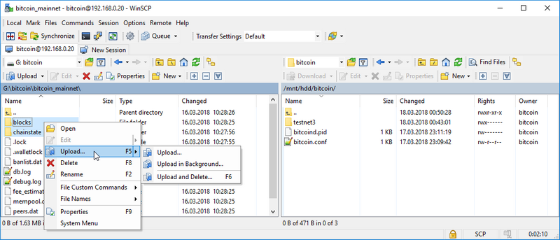

[ [Intro](README.md) ] -- [ [Preparations](raspibolt_10_preparations.md) ] -- [ [Raspberry Pi](raspibolt_20_pi.md) ] -- [ [Bitcoin](raspibolt_30_bitcoin.md) ] -- [ [Lightning](raspibolt_40_lnd.md) ] -- [ **Mainnet** ] -- [ [Bonus](raspibolt_60_bonus.md) ] -- [ [FAQ](raspibolt_faq.md) ] -- [ [Updates](raspibolt_updates.md) ]

-------
### Beginner’s Guide to ️⚡Lightning️⚡ on a Raspberry Pi
--------

# Mainnet
Are you feeling comfortable to put real bitcoin on the line? Here's how to do it. 

⚠️⚠️⚠️⚠️⚠️⚠️⚠️⚠️⚠️⚠️⚠️⚠️⚠️⚠️⚠️⚠️⚠️⚠️⚠️⚠️⚠️⚠️⚠️⚠️ 

But first: if you are not comfortable with learning Linux more in-depth on your own or even compile a program from source, chances are that you lose some funds sooner or later. The Lightning Network is not production-ready yet and LND is still in beta.

```
Personal disclaimer: This guide is provided as-is and without any guarantees. Most components are 
under development and this guide may contain factual errors that result in the loss of your bitcoin. 
Use this guide at your own risk.
```
```
Lightning Labs disclaimer: As this is the first mainnet release of lnd, we recommend that users 
experiment with only small amounts (#craefulgang #craefulgang #craefulgang).
```

⚠️⚠️⚠️⚠️⚠️⚠️⚠️⚠️⚠️⚠️⚠️⚠️⚠️⚠️⚠️⚠️⚠️⚠️⚠️⚠️⚠️⚠️⚠️⚠️ 

Still want to try it? Proceed at your own risk.

## Copy the mainnet blockchain

The current setup runs on Bitcoin testnet. Right at the beginning, however, we started downloading the Bitcoin mainnet blockchain on your regular computer. Check the verification progress directly in Bitcoin Core on this computer. To proceed, it  should be fully synced (see status bar). 

As soon as the verification is finished, shut down Bitcoin Core on Windows. We will now copy the whole data structure to the RaspiBolt. This takes about 6 hours.

### Temporarily enable password login
In order to copy the data with the user "bitcoin", we need to temporarily enable the password login.

* As user "admin", edit the SSH config file and put a `#` in front of "PasswordAuthentication no" to disable the whole line. Save and exit.  
  `$ sudo nano /etc/ssh/sshd_config`  
  `# PasswordAuthentication no` 

* Restart the SSH daemon.  
  `$ sudo systemctl restart ssh`
  
### Copy using WinSCP
We are using "Secure Copy" (SCP), so [download and install WinSCP](https://winscp.net), a free open-source program. 

* With WinSCP, you can now connect to your Pi with the user "bitcoin".  


* Accept the server certificate and navigate to the local and remote bitcoin directories:  
  * Local: `d:\bitcoin\bitcoin_mainnet\`
  * Remote: `\mnt\hdd\bitcoin\`   

* You can now copy the two subdirectories `blocks` and `chainstate` from Local to Remote. This will take about 6 hours.  


:warning: The transfer must not be interupted. Make sure your computer does not go to sleep. 

:point_right:_ Additional information: [Bitcoin Core data directory structure](https://en.bitcoin.it/wiki/Data_directory)

### Disable password login again
* As user "admin", remove the `#` in front of "PasswordAuthentication no" to enable the line. Save and exit.  
  `$ sudo nano /etc/ssh/sshd_config`  
  `PasswordAuthentication no` 

* Restart the SSH daemon.  
  `$ sudo systemctl restart ssh`

## Send back your testnet Bitcoin

To avoid burning our testnet Bitcoin, and as a courtesy to the next testers, we close all our channels and withdraw the funds to the address stated on the website of the [Bitcoin Testnet Faucet](https://testnet.manu.backend.hamburg/faucet).  

* `$ lncli --network=testnet closeallchannels`

* Wait unitl the the channel balance is zero and the funds to be back in our on-chain wallet.  
  `$ lncli --network=testnet channelbalance`  
  `$ lncli --network=testnet walletbalance`

- Send the amount provided by `walletbalance` minus 500 satoshis to account for fees. If you get an "insufficient funds" error, deduct a bit more until the transaction gets broadcasted.  
  `$ lncli --network=testnet sendcoins 2N8hwP1WmJrFF5QWABn38y63uYLhnJYJYTF [amount]`

## Adjust configuration 

* Stop the Bitcoin and Lightning services.  
  `$ sudo systemctl stop lnd`   
  `$ sudo systemctl stop bitcoind` 
  
* Edit "bitcoin.conf" file by commenting  `testnet=1` out. Save and exit.  
  `$ sudo nano /home/bitcoin/.bitcoin/bitcoin.conf`
```
# remove the following line to enable Bitcoin mainnet
#testnet=1
```

* Copy updated "bitcoin.conf" to user "admin" for credentials  
  `$ sudo cp /home/bitcoin/.bitcoin/bitcoin.conf /home/admin/.bitcoin/`  


* Edit "lnd.conf" file by switching from `bitcoin.testnet=1` to `bitcoin.mainnet=1`. Save and exit.  
  `$ sudo nano /home/bitcoin/.lnd/lnd.conf`
```
# enable either testnet or mainnet
#bitcoin.testnet=1
bitcoin.mainnet=1
```
## Restart bitcoind & lnd for mainnet

:warning: **Do not proceed** until the copy task of the mainnet blockchain is completely finished.

* Start Bitcoind and check if it's operating on mainnet  

  `$ sudo systemctl start bitcoind`  
  `$ systemctl status bitcoind.service`  
  `$ sudo tail -f /home/bitcoin/.bitcoin/debug.log`  (exit with `Ctrl-C`)  
  `$ bitcoin-cli getblockchaininfo` 

* **Wait until the blockchain is fully synced**: "blocks" = "headers", otherwise you might run into performance / memory issues when creating a new lnd mainnet wallet.

* Start LND and check its operation  
  `$ sudo systemctl start lnd`   
  `$ systemctl status lnd`  
  `$ sudo journalctl -f -u lnd`  

* If everything works fine, restart the RaspiBolt and check the operations again.
  `$ sudo shutdown -r now`  

* Monitor the startup process of first  `bitcoind` and then `lnd`   
  `$ sudo tail -f /home/bitcoin/.bitcoin/debug.log`  
  `$ sudo journalctl -f -u lnd` 

* Create the mainnet wallet with the **exact same** `password [C]` as on testnet. If you use another password, you need to recreate your access credentials.  
  `$ lncli create `

* Copy permission files and TLS cert to user "admin" to use `lncli`  
  `$ sudo cp /home/bitcoin/.lnd/tls.cert /home/admin/.lnd`  
  `$ cd /home/bitcoin/`  
  `$ sudo cp --parents .lnd/data/chain/bitcoin/mainnet/admin.macaroon /home/admin/`  

* Restart `lnd` and unlock your wallet (enter `password [C]` )  
  `$ sudo systemctl restart lnd`  
  `$ lncli unlock`   

* Monitor the LND startup progress until it caught up with the mainnet blockchain (about 515k blocks at the moment). This can take up to 2 hours, then you see a lot of very fast chatter (exit with `Ctrl-C`).  
  `$ sudo journalctl -f -u lnd`

* Make sure that `lncli` works by getting some node infos  
  `$ lncli getinfo`

:point_right: **Important**: you need to manually unlock the lnd wallet after each restart of the lnd service! 

## Start using the Lightning Network

### Fund your node

Congratulations, your RaspiBolt is live on the Bitcoin mainnet! To open channels and start using it, you need to fund it with some bitcoin. For starters, put only on your node what you are willing to lose. Monopoly money.

* Generate a new Bitcoin address to receive funds on-chain  
  `$ lncli newaddress np2wkh`   
  `> "address": "3.........................."`

* From your regular Bitcoin wallet, send a small amount of bitcoin to this address

* Check your LND wallet balance  
  `$ lncli walletbalance`

* Monitor your transaction on a Blockchain explorer:
  https://smartbit.com.au

### LND in action
As soon as your funding transaction is mined and confirmed, LND will start to open and maintain channels. This feature is called "Autopilot" and is configured in the "lnd.conf" file. If you would like to maintain your channels manually, you can disable the autopilot.

Some commands to try:  

* list all arguments for the command line interface (cli)  
   `$ lncli`

* get help for a specific argument  
   `$ lncli help [ARGUMENT]`

* find out some general stats about your node:  
   `$ lncli getinfo`  

* connect to a peer (you can find some nodes to connect to here: https://1ml.com/):  
   `$ lncli connect [NODE_URI]`  

* check the peers you are currently connected to:  
   `$ lncli listpeers`  

* open a channel with a peer:  
   `$ lncli openchannel [NODE_PUBKEY] [AMOUNT_IN_SATOSHIS] 0`   
    *keep in mind that [NODE_URI] includes @IP:PORT at the end, while [NODE_PUBKEY] doesn't*  

* check the status of your pending channels:  
   `$ lncli pendingchannels`  

* check the status of your active channels:  
   `$ lncli listchannels`  

* before paying an invoice, you should decode it to check if the amount and other infos are correct:  
   `$ lncli decodepayreq [INVOICE]`  

* pay an invoice:  
   `$ lncli payinvoice [INVOICE]`  

* check the payments that you sent:      
   `$ lncli listpayments`   

* create an invoice:   
   `$ lncli addinvoice [AMOUNT_IN_SATOSHIS]`  
   
* list all invoices:  
  `$ lncli listinvoices`

* to close a channel, you need the following two arguments that can be determined with `listchannels` and are listed as "channelpoint": `FUNDING_TXID` : `OUTPUT_INDEX` .  
   `$ lncli listchannels`  
   `$ lncli closechannel [FUNDING_TXID] [OUTPUT_INDEX]`

* to force close a channel (if your peer is offline or not cooperative), use  
   `$ lncli closechannel --force [FUNDING_TXID] [OUTPUT_INDEX] `
   

👉 see [LND API reference](http://api.lightning.community/) for additional information

### Try it out 
To try out your new Lightning node, you can send me a micro-tip:  
[Article 'Beginner’s Guide to ️⚡Lightning️⚡ on a Raspberry Pi'](https://mainnet.yalls.org/articles/97d67df1-d721-417d-a6c0-11d793739be9:0965AC5E-56CD-4870-9041-E69616660E6F/70858a49-d91c-40fb-ae34-bddc2e938704) on Y'alls ($0.01)

### Explore Lightning mainnet
There are a lot of great resources to explore the Lightning mainnet in regard to your own node.

* [Recksplorer](https://rompert.com/recksplorer/): Lightning Network Map
* [1ML](https://1ml.com): Lightning Network Search and Analysis Engine
* [lnroute.com](http://lnroute.com): comprehensive Lightning Network resources list

---
Next: [Bonus >>](raspibolt_60_bonus.md)
